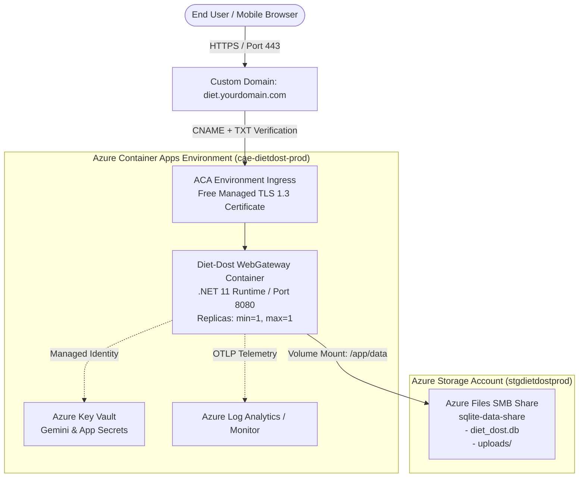

# Azure Cloud Deployment & SQLite Zero-Data-Loss Specification: Diet-Dost

> **Host Runtime**: .NET 11 (`net11.0`) on Linux Container  
> **Database**: SQLite 3.x (Single-writer embedded engine)  
> **Target Cloud**: Microsoft Azure (Azure Container Apps, Azure App Service, or Azure Linux VM)  
> **Security Baseline**: TLS 1.3, Zero Hardcoded Secrets, Managed Identity, DPDPA 2023 & OWASP ASVS  

---

## 1. Executive Summary & Architecture Decision Matrix

When deploying a .NET 11 web application with an **embedded SQLite database** to Azure, the biggest engineering trap is **ephemeral container filesystems** and **network file share concurrency**. 

By default, Docker/OCI containers in Azure Container Apps or App Service discard all local filesystem changes when a container restarts, crashes, scales, or deploys a new revision. Furthermore, SQLite relies on POSIX byte-range file locking and shared memory (`.shm` / `mmap`), which behave differently across cloud network file shares (SMB vs. NFS vs. Local Block SSD).

The following matrix evaluates the three viable deployment architectures for Diet-Dost:

| Architecture Dimension | Option 1: Azure Container Apps (ACA) + Azure Files SMB (Recommended Serverless) | Option 2: Azure App Service Linux (F1 Free / B1 Basic) | Option 3: Azure B1s Linux VM (Docker + Nginx + Certbot) |
| :--- | :--- | :--- | :--- |
| **Compute Type** | Serverless MicroVM (Container Apps) | Managed Web App PaaS | IaaS Virtual Machine (Ubuntu 24.04 LTS) |
| **Pricing & Free Tier** | **Monthly Free Grant**: 180,000 vCPU-s + 360,000 GiB-s + 2M requests/mo free. Storage share: ~$0.10–$0.30/mo. | **F1 Tier**: 100% Free (60 CPU-min/day, sleeps). **B1 Tier**: ~$13/mo (AlwaysOn, dedicated core). | **12 Months 100% Free**: Standard_B1s (1 vCPU, 1GB RAM, 750 hrs/mo) + 2x 64GB Managed SSDs. |
| **Persistence Mechanism** | Azure Storage Account File Share mounted to `/app/data` via ACA Environment Volume. | Built-in `/home` persistent storage (`WEBSITES_ENABLE_APP_SERVICE_STORAGE=true`). | Local SSD ext4 volume mounted to container `/data` (`-v /var/lib/dietdost/data:/app/data`). |
| **Zero Data Loss on Restart** | **Guaranteed**: Data lives in Azure File Share outside container lifecycle. | **Guaranteed**: Data lives in `/home` persistent storage. | **Guaranteed**: Data lives on durable Azure Managed OS/Data Disk. |
| **SQLite Concurrency & Locking** | **Single Replica Mandate (`maxReplicas: 1`)**. SMB does not support POSIX `mmap` WAL mode; must use `journal_mode=DELETE`. | **Single Instance Mandate**. Backed by Azure Files SMB under the hood. Must use `journal_mode=DELETE`. | **Best SQLite Performance**: Native POSIX file locks, full `journal_mode=WAL` support, concurrent readers, 0 network lag. |
| **Custom Domain & SSL** | **100% Free Azure Managed Certificates** (`Microsoft.App/managedEnvironments/managedCertificates`) with auto-renewal. | **Free Managed Cert on B1+**. F1 does **NOT** support free Azure SSL (requires Cloudflare proxy workaround). | **100% Free via Let's Encrypt / Certbot** with automated cron renewal. |
| **Security Posture** | Managed Identity, Azure Key Vault references, internal/external ingress, DDoS basic. | Managed Identity, Key Vault references, HTTPS only, IP access restrictions. | OS hardening required (UFW firewall, SSH key pairs, fail2ban, unattended-upgrades). |
| **CI/CD Integration** | GitHub Actions / Azure DevOps (`azure/container-apps-deploy-action`). | GitHub Actions / Azure DevOps (`azure/webapps-deploy`). | GitHub Actions via SSH or Container Registry webhook / Watchtower. |
| **Verdict** | **Best Serverless Cloud-Native**: Modern, pay-per-use, free managed TLS, zero OS maintenance. | **Simplest Traditional PaaS**: Good if using B1, but F1 free tier is too restricted for production. | **Best Free Tier & Speed**: 100% free for 1 year, fastest SQLite I/O, but requires Linux admin. |

---

## 2. The SQLite Cloud Persistence Doctrine (Zero Data Loss Rules)

To ensure SQLite never suffers data loss, silent corruption, or file-lock deadlocks in cloud environments, every deployment MUST adhere to these four golden rules:

### Rule 1: The Single-Replica Constraint (`maxReplicas: 1`)
SQLite is an embedded, single-process write-locking database. In containerized environments, auto-scaling to 2 or more replicas pointing to the same shared SQLite file **will lead to database corruption or immediate `busy / locked` exceptions**.
- In ACA: Configure `minReplicas: 1`, `maxReplicas: 1`.
- In App Service: Scale out must be fixed at `1` instance.
- In VM: Only 1 application container running at any time.

### Rule 2: Journal Mode Compatibility (SMB vs. Local Disk)
- **Azure Files SMB**: SMB/CIFS network protocol does not support POSIX shared memory (`.shm` file mapping). Attempting to use SQLite `WAL` (Write-Ahead Logging) over SMB can cause `database disk image is malformed` or `disk I/O error`. Over SMB, SQLite **MUST** run with rollback journal:
  ```sql
  PRAGMA journal_mode = DELETE; -- or TRUNCATE
  PRAGMA synchronous = FULL;
  PRAGMA busy_timeout = 5000;
  ```
- **Local SSD (VM)**: Native Linux ext4/xfs filesystem fully supports shared memory. Always enable WAL mode for maximum read concurrency:
  ```sql
  PRAGMA journal_mode = WAL;
  PRAGMA synchronous = NORMAL;
  PRAGMA busy_timeout = 5000;
  ```

### Rule 3: Unified Data Directory for Database and Photo Uploads
Diet-Dost stores both the database file (`diet_dost.db`) and user photos (`uploads/meals`, `uploads/progress`).
The persistent volume mount MUST cover both paths:
- Mount point in container: `/app/data`
- Connection String: `Data Source=/app/data/diet_dost.db;Cache=Shared`
- Photo Storage Path: `Storage:WebRootPath=/app/data/wwwroot` or symlinked `/app/data/uploads` -> `/app/wwwroot/uploads`.

### Rule 4: Automated Hot-Backup to Azure Blob Storage
Network file share or VM disk snapshot is not a substitute for database transaction-safe backups. An automated daily cron or background task must execute SQLite's online backup API:
```bash
sqlite3 /app/data/diet_dost.db ".backup '/app/data/backup_today.db'"
az storage blob upload --account-name <storage> --container-name db-backups --file /app/data/backup_today.db --name "diet_dost_$(date +%Y%m%d_%H%M%S).db"
```

---

## 3. Option 1: Azure Container Apps (ACA) + Azure Files (Recommended)

### 3.1 Architecture Overview


### 3.2 Azure Resource Provisioning Script (Azure CLI)
Run these commands in PowerShell or Bash with Azure CLI (`az login`):

```bash
# 1. Variables
RESOURCE_GROUP="rg-dietdost-prod"
LOCATION="centralindia" # Or eastus, westeurope, etc.
STORAGE_ACCOUNT="stgdietdost$RANDOM"
SHARE_NAME="dietdost-data"
ACR_NAME="crdietdost$RANDOM"
ENV_NAME="cae-dietdost-prod"
APP_NAME="app-dietdost-web"

# 2. Create Resource Group
az group create --name $RESOURCE_GROUP --location $LOCATION

# 3. Create Storage Account (Standard LRS is ultra low-cost ~$0.05/GB/mo)
az storage account create \
  --name $STORAGE_ACCOUNT \
  --resource-group $RESOURCE_GROUP \
  --location $LOCATION \
  --sku Standard_LRS \
  --kind StorageV2 \
  --enable-large-file-share false

# Retrieve Storage Key
STORAGE_KEY=$(az storage account keys list --resource-group $RESOURCE_GROUP --account-name $STORAGE_ACCOUNT --query "[0].value" --output tsv)

# 4. Create File Share
az storage share-rm create \
  --resource-group $RESOURCE_GROUP \
  --storage-account $STORAGE_ACCOUNT \
  --name $SHARE_NAME \
  --quota 10

# 5. Create Azure Container Registry (Basic SKU)
az acr create \
  --resource-group $RESOURCE_GROUP \
  --name $ACR_NAME \
  --sku Basic \
  --admin-enabled true

# 6. Create Log Analytics Workspace
WORKSPACE_NAME="log-dietdost-prod"
az monitor log-analytics workspace create \
  --resource-group $RESOURCE_GROUP \
  --workspace-name $WORKSPACE_NAME \
  --location $LOCATION

WORKSPACE_ID=$(az monitor log-analytics workspace show --resource-group $RESOURCE_GROUP --workspace-name $WORKSPACE_NAME --query customerId --output tsv)
WORKSPACE_KEY=$(az monitor log-analytics workspace get-shared-keys --resource-group $RESOURCE_GROUP --workspace-name $WORKSPACE_NAME --query primarySharedKey --output tsv)

# 7. Create Azure Container Apps Environment
az containerapp env create \
  --name $ENV_NAME \
  --resource-group $RESOURCE_GROUP \
  --location $LOCATION \
  --logs-workspace-id $WORKSPACE_ID \
  --logs-workspace-key $WORKSPACE_KEY

# 8. Link Azure File Share to ACA Environment as a Durable Storage Volume
az containerapp env storage set \
  --name $ENV_NAME \
  --resource-group $RESOURCE_GROUP \
  --storage-name dietdoststorage \
  --azure-file-account-name $STORAGE_ACCOUNT \
  --azure-file-account-key $STORAGE_KEY \
  --azure-file-share-name $SHARE_NAME \
  --access-mode ReadWrite
```

### 3.3 Production Containerfile (Multi-Stage .NET 11)
Save as `Containerfile` or `Dockerfile` at repository root:

```dockerfile
# Build Stage
FROM mcr.microsoft.com/dotnet/sdk:11.0-preview AS build
WORKDIR /src

# Copy project files for caching restore layer
COPY src/Nutrition.Domain/*.csproj src/Nutrition.Domain/
COPY src/Nutrition.Application/*.csproj src/Nutrition.Application/
COPY src/Nutrition.Infrastructure/*.csproj src/Nutrition.Infrastructure/
COPY src/Nutrition.ServiceDefaults/*.csproj src/Nutrition.ServiceDefaults/
COPY src/Nutrition.WebGateway/*.csproj src/Nutrition.WebGateway/

RUN dotnet restore src/Nutrition.WebGateway/Nutrition.WebGateway.csproj

# Copy full source and publish
COPY . .
RUN dotnet publish src/Nutrition.WebGateway/Nutrition.WebGateway.csproj \
    -c Release \
    -o /app/publish \
    --no-restore

# Runtime Stage
FROM mcr.microsoft.com/dotnet/aspnet:11.0-preview AS runtime
WORKDIR /app

# Ensure data directory exists for volume mount
RUN mkdir -p /app/data /app/wwwroot/uploads

COPY --from=build /app/publish .

# Environment Defaults for Container Apps
ENV ASPNETCORE_URLS=http://+:8080
ENV ASPNETCORE_ENVIRONMENT=Production
ENV Database__Provider=Sqlite
ENV ConnectionStrings__DefaultConnection="Data Source=/app/data/diet_dost.db;Cache=Shared"
ENV Storage__WebRootPath="/app/data/wwwroot"

EXPOSE 8080

ENTRYPOINT ["dotnet", "Nutrition.WebGateway.dll"]
```

### 3.4 Deploy Container App with Mounted Volume
```bash
ACR_SERVER="${ACR_NAME}.azurecr.io"

# Initial deployment
az containerapp create \
  --name $APP_NAME \
  --resource-group $RESOURCE_GROUP \
  --environment $ENV_NAME \
  --image "${ACR_SERVER}/diet-dost-web:latest" \
  --target-port 8080 \
  --ingress external \
  --registry-server $ACR_SERVER \
  --registry-username $ACR_NAME \
  --registry-password $(az acr credential show --name $ACR_NAME --query "passwords[0].value" -o tsv) \
  --min-replicas 1 \
  --max-replicas 1 \
  --cpu 0.5 \
  --memory 1.0Gi \
  --volume-mount-path /app/data \
  --volume-name dietdoststorage
```

---

## 4. Option 2: Azure App Service Linux (F1 Free / B1 Basic)

### 4.1 Architecture Overview
- Web App deployed on Linux App Service Plan.
- Persistent storage enabled via application setting:
  `WEBSITES_ENABLE_APP_SERVICE_STORAGE = true`
- All files in `/home` are preserved across restarts, crashes, and deployments.
- SQLite path: `/home/data/diet_dost.db`.

### 4.2 Trade-offs & Critical Gotchas
- **Free Tier (F1)**:
  - Pros: 100% free forever.
  - Cons:
    - 60 CPU-minutes per day quota (app stops responding when quota is exceeded).
    - No "Always On" setting (app sleeps after 20 minutes of inactivity; next request suffers a 15–30s cold start).
    - **No Free Managed SSL Certificate**: Azure does not issue free managed SSL certificates on F1. To use a custom domain securely on F1, you must route DNS through **Cloudflare Free Tier** (Cloudflare terminates SSL for free and proxies traffic to Azure HTTP).
- **Basic Tier (B1 - ~$13/month)**:
  - Pros: Dedicated CPU, 1.75 GB RAM, "Always On" supported, and **Free App Service Managed Certificates** included.
  - Cons: Incurs monthly subscription fee.

### 4.3 App Service Provisioning Script
```bash
APP_PLAN="asp-dietdost-prod"

# Create Plan (B1 for production custom domain + AlwaysOn, or F1 for testing)
az appservice plan create \
  --name $APP_PLAN \
  --resource-group $RESOURCE_GROUP \
  --is-linux \
  --sku B1

# Create Web App
az webapp create \
  --name "app-dietdost-service" \
  --resource-group $RESOURCE_GROUP \
  --plan $APP_PLAN \
  --deployment-container-image-name "${ACR_NAME}.azurecr.io/diet-dost-web:latest"

# Enable Persistent /home Storage
az webapp config appsettings set \
  --name "app-dietdost-service" \
  --resource-group $RESOURCE_GROUP \
  --settings \
    WEBSITES_ENABLE_APP_SERVICE_STORAGE=true \
    ConnectionStrings__DefaultConnection="Data Source=/home/data/diet_dost.db;Cache=Shared" \
    Storage__WebRootPath="/home/data/wwwroot" \
    ASPNETCORE_ENVIRONMENT=Production
```

---

## 5. Option 3: Azure B1s Virtual Machine (Docker + Nginx + Certbot)

### 5.1 Architecture Overview
- Virtual Machine: **Standard_B1s** (1 vCPU, 1 GB RAM).
- Azure provides Standard_B1s for **12 months free** (750 hours/month) for new Azure accounts, along with 2x 64 GB P6 Managed SSD disks.
- SQLite sits on a **local ext4 SSD** partition.
- **Why it is technically superior for SQLite**: Local block storage supports native POSIX shared memory (`mmap`). This allows full **SQLite WAL mode (`journal_mode=WAL`)**, providing the lowest latency and highest concurrency.

### 5.2 VM Provisioning & Setup Script
```bash
VM_NAME="vm-dietdost-prod"

# 1. Create VM with Ubuntu 24.04 LTS (B1s SKU)
az vm create \
  --resource-group $RESOURCE_GROUP \
  --name $VM_NAME \
  --image Ubuntu2404 \
  --size Standard_B1s \
  --admin-username azureuser \
  --generate-ssh-keys \
  --public-ip-sku Standard

# 2. Open HTTP and HTTPS ports in Network Security Group (NSG)
az vm open-port --resource-group $RESOURCE_GROUP --name $VM_NAME --port 80 --priority 1000
az vm open-port --resource-group $RESOURCE_GROUP --name $VM_NAME --port 443 --priority 1001

# 3. Retrieve Public IP
VM_IP=$(az vm show -d -g $RESOURCE_GROUP -n $VM_NAME --query publicIps -o tsv)
echo "VM Public IP: $VM_IP"
```

### 5.3 On-Host Docker Compose & Nginx Configuration (`docker-compose.yml`)
SSH into the VM (`ssh azureuser@$VM_IP`) and deploy:

```yaml
version: '3.8'

services:
  dietdost-app:
    image: crdietdost.azurecr.io/diet-dost-web:latest
    restart: always
    environment:
      - ASPNETCORE_ENVIRONMENT=Production
      - ASPNETCORE_URLS=http://+:8080
      - ConnectionStrings__DefaultConnection=Data Source=/app/data/diet_dost.db;Cache=Shared
      - Storage__WebRootPath=/app/data/wwwroot
    volumes:
      - /var/lib/dietdost/data:/app/data
    networks:
      - webnet

  nginx:
    image: nginx:alpine
    restart: always
    ports:
      - "80:80"
      - "443:443"
    volumes:
      - ./nginx.conf:/etc/nginx/nginx.conf:ro
      - ./certbot/conf:/etc/letsencrypt:ro
      - ./certbot/www:/var/www/certbot:ro
    depends_on:
      - dietdost-app
    networks:
      - webnet

  certbot:
    image: certbot/certbot
    restart: unless-stopped
    volumes:
      - ./certbot/conf:/etc/letsencrypt
      - ./certbot/www:/var/www/certbot
    entrypoint: "/bin/sh -c 'trap exit TERM; while :; do certbot renew; sleep 12h & wait $${!}; done;'"

networks:
  webnet:
    driver: bridge
```

---

## 6. Custom Domain & Managed TLS DNS Verification Walkthrough

To bind your custom domain (e.g. `diet.yourdomain.com`) to Azure Container Apps with a free managed SSL certificate:

### Step 6.1: Retrieve Ingress FQDN and Verification ID
```bash
# Get the ACA Default Domain FQDN
ACA_FQDN=$(az containerapp show --name $APP_NAME --resource-group $RESOURCE_GROUP --query "properties.configuration.ingress.fqdn" -o tsv)

# Get the Environment Domain Verification Code
CUSTOM_DOMAIN_VERIFICATION_ID=$(az containerapp env show --name $ENV_NAME --resource-group $RESOURCE_GROUP --query "properties.customDomainConfiguration.customDomainVerificationId" -o tsv)

echo "ACA Target FQDN: $ACA_FQDN"
echo "Verification ID: $CUSTOM_DOMAIN_VERIFICATION_ID"
```

### Step 6.2: Configure DNS Records at Domain Registrar (GoDaddy, Namecheap, Cloudflare, etc.)
Add two DNS records for your subdomain (e.g. `diet`):

| Record Type | Host / Name | Value / Destination | TTL | Purpose |
| :--- | :--- | :--- | :--- | :--- |
| **CNAME** | `diet` | `$ACA_FQDN` (e.g. `app-dietdost-web.happyrock-1234.centralindia.azurecontainerapps.io`) | 300 | Routes web traffic |
| **TXT** | `asuid.diet` | `$CUSTOM_DOMAIN_VERIFICATION_ID` | 300 | Proves domain ownership to Azure |

> [!NOTE]
> If configuring the apex/root domain (e.g. `yourdomain.com`), create an `A` record pointing to the ACA Environment Static IP (`properties.staticIp`) and a `TXT` record named `asuid` with `$CUSTOM_DOMAIN_VERIFICATION_ID`.

### Step 6.3: Bind Domain & Issue Free Azure Managed Certificate
Once DNS propagates (usually 1–5 minutes):

```bash
DOMAIN_NAME="diet.yourdomain.com"

# 1. Add hostname to Container App
az containerapp hostname add \
  --name $APP_NAME \
  --resource-group $RESOURCE_GROUP \
  --hostname $DOMAIN_NAME

# 2. Provision Free Azure Managed Certificate & Bind
az containerapp hostname bind \
  --name $APP_NAME \
  --resource-group $RESOURCE_GROUP \
  --hostname $DOMAIN_NAME \
  --environment $ENV_NAME \
  --validation-method CNAME
```
Azure Container Apps handles automatic 90-day renewal with zero maintenance.

---

## 7. Automated CI/CD Pipeline Blueprint (GitHub Actions)

Create `.github/workflows/azure-deploy.yml`:

```yaml
name: Build and Deploy Diet-Dost to Azure Container Apps

on:
  push:
    branches:
      - main
  workflow_dispatch:

permissions:
  id-token: write
  contents: read

jobs:
  build-and-deploy:
    runs-on: ubuntu-latest
    steps:
      - name: Checkout Code
        uses: actions/checkout@v4

      - name: Setup .NET 11 SDK
        uses: actions/setup-dotnet@v4
        with:
          dotnet-version: '11.0.x'

      - name: Run Unit & Integration Tests (100% Pass Standard)
        run: dotnet test --configuration Release --verbosity normal

      - name: Log in to Azure CLI
        uses: azure/login@v2
        with:
          creds: ${{ secrets.AZURE_CREDENTIALS }}

      - name: Log in to Azure Container Registry
        uses: azure/docker-login@v2
        with:
          login-server: ${{ secrets.ACR_LOGIN_SERVER }}
          username: ${{ secrets.ACR_USERNAME }}
          password: ${{ secrets.ACR_PASSWORD }}

      - name: Build and Push Docker Image
        run: |
          IMAGE_TAG="${{ secrets.ACR_LOGIN_SERVER }}/diet-dost-web:${{ github.sha }}"
          IMAGE_LATEST="${{ secrets.ACR_LOGIN_SERVER }}/diet-dost-web:latest"
          
          docker build -t $IMAGE_TAG -t $IMAGE_LATEST -f Containerfile .
          docker push $IMAGE_TAG
          docker push $IMAGE_LATEST

      - name: Deploy to Azure Container Apps (Zero Downtime)
        uses: azure/container-apps-deploy-action@v2
        with:
          acrName: ${{ secrets.ACR_NAME }}
          containerAppName: app-dietdost-web
          resourceGroup: rg-dietdost-prod
          imageToDeploy: ${{ secrets.ACR_LOGIN_SERVER }}/diet-dost-web:${{ github.sha }}
```

---

## 8. Verification & Operational Health Check

After deployment, perform these mandatory operational checks:
1. **Durable Restart Test**:
   - Log in and log a meal via `POST /api/meals/analyze-text`.
   - Restart the Container App: `az containerapp restart --name app-dietdost-web --resource-group rg-dietdost-prod`.
   - Refresh the food diary: verify all meals and nutritional ledgers are 100% intact.
2. **TLS 1.3 & SSL Verification**:
   - Access `https://diet.yourdomain.com`.
   - Check SSL certificate status: Issued by Microsoft Azure Managed Certificate authority with valid expiry.
3. **Application Logs**:
   - Stream live logs: `az containerapp logs show --name app-dietdost-web --resource-group rg-dietdost-prod --follow`.
   - Verify `SQLite database schema verified and initialized successfully with 0 errors.` appears on startup.
