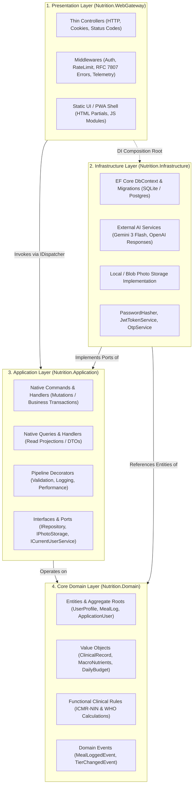

# Diet Dost — Clean Architecture & Native CQRS Implementation Rulebook
> **Specification Version**: `v1.1.0-NATIVE-SPEC`  
> **Architecture Pattern**: Clean Architecture (Onion / Hexagonal / Ports & Adapters) with Native .NET 11 CQRS  
> **Target Framework**: `.NET 11 RC` (`net11.0`) · Standalone `.NET Aspire 13.5.4`  
> **Framework Primitives**: Pure `Microsoft.Extensions.DependencyInjection` (Zero MediatR / Zero Commercial License)  
> **Standards Compliance**: SOLID Principles, OWASP ASVS v4.0, RFC 7807 (ProblemDetails), ICMR-NIN 2024  

---

## 0. Mandatory Pre-Conditions & Solution Rules

> [!IMPORTANT]
> Adhere strictly to the **Zero Direct-to-Main Policy** and Solution Rules in `AGENTS.md`:
> 1. **Branch First**: All refactoring must occur on a dedicated feature branch (`feature/<name>`). Never commit directly to `main`. First pull latest source of `main` before creating feature branch.
> 2. **Target Framework**: All projects must target `<TargetFramework>net11.0</TargetFramework>`.
> 3. **Zero-Warning Standard**: 0 warnings, 0 errors across the solution.
> 4. **Zero Third-Party CQRS Dependencies**: Do NOT use `MediatR`. MediatR v13+ moved to a commercial / RPL-1.5 reciprocal license requiring paid license keys. Implement CQRS using native .NET 11 BCL abstractions.
> 5. **Test Verification**: Run `dotnet test` and confirm 100% pass rate before committing or raising PRs.
> 6. **Living SDD Synchronization**: Synchronize `docs/sdd/*.md` and append an entry to `docs/sdd/07_living_documentation_log.md`.
> 7. **Mandatory End-to-End User Tier Validation**: After any refactoring, new feature implementation, or bug fix, execute comprehensive end-to-end verification of the running application across all 5 user tiers using seeded demo accounts (`free@dietdost.app`, `basic@dietdost.app`, `premium@dietdost.app`, `admin.demo@dietdost.app`, `superadmin@dietdost.app` with password `DietDost@Demo2026!`). Ensure zero runtime exceptions, accurate quota enforcement, correct tier gating (e.g. photo comparison and data export paywalls), and zero browser console errors.

---

## 1. Clean Architecture Principles & Core Anti-Patterns

### 1.1 The Anti-Pattern: Fat Controllers
In the initial prototyping phase, controllers frequently accumulate responsibilities that violate Clean Architecture:
- Direct injection and invocation of EF Core `DbContext` (`_db.Users.FirstOrDefaultAsync(...)`).
- Raw file system manipulation (`Directory.CreateDirectory`, `Path.Combine`, `FileStream`).
- Direct orchestration of external AI services, tier checking, and quota deduction inside HTTP endpoint methods.
- Business rule validation mixed with HTTP status codes and cookie/header writing.

### 1.2 The Clean Architecture Law: Dependency Inversion
Dependencies **MUST strictly point inwards**:



### 1.3 Layer Separation Contracts
| Layer | Namespace | Allowed Dependencies | Forbidden Dependencies |
|---|---|---|---|
| **Domain** | `Nutrition.Domain` | None (pure C# / .NET runtime primitives) | EF Core, ASP.NET Core, Infrastructure, Application |
| **Application** | `Nutrition.Application` | `Nutrition.Domain`, BCL `Microsoft.Extensions.*` | ASP.NET Core MVC/Controllers, EF Core runtime, File system, Third-party Mediator packages |
| **Infrastructure** | `Nutrition.Infrastructure` | `Nutrition.Application`, `Nutrition.Domain`, EF Core, External SDKs | Presentation / Controllers |
| **Presentation** | `Nutrition.WebGateway` | `Nutrition.Application`, `Nutrition.Domain`, `Nutrition.Infrastructure` (DI Root only) | Direct DbContext queries in Controllers, Raw File I/O in Controllers |

---

## 2. Native .NET 11 CQRS (Zero Third-Party Dependency)

### 2.1 Why Native .NET 11 CQRS Over MediatR?
1. **Zero Licensing Complications**: MediatR v13+ adopted the Reciprocal Public License 1.5 (RPL-1.5) and a commercial paid license model under Lucky Penny Software LLC, requiring commercial license keys (`MEDIATR_LICENSE_KEY`). Native .NET 11 CQRS is 100% license-free and royalty-free.
2. **Native AOT Ready**: Uses compile-time interface dispatch or clean service provider resolution without reflection emit.
3. **Transparent Debugging**: No complex multi-layer reflection wrappers obscuring call stacks.
4. **Performance**: Zero allocation overhead for pipeline reflection wrappers.

### 2.2 Core CQRS Contracts in `Nutrition.Application/Common/CQRS/`

```csharp
namespace Nutrition.Application.Common.CQRS;

public interface ICommand<out TResult> { }
public interface ICommand : ICommand<Result> { }

public interface IQuery<out TResult> { }

public interface ICommandHandler<in TCommand, TResult>
    where TCommand : ICommand<TResult>
{
    Task<TResult> HandleAsync(TCommand command, CancellationToken ct = default);
}

public interface ICommandHandler<in TCommand> : ICommandHandler<TCommand, Result>
    where TCommand : ICommand
{
}

public interface IQueryHandler<in TQuery, TResult>
    where TQuery : IQuery<TResult>
{
    Task<TResult> HandleAsync(TQuery query, CancellationToken ct = default);
}

public interface IDispatcher
{
    Task<TResult> SendAsync<TResult>(ICommand<TResult> command, CancellationToken ct = default);
    Task<TResult> QueryAsync<TResult>(IQuery<TResult> query, CancellationToken ct = default);
}
```

### 2.3 Native Dispatcher Implementation
Implemented cleanly using `IServiceProvider` with direct handler resolution:

```csharp
namespace Nutrition.Application.Common.CQRS;

public class NativeDispatcher : IDispatcher
{
    private readonly IServiceProvider _serviceProvider;

    public NativeDispatcher(IServiceProvider serviceProvider)
    {
        _serviceProvider = serviceProvider;
    }

    public async Task<TResult> SendAsync<TResult>(ICommand<TResult> command, CancellationToken ct = default)
    {
        ArgumentNullException.ThrowIfNull(command);
        var handlerType = typeof(ICommandHandler<,>).MakeGenericType(command.GetType(), typeof(TResult));
        dynamic handler = _serviceProvider.GetRequiredService(handlerType);
        return await handler.HandleAsync((dynamic)command, ct);
    }

    public async Task<TResult> QueryAsync<TResult>(IQuery<TResult> query, CancellationToken ct = default)
    {
        ArgumentNullException.ThrowIfNull(query);
        var handlerType = typeof(IQueryHandler<,>).MakeGenericType(query.GetType(), typeof(TResult));
        dynamic handler = _serviceProvider.GetRequiredService(handlerType);
        return await handler.HandleAsync((dynamic)query, ct);
    }
}
```

### 2.4 Dependency Injection Registration Extension
Registers all command and query handlers automatically by scanning the Application assembly:

```csharp
namespace Nutrition.Application;

public static class DependencyInjection
{
    public static IServiceCollection AddApplicationServices(this IServiceCollection services)
    {
        services.AddScoped<IDispatcher, NativeDispatcher>();

        var assembly = typeof(DependencyInjection).Assembly;
        
        // Register all ICommandHandler<,> and IQueryHandler<,>
        foreach (var type in assembly.GetTypes().Where(t => !t.IsAbstract && !t.IsInterface))
        {
            foreach (var iface in type.GetInterfaces().Where(i => i.IsGenericType))
            {
                var genericDef = iface.GetGenericTypeDefinition();
                if (genericDef == typeof(ICommandHandler<,>) || genericDef == typeof(IQueryHandler<,>))
                {
                    services.AddScoped(iface, type);
                }
            }
        }

        return services;
    }
}
```

---

## 3. Thin Controllers & Result Envelope

### 3.1 Standard Result Envelope (`Result<T>`)
```csharp
namespace Nutrition.Application.Common.Models;

public class Result<T>
{
    public bool Succeeded { get; }
    public T? Data { get; }
    public string? Error { get; }
    public string? ErrorCode { get; }
    public int StatusCode { get; }

    private Result(bool succeeded, T? data, string? error, string? errorCode, int statusCode)
    {
        Succeeded = succeeded;
        Data = data;
        Error = error;
        ErrorCode = errorCode;
        StatusCode = statusCode;
    }

    public static Result<T> Success(T data, int statusCode = 200) => new(true, data, null, null, statusCode);
    public static Result<T> Failure(string error, string errorCode = "BadRequest", int statusCode = 400) => new(false, default, error, errorCode, statusCode);
    public static Result<T> NotFound(string message = "Entity not found.") => new(false, default, message, "NotFound", 404);
    public static Result<T> Unauthorized(string message = "Unauthorized.") => new(false, default, message, "Unauthorized", 401);
    public static Result<T> Forbidden(string message = "Forbidden.") => new(false, default, message, "Forbidden", 403);
}

public class Result : Result<bool>
{
    private Result(bool succeeded, string? error, string? errorCode, int statusCode) 
        : base(succeeded, succeeded, error, errorCode, statusCode) { }

    public static Result Ok() => new(true, null, null, 200);
    public static new Result Failure(string error, string errorCode = "BadRequest", int statusCode = 400) => new(false, error, errorCode, statusCode);
}
```

### 3.2 Thin Controller Pattern
Controllers handle **HTTP semantics only** (request binding, claims extraction, status codes, cookies):

```csharp
[ApiController]
[Route("api/[controller]")]
public class AuthController : ControllerBase
{
    private readonly IDispatcher _dispatcher;

    public AuthController(IDispatcher dispatcher)
    {
        _dispatcher = dispatcher;
    }

    [HttpPost("register")]
    public async Task<IActionResult> Register([FromBody] RegisterUserCommand command, CancellationToken ct)
    {
        var result = await _dispatcher.SendAsync(command, ct);
        if (!result.Succeeded)
            return StatusCode(result.StatusCode, new { error = result.ErrorCode, message = result.Error });

        return Ok(result.Data);
    }
}
```

---

## 4. Port / Adapter Abstractions

### 4.1 Storage Abstraction (`IPhotoStorageService`)
Extracts all physical file system operations out of `MealsController` and `ProgressPhotosController`:

```csharp
namespace Nutrition.Application.Common.Interfaces;

public interface IPhotoStorageService
{
    Task<string> SaveMealPhotoAsync(Stream fileStream, string fileName, string contentType, CancellationToken ct = default);
    Task<string> SaveProgressPhotoAsync(Stream fileStream, string fileName, string contentType, CancellationToken ct = default);
    Task<bool> DeletePhotoAsync(string relativeUrl, CancellationToken ct = default);
}
```

### 4.2 User Context Abstraction (`ICurrentUserService`)
Extracts `HttpContext.User` claims inspection out of controllers and business services:

```csharp
namespace Nutrition.Application.Common.Interfaces;

public interface ICurrentUserService
{
    string? UserId { get; }
    string? Email { get; }
    string? Role { get; }
    string? Tier { get; }
    bool IsAuthenticated { get; }
    bool IsAdminOrSuper { get; }
}
```

---

## 5. Standard Feature Slices in `Nutrition.Application`

```
src/Nutrition.Application/
├── Common/
│   ├── CQRS/
│   │   ├── ICommand.cs
│   │   ├── IQuery.cs
│   │   ├── ICommandHandler.cs
│   │   ├── IQueryHandler.cs
│   │   ├── IDispatcher.cs
│   │   └── NativeDispatcher.cs
│   ├── Interfaces/
│   │   ├── IPhotoStorageService.cs
│   │   ├── ICurrentUserService.cs
│   │   └── IDateTimeProvider.cs
│   └── Models/
│       └── Result.cs
├── Features/
│   ├── Auth/
│   │   ├── Commands/ (RegisterUser, Login, VerifyOtp, ForgotPassword, ResetPassword)
│   │   └── Queries/  (GetCurrentUser)
│   ├── Meals/
│   │   ├── Commands/ (UploadAndAnalyzeMeal, ConfirmMeal, LogManualMeal, SubmitAiFeedback)
│   │   └── Queries/  (GetMealHistory, GetMealById)
│   ├── Profile/
│   │   ├── Commands/ (SaveProfile)
│   │   └── Queries/  (GetProfile)
│   ├── Analytics/
│   │   └── Queries/  (GetDailyLedger, GetProjections)
│   └── Admin/
│       ├── Commands/ (UpdateUserTier, UpdateUserRole, UpdateTierConfig)
│       └── Queries/  (GetAdminUsers, GetAdminUserById)
```

---

## 6. Implementation & Refactoring Roadmap

When executing the Clean Architecture restructuring:
1. **Slice 1: Application CQRS Engine & Port Abstractions**:
   - Add CQRS contracts (`ICommand`, `IQuery`, `ICommandHandler`, `IQueryHandler`, `IDispatcher`, `NativeDispatcher`) in `Nutrition.Application/Common/CQRS/`.
   - Add Port interfaces: `IPhotoStorageService`, `ICurrentUserService`.
   - Implement `LocalPhotoStorageService` in `Nutrition.Infrastructure/Services/`.
   - Implement `CurrentUserService` in `Nutrition.WebGateway/Services/`.
   - Wire `AddApplicationServices()` in `Nutrition.Application/DependencyInjection.cs`.
2. **Slice 2: Auth Feature Vertical Slice**:
   - Implement `RegisterUserCommand`, `LoginCommand`, `VerifyOtpCommand`, `ForgotPasswordCommand`, `ResetPasswordCommand`.
   - Implement `GetCurrentUserQuery`.
   - Refactor `AuthController.cs` into a thin controller delegating to `_dispatcher`.
3. **Slice 3: Meals & Vision Vertical Slice**:
   - Implement `UploadAndAnalyzeMealCommand`, `ConfirmMealCommand`, `LogManualMealCommand`, `SubmitAiFeedbackCommand`.
   - Implement `GetMealHistoryQuery`.
   - Move all photo file writing, quota gating, and AI vision coordination into handlers.
   - Refactor `MealsController.cs` into a thin controller delegating to `_dispatcher`.
4. **Slice 4: Analytics, Profile & Admin Vertical Slice**:
   - Implement `GetDailyLedgerQuery`, `GetProjectionsQuery`, `GetProfileQuery`, `SaveProfileCommand`, `GetAdminUsersQuery`, `UpdateUserTierCommand`.
   - Refactor `AnalyticsController.cs`, `ProfileController.cs`, and `AdminController.cs`.
   - Eliminate direct `DietTrackerDbContext` references in all controllers.
5. **Slice 5: Verification & Living SDD Update**:
   - Run `dotnet test` to confirm 100% test pass rate across all projects.
   - Update `docs/sdd/02_solution_architecture.md` and append an entry to `docs/sdd/07_living_documentation_log.md`.
6. **Slice 6: End-to-End User Tier Validation on Live Product**:
   - Launch application on `http://localhost:5240`.
   - Execute the end-to-end tier validation protocol defined in Section 7 across all 5 demo accounts.
   - Run browser automation / UI verification to ensure zero regressions in visual presentation, paywall modals, and navigation.

---

## 7. Mandatory End-to-End User Tier Verification Protocol

Whenever code in the solution is modified, refactored, or introduced, the following validation matrix **MUST** be verified against the live application:

### 7.1 Deterministic Demo User Credentials Matrix
All seeded demo accounts share the common demo password: `DietDost@Demo2026!`

| Demo User Identifier | User Tier | User Role | Daily AI Quota | Photo Compare Gating | Data Export Gating | Analytics History | Admin Console |
| :--- | :--- | :--- | :--- | :--- | :--- | :--- | :--- |
| `free@dietdost.app` | `Free` (0) | `User` | 1 / day | **Gated (403 / Paywall Modal)** | **Gated (403 / Paywall Modal)** | 7 Days | **Gated (403 Forbidden)** |
| `basic@dietdost.app` | `Basic` (1) | `User` | 7 / day | **Gated (403 / Paywall Modal)** | **Gated (403 / Paywall Modal)** | 30 Days | **Gated (403 Forbidden)** |
| `premium@dietdost.app` | `Premium` (2) | `User` | 30 / day | **Unlocked (200 OK)** | **Unlocked (200 OK)** | 365 Days | **Gated (403 Forbidden)** |
| `admin.demo@dietdost.app` | `Premium` (2) | `Admin` | 30 / day | **Unlocked (200 OK)** | **Unlocked (200 OK)** | 365 Days | **Unlocked (200 OK)** |
| `superadmin@dietdost.app` | `SuperAdmin` (3) | `SuperAdmin` | Unlimited (-1) | **Unlocked (200 OK)** | **Unlocked (200 OK)** | 365 Days | **Unlocked (200 OK & Full Governance)** |

### 7.2 Validation Workflow Steps
1. **API Protocol Validation**:
   - `POST /api/auth/login`: Authenticate and obtain JWT bearer token / cookie.
   - `GET /api/auth/me`: Confirm authenticated user profile, claims, tier, and role.
   - `GET /api/profile`: Validate clinical intake formulas and macro distribution calculation.
   - `GET /api/analytics/ledger/today`: Confirm daily calorie ledger budget calculations.
   - `GET /api/meals/quota`: Verify daily AI detection quota limits and remaining counter.
   - `GET /api/progress-photos/comparison`: Assert HTTP 403 for Free/Basic and HTTP 200 for Premium/Admin/SuperAdmin.
   - `GET /api/meals/export`: Assert HTTP 403 for Free/Basic and HTTP 200 for Premium/Admin/SuperAdmin.
   - `GET /api/admin/users`: Assert HTTP 403 for User role and HTTP 200 for Admin/SuperAdmin.
2. **Interactive UI Verification**:
   - Verify visual rendering of Hero HUD, gauges, and meal logger for Free user.
   - Trigger gated feature (e.g. clicking "Upgrade to Premium" on locked photo comparison) to verify paywall modal emerges cleanly.
   - Log in as Premium user: verify `⚡ Premium` badge and unlocked side-by-side photo comparison view.
   - Log in as SuperAdmin user: verify `👑 Super` badge and `👑 Admin Governance` console modal.
   - Ensure zero browser console errors and zero backend exceptions.
