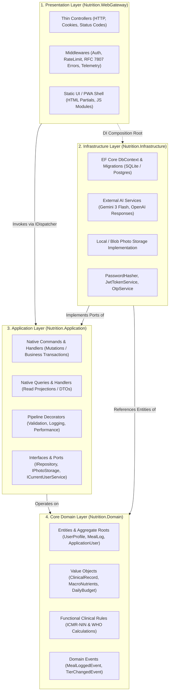
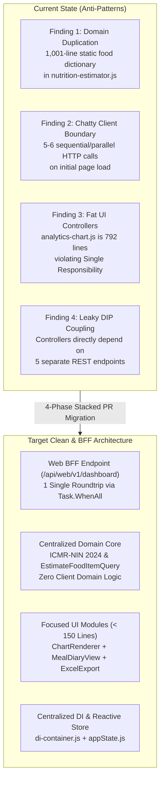
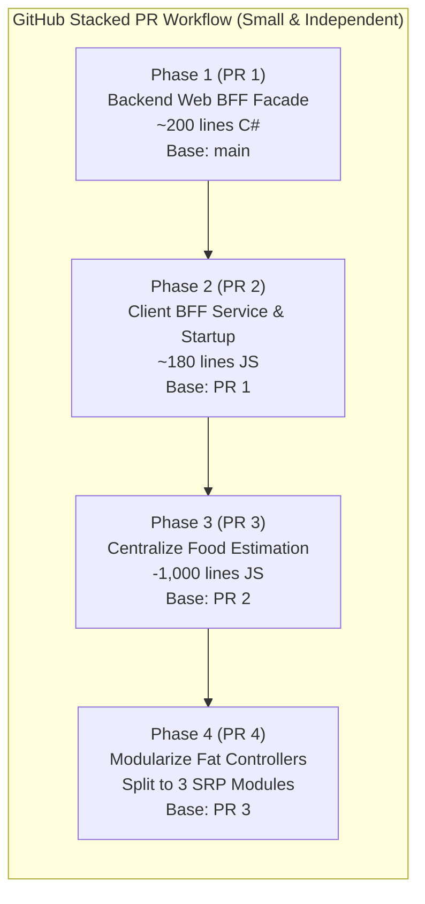

# Diet Dost — Clean Architecture, Native CQRS & Web BFF Rulebook
> **Specification Version**: `v1.2.0-WEB-BFF-SPEC`  
> **Architecture Pattern**: Clean Architecture (Hexagonal / Ports & Adapters) + Web BFF + Native .NET 11 CQRS  
> **Target Framework**: `.NET 11 RC` (`net11.0`) · Standalone `.NET Aspire 13.5.4`  
> **Framework Primitives**: Pure `Microsoft.Extensions.DependencyInjection` (Zero MediatR / Zero Commercial License)  
> **Standards Compliance**: SOLID Principles, Zero Duplicate Domain Code, OWASP ASVS v4.0, ICMR-NIN 2024  


---

## 0. Mandatory Pre-Conditions & Solution Rules

> [!IMPORTANT]
> Adhere strictly to the **Zero Direct-to-Main Policy** and Solution Rules in `AGENTS.md`:
> 1. **Branch First (Pre-Flight Remote Fetch)**: All refactoring must occur on a dedicated feature branch (`feature/<name>`). Never commit directly to `main`. Always execute `git fetch origin` and branch strictly from `origin/main` (or parent feature branch for GitHub Stacked PRs). Never branch from stale/dirty local branches.
> 2. **Target Framework**: All projects must target `<TargetFramework>net11.0</TargetFramework>`.
> 3. **Zero-Warning Standard**: 0 warnings, 0 errors across the solution.
> 4. **Zero Third-Party CQRS Dependencies**: Do NOT use `MediatR`. MediatR v13+ moved to a commercial / RPL-1.5 reciprocal license requiring paid license keys. Implement CQRS using native .NET 11 BCL abstractions.
> 5. **Test Verification**: Run `dotnet test` and confirm 100% pass rate before committing or raising PRs.
> 6. **Living SDD Synchronization**: Synchronize `docs/sdd/*.md` and append an entry to `docs/sdd/07_living_documentation_log.md`.
> 7. **Mandatory End-to-End User Tier Validation**: After any refactoring, new feature implementation, or bug fix, execute comprehensive end-to-end verification of the running application across all 5 user tiers using seeded demo accounts (`free@dietdost.app`, `basic@dietdost.app`, `premium@dietdost.app`, `admin.demo@dietdost.app`, `superadmin@dietdost.app` with password `DietDost@Demo2026!`). Ensure zero runtime exceptions, accurate quota enforcement, correct tier gating (e.g. photo comparison and data export paywalls), and zero browser console errors.
> 8. **Major Change Auto-Detection & Artifact Synchronization**: Continuously detect major changes (CQRS commands/queries, ports, entities, secret store, environment gates). Auto-synchronize `README.md`, `docs/architecture/diagrams/*.mermaid`, `docs/sdd/*.md`, and relevant skills without manual prompting.
> 9. **Mandatory Confirmation & Zero-Unilateral-Decision Protocol**: In case of ANY ambiguity, doubt, or multiple architectural paths, ask questions and seek confirmation using interactive tools (`ask_question`); do not make unilateral decisions on your own.

---

## 1. Clean Architecture Principles & Core Anti-Patterns

### 1.1 The Anti-Pattern: Fat Controllers
In the initial prototyping phase, controllers frequently accumulate responsibilities that violate Clean Architecture:
- Direct injection and invocation of EF Core `DbContext` (`_db.Users.FirstOrDefaultAsync(...)`).
- Raw file system manipulation (`Directory.CreateDirectory`, `Path.Combine`, `FileStream`).
- Direct orchestration of external AI services, tier checking, and quota deduction inside HTTP endpoint methods.
- Business rule validation mixed with HTTP status codes and cookie/header writing.

### 1.2 The Clean Architecture Law: Dependency Inversion
Dependencies **MUST strictly point inwards**:



### 1.3 Layer Separation Contracts
| Layer | Namespace | Allowed Dependencies | Forbidden Dependencies |
|---|---|---|---|
| **Domain** | `Nutrition.Domain` | None (pure C# / .NET runtime primitives) | EF Core, ASP.NET Core, Infrastructure, Application |
| **Application** | `Nutrition.Application` | `Nutrition.Domain`, BCL `Microsoft.Extensions.*` | ASP.NET Core MVC/Controllers, EF Core runtime, File system, Third-party Mediator packages |
| **Infrastructure** | `Nutrition.Infrastructure` | `Nutrition.Application`, `Nutrition.Domain`, EF Core, External SDKs | Presentation / Controllers |
| **Presentation** | `Nutrition.WebGateway` | `Nutrition.Application`, `Nutrition.Domain`, `Nutrition.Infrastructure` (DI Root only) | Direct DbContext queries in Controllers, Raw File I/O in Controllers |

---

## 2. Native .NET 11 CQRS (Zero Third-Party Dependency)

### 2.1 Why Native .NET 11 CQRS Over MediatR?
1. **Zero Licensing Complications**: MediatR v13+ adopted the Reciprocal Public License 1.5 (RPL-1.5) and a commercial paid license model under Lucky Penny Software LLC, requiring commercial license keys (`MEDIATR_LICENSE_KEY`). Native .NET 11 CQRS is 100% license-free and royalty-free.
2. **Native AOT Ready**: Uses compile-time interface dispatch or clean service provider resolution without reflection emit.
3. **Transparent Debugging**: No complex multi-layer reflection wrappers obscuring call stacks.
4. **Performance**: Zero allocation overhead for pipeline reflection wrappers.

### 2.2 Core CQRS Contracts in `Nutrition.Application/Common/CQRS/`

```csharp
namespace Nutrition.Application.Common.CQRS;

public interface ICommand<out TResult> { }
public interface ICommand : ICommand<Result> { }

public interface IQuery<out TResult> { }

public interface ICommandHandler<in TCommand, TResult>
    where TCommand : ICommand<TResult>
{
    Task<TResult> HandleAsync(TCommand command, CancellationToken ct = default);
}

public interface ICommandHandler<in TCommand> : ICommandHandler<TCommand, Result>
    where TCommand : ICommand
{
}

public interface IQueryHandler<in TQuery, TResult>
    where TQuery : IQuery<TResult>
{
    Task<TResult> HandleAsync(TQuery query, CancellationToken ct = default);
}

public interface IDispatcher
{
    Task<TResult> SendAsync<TResult>(ICommand<TResult> command, CancellationToken ct = default);
    Task<TResult> QueryAsync<TResult>(IQuery<TResult> query, CancellationToken ct = default);
}
```

### 2.3 Native Dispatcher Implementation
Implemented cleanly using `IServiceProvider` with direct handler resolution:

```csharp
namespace Nutrition.Application.Common.CQRS;

public class NativeDispatcher : IDispatcher
{
    private readonly IServiceProvider _serviceProvider;

    public NativeDispatcher(IServiceProvider serviceProvider)
    {
        _serviceProvider = serviceProvider;
    }

    public async Task<TResult> SendAsync<TResult>(ICommand<TResult> command, CancellationToken ct = default)
    {
        ArgumentNullException.ThrowIfNull(command);
        var handlerType = typeof(ICommandHandler<,>).MakeGenericType(command.GetType(), typeof(TResult));
        dynamic handler = _serviceProvider.GetRequiredService(handlerType);
        return await handler.HandleAsync((dynamic)command, ct);
    }

    public async Task<TResult> QueryAsync<TResult>(IQuery<TResult> query, CancellationToken ct = default)
    {
        ArgumentNullException.ThrowIfNull(query);
        var handlerType = typeof(IQueryHandler<,>).MakeGenericType(query.GetType(), typeof(TResult));
        dynamic handler = _serviceProvider.GetRequiredService(handlerType);
        return await handler.HandleAsync((dynamic)query, ct);
    }
}
```

### 2.4 Dependency Injection Registration Extension
Registers all command and query handlers automatically by scanning the Application assembly:

```csharp
namespace Nutrition.Application;

public static class DependencyInjection
{
    public static IServiceCollection AddApplicationServices(this IServiceCollection services)
    {
        services.AddScoped<IDispatcher, NativeDispatcher>();

        var assembly = typeof(DependencyInjection).Assembly;
        
        // Register all ICommandHandler<,> and IQueryHandler<,>
        foreach (var type in assembly.GetTypes().Where(t => !t.IsAbstract && !t.IsInterface))
        {
            foreach (var iface in type.GetInterfaces().Where(i => i.IsGenericType))
            {
                var genericDef = iface.GetGenericTypeDefinition();
                if (genericDef == typeof(ICommandHandler<,>) || genericDef == typeof(IQueryHandler<,>))
                {
                    services.AddScoped(iface, type);
                }
            }
        }

        return services;
    }
}
```

---

## 3. Thin Controllers & Result Envelope

### 3.1 Standard Result Envelope (`Result<T>`)
```csharp
namespace Nutrition.Application.Common.Models;

public class Result<T>
{
    public bool Succeeded { get; }
    public T? Data { get; }
    public string? Error { get; }
    public string? ErrorCode { get; }
    public int StatusCode { get; }

    private Result(bool succeeded, T? data, string? error, string? errorCode, int statusCode)
    {
        Succeeded = succeeded;
        Data = data;
        Error = error;
        ErrorCode = errorCode;
        StatusCode = statusCode;
    }

    public static Result<T> Success(T data, int statusCode = 200) => new(true, data, null, null, statusCode);
    public static Result<T> Failure(string error, string errorCode = "BadRequest", int statusCode = 400) => new(false, default, error, errorCode, statusCode);
    public static Result<T> NotFound(string message = "Entity not found.") => new(false, default, message, "NotFound", 404);
    public static Result<T> Unauthorized(string message = "Unauthorized.") => new(false, default, message, "Unauthorized", 401);
    public static Result<T> Forbidden(string message = "Forbidden.") => new(false, default, message, "Forbidden", 403);
}

public class Result : Result<bool>
{
    private Result(bool succeeded, string? error, string? errorCode, int statusCode) 
        : base(succeeded, succeeded, error, errorCode, statusCode) { }

    public static Result Ok() => new(true, null, null, 200);
    public static new Result Failure(string error, string errorCode = "BadRequest", int statusCode = 400) => new(false, error, errorCode, statusCode);
}
```

### 3.2 Thin Controller Pattern
Controllers handle **HTTP semantics only** (request binding, claims extraction, status codes, cookies):

```csharp
[ApiController]
[Route("api/[controller]")]
public class AuthController : ControllerBase
{
    private readonly IDispatcher _dispatcher;

    public AuthController(IDispatcher dispatcher)
    {
        _dispatcher = dispatcher;
    }

    [HttpPost("register")]
    public async Task<IActionResult> Register([FromBody] RegisterUserCommand command, CancellationToken ct)
    {
        var result = await _dispatcher.SendAsync(command, ct);
        if (!result.Succeeded)
            return StatusCode(result.StatusCode, new { error = result.ErrorCode, message = result.Error });

        return Ok(result.Data);
    }
}
```

---

## 4. Port / Adapter Abstractions

### 4.1 Storage Abstraction (`IPhotoStorageService`)
Extracts all physical file system operations out of `MealsController` and `ProgressPhotosController`:

```csharp
namespace Nutrition.Application.Common.Interfaces;

public interface IPhotoStorageService
{
    Task<string> SaveMealPhotoAsync(Stream fileStream, string fileName, string contentType, CancellationToken ct = default);
    Task<string> SaveProgressPhotoAsync(Stream fileStream, string fileName, string contentType, CancellationToken ct = default);
    Task<bool> DeletePhotoAsync(string relativeUrl, CancellationToken ct = default);
}
```

### 4.2 User Context Abstraction (`ICurrentUserService`)
Extracts `HttpContext.User` claims inspection out of controllers and business services:

```csharp
namespace Nutrition.Application.Common.Interfaces;

public interface ICurrentUserService
{
    string? UserId { get; }
    string? Email { get; }
    string? Role { get; }
    string? Tier { get; }
    bool IsAuthenticated { get; }
    bool IsAdminOrSuper { get; }
}
```

---

## 5. Standard Feature Slices in `Nutrition.Application`

```
src/Nutrition.Application/
├── Common/
│   ├── CQRS/
│   │   ├── ICommand.cs
│   │   ├── IQuery.cs
│   │   ├── ICommandHandler.cs
│   │   ├── IQueryHandler.cs
│   │   ├── IDispatcher.cs
│   │   └── NativeDispatcher.cs
│   ├── Interfaces/
│   │   ├── IPhotoStorageService.cs
│   │   ├── ICurrentUserService.cs
│   │   └── IDateTimeProvider.cs
│   └── Models/
│       └── Result.cs
├── Features/
│   ├── Auth/
│   │   ├── Commands/ (RegisterUser, Login, VerifyOtp, ForgotPassword, ResetPassword)
│   │   └── Queries/  (GetCurrentUser)
│   ├── Meals/
│   │   ├── Commands/ (UploadAndAnalyzeMeal, ConfirmMeal, LogManualMeal, SubmitAiFeedback)
│   │   └── Queries/  (GetMealHistory, GetMealById)
│   ├── Profile/
│   │   ├── Commands/ (SaveProfile)
│   │   └── Queries/  (GetProfile)
│   ├── Analytics/
│   │   └── Queries/  (GetDailyLedger, GetProjections)
│   └── Admin/
│       ├── Commands/ (UpdateUserTier, UpdateUserRole, UpdateTierConfig)
│       └── Queries/  (GetAdminUsers, GetAdminUserById)
```

---

---

## 6. Web Backend for Frontend (Web BFF) & Client Clean Architecture Specification

### 6.1 Architectural Review of Existing Web App & Critical Deficiencies
A strict architectural audit of `src/Nutrition.WebGateway/wwwroot/` revealed four structural anti-patterns that must be systematically remediated:



1. **Domain Logic Leakage & Duplication (`nutrition-estimator.js`)**:
   - Contains a hardcoded 1,001-line static JavaScript dictionary (`INDIAN_FOOD_DICTIONARY`) with calories, protein, carbs, fat, fiber, and sodium for 150+ Indian dishes.
   - Duplicates portion multipliers (`scaleNutritionByPortion`) and dietitian advice (`generateDietitianAdvice`).
   - Violates the **Single Source of Truth** principle: clinical updates in `Nutrition.Domain` or `ICMR-NIN 2024` do not reflect in the client, creating clinical drift and downloading 31 KB of dead weight on every mobile session.
2. **Chatty Client-Server Boundary (Lack of Web BFF)**:
   - On initial authenticated page load (`main.js` `initApp`), the browser executes **5 to 6 discrete HTTP roundtrips**:
     `GET /api/auth/me`, `GET /api/analytics/daily`, `GET /api/analytics/projections`, `GET /api/meals/history`, `GET /api/progressphotos/comparison`, and `GET /api/meals/quota`.
   - Results in high Time-to-Interactive (TTI), connection exhaustion on mobile cellular networks, and UI layout shifts as components hydrate asynchronously.
3. **Violations of Single Responsibility Principle (Fat UI Controllers)**:
   - `analytics-chart.js` (792 lines) manages SVG coordinate calculations, timeline tab state, click filter handlers, meal diary card/grid rendering, and Excel/CSV serialization.
   - High defect coupling: altering chart tooltip formatting risks breaking Excel export or diary table rendering.
4. **Leaky DIP Coupling**:
   - UI controllers are tightly coupled to the REST routing and payload shapes of 5 distinct backend controllers rather than depending on a presentation-tailored abstraction.

---

### 6.2 The Web BFF Pattern & Server-Side Aggregation
The Web BFF pattern introduces a dedicated presentation facade (`WebBffController` at `/api/web/v1/*`) that aggregates domain queries on the server:

1. **Single Composite Endpoint (`GET /api/web/v1/dashboard`)**:
   Returns `WebDashboardCompositeDto` containing:
   - `User`: Identity, Tier, Role, Avatar.
   - `TodayLedger`: Daily budget, calories consumed, remaining allowance, macro distribution.
   - `Projections`: Historical trend points for the requested timeline period (default 7D), deficit total, weight loss forecast.
   - `RecentMeals`: Today's logged meals for immediate diary rendering.
   - `Quota`: Daily AI scans remaining, quota ceiling, upgrade recommendations.
   - `FeatureFlags`: Tier gating flags (`CanComparePhotos`, `CanExportData`, `HistoryDayLimit`, `IsAdmin`).
2. **Concurrent Execution via `Task.WhenAll`**:
   The controller dispatches 4 independent CQRS queries concurrently via `IDispatcher`, completing aggregation in sub-50ms with 0 database access inside the controller:
   ```csharp
   var ledgerTask = _dispatcher.QueryAsync(new GetDailyLedgerQuery(userId, null, isAdminOrSuper), ct);
   var projectionsTask = _dispatcher.QueryAsync(new GetHistoricalAnalyticsQuery(userId, period), ct);
   var mealsTask = _dispatcher.QueryAsync(new GetMealHistoryQuery(userId, 7), ct);
   var quotaTask = _dispatcher.QueryAsync(new GetAiQuotaQuery(userId), ct);

   await Task.WhenAll(ledgerTask, projectionsTask, mealsTask, quotaTask);
   ```

---

### 6.3 Zero-Duplicate-Code Guarantee
1. **Clinical Dietetics Exclusivity**:
   - All nutritional calculations, Mifflin-St Jeor BMR, TDEE, macronutrient distributions, and Asian-Indian BMI cutoffs **MUST reside strictly in `Nutrition.Domain.Clinical`**.
   - No calorie or macro arithmetic may be implemented in client-side JavaScript.
2. **Centralized Food Item Estimation**:
   - Food estimation, portion scaling, and dietitian tips are routed exclusively through `EstimateFoodItemQueryHandler.cs` via `POST /api/meals/estimate`.
   - `nutrition-estimator.js` is completely excised, eliminating 1,001 lines of duplicate static dictionary.
   - Client review modal uses a 300ms input debounce when requesting real-time estimation from the backend.

---

### 6.4 Client-Side SOLID Principles in Native HTML5 & ES Modules
Even within a vanilla JavaScript / HTML5 PWA architecture, SOLID principles must be strictly enforced:

1. **Single Responsibility Principle (SRP)**:
   - Every JavaScript class or module must have exactly one reason to change.
   - UI Controllers are strictly coordinators (<150 lines) that bind DOM events and delegate to dedicated components:
     - `ChartRenderer.js`: SVG coordinate math, bar rendering, and tooltips only.
     - `MealDiaryView.js`: Card and Grid DOM generation only.
     - `ExcelExportService.js`: CSV/XLSX serialization and file download triggering only.
2. **Open/Closed Principle (OCP)**:
   - Timeline period filters (`1D`, `7D`, `30D`, `90D`, `365D`) and meal types are defined as registry configurations rather than hardcoded `switch` statements across multiple files.
3. **Liskov Substitution & Interface Segregation (LSP / ISP)**:
   - Client services expose focused, segregated methods (e.g. `IWebBffService` provides read-only aggregation, `IMealsService` provides mutations).
4. **Dependency Inversion Principle (DIP)**:
   - Components receive dependencies via constructor injection from `di-container.js`.
   - Components never instantiate network clients or query remote APIs directly.

---

## 7. Phased Non-Big-Bang Step-by-Step Implementation Roadmap

> [!IMPORTANT]
> **No Big-Bang Release Mandate**: To eliminate regression risk and ensure each step is cleanly reviewable, the Web BFF and Clean Architecture migration is divided into **4 small, independently testable Pull Requests** using the **GitHub Stacked PR Protocol**.
> Complete reference code and scripts are maintained in [web_bff_clean_architecture_playbook.md](file:///c:/Users/nikunj.banker/source/repos/diet-dost/.agents/skills/diet-dost-clean-architecture/references/web_bff_clean_architecture_playbook.md).



### Phase 1 (PR 1): Backend Web BFF Facade Endpoint (`/api/web/v1/dashboard`)
- **Objective**: Create the composite endpoint and DTO without altering any running client code.
- **Scope**: ~200 lines C#. 100% additive, zero breaking changes.
- **Tasks**:
  1. Add `WebDashboardCompositeDto.cs` in `Nutrition.Application/Features/WebBff/DTOs/`.
  2. Implement `WebBffController.cs` in `Nutrition.WebGateway/Controllers/Web/` using `IDispatcher` and `Task.WhenAll`.
  3. Add unit & integration tests in `Nutrition.EvalHarness.Tests`.
  4. Validate `dotnet test` (0 errors, 0 warnings).

### Phase 2 (PR 2): Client Web BFF Service & Startup Consolidation
- **Objective**: Update client startup (`main.js`) to consume the composite endpoint, collapsing 5 network roundtrips into 1.
- **Scope**: ~180 lines JS.
- **Tasks**:
  1. Add `web-bff-service.js` in `src/Nutrition.WebGateway/wwwroot/js/services/`.
  2. Register `webBffService` in `di-container.js`.
  3. Refactor `initApp` in `main.js` to call `webBffService.getDashboard('7D')` and hydrate `DailyHud` and `AnalyticsChart` directly from memory.
  4. Verify in browser Network tab: 1 request replaces 5 requests on startup.

### Phase 3 (PR 3): Centralize Food Estimation & Safely Excise `nutrition-estimator.js`
- **Objective**: Eliminate 1,001-line client food dictionary and wire review modal to backend estimation.
- **Scope**: +80 lines modified, -1,001 lines deleted.
- **Tasks**:
  1. Wire `review-modal.js` to call `mealsService.estimateFoodItem` with a 300ms debounce.
  2. Safely delete `src/Nutrition.WebGateway/wwwroot/js/services/nutrition-estimator.js`.
  3. Verify manual meal logging, portion steppers, and macro calculations across all meal types.

### Phase 4 (PR 4): Modularize Monolithic UI Controllers into Single Responsibility Components
- **Objective**: Deconstruct `analytics-chart.js` (792 lines) into focused, single-responsibility components.
- **Scope**: ~300 lines refactored into 3 small modules.
- **Tasks**:
  1. Extract `ChartRenderer.js` (<150 lines) for pure SVG coordinate math and rendering.
  2. Extract `MealDiaryView.js` (<150 lines) for card and grid table rendering.
  3. Extract `ExcelExportService.js` (<80 lines) for CSV/XLSX generation and file download.
  4. Reduce `AnalyticsChartController.js` to a thin coordinator (<120 lines).

### Phase 5 (PR 5): End-to-End Verification & Living Documentation Sync
- **Objective**: Full end-to-end verification across all 5 demo user tiers and living documentation synchronization.
- **Tasks**:
  1. Execute verification protocol in Section 8 across all 5 demo accounts.
  2. Confirm 0 console errors, 0 runtime exceptions, and accurate tier gating.
  3. Update `docs/sdd/07_living_documentation_log.md` and related SDDs.

---

## 8. Mandatory End-to-End User Tier Verification Protocol

Whenever code in the solution is modified, refactored, or introduced, the following validation matrix **MUST** be verified against the live application:

### 8.1 Deterministic Demo User Credentials Matrix
All seeded demo accounts share the common demo password: `DietDost@Demo2026!`

| Demo User Identifier | User Tier | User Role | Daily AI Quota | Photo Compare Gating | Data Export Gating | Analytics History | Admin Console |
| :--- | :--- | :--- | :--- | :--- | :--- | :--- | :--- |
| `free@dietdost.app` | `Free` (0) | `User` | 1 / day | **Gated (403 / Paywall Modal)** | **Gated (403 / Paywall Modal)** | 7 Days | **Gated (403 Forbidden)** |
| `basic@dietdost.app` | `Basic` (1) | `User` | 7 / day | **Gated (403 / Paywall Modal)** | **Gated (403 / Paywall Modal)** | 30 Days | **Gated (403 Forbidden)** |
| `premium@dietdost.app` | `Premium` (2) | `User` | 30 / day | **Unlocked (200 OK)** | **Unlocked (200 OK)** | 365 Days | **Gated (403 Forbidden)** |
| `admin.demo@dietdost.app` | `Premium` (2) | `Admin` | 30 / day | **Unlocked (200 OK)** | **Unlocked (200 OK)** | 365 Days | **Unlocked (200 OK)** |
| `superadmin@dietdost.app` | `SuperAdmin` (3) | `SuperAdmin` | Unlimited (-1) | **Unlocked (200 OK)** | **Unlocked (200 OK)** | 365 Days | **Unlocked (200 OK & Full Governance)** |

### 8.2 Validation Workflow Steps
1. **API Protocol Validation**:
   - `POST /api/auth/login`: Authenticate and obtain JWT bearer token / cookie.
   - `GET /api/auth/me`: Confirm authenticated user profile, claims, tier, and role.
   - `GET /api/profile`: Validate clinical intake formulas and macro distribution calculation.
   - `GET /api/analytics/ledger/today`: Confirm daily calorie ledger budget calculations.
   - `GET /api/meals/quota`: Verify daily AI detection quota limits and remaining counter.
   - `GET /api/progress-photos/comparison`: Assert HTTP 403 for Free/Basic and HTTP 200 for Premium/Admin/SuperAdmin.
   - `GET /api/meals/export`: Assert HTTP 403 for Free/Basic and HTTP 200 for Premium/Admin/SuperAdmin.
   - `GET /api/admin/users`: Assert HTTP 403 for User role and HTTP 200 for Admin/SuperAdmin.
2. **Interactive UI Verification**:
   - Verify visual rendering of Hero HUD, gauges, and meal logger for Free user.
   - Trigger gated feature (e.g. clicking "Upgrade to Premium" on locked photo comparison) to verify paywall modal emerges cleanly.
   - Log in as Premium user: verify `⚡ Premium` badge and unlocked side-by-side photo comparison view.
   - Log in as SuperAdmin user: verify `👑 Super` badge and `👑 Admin Governance` console modal.
   - Ensure zero browser console errors and zero backend exceptions.
