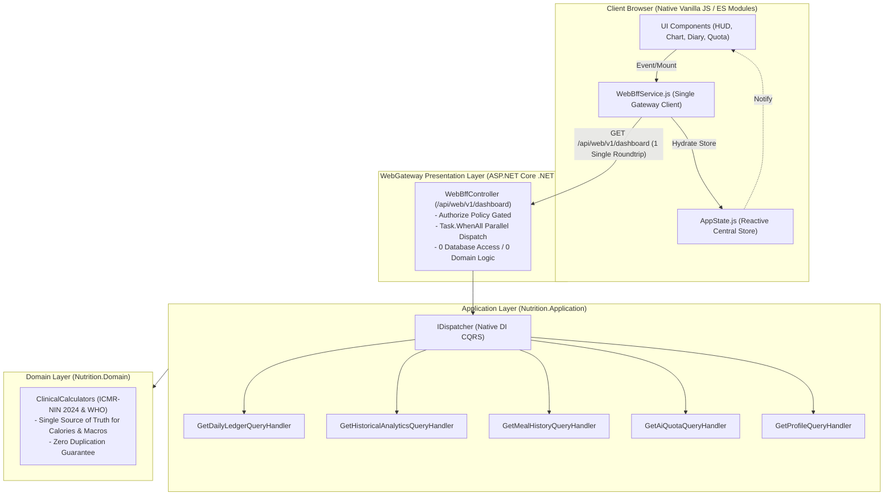

<!--
  Copyright (c) 2026 diet-dost and/or its contributors.
  Licensed under the "GNU Affero General Public License v3.0 only" and
  the "Server Side Public License, v 1"; you may not use this file except
  in compliance with, at your election, the "GNU Affero General Public
  License v3.0 only" or the "Server Side Public License, v 1".
-->

# Reference Playbook: Web BFF & Frontend Clean Architecture Implementation

> **Skill Reference Document**: `.agents/skills/diet-dost-clean-architecture/references/web_bff_clean_architecture_playbook.md`  
> **Target Framework**: `.NET 11 RC` (`net11.0`) & Native HTML5 / ES Modules Client  
> **Architecture Pattern**: Backend for Frontend (Web BFF) & Clean Architecture / SOLID in Native JS  
> **Status**: Approved Reference Implementation Blueprint (Zero Code Changes in Master Repository)  

---

## 1. Architectural Topology & Design Principles

### 1.1 Web BFF Pattern Overview
The Web BFF (Backend for Frontend) serves as a presentation-layer aggregation gateway that decouples the frontend client (`src/Nutrition.WebGateway/wwwroot/`) from granular backend CQRS query contracts. Instead of the browser initiating 5 to 6 discrete HTTP roundtrips across multiple controllers (`MealsController`, `AnalyticsController`, `ProfileController`, `ProgressPhotosController`, `AuthController`), the Web BFF executes these operations **in parallel on the server** via `IDispatcher` and `Task.WhenAll`.



---

## 2. Phase 1 Reference Code: Backend Web BFF Facade

### 2.1 Composite DTO Contract
**Path**: `src/Nutrition.Application/Features/WebBff/DTOs/WebDashboardCompositeDto.cs`

```csharp
namespace Nutrition.Application.Features.WebBff.DTOs;

using Nutrition.Application.Features.Analytics.DTOs;
using Nutrition.Application.Features.Identity.DTOs;
using Nutrition.Application.Features.Meals.DTOs;

/// <summary>
/// Composite DTO consolidating all required data for the initial dashboard render.
/// Eliminates 5 client-side roundtrips by hydrating user, ledger, analytics, meals, quota, and feature flags in one payload.
/// </summary>
public record WebDashboardCompositeDto(
    UserProfileDto User,
    DailyLedgerDto TodayLedger,
    AnalyticsProjectionDto Projections,
    IReadOnlyList<MealHistoryItemDto> RecentMeals,
    AiQuotaStatusDto Quota,
    TierFeatureFlagsDto FeatureFlags
);

public record TierFeatureFlagsDto(
    bool CanComparePhotos,
    bool CanExportData,
    int HistoryDayLimit,
    bool HasAdvancedAnalytics,
    bool IsAdmin
);
```

### 2.2 Web BFF Controller Implementation
**Path**: `src/Nutrition.WebGateway/Controllers/Web/WebBffController.cs`

```csharp
namespace Nutrition.WebGateway.Controllers.Web;

using System.Security.Claims;
using Microsoft.AspNetCore.Authorization;
using Microsoft.AspNetCore.Mvc;
using Nutrition.Application.Common.CQRS;
using Nutrition.Application.Features.Analytics.Queries;
using Nutrition.Application.Features.Identity.DTOs;
using Nutrition.Application.Features.Identity.Queries;
using Nutrition.Application.Features.Meals.Queries;
using Nutrition.Application.Features.WebBff.DTOs;

/// <summary>
/// Web BFF Facade Controller. Provides high-performance, composite endpoints tailored strictly
/// for the web application presentation layer, orchestrating CQRS queries via IDispatcher in parallel.
/// </summary>
[Authorize]
[ApiController]
[Route("api/web/v1")]
[Produces("application/json")]
public class WebBffController : ControllerBase
{
    private readonly IDispatcher _dispatcher;
    private readonly ILogger<WebBffController> _logger;

    public WebBffController(IDispatcher dispatcher, ILogger<WebBffController> logger)
    {
        _dispatcher = dispatcher ?? throw new ArgumentNullException(nameof(dispatcher));
        _logger = logger ?? throw new ArgumentNullException(nameof(logger));
    }

    /// <summary>
    /// Fetches all essential dashboard components in a single high-efficiency request.
    /// Executes queries concurrently using Task.WhenAll to achieve sub-50ms execution times.
    /// </summary>
    [HttpGet("dashboard")]
    [ProducesResponseType(typeof(WebDashboardCompositeDto), StatusCodes.Status200OK)]
    [ProducesResponseType(StatusCodes.Status401Unauthorized)]
    public async Task<IActionResult> GetDashboardComposite(
        [FromQuery] string period = "7D",
        CancellationToken ct = default)
    {
        var userId = User.FindFirstValue(ClaimTypes.NameIdentifier);
        if (string.IsNullOrWhiteSpace(userId))
        {
            return Unauthorized();
        }

        var tierStr = User.FindFirstValue("Tier") ?? "Free";
        var roleStr = User.FindFirstValue(ClaimTypes.Role) ?? "User";
        var isAdminOrSuper = roleStr is "Admin" or "SuperAdmin";

        _logger.LogInformation("Web BFF dashboard requested for user {UserId} (Tier: {Tier}, Period: {Period})", 
            userId, tierStr, period);

        // Execute 4 primary independent read queries in parallel
        var ledgerTask = _dispatcher.QueryAsync(new GetDailyLedgerQuery(userId, null, isAdminOrSuper), ct);
        var projectionsTask = _dispatcher.QueryAsync(new GetHistoricalAnalyticsQuery(userId, period), ct);
        var mealsTask = _dispatcher.QueryAsync(new GetMealHistoryQuery(userId, 7), ct);
        var quotaTask = _dispatcher.QueryAsync(new GetAiQuotaQuery(userId), ct);

        await Task.WhenAll(ledgerTask, projectionsTask, mealsTask, quotaTask);

        var ledgerResult = ledgerTask.Result;
        var projectionsResult = projectionsTask.Result;
        var mealsResult = mealsTask.Result;
        var quotaResult = quotaTask.Result;

        var userDto = new UserProfileDto(
            UserId: userId,
            Email: User.FindFirstValue(ClaimTypes.Email) ?? string.Empty,
            DisplayName: User.FindFirstValue("DisplayName") ?? User.FindFirstValue(ClaimTypes.Name) ?? "User",
            Tier: tierStr,
            Role: roleStr
        );

        var featureFlags = new TierFeatureFlagsDto(
            CanComparePhotos: tierStr is "Premium" or "SuperAdmin",
            CanExportData: tierStr is "Premium" or "SuperAdmin",
            HistoryDayLimit: tierStr switch
            {
                "SuperAdmin" or "Premium" => 365,
                "Basic" => 30,
                _ => 7
            },
            HasAdvancedAnalytics: tierStr is "Premium" or "SuperAdmin",
            IsAdmin: isAdminOrSuper
        );

        var composite = new WebDashboardCompositeDto(
            User: userDto,
            TodayLedger: ledgerResult.Data ?? new(),
            Projections: projectionsResult.Data ?? new(),
            RecentMeals: mealsResult.Data?.Items ?? Array.Empty<MealHistoryItemDto>(),
            Quota: quotaResult.Data ?? new(),
            FeatureFlags: featureFlags
        );

        return Ok(composite);
    }
}
```

---

## 3. Phase 2 Reference Code: Client Web BFF Service & Bootstrap

### 3.1 Client Web BFF Service Module
**Path**: `src/Nutrition.WebGateway/wwwroot/js/services/web-bff-service.js`

```javascript
/**
 * WebBffService — Dedicated client service consuming the composite Web BFF endpoints.
 * Consolidates multiple domain queries into single high-speed HTTP payloads.
 */
export class WebBffService {
  /**
   * @param {import('./api-client.js').ApiClient} apiClient
   */
  constructor(apiClient) {
    if (!apiClient) throw new Error('[WebBffService] ApiClient instance is required.');
    this._api = apiClient;
  }

  /**
   * Fetches the complete aggregated dashboard payload in a single roundtrip.
   * @param {string} [period='7D'] - 1D, 7D, 30D, 90D, 365D
   * @returns {Promise<WebDashboardComposite>}
   */
  async getDashboard(period = '7D') {
    try {
      const response = await this._api.get(`/api/web/v1/dashboard?period=${encodeURIComponent(period)}`);
      return response;
    } catch (err) {
      console.error('[WebBffService] Failed to fetch dashboard composite:', err);
      throw err;
    }
  }
}
```

### 3.2 Refactored Bootstrap in `main.js`
**Path**: `src/Nutrition.WebGateway/wwwroot/js/main.js` (Snippet)

```javascript
// Inside main.js initApp / auth:success handler
async function handleAuthenticatedInit(webBffService, appState, uiControllers) {
  try {
    // 1 single HTTP GET roundtrip replaces 5 sequential network requests
    const dashboard = await webBffService.getDashboard('7D');
    
    // Store in global reactive state
    appState.setUser(dashboard.user);
    appState.setFeatureFlags(dashboard.featureFlags);
    appState.setAiQuota(dashboard.quota);
    
    // Instantly hydrate UI components from memory with zero layout shift
    uiControllers.dailyHud.hydrate(dashboard.todayLedger);
    uiControllers.analyticsChart.hydrate(dashboard.projections, dashboard.recentMeals);
    uiControllers.quotaMeter.hydrate(dashboard.quota);
    
    console.log('[App] Dashboard hydrated successfully in 1 roundtrip.');
  } catch (err) {
    console.error('[App] Failed to hydrate dashboard via Web BFF:', err);
  }
}
```

---

## 4. Phase 3 Reference Code: Eliminating Duplicate Food Estimation

### 4.1 The Violation: Why `nutrition-estimator.js` Must Be Excised
`src/Nutrition.WebGateway/wwwroot/js/services/nutrition-estimator.js` contains a 1,001-line static JavaScript dictionary duplicating nutritional values, portions, and advice.
- **Drift Risk**: Any update to ICMR-NIN 2024 or clinical calculations in `Nutrition.Domain` will fail to reflect on the web client.
- **Bundle Bloat**: 31 KB downloaded on every client load.
- **Solution**: Wire `review-modal.js` directly to backend query `EstimateFoodItemQuery` via `POST /api/meals/estimate`.

### 4.2 Review Modal Backend Estimation Wiring
**Path**: `src/Nutrition.WebGateway/wwwroot/js/ui/review-modal.js` (Snippet)

```javascript
// In review-modal.js: Replace local dictionary lookup with debounced backend estimation
let _debounceTimer = null;

export function onPortionOrItemChanged(itemName, portionText, mealsService, callback) {
  clearTimeout(_debounceTimer);
  _debounceTimer = setTimeout(async () => {
    try {
      // Calls POST /api/meals/estimate backed by EstimateFoodItemQueryHandler
      const estimation = await mealsService.estimateFoodItem({
        foodName: itemName,
        portionDescription: portionText
      });
      
      if (estimation && estimation.nutrition) {
        callback({
          calories: estimation.nutrition.calories,
          protein: estimation.nutrition.proteinGrams,
          carbs: estimation.nutrition.carbsGrams,
          fat: estimation.nutrition.fatGrams,
          fiber: estimation.nutrition.fiberGrams,
          sugar: estimation.nutrition.sugarGrams,
          dietitianNote: estimation.dietitianAdvice
        });
      }
    } catch (err) {
      console.warn('[ReviewModal] Backend estimation unavailable:', err);
    }
  }, 300); // 300ms input debounce
}
```

---

## 5. Phase 4 Reference Code: Modularizing Fat UI Controllers (Strict SRP)

### 5.1 Pure SVG Chart Renderer
**Path**: `src/Nutrition.WebGateway/wwwroot/js/ui/components/chart-renderer.js`

```javascript
/**
 * ChartRenderer — Dedicated component with Single Responsibility for SVG coordinate math and rendering.
 * Contains 0 network calls, 0 table rendering, and 0 export logic.
 */
export class ChartRenderer {
  constructor(svgContainerElement) {
    this._container = svgContainerElement;
  }

  /**
   * Renders the caloric timeline bar chart.
   * @param {Array<{date: string, consumedCalories: number, targetCalories: number}>} points
   * @param {function(object): void} onBarClick
   */
  render(points, onBarClick) {
    if (!this._container || !Array.isArray(points) || points.length === 0) {
      this._renderEmptyState();
      return;
    }

    const width = this._container.clientWidth || 600;
    const height = 220;
    const padding = { top: 20, right: 20, bottom: 30, left: 45 };
    const maxVal = Math.max(...points.map(p => Math.max(p.consumedCalories, p.targetCalories, 2000)));

    let svgHtml = `<svg width="100%" height="${height}" viewBox="0 0 ${width} ${height}" class="chart-svg">`;
    
    // Render gridlines and bars
    const barWidth = Math.max(8, (width - padding.left - padding.right) / points.length - 8);
    points.forEach((point, idx) => {
      const x = padding.left + idx * (barWidth + 8);
      const barHeight = (point.consumedCalories / maxVal) * (height - padding.top - padding.bottom);
      const y = height - padding.bottom - barHeight;
      const isOver = point.consumedCalories > point.targetCalories;
      const color = isOver ? '#ef4444' : '#10b981';

      svgHtml += `
        <rect x="${x}" y="${y}" width="${barWidth}" height="${barHeight}" rx="4" fill="${color}"
              data-index="${idx}" class="chart-bar" style="cursor: pointer;" />
      `;
    });

    svgHtml += `</svg>`;
    this._container.innerHTML = svgHtml;

    // Attach click handlers
    this._container.querySelectorAll('.chart-bar').forEach(bar => {
      bar.addEventListener('click', (e) => {
        const idx = parseInt(e.currentTarget.getAttribute('data-index'), 10);
        if (onBarClick && points[idx]) onBarClick(points[idx]);
      });
    });
  }

  _renderEmptyState() {
    this._container.innerHTML = `<div class="chart-empty">No trend data available for this period.</div>`;
  }
}
```

### 5.2 Meal Diary View Component
**Path**: `src/Nutrition.WebGateway/wwwroot/js/ui/components/meal-diary-view.js`

```javascript
/**
 * MealDiaryView — Dedicated component with Single Responsibility for meal diary rendering.
 * Renders Card or Grid views based on user preferences.
 */
export class MealDiaryView {
  constructor(containerElement) {
    this._container = containerElement;
  }

  render(meals, viewMode = 'cards', onMealDelete) {
    if (!this._container) return;
    if (!meals || meals.length === 0) {
      this._container.innerHTML = `<div class="empty-diary">No meals logged for this date.</div>`;
      return;
    }

    if (viewMode === 'grid') {
      this._renderGrid(meals, onMealDelete);
    } else {
      this._renderCards(meals, onMealDelete);
    }
  }

  _renderCards(meals, onMealDelete) {
    this._container.innerHTML = meals.map(m => `
      <div class="meal-card" data-meal-id="${m.id}">
        <div class="meal-card-header">
          <span class="meal-time">${m.timeLogged || 'Meal'}</span>
          <span class="meal-cals">${m.totalCalories} kcal</span>
        </div>
        <div class="meal-name">${m.mealName || 'Logged Items'}</div>
        <button class="btn-delete-meal" data-id="${m.id}">Delete</button>
      </div>
    `).join('');

    this._container.querySelectorAll('.btn-delete-meal').forEach(btn => {
      btn.addEventListener('click', () => onMealDelete?.(btn.getAttribute('data-id')));
    });
  }

  _renderGrid(meals, onMealDelete) {
    this._container.innerHTML = `
      <table class="meal-grid-table">
        <thead>
          <tr><th>Time</th><th>Meal</th><th>Calories</th><th>Protein</th><th>Action</th></tr>
        </thead>
        <tbody>
          ${meals.map(m => `
            <tr>
              <td>${m.timeLogged || ''}</td>
              <td>${m.mealName || ''}</td>
              <td>${m.totalCalories} kcal</td>
              <td>${m.totalProteinGrams}g</td>
              <td><button class="btn-delete-meal" data-id="${m.id}">🗑️</button></td>
            </tr>
          `).join('')}
        </tbody>
      </table>
    `;
  }
}
```

### 5.3 Excel & CSV Export Service
**Path**: `src/Nutrition.WebGateway/wwwroot/js/services/excel-export-service.js`

```javascript
/**
 * ExcelExportService — Single Responsibility for formatting meal history and triggering browser download.
 */
export class ExcelExportService {
  /**
   * Serializes meals array to CSV format and prompts file download.
   * @param {Array<object>} meals
   * @param {string} filename
   */
  exportMealsToCsv(meals, filename = 'diet-dost-export.csv') {
    if (!meals || meals.length === 0) throw new Error('No meal records available to export.');

    const headers = ['Date', 'Meal Name', 'Calories', 'Protein (g)', 'Carbs (g)', 'Fat (g)', 'Fiber (g)', 'Sugar (g)'];
    const rows = meals.map(m => [
      `"${m.dateLogged || ''}"`,
      `"${(m.mealName || '').replace(/"/g, '""')}"`,
      m.totalCalories || 0,
      m.totalProteinGrams || 0,
      m.totalCarbsGrams || 0,
      m.totalFatGrams || 0,
      m.totalFiberGrams || 0,
      m.totalSugarGrams || 0
    ]);

    const csvContent = [headers.join(','), ...rows.map(r => r.join(','))].join('\r\n');
    const blob = new Blob([csvContent], { type: 'text/csv;charset=utf-8;' });
    const url = URL.createObjectURL(blob);
    
    const link = document.createElement('a');
    link.setAttribute('href', url);
    link.setAttribute('download', filename);
    document.body.appendChild(link);
    link.click();
    document.body.removeChild(link);
    URL.revokeObjectURL(url);
  }
}
```

---

## 6. Verification Script: Web BFF Automated Test Harness

```powershell
# Script: scratch/validate_web_bff.ps1
# Validates the Web BFF composite endpoint across all demo user tiers

$BaseUrl = "http://localhost:5240"
$DemoPassword = "DietDost@Demo2026!"
$Tiers = @("free@dietdost.app", "basic@dietdost.app", "premium@dietdost.app", "superadmin@dietdost.app")

Write-Host "==========================================================" -ForegroundColor Cyan
Write-Host " Diet Dost Web BFF Verification Protocol" -ForegroundColor Cyan
Write-Host "==========================================================" -ForegroundColor Cyan

foreach ($Email in $Tiers) {
    Write-Host "`n[Testing User] $Email" -ForegroundColor Yellow
    
    # 1. Login
    $LoginBody = @{ email = $Email; password = $DemoPassword } | ConvertTo-Json
    $LoginRes = Invoke-RestMethod -Method Post -Uri "$BaseUrl/api/auth/login" -Body $LoginBody -ContentType "application/json" -SessionVariable Session
    
    # 2. Call Web BFF Dashboard
    $Stopwatch = [System.Diagnostics.Stopwatch]::StartNew()
    $Dashboard = Invoke-RestMethod -Method Get -Uri "$BaseUrl/api/web/v1/dashboard?period=7D" -WebSession $Session
    $Stopwatch.Stop()
    
    # 3. Assertions
    if ($null -ne $Dashboard.user -and $null -ne $Dashboard.todayLedger -and $null -ne $Dashboard.projections) {
        Write-Host "  ✅ Web BFF returned composite in $($Stopwatch.ElapsedMilliseconds) ms" -ForegroundColor Green
        Write-Host "     - Tier: $($Dashboard.user.tier)"
        Write-Host "     - Today's Target: $($Dashboard.todayLedger.dailyCaloricBudget) kcal"
        Write-Host "     - Quota Remaining: $($Dashboard.quota.scansRemaining)"
        Write-Host "     - Photo Compare Flag: $($Dashboard.featureFlags.canComparePhotos)"
    } else {
        Write-Host "  ❌ Failed composite assertion for $Email" -ForegroundColor Red
    }
}
```
