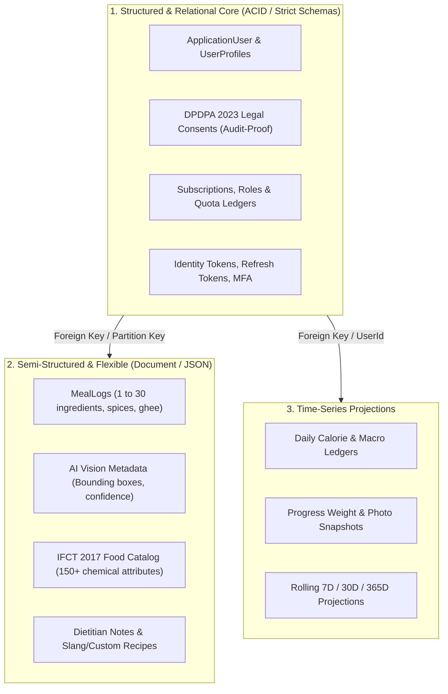
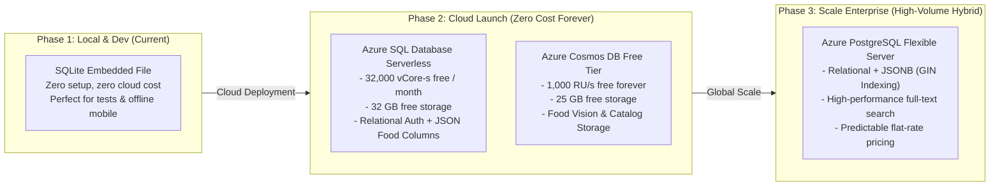
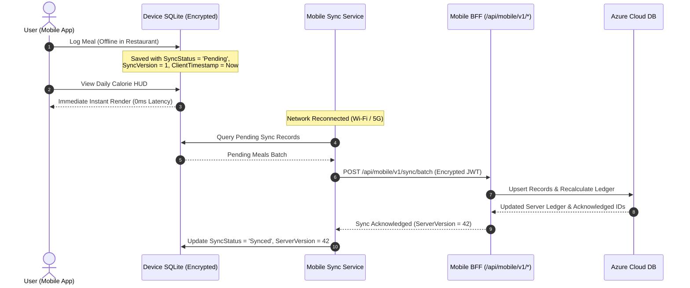

# Diet-Dost — Enterprise Database Architecture & Cloud Persistence Guide
> **Specification Version**: `v1.0.0-ENTERPRISE-DB`  
> **Domain Classification**: Nutrition & Clinical Dietetics Persistence Engine  
> **Platforms Supported**: Web PWA (`Nutrition.WebGateway`) & Cross-Platform Mobile (.NET MAUI / Expo)  
> **Cloud Provider**: Microsoft Azure (Zero-Cost Free Tier Starting Architecture)  
> **Compliance Standard**: DPDPA 2023, OWASP ASVS v4.0, Indian Medical Standards (ICMR-NIN 2024)  

---

## 0. Mandatory Pre-Conditions & Solution Governance

> [!IMPORTANT]
> Adhere strictly to the **Zero Direct-to-Main Policy** and Solution Rules in [`AGENTS.md`](file:///c:/Users/nikunj.banker/source/repos/diet-dost/AGENTS.md):
> 1. **Branch First (Pre-Flight Remote Fetch)**: All work must occur on an isolated feature branch. Always run `git fetch origin` first and verify that `git rev-parse HEAD` == `git rev-parse origin/main`.
> 2. **Target Framework**: All database adapters and migrations must target `<TargetFramework>net11.0</TargetFramework>`.
> 3. **Zero-Warning Standard**: 0 warnings, 0 errors across the solution.
> 4. **Token Economics Mandate**: Keep declarative specifications and schemas in [`docs/sdd/`](file:///c:/Users/nikunj.banker/source/repos/diet-dost/docs/sdd/) (0 baseline tokens) and tactical code recipes in this skill.
> 5. **Living SDD Synchronization**: Log changes using atomic fragments in `docs/sdd/logs/LOG-*.md` and register in [`07_living_documentation_log.md`](file:///c:/Users/nikunj.banker/source/repos/diet-dost/docs/sdd/07_living_documentation_log.md).
> 6. **Zero-Unilateral-Decision Protocol**: In case of any architectural ambiguity, ask confirmation via `ask_question`.

---

## 1. Domain-Driven Database Analysis: Nutrition & Diet Applications

Nutrition and health applications possess distinct data characteristics that disqualify purely relational or purely document architectures:



### 1.1 The Nutrition Data Profile
1. **Relational / ACID Core**:
   - Identity, DPDPA consent logs, subscriptions, tier quotas, and payment receipts require strict relational integrity, ACID transactions, and foreign key cascades.
2. **Semi-Structured Nutrition Logs**:
   - An Indian meal log is inherently dynamic. A *"Gujarati Thali"* or *"Hyderabadi Biryani"* contains nested sub-dishes (roti, dal, sabzi, curd, salad), variable portion scaling, custom oil/ghee adjustments, and AI vision confidence scores.
3. **Reference Food Composition Tables (IFCT 2017 / ICMR-NIN 2024)**:
   - Contains 528+ Indian foods with 150+ nutritional parameters (macronutrients, micronutrients, fatty acids, carotenoids, phytates). A flexible schema or native JSON/JSONB column is exponentially faster and more maintainable than a 150-column wide relational table.
4. **Mobile Offline Synchronization**:
   - Mobile users frequently log meals in poor connectivity (restaurants, basements, flights). The database strategy must support local offline caching on the device with optimistic cloud sync upon reconnection.

---

### 1.2 Concrete Diet-Dost Entity Schema Audit (The 12 Core Tables)

A strict audit of the active [`DietTrackerDbContext.cs`](file:///c:/Users/nikunj.banker/source/repos/diet-dost/src/Nutrition.Infrastructure/Persistence/DietTrackerDbContext.cs) and Domain Models reveals the following 12 database tables:

| # | Entity Class | Table Name | Storage Pattern & Characteristics | Foreign Keys & Indexing |
|---|---|---|---|---|
| **1** | `ApplicationUser` | `Users` | Relational Entity. String GUID PK. Contains password hashes, security stamps, tier enums, and forensic DPDPA 2023 legal consent fields (`TermsAcceptedAtUtc`, `HealthConsentAcceptedAtUtc`, `ConsentIpAddress`, `ConsentUserAgent`). | `NormalizedEmail` (Unique Index), `NormalizedMobileNumber`, `Role`, `Tier`. |
| **2** | `UserProfile` | `Profiles` | Relational Entity. String GUID PK matching `UserId`. Contains physical metrics (`Age`, `HeightCm`, `CurrentWeightKg`, `TargetWeightKg`, `Timezone`). Uses EF Core `ValueConverter` with `ValueComparer` to serialize `DiagnosedConditions` (`List<string>`) and `Medications` (`List<MedicationEntry>`) as JSON strings. | PK = `UserId`. |
| **3** | `MealLog` | `Meals` | Relational Aggregate Root. String GUID PK. Contains meal metadata (`DishName`, `PhotoUri`, `OverallConfidenceScore`, `AddedGheeKcal`, `AddedTadkaKcal`, `TotalCalories`, `TotalProteinGrams`, `TotalCarbsGrams`, `TotalFatGrams`). Stores `WhoComplianceFlags` and `MedicationWarnings` as JSON strings. | FK `UserId`. Auto-includes `Items` navigation. |
| **4** | `FoodItemRecord` | `FoodItems` | Relational Child Entity. String GUID PK. Represents individual food items in a meal with portion grams, macro totals, `CookingMediumEstimate`, and `ConfidenceScore`. | FK `MealLogId` with `DeleteBehavior.Cascade`. |
| **5** | `DailyCalorieLedger` | `Ledgers` | Relational Entity. String GUID PK. Tracks target vs. consumed calories, protein, carbs, fat, fiber, sugar, sodium for a given calendar date. Serializes `EarnedBadges` (`List<string>`) as JSON string. | Index on `(UserId, Date)`. |
| **6** | `ProgressPhoto` | `ProgressPhotos` | Relational Entity. String GUID PK. Stores photo URIs, weight snapshots, photo type enum (`Face`, `FullBodyFront`, `FullBodySide`), and baseline flags. | Composite indexes on `(UserId, CapturedAtUtc)` and `(UserId, PhotoType)`. |
| **7** | `UserCorrectionRecord` | `Corrections` | Relational Entity. String GUID PK. Continuous AI retraining feedback loop storing user corrections to detected foods. | Composite index on `(UserId, OriginalDetectedItem)`. |
| **8** | `AiDetectionFeedbackRecord` | `AiFeedbacks` | Relational Entity. String GUID PK. AI vision benchmark and user feedback log. | Indexes on `(UserId, CreatedAtUtc)` and `Rating`. |
| **9** | `TierFeatureConfiguration` | `TierConfigurations` | Relational Entity. String GUID PK. Gating limits for Free, Basic, Premium, SuperAdmin tiers (`DailyAiDetectionLimit`, `AllowPhotoCompare`, `AllowDataExport`, `AnalyticsHistoryDays`). | `Tier` (Unique Index). |
| **10** | `AiUsageLog` | `AiUsageLogs` | Relational Entity. String GUID PK. Records every AI call with token consumption, latency ms, model ID, and operation type for quota enforcement. | Composite indexes on `(UserId, TimestampUtc)` and `(UserId, OperationType)`. |
| **11** | `AppSecret` | `AppSecrets` | Key/Value Relational Store. String Key PK. Stores runtime secrets (`Jwt:Key`, `AI:GoogleAI:ApiKey`, `AI:AzureOpenAI:ApiKey`, `Auth:DemoPassword`) injected into `IConfiguration`. | Key (PK, MaxLength 128). |
| **12** | `VerificationOtp` | `VerificationOtps` | Relational Entity. String GUID PK. Stores cryptographic OTP hashes for email and SMS verification. | Composite indexes on `(UserId, Target)`, `(Target, Channel, IsUsed)`, and `ExpiresAtUtc`. |

---

### 1.3 Actual Seeded Data & Storage Footprint (`diettracker.db`)

An inspection of the active SQLite database ([`src/Nutrition.WebGateway/diettracker.db`](file:///c:/Users/nikunj.banker/source/repos/diet-dost/src/Nutrition.WebGateway/diettracker.db)) reveals:
1. **Seeded Demo Accounts**:
   - 5 seeded accounts representing all user tiers: `free@dietdost.app` (Free), `basic@dietdost.app` (Basic), `premium@dietdost.app` (Premium), `admin.demo@dietdost.app` (Admin), and `superadmin@dietdost.app` (SuperAdmin) with password `DietDost@Demo2026!`.
2. **Seeded Clinical Profiles & Conditions**:
   - Basic user is seeded with *"Hypertension"* and *"Telmisartan 40mg"*.
   - Premium user is seeded with *"Pre-Diabetes"* and *"Metformin 500mg"*.
3. **Seeded Representative Indian Meals**:
   - Pre-populated meals with rich ingredient breakdowns:
     - *"North Indian Thali (Phulkas, Dal & Bhindi Masala)"* (4 child food items).
     - *"Kanda Poha with Roasted Peanuts"* (3 child food items).
     - *"Palak Paneer with Phulkas"* (2 child food items).
     - *"Moong Dal Khichdi with Curd"* (2 child food items).
4. **Seeded Baseline Progress Photos**:
   - Seeded face and body comparison photos (`/uploads/progress/face_baseline.svg` vs `face_current.svg`).
5. **Seeded Configuration Secrets**:
   - `Jwt:Key` and `Auth:DemoPassword` seeded directly in `AppSecrets`.
6. **Key Finding on Identifiers**:
   - **All entities use string GUIDs (`Guid.NewGuid().ToString()`) rather than auto-incrementing integers**. This is a massive architectural advantage: GUIDs guarantee zero ID collision when synchronizing between local mobile SQLite and cloud databases.

---

## 2. Comprehensive Azure Database Evaluation & Deep Comparison

To balance enterprise security, clinical data flexibility, scalability, and zero startup cost, four architectural database options are evaluated:

| Dimension | Option 1: SQLite (Current MVP) | Option 2: Azure SQL Database (Serverless Free Tier) | Option 3: Azure Cosmos DB (NoSQL Free Tier) | Option 4: Azure PostgreSQL (Flexible Server) |
| :--- | :---: | :---: | :---: | :---: |
| **Azure Free Tier** | 100% Free (Local file / Azure Files) | 🏆 **Free Forever**<br>(32,000 vCore-s/mo + 32 GB storage) | 🏆 **Free Forever**<br>(1,000 RU/s + 25 GB storage) | ⚠️ **12 Months Free Trial**<br>(B1ms instance + 32 GB, then ~$12/mo) |
| **Model Type** | Embedded Relational | Relational + Native JSON | NoSQL Document (JSON) | Relational + JSONB (Hybrid) |
| **Enterprise Readiness** | ⚠️ Single-node file locking (No horizontal scale) | 🏆 High Enterprise (Autoscale, 99.99% SLA) | 🏆 Global Enterprise (Turnkey multi-region, 99.999% SLA) | 🏆 High Enterprise (Managed HA, Extensions) |
| **Schema Flexibility** | Moderate (Dynamic typing) | High (Native `JSON` columns + `OPENJSON`) | 🏆 Highest (Schema-less documents) | 🏆 Highest (JSONB with GIN indexing) |
| **.NET 11 / EF Core Support** | Native (`Microsoft.EntityFrameworkCore.Sqlite`) | 🏆 First-Class (`Microsoft.EntityFrameworkCore.SqlServer`) | First-Class (`Microsoft.EntityFrameworkCore.Cosmos`) | First-Class (`Npgsql.EntityFrameworkCore.PostgreSQL`) |
| **DPDPA 2023 & Security** | File-level OS encryption | 🏆 **Always Encrypted**, TDE, Row-Level Security | 🏆 RBAC, Entra ID, Customer Managed Keys | RLS, SCRAM-SHA-256, Entra ID |
| **Mobile Offline Sync** | Native (Same engine on phone) | Sync via Mobile BFF REST APIs | Sync via Mobile BFF or Cosmos Change Feed | Sync via Mobile BFF REST APIs |
| **Initial Cloud Hosting Cost** | **$0.00 / month** | **$0.00 / month** | **$0.00 / month** | **$0.00 / month (Year 1)**, then ~$12/mo |

---

### 2.1 Option 1: SQLite (Embedded Relational — Current MVP)

- **WHAT It Is**:
  - An in-process, serverless C-library relational database. Data is stored entirely in a single file on disk (`dietdost.db`), which in cloud container environments mounts via an Azure Files SMB persistent volume.
- **WHY Consider It**:
  - Unmatched simplicity for initial MVP development, local automated testing (`dotnet test`), and as the native offline storage engine embedded on Android and iOS client devices.
- **HOW It Works**:
  - Configured in EF Core via `options.UseSqlite(connectionString)`.
  - In Azure Container Apps, it uses a persistent storage volume mount (`/app/data/dietdost.db`).
- **PROS**:
  - **Zero Cloud Infrastructure Cost**: Runs completely within the existing container memory.
  - **Zero Network Latency**: In-process function calls with zero TCP/socket overhead.
  - **Cross-Platform Symmetry**: The exact same database engine runs natively on Android and iOS devices.
  - **Trivial Backups**: A snapshot backup is as simple as copying the `.db` file.
- **CONS**:
  - **Database-Level Write Locking**: SQLite locks the entire database file during writes (`SQLITE_BUSY`), preventing multi-replica horizontal scaling on Azure Container Apps.
  - **SMB Network Latency in Cloud**: Azure Files network latency can cause timeout exceptions under concurrent write traffic.
  - **Zero Native Row-Level Security (RLS)**: Cannot enforce database-engine tenant isolation or advanced DPDPA cryptographic masking.
  - **Verdict**: Exceptional for **Phase 1 local testing and client-side mobile caching**, but strictly disqualifying for multi-user enterprise cloud production.

---

### 2.2 Option 2: Azure SQL Database Serverless (Relational + Native JSON — The Recommended Free Tier)

- **WHAT It Is**:
  - A fully managed, cloud-native Microsoft SQL Server with serverless compute that auto-scales between 0.5 and 4 vCores and automatically pauses during idle periods. Includes **32,000 vCore-seconds and 32 GB storage completely free every month for life**.
- **WHY Consider It**:
  - Combines enterprise ACID relational guarantees for Identity, Subscriptions, and DPDPA consent with modern EF Core JSON columns (`ToJson()`) for flexible Indian food recipes and AI vision metadata.
- **HOW It Works**:
  - Configured in .NET 11 via `options.UseSqlServer(connectionString)`.
  - Authenticates securely via **Microsoft Entra ID (Azure AD) Managed Identity** with zero passwords in code.
  - Maps complex meal ingredient arrays directly to native `nvarchar(max)` JSON columns with sub-50ms query projections.
- **PROS**:
  - **Free Tier Forever**: 32,000 vCore-seconds + 32 GB storage free every month ($0.00 cloud bill).
  - **First-Class .NET 11 & EF Core Integration**: Zero migration friction from SQLite; identical LINQ semantics.
  - **Hybrid Data Superpower**: Eliminates 6-table joins for Indian meals by storing ingredients in native JSON columns.
  - **Enterprise Security Suite**: Transparent Data Encryption (TDE), Always Encrypted, Row-Level Security (RLS), and Dynamic Data Masking out of the box.
  - **Seamless Scalability**: Effortlessly handles thousands of concurrent Web and Mobile connections.
- **CONS**:
  - **Cold-Start Pause Latency**: When auto-paused after 60 minutes of inactivity, resuming takes ~20 to 40 seconds on the first request (can be warmed with synthetic health-check pings).
  - **32 GB Free Cap**: High-volume photo binary storage must be offloaded to Azure Blob Storage rather than DB tables.
  - **Proprietary Engine**: Relies on Microsoft T-SQL syntax and ecosystem.
  - **Verdict**: **The #1 Best Overall Choice for Diet-Dost Enterprise Cloud Launch**.

---

### 2.3 Option 3: Azure Cosmos DB (NoSQL Document — Cloud-Native Vision & Food Store)

- **WHAT It Is**:
  - A globally distributed, multi-model NoSQL document database offering guaranteed single-digit millisecond read/write latency at any scale. Includes **1,000 RU/s throughput and 25 GB storage free forever** per Azure subscription.
- **WHY Consider It**:
  - Nutrition meal logs, Indian food composition tables (IFCT 2017), and multimodal AI vision bounding boxes are naturally hierarchical JSON documents.
- **HOW It Works**:
  - Managed via `Microsoft.EntityFrameworkCore.Cosmos` or the `@azure/cosmos` SDK.
  - Containers partitioned by `/userId` for optimal point-read performance and predictable Request Unit (RU) consumption.
  - Uses the integrated Cosmos DB Change Feed to reactively trigger background AI analysis and sync to mobile clients.
- **PROS**:
  - **Free Tier Forever**: 1,000 RU/s + 25 GB free forever ($0.00/month).
  - **Schema-Less Agility**: Add new spices, regional slang, or AI model confidence scores without running database migrations.
  - **Blazing Performance**: Guaranteed sub-10ms read and write latencies globally.
  - **Turnkey Global Replication**: Instant multi-region replication with a single click.
  - **Event-Driven Change Feed**: Native reactive stream perfect for notifying mobile apps when meal vision analysis finishes.
- **CONS**:
  - **Relational Impedance Mismatch**: Enforcing ACID foreign keys, user role hierarchies, and complex financial/legal audit joins is difficult and expensive.
  - **Cross-Partition Query Overhead**: Unindexed cross-partition queries burn Request Units (RUs) rapidly.
  - **Steeper Learning Curve**: Requires strict partition-key modeling discipline compared to traditional relational SQL.
  - **Verdict**: **The Best Specialized Store for High-Scale Food Catalogs and AI Vision Logs** when paired with a relational identity store.

---

### 2.4 Option 4: Azure Database for PostgreSQL Flexible Server (The Open-Source Hybrid)

- **WHAT It Is**:
  - A fully managed enterprise PostgreSQL 16+ instance on Linux featuring native **JSONB** (binary JSON) storage, GIN/GiST indexing, and rich extensions like PostGIS. Includes a **12-month free trial** (750 hours/month on B1ms instance + 32 GB storage).
- **WHY Consider It**:
  - Provides the ultimate open-source hybrid architecture: strict relational tables for Auth and Consent, plus high-performance JSONB columns for nutrition logs that can be indexed and queried internally with sub-millisecond speed.
- **HOW It Works**:
  - Configured in .NET 11 via `Npgsql.EntityFrameworkCore.PostgreSQL`.
  - Maps meal logs via `builder.Property(m => m.Items).HasColumnType("jsonb")`.
  - Indexes nested ingredients using PostgreSQL Generalized Inverted Indexes (`CREATE INDEX idx_meals_gin ON MealLogs USING GIN (Items);`).
- **PROS**:
  - **Unrivaled Hybrid Power**: Combines ACID relational tables with the industry's most advanced JSONB query engine.
  - **GIN Indexing on Nested Ingredients**: Search for any Indian spice or allergen inside JSON arrays in sub-milliseconds (e.g. `WHERE Items @> '[{"FoodName": "Turmeric"}]'`).
  - **Zero Vendor Lock-In**: 100% open-source PostgreSQL; can run on Azure, AWS, GCP, or on-premises Docker containers.
  - **PostGIS Geospatial Support**: Ready for location-based features (e.g. finding nearby verified clinical dietitians or organic food vendors).
- **CONS**:
  - **Not Free Forever**: Free trial lasts **12 months**, after which it converts to standard burstable pricing (~$12 to $15/month).
  - **Connection Pooling Required**: High mobile concurrency requires configuring PgBouncer to prevent connection exhaustion.
  - **Migration Friction**: Requires switching from SQLite to Npgsql provider and writing PostgreSQL-specific migrations.
  - **Verdict**: **The Best Long-Term Open-Source Choice** if moving away from proprietary Microsoft database engines.

---

### 2.5 What, Why, How Decision Tree for Architects & Agents

```
START: What is the current operational phase and priority?
│
├── Phase 1: Local Development, CI/CD Pipeline & In-Memory Unit Testing
│   └── ➔ USE: Option 1 (SQLite Embedded)
│       ├── WHAT: In-process single-file database.
│       ├── WHY: 0 infrastructure, 0 cost, instant test teardown.
│       └── HOW: UseSqlite("Data Source=dietdost.db") with EF Core.
│
├── Phase 2: Enterprise Cloud Launch on Azure (ZERO Startup Cost Mandate)
│   └── ➔ USE: Option 2 (Azure SQL Database Serverless Free Tier) [RECOMMENDED]
│       ├── WHAT: Managed SQL Serverless with 32,000 vCore-s + 32 GB free forever.
│       ├── WHY: $0.00/mo forever, 0 migration friction from EF Core SQLite, Always Encrypted & RLS.
│       └── HOW: UseSqlServer() + Entra ID Managed Identity + builder.OwnsMany().ToJson().
│
├── Phase 3: High-Scale AI Multimodal Vision & Global Food Catalog Offload
│   └── ➔ USE: Option 2 (Azure SQL) + Option 3 (Azure Cosmos DB Free Tier) [POLYGLOT]
│       ├── WHAT: Relational Auth/Consent in Azure SQL; Meal documents & Vision in Cosmos DB.
│       ├── WHY: 1,000 RU/s free forever, sub-10ms reads, schema-less recipe flexibility.
│       └── HOW: UseCosmos() partitioned on /userId + Change Feed for mobile push notifications.
│
└── Phase 4: Long-Term Multi-Cloud / Open-Source Migration
    └── ➔ USE: Option 4 (Azure PostgreSQL Flexible Server)
        ├── WHAT: Managed PostgreSQL 16 with native JSONB and GIN indexing.
        ├── WHY: Zero vendor lock-in, deep JSONB ingredient indexing, PostGIS geolocation.
        └── HOW: UseNpgsql() + PgBouncer connection pooling + GIN index on meal JSONB.
```


---

## 3. Recommended Phased Database Architecture



### 3.1 The Winning Cloud-Launch Recommendation (Zero-Cost Tier)
For launching Diet-Dost into Azure with **zero initial cloud spend ($0.00/mo)** while maintaining enterprise-grade security and compliance:

1. **Option A (Recommended Unified): Azure SQL Database Serverless (Free Forever)**
   - **Why**: Microsoft Azure offers **32,000 vCore seconds of compute and 32 GB storage completely free every single month** per Azure subscription for the lifetime of the account.
   - **How it handles nutrition**: Store Users, Roles, Tiers, DPDPA Consents, and Daily Ledgers in relational tables; store variable meal ingredients, AI vision outputs, and clinical metadata in native `nvarchar(max)` columns using EF Core 8/9/11 JSON mapping (`ToJson()`).
   - **Cost**: **$0.00 / month**.
   - **Migration Effort**: Extremely low (swapping EF Core provider from SQLite to SqlServer).

2. **Option B (The Polyglot Cloud-Native Option): Azure SQL Serverless + Azure Cosmos DB Free Tier**
   - **Azure SQL Serverless (Free Forever)**: Manages User Identities, DPDPA Consent audit trails, Tier Quotas, and Auth tokens.
   - **Azure Cosmos DB Free Tier (Free Forever)**: 1,000 RU/s throughput + 25 GB storage free forever. Houses the IFCT food catalog and rich meal photo vision logs.
   - **Cost**: **$0.00 / month**.

3. **Option C (The Future Scale Option): Azure PostgreSQL Flexible Server**
   - Ideal if migrating away from Microsoft-specific engines towards open-source PostgreSQL. Free for the first 12 months on Azure (750 hours/mo on B1ms instance), then ~$12-15/month.

---

## 4. Security, DPDPA 2023 & Clinical Privacy Governance

Health and nutrition data is classified as sensitive personal data under India's **DPDPA 2023** and global health privacy frameworks.

### 4.1 Security Invariants
1. **Passwordless Managed Identity (Zero Hardcoded Secrets)**:
   - In Azure, the backend WebGateway communicates with Azure SQL or Cosmos DB using **Microsoft Entra ID Managed Identity**.
   - Zero database passwords or keys stored in `appsettings.json` or environment variables:
     ```csharp
     // Connection string with Managed Identity (Zero Secret)
     "Server=tcp:dietdost-sql.database.windows.net,1433;Database=dietdost;Authentication=Active Directory Default;Encrypt=True;"
     ```
2. **Row-Level Security (RLS)**:
   - For multi-tenant and multi-tier isolation, queries automatically enforce tenant predicates (`UserId = CURRENT_USER_ID()`) at the database engine level, preventing data leakage even in the event of an application defect.
3. **Data Anonymization on Erasure (DPDPA Section 12)**:
   - When a user exercises their Right to Erasure, identity records are deleted while anonymized nutritional metrics (e.g. calorie intake trends without identifiers) can be retained for clinical research with salt hashes removed.
4. **Encryption at Rest & In Transit**:
   - Transparent Data Encryption (TDE) with Customer-Managed Keys (CMK) in Azure Key Vault.
   - Strict TLS 1.3 enforcement with minimum cipher suites.

---

## 5. Mobile Offline-First Synchronization Architecture

To support seamless nutrition logging on Android and iOS devices when disconnected:



### 5.1 Sync Invariants
1. **Local Encryption**: Mobile SQLite database is encrypted via SQLCipher using an AES-256 key stored inside `AndroidKeyStore` (Android) or `Keychain` (iOS).
2. **Tombstone Deletions**: Meals deleted on mobile are marked with `IsDeleted = 1` and `DeletedAt = UtcNow` rather than physical deletion, ensuring the delete replicates cleanly to the cloud.
3. **Server-Authoritative Clinical Math**: Even if the mobile app renders an estimated calorie count offline, the server recalculates the authoritative macros using the canonical `Nutrition.Domain.Clinical` engine upon sync.

---

## 6. Concrete EF Core Implementation Recipes

### 6.1 Multi-Provider Configuration (SQLite for Dev, Azure SQL for Cloud)
**Path**: `src/Nutrition.Infrastructure/Persistence/DependencyInjection.cs`

```csharp
public static IServiceCollection AddNutritionPersistence(this IServiceCollection services, IConfiguration configuration, IHostEnvironment environment)
{
    var provider = configuration.GetValue<string>("Database:Provider") ?? "Sqlite";

    services.AddDbContext<NutritionDbContext>((sp, options) =>
    {
        switch (provider.ToLowerInvariant())
        {
            case "azure-sql":
            case "sqlserver":
                var sqlConnection = configuration.GetConnectionString("AzureSqlConnection");
                options.UseSqlServer(sqlConnection, sqlOpts =>
                {
                    sqlOpts.EnableRetryOnFailure(maxRetryCount: 5, maxRetryDelay: TimeSpan.FromSeconds(30), errorNumbersToAdd: null);
                    sqlOpts.MigrationsAssembly(typeof(DietTrackerDbContext).Assembly.FullName);
                });
                break;

            case "postgresql":
                var pgConnection = configuration.GetConnectionString("PostgreSqlConnection");
                options.UseNpgsql(pgConnection, pgOpts =>
                {
                    pgOpts.EnableRetryOnFailure(5);
                    pgOpts.MigrationsAssembly(typeof(DietTrackerDbContext).Assembly.FullName);
                });
                break;

            case "sqlite":
            default:
                var sqliteConnection = configuration.GetConnectionString("DefaultConnection") ?? "Data Source=diettracker.db";
                options.UseSqlite(sqliteConnection);
                break;
        }
    });

    return services;
}
```

### 6.2 EF Core Hybrid Relational + JSON Column Mapping
**Path**: `src/Nutrition.Infrastructure/Persistence/Configurations/MealLogConfiguration.cs`

```csharp
public class MealLogConfiguration : IEntityTypeConfiguration<MealLog>
{
    public void Configure(EntityTypeBuilder<MealLog> builder)
    {
        builder.HasKey(m => m.Id);
        builder.Property(m => m.UserId).IsRequired();
        builder.Property(m => m.LoggedAt).IsRequired();

        // Native JSON mapping in EF Core (Zero additional tables for ingredients)
        builder.OwnsMany(m => m.Items, item =>
        {
            item.ToJson();
            item.Property(i => i.Name).IsRequired();
            item.Property(i => i.Grams).HasPrecision(10, 2);
            item.Property(i => i.Calories).HasPrecision(10, 2);
        });

        // Fast index on UserId + LoggedAt for sub-50ms dashboard hydration
        builder.HasIndex(m => new { m.UserId, m.LoggedAt });
    }
}
```

---

## 7. Azure Zero-Cost Free Tier Provisioning Playbook

### 7.1 Azure SQL Serverless Free Tier Setup via Azure CLI
Run these commands to provision the permanent free tier:

```bash
# 1. Create Resource Group in Central India or East US
az group create --name rg-dietdost-prod --location centralindia

# 2. Create Logical SQL Server (Azure AD Only Auth - Zero SQL Passwords)
az sql server create \
  --name sql-dietdost-prod \
  --resource-group rg-dietdost-prod \
  --location centralindia \
  --enable-ad-only-auth \
  --external-admin-name "admin@dietdost.app" \
  --external-admin-sid "<your-azure-ad-object-id>"

# 3. Provision Serverless General Purpose Database with FREE TIER enabled
az sql db create \
  --resource-group rg-dietdost-prod \
  --server sql-dietdost-prod \
  --name dietdost \
  --edition GeneralPurpose \
  --family Gen5 \
  --compute-model Serverless \
  --free-limit-exhaustion-behavior AutoPause \
  --use-free-limit true

# 4. Configure Firewall to allow Azure Services (App Service / Container Apps)
az sql server firewall-rule create \
  --resource-group rg-dietdost-prod \
  --server sql-dietdost-prod \
  --name AllowAzureServices \
  --start-ip-address 0.0.0.0 \
  --end-ip-address 0.0.0.0
```

### 7.2 Azure Cosmos DB Free Tier Setup via Azure CLI
```bash
# Provision Azure Cosmos DB NoSQL account with Free Tier (1,000 RU/s + 25 GB free forever)
az cosmosdb create \
  --name cosmos-dietdost-prod \
  --resource-group rg-dietdost-prod \
  --default-consistency-level Session \
  --enable-free-tier true \
  --locations regionName=centralindia failoverPriority=0
```

---

## 8. Verification & Validation Checklist

Before migrating any environment from SQLite to Azure Cloud persistence:
- [ ] **Automated Test Suite**: Run `dotnet test` targeting the database provider to assert 100% pass rate.
- [ ] **5-Tier End-to-End User Verification**: Validate seeded accounts across all tiers (`free@dietdost.app`, `basic@dietdost.app`, `premium@dietdost.app`, `admin.demo@dietdost.app`, `superadmin@dietdost.app`).
- [ ] **Quota & Feature Gating Enforcement**: Assert daily AI scan limits and photo comparison paywalls behave identically.
- [ ] **Passwordless Connectivity**: Validate Microsoft Entra ID managed identity connection with zero hardcoded credentials.
- [ ] **Living Documentation Log**: Register the implementation fragment in `docs/sdd/logs/LOG-*.md` and update [`docs/sdd/07_living_documentation_log.md`](file:///c:/Users/nikunj.banker/source/repos/diet-dost/docs/sdd/07_living_documentation_log.md).
