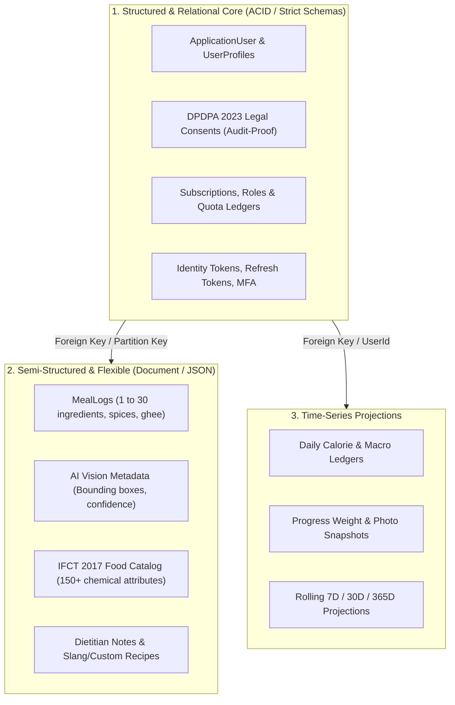
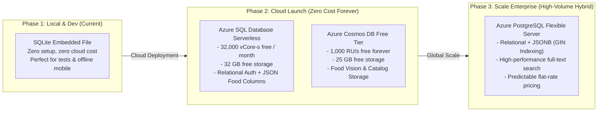
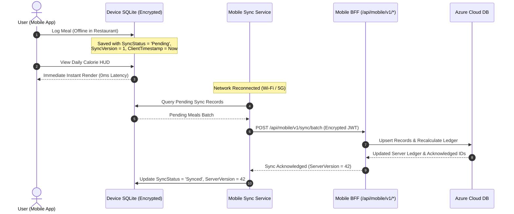

# Diet-Dost — Enterprise Database Architecture & Cloud Persistence Guide
> **Specification Version**: `v1.0.0-ENTERPRISE-DB`  
> **Domain Classification**: Nutrition & Clinical Dietetics Persistence Engine  
> **Platforms Supported**: Web PWA (`Nutrition.WebGateway`) & Cross-Platform Mobile (.NET MAUI / Expo)  
> **Cloud Provider**: Microsoft Azure (Zero-Cost Free Tier Starting Architecture)  
> **Compliance Standard**: DPDPA 2023, OWASP ASVS v4.0, Indian Medical Standards (ICMR-NIN 2024)  

---

## 0. Mandatory Pre-Conditions & Solution Governance

> [!IMPORTANT]
> Adhere strictly to the **Zero Direct-to-Main Policy** and Solution Rules in [`AGENTS.md`](file:///c:/Users/nikunj.banker/source/repos/diet-dost/AGENTS.md):
> 1. **Branch First (Pre-Flight Remote Fetch)**: All work must occur on an isolated feature branch. Always run `git fetch origin` first and verify that `git rev-parse HEAD` == `git rev-parse origin/main`.
> 2. **Target Framework**: All database adapters and migrations must target `<TargetFramework>net11.0</TargetFramework>`.
> 3. **Zero-Warning Standard**: 0 warnings, 0 errors across the solution.
> 4. **Token Economics Mandate**: Keep declarative specifications and schemas in [`docs/sdd/`](file:///c:/Users/nikunj.banker/source/repos/diet-dost/docs/sdd/) (0 baseline tokens) and tactical code recipes in this skill.
> 5. **Living SDD Synchronization**: Log changes using atomic fragments in `docs/sdd/logs/LOG-*.md` and register in [`07_living_documentation_log.md`](file:///c:/Users/nikunj.banker/source/repos/diet-dost/docs/sdd/07_living_documentation_log.md).
> 6. **Zero-Unilateral-Decision Protocol**: In case of any architectural ambiguity, ask confirmation via `ask_question`.

---

## 1. Domain-Driven Database Analysis: Nutrition & Diet Applications

Nutrition and health applications possess distinct data characteristics that disqualify purely relational or purely document architectures:



### 1.1 The Nutrition Data Profile
1. **Relational / ACID Core**:
   - Identity, DPDPA consent logs, subscriptions, tier quotas, and payment receipts require strict relational integrity, ACID transactions, and foreign key cascades.
2. **Semi-Structured Nutrition Logs**:
   - An Indian meal log is inherently dynamic. A *"Gujarati Thali"* or *"Hyderabadi Biryani"* contains nested sub-dishes (roti, dal, sabzi, curd, salad), variable portion scaling, custom oil/ghee adjustments, and AI vision confidence scores. Forcing this into rigid relational tables causes 6-table joins for every meal scan.
3. **Reference Food Composition Tables (IFCT 2017 / ICMR-NIN 2024)**:
   - Contains 528+ Indian foods with 150+ nutritional parameters (macronutrients, micronutrients, fatty acids, carotenoids, phytates). A flexible schema or native JSON/JSONB column is exponentially faster and more maintainable than a 150-column wide relational table.
4. **Mobile Offline Synchronization**:
   - Mobile users frequently log meals in poor connectivity (restaurants, basements, flights). The database strategy must support local offline caching on the device with optimistic cloud sync upon reconnection.

---

## 2. Comprehensive Azure Database Evaluation Matrix

To balance enterprise security, scalability, and zero startup cost, the following platforms are evaluated:

| Dimension | Option 1: SQLite (Current MVP) | Option 2: Azure SQL Database (Serverless Free Tier) | Option 3: Azure Cosmos DB (NoSQL Free Tier) | Option 4: Azure PostgreSQL (Flexible Server) |
| :--- | :---: | :---: | :---: | :---: |
| **Azure Free Tier** | 100% Free (Local file / Azure Files) | 🏆 **Free Forever**<br>(32,000 vCore-s/mo + 32 GB storage) | 🏆 **Free Forever**<br>(1,000 RU/s + 25 GB storage) | ⚠️ **12 Months Free Trial**<br>(B1ms instance + 32 GB, then ~$12/mo) |
| **Model Type** | Embedded Relational | Relational + Native JSON | NoSQL Document (JSON) | Relational + JSONB (Hybrid) |
| **Enterprise Readiness** | ⚠️ Single-node file locking (No horizontal scale) | 🏆 High Enterprise (Autoscale, 99.99% SLA) | 🏆 Global Enterprise (Turnkey multi-region, 99.999% SLA) | 🏆 High Enterprise (Managed HA, Extensions) |
| **Schema Flexibility** | Moderate (Dynamic typing) | High (Native `JSON` columns + `OPENJSON`) | 🏆 Highest (Schema-less documents) | 🏆 Highest (JSONB with GIN indexing) |
| **.NET 11 / EF Core Support** | Native (`Microsoft.EntityFrameworkCore.Sqlite`) | 🏆 First-Class (`Microsoft.EntityFrameworkCore.SqlServer`) | First-Class (`Microsoft.EntityFrameworkCore.Cosmos`) | First-Class (`Npgsql.EntityFrameworkCore.PostgreSQL`) |
| **DPDPA 2023 & Security** | File-level OS encryption | 🏆 **Always Encrypted**, TDE, Row-Level Security | 🏆 RBAC, Entra ID, Customer Managed Keys | RLS, SCRAM-SHA-256, Entra ID |
| **Mobile Offline Sync** | Native (Same engine on phone) | Sync via Mobile BFF REST APIs | Sync via Mobile BFF or Cosmos Change Feed | Sync via Mobile BFF REST APIs |
| **Initial Cloud Hosting Cost** | **$0.00 / month** | **$0.00 / month** | **$0.00 / month** | **$0.00 / month (Year 1)**, then ~$12/mo |

---

## 3. Recommended Phased Database Architecture



### 3.1 The Winning Cloud-Launch Recommendation (Zero-Cost Tier)
For launching Diet-Dost into Azure with **zero initial cloud spend ($0.00/mo)** while maintaining enterprise-grade security and compliance:

1. **Option A (Recommended Unified): Azure SQL Database Serverless (Free Forever)**
   - **Why**: Microsoft Azure offers **32,000 vCore seconds of compute and 32 GB storage completely free every single month** per Azure subscription for the lifetime of the account.
   - **How it handles nutrition**: Store Users, Roles, Tiers, DPDPA Consents, and Daily Ledgers in relational tables; store variable meal ingredients, AI vision outputs, and clinical metadata in native `nvarchar(max)` columns using EF Core 8/9/11 JSON mapping (`ToJson()`).
   - **Cost**: **$0.00 / month**.
   - **Migration Effort**: Extremely low (swapping EF Core provider from SQLite to SqlServer).

2. **Option B (The Polyglot Cloud-Native Option): Azure SQL Serverless + Azure Cosmos DB Free Tier**
   - **Azure SQL Serverless (Free Forever)**: Manages User Identities, DPDPA Consent audit trails, Tier Quotas, and Auth tokens.
   - **Azure Cosmos DB Free Tier (Free Forever)**: 1,000 RU/s throughput + 25 GB storage free forever. Houses the IFCT food catalog and rich meal photo vision logs.
   - **Cost**: **$0.00 / month**.

3. **Option C (The Future Scale Option): Azure PostgreSQL Flexible Server**
   - Ideal if migrating away from Microsoft-specific engines towards open-source PostgreSQL. Free for the first 12 months on Azure (750 hours/mo on B1ms instance), then ~$12-15/month.

---

## 4. Security, DPDPA 2023 & Clinical Privacy Governance

Health and nutrition data is classified as sensitive personal data under India's **DPDPA 2023** and global health privacy frameworks.

### 4.1 Security Invariants
1. **Passwordless Managed Identity (Zero Hardcoded Secrets)**:
   - In Azure, the backend WebGateway communicates with Azure SQL or Cosmos DB using **Microsoft Entra ID Managed Identity**.
   - Zero database passwords or keys stored in `appsettings.json` or environment variables:
     ```csharp
     // Connection string with Managed Identity (Zero Secret)
     "Server=tcp:dietdost-sql.database.windows.net,1433;Database=dietdost;Authentication=Active Directory Default;Encrypt=True;"
     ```
2. **Row-Level Security (RLS)**:
   - For multi-tenant and multi-tier isolation, queries automatically enforce tenant predicates (`UserId = CURRENT_USER_ID()`) at the database engine level, preventing data leakage even in the event of an application defect.
3. **Data Anonymization on Erasure (DPDPA Section 12)**:
   - When a user exercises their Right to Erasure, identity records are deleted while anonymized nutritional metrics (e.g. calorie intake trends without identifiers) can be retained for clinical research with salt hashes removed.
4. **Encryption at Rest & In Transit**:
   - Transparent Data Encryption (TDE) with Customer-Managed Keys (CMK) in Azure Key Vault.
   - Strict TLS 1.3 enforcement with minimum cipher suites.

---

## 5. Mobile Offline-First Synchronization Architecture

To support seamless nutrition logging on Android and iOS devices when disconnected:



### 5.1 Sync Invariants
1. **Local Encryption**: Mobile SQLite database is encrypted via SQLCipher using an AES-256 key stored inside `AndroidKeyStore` (Android) or `Keychain` (iOS).
2. **Tombstone Deletions**: Meals deleted on mobile are marked with `IsDeleted = 1` and `DeletedAt = UtcNow` rather than physical deletion, ensuring the delete replicates cleanly to the cloud.
3. **Server-Authoritative Clinical Math**: Even if the mobile app renders an estimated calorie count offline, the server recalculates the authoritative macros using the canonical `Nutrition.Domain.Clinical` engine upon sync.

---

## 6. Concrete EF Core Implementation Recipes

### 6.1 Multi-Provider Configuration (SQLite for Dev, Azure SQL for Cloud)
**Path**: `src/Nutrition.Infrastructure/Persistence/DependencyInjection.cs`

```csharp
public static IServiceCollection AddNutritionPersistence(this IServiceCollection services, IConfiguration configuration, IHostEnvironment environment)
{
    var provider = configuration.GetValue<string>("Database:Provider") ?? "Sqlite";

    services.AddDbContext<NutritionDbContext>((sp, options) =>
    {
        switch (provider.ToLowerInvariant())
        {
            case "azure-sql":
            case "sqlserver":
                var sqlConnection = configuration.GetConnectionString("AzureSqlConnection");
                options.UseSqlServer(sqlConnection, sqlOpts =>
                {
                    sqlOpts.EnableRetryOnFailure(maxRetryCount: 5, maxRetryDelay: TimeSpan.FromSeconds(30), errorNumbersToAdd: null);
                    sqlOpts.MigrationsAssembly(typeof(NutritionDbContext).Assembly.FullName);
                });
                break;

            case "postgresql":
                var pgConnection = configuration.GetConnectionString("PostgreSqlConnection");
                options.UseNpgsql(pgConnection, pgOpts =>
                {
                    pgOpts.EnableRetryOnFailure(5);
                    pgOpts.MigrationsAssembly(typeof(NutritionDbContext).Assembly.FullName);
                });
                break;

            case "sqlite":
            default:
                var sqliteConnection = configuration.GetConnectionString("SqliteConnection") ?? "Data Source=dietdost.db";
                options.UseSqlite(sqliteConnection);
                break;
        }
    });

    return services;
}
```

### 6.2 EF Core Hybrid Relational + JSON Column Mapping
**Path**: `src/Nutrition.Infrastructure/Persistence/Configurations/MealLogConfiguration.cs`

```csharp
public class MealLogConfiguration : IEntityTypeConfiguration<MealLog>
{
    public void Configure(EntityTypeBuilder<MealLog> builder)
    {
        builder.HasKey(m => m.Id);
        builder.Property(m => m.UserId).IsRequired();
        builder.Property(m => m.LoggedAt).IsRequired();

        // Native JSON mapping in EF Core (Zero additional tables for ingredients)
        builder.OwnsMany(m => m.Items, item =>
        {
            item.ToJson();
            item.Property(i => i.FoodName).IsRequired();
            item.Property(i => i.PortionGrams).HasPrecision(10, 2);
            item.Property(i => i.Calories).HasPrecision(10, 2);
        });

        // Fast index on UserId + LoggedAt for sub-50ms dashboard hydration
        builder.HasIndex(m => new { m.UserId, m.LoggedAt });
    }
}
```

---

## 7. Azure Zero-Cost Free Tier Provisioning Playbook

### 7.1 Azure SQL Serverless Free Tier Setup via Azure CLI
Run these commands to provision the permanent free tier:

```bash
# 1. Create Resource Group in Central India or East US
az group create --name rg-dietdost-prod --location centralindia

# 2. Create Logical SQL Server (Azure AD Only Auth - Zero SQL Passwords)
az sql server create \
  --name sql-dietdost-prod \
  --resource-group rg-dietdost-prod \
  --location centralindia \
  --enable-ad-only-auth \
  --external-admin-name "admin@dietdost.app" \
  --external-admin-sid "<your-azure-ad-object-id>"

# 3. Provision Serverless General Purpose Database with FREE TIER enabled
az sql db create \
  --resource-group rg-dietdost-prod \
  --server sql-dietdost-prod \
  --name dietdost \
  --edition GeneralPurpose \
  --family Gen5 \
  --compute-model Serverless \
  --free-limit-exhaustion-behavior AutoPause \
  --use-free-limit true

# 4. Configure Firewall to allow Azure Services (App Service / Container Apps)
az sql server firewall-rule create \
  --resource-group rg-dietdost-prod \
  --server sql-dietdost-prod \
  --name AllowAzureServices \
  --start-ip-address 0.0.0.0 \
  --end-ip-address 0.0.0.0
```

### 7.2 Azure Cosmos DB Free Tier Setup via Azure CLI
```bash
# Provision Azure Cosmos DB NoSQL account with Free Tier (1,000 RU/s + 25 GB free forever)
az cosmosdb create \
  --name cosmos-dietdost-prod \
  --resource-group rg-dietdost-prod \
  --default-consistency-level Session \
  --enable-free-tier true \
  --locations regionName=centralindia failoverPriority=0
```

---

## 8. Verification & Validation Checklist

Before migrating any environment from SQLite to Azure Cloud persistence:
- [ ] **Automated Test Suite**: Run `dotnet test` targeting the database provider to assert 100% pass rate.
- [ ] **5-Tier End-to-End User Verification**: Validate seeded accounts across all tiers (`free@dietdost.app`, `basic@dietdost.app`, `premium@dietdost.app`, `admin.demo@dietdost.app`, `superadmin@dietdost.app`).
- [ ] **Quota & Feature Gating Enforcement**: Assert daily AI scan limits and photo comparison paywalls behave identically.
- [ ] **Passwordless Connectivity**: Validate Microsoft Entra ID managed identity connection with zero hardcoded credentials.
- [ ] **Living Documentation Log**: Register the implementation fragment in `docs/sdd/logs/LOG-*.md` and update [`docs/sdd/07_living_documentation_log.md`](file:///c:/Users/nikunj.banker/source/repos/diet-dost/docs/sdd/07_living_documentation_log.md).
