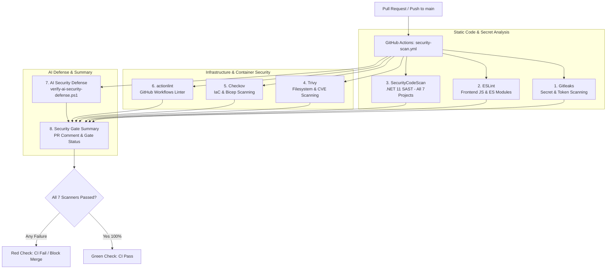

<!--
  Copyright (c) 2026 diet-dost and/or its contributors.
  Licensed under the "GNU Affero General Public License v3.0 only" and
  the "Server Side Public License, v 1"; you may not use this file except
  in compliance with, at your election, the "GNU Affero General Public
  License v3.0 only" or the "Server Side Public License, v 1".
-->

# DevSecOps Pipeline & Continuous Security Gate Runbook: Diet-Dost

> **CI Pipeline**: [`.github/workflows/security-scan.yml`](file:///c:/Users/nikunj.banker/source/repos/diet-dost/.github/workflows/security-scan.yml) (8 parallel / sequential security analyzers)  
> **Security Baseline**: OWASP Top 10 (2021), OWASP LLM Top 10 (2025), India DPDPA 2023, Safe Harbor & CVD ([`SECURITY.md`](file:///c:/Users/nikunj.banker/source/repos/diet-dost/SECURITY.md))  
> **Target Framework**: .NET 11 RC (`net11.0`), Native ES Modules, Azure Bicep, Containerfile  
> **Administrative Authority**: Contributor `@nikunjbanker` holds sole authority over secrets and cloud access  

---

## 1. Executive Summary & 8-Job Security Matrix

Diet-Dost enforces a strict **Zero-Defect Security Gate** on every Pull Request and push to `main`. If any security analyzer detects an unmitigated vulnerability, secret leak, or syntax violation, the workflow terminates with an error and blocks deployment.



---

## 2. Job-by-Job Runbook & Local Execution Commands

### 2.1 Job 1: Gitleaks (Secret & Token Leak Detection)
- **Scope**: Scans full Git commit history and working tree for API keys, bearer tokens, private keys, and hardcoded cloud credentials.
- **Rules & Exclusions**: Governed by root [`.gitleaks.toml`](file:///c:/Users/nikunj.banker/source/repos/diet-dost/.gitleaks.toml) and [`.gitleaksignore`](file:///c:/Users/nikunj.banker/source/repos/diet-dost/.gitleaksignore).
- **Zero Hardcoded Secrets Policy**:
  - Never allowlist live credentials.
  - Azure subscription, tenant, and client IDs must resolve dynamically at runtime via `az account show` (see [`scripts/setup-azure-pre-deployment.ps1`](file:///c:/Users/nikunj.banker/source/repos/diet-dost/scripts/setup-azure-pre-deployment.ps1)).
  - Documentation GUIDs must use sanitized placeholders (e.g. `00000000-0000-0000-0000-000000000000`).
  - Historical commit hashes with false positives must be fingerprinted in `.gitleaksignore`.
- **Local Execution Command**:
  ```bash
  gitleaks detect --verbose --redact
  ```

### 2.2 Job 2: ESLint (Frontend JavaScript & Security Linting)
- **Scope**: Scans all browser client scripts in `src/Nutrition.WebGateway/wwwroot/` and tests in `tests/`.
- **Key Invariants**: Native ES Modules, no `eval()`, no insecure DOM injection (`innerHTML` with untrusted data), no undeclared variables.
- **Local Execution Command**:
  ```bash
  npx eslint src/Nutrition.WebGateway/wwwroot/js/**/*.js tests/**/*.mjs
  ```

### 2.3 Job 3: SecurityCodeScan (.NET 11 SAST across All 7 Projects)
- **Scope**: Analyzes all 7 C# projects in `DietDost.slnx` for SQL injection, path traversal, insecure cryptography, weak hashing, and unsafe deserialization:
  - `src/Nutrition.Domain`
  - `src/Nutrition.Application`
  - `src/Nutrition.Infrastructure`
  - `src/Nutrition.WebGateway`
  - `src/Nutrition.ServiceDefaults`
  - `tests/Nutrition.Domain.Tests`
  - `tests/Nutrition.EvalHarness.Tests`
- **Output**: Generates SARIF log (`security-scan.sarif`).
- **Local Execution Command**:
  ```bash
  dotnet build DietDost.slnx --configuration Release /p:RunAnalyzersDuringBuild=true
  ```

### 2.4 Job 4: Trivy (Filesystem, Dependency & CVE Scanning)
- **Scope**: Scans solution dependencies (NuGet, npm) and container base images for known vulnerabilities (CVEs) and license compliance.
- **Severity Gate**: Blocks on `CRITICAL` and `HIGH` vulnerabilities.
- **Local Execution Command**:
  ```bash
  trivy fs --severity CRITICAL,HIGH --ignore-unfixed .
  ```

### 2.5 Job 5: Checkov (Infrastructure-as-Code Security Scanning)
- **Scope**: Scans Azure Bicep templates (`infra/infra.bicep`, `infra/app.bicep`) and `Containerfile` against cloud security benchmarks (CIS, Azure Security Benchmark).
- **Configuration**: Governed by root [`.checkov.yaml`](file:///c:/Users/nikunj.banker/source/repos/diet-dost/.checkov.yaml).
- **Suppression Policy**: Any justified suppression (e.g. SQLite single-replica container without load balancer) must be explicitly listed in `.checkov.yaml` under `skip-check` with documentation.
- **Local Execution Command**:
  ```bash
  checkov --config-file .checkov.yaml --directory infra/
  ```

### 2.6 Job 6: actionlint (GitHub Actions Workflow Linter)
- **Scope**: Lints all workflow definitions in `.github/workflows/*.yml` (`security-scan.yml`, `azure-infra-deploy.yml`, `azure-app-deploy.yml`).
- **Enforces**: Shell injection prevention, expression syntax correctness, runner compatibility.
- **Local Execution Command**:
  ```bash
  actionlint .github/workflows/*.yml
  ```

### 2.7 Job 7: AI Security Defense & PromptShield Validator
- **Scope**: Executes the automated PowerShell security test harness [`scripts/verify-ai-security-defense.ps1`](file:///c:/Users/nikunj.banker/source/repos/diet-dost/scripts/verify-ai-security-defense.ps1).
- **Validates**:
  - `PromptShieldValidator` defense against harmful, violent, sexual, and communal attacks.
  - Adversarial jailbreak attempts (DAN, role overrides, system prompt extraction).
  - Self-learning data poisoning prevention.
  - Multi-model safety settings (`StrictSafetySettings = BLOCK_LOW_AND_ABOVE`).
  - Unit tests in `Nutrition.Domain.Tests` and eval harnesses.
- **Local Execution Command**:
  ```powershell
  pwsh -File scripts/verify-ai-security-defense.ps1 -Mode All
  ```

### 2.8 Job 8: Security Gate Summary
- **Scope**: Aggregates results from all 7 security scanners and publishes a standardized markdown summary on the Pull Request.
- **Condition**: Asserts that `gitleaks`, `eslint`, `securitycodescan`, `trivy`, `checkov`, `actionlint`, and `ai-security-defense` all exited with code 0.

---

## 3. Vulnerability Triage & Policy Governance (`SECURITY.md`)

When a vulnerability is flagged during local development or CI:

### 3.1 Triage Hierarchy
1. **True Positive Secret Leak**:
   - Immediately rotate the exposed credential in Azure / provider portal.
   - Do NOT commit `.gitleaksignore` for real active keys.
   - Re-run `scripts/setup-azure-pre-deployment.ps1` to re-sync Key Vault references.
2. **True Positive Code Vulnerability (SAST / Trivy)**:
   - Remediate at the root cause (e.g., parameterize queries, use `Path.GetFileName` for path traversal, update package version in `.csproj`).
   - Rebuild with `dotnet build DietDost.slnx` with 0 warnings.
3. **Verified False Positive (Commit Hash / IaC Architecture)**:
   - For historical commit hashes: Append fingerprint to `.gitleaksignore`.
   - For deliberate architectural trade-offs: Add documented check ID to `.checkov.yaml`.

### 3.2 Security SLAs Aligned with `SECURITY.md`
- **Applicability**: SLAs apply strictly to **released production versions (v1.0+)**.
- **Alpha & Beta Versions**: Addressed on a best-effort basis during active milestone development.
- **Minimum Response Timeline**:
  - Initial acknowledgment: Minimum 7 days.
  - Triage and remediation targets: Minimum 7 days for critical findings.
- **Reporting Contact**: Contact contributor `@nikunjbanker` privately per the CVD instructions in `SECURITY.md`.

---

## 4. Pre-Commit / Pre-Push Local Security Verification Checklist

Before pushing any branch or requesting PR review, run this sequence:

- [ ] 1. **Secret Scan**: Run `gitleaks detect --verbose` (0 secrets detected).
- [ ] 2. **Build with SAST**: Run `dotnet build DietDost.slnx` (0 warnings, 0 errors).
- [ ] 3. **Run AI Security Defense**: Run `pwsh -File scripts/verify-ai-security-defense.ps1 -Mode All` (100% pass).
- [ ] 4. **Run Live Tier CFT**: Run `pwsh -File tests/validate_e2e_tiers.ps1` (5/5 demo accounts pass).
- [ ] 5. **Check Workflows**: Run `actionlint` if any `.github/workflows/*.yml` files were edited.
- [ ] 6. **Ensure Zero Hardcoded Secrets**: Assert all Azure script variables are resolved dynamically.
