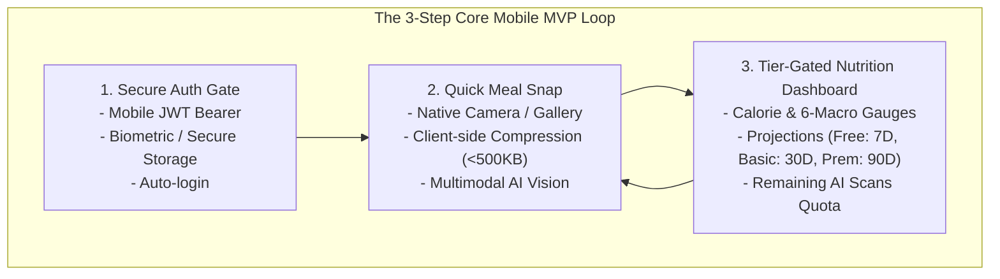
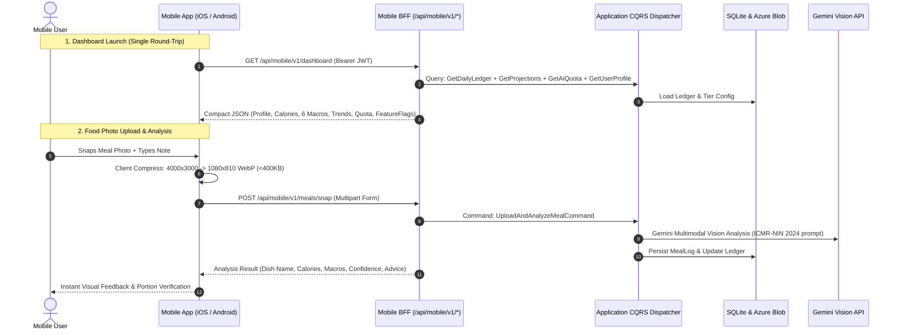
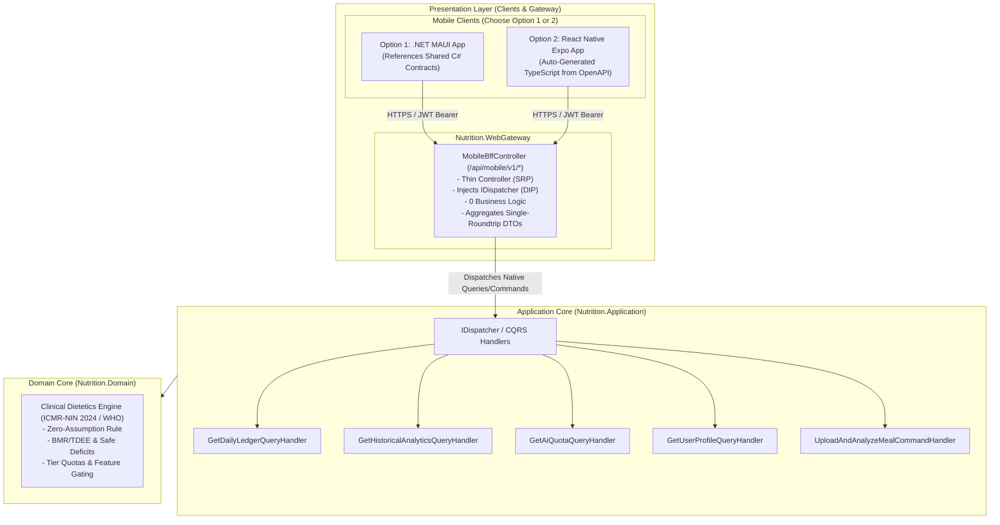
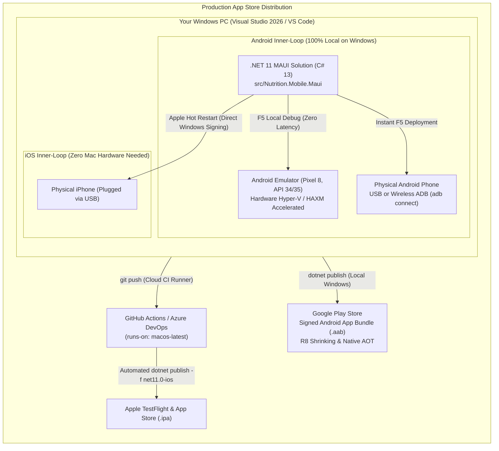
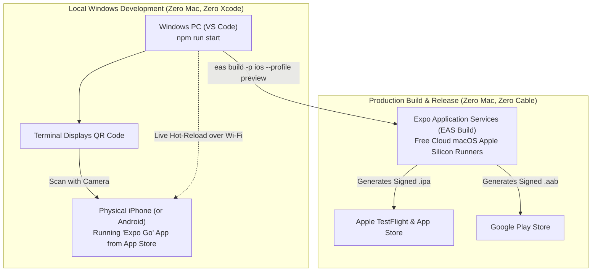

---
name: diet-dost-mobile-architecture
description: Authoritative cross-platform mobile architecture, SMART MVP specification, Mobile BFF design, and enterprise cloud/AI architect guide for Diet-Dost (.NET 11, iOS, Android).
---

<!--
  Copyright (c) 2026 diet-dost and/or its contributors.
  Licensed under the "GNU Affero General Public License v3.0 only" and
  the "Server Side Public License, v 1"; you may not use this file except
  in compliance with, at your election, the "GNU Affero General Public
  License v3.0 only" or the "Server Side Public License, v 1".
-->

# Cross-Platform Mobile MVP & Mobile BFF Architecture: Diet-Dost

> **Mobile Target**: iOS & Android (Single Cross-Platform Codebase)  
> **Backend Target**: .NET 11 WebGateway / Mobile BFF &bull; Clean Architecture &bull; Native CQRS  
> **Core MVP Scope**: Secure Authentication &bull; Food Photo Upload with AI Analysis &bull; Tier-Gated Nutrition Charts  
> **Architect Perspective**: Written for Enterprise Cloud, AI, and .NET Architects building their first mobile client  

---

## 0. Mandatory Solution Rules & Stale-Branch Prevention

> [!IMPORTANT]
> **Strict Git Branching Mandate**:
> 1. **Remote Fetch First**: Always run `git fetch origin` before creating any branch.
> 2. **Never Branch from Local Main**: Local `main` does not auto-update when GitHub PRs merge. Branching from local `main` drags stale history and causes severe merge conflicts. Always branch explicitly from remote:
>    ```bash
>    git checkout -b feature/<name> origin/main
>    ```
> 3. **Lineage Verification Guard**: Immediately verify that `git rev-parse HEAD` equals `git rev-parse origin/main`. If hashes differ, delete the branch and recreate it.
> 4. **Stacked PRs**: For dependent child features, branch directly from remote parent branch (`git checkout -b feature/<child> origin/feature/<parent>`) and set the PR base to the parent branch.

---

## 1. SMART & MVP Framework for Mobile Diet-Dost

Building a mobile client for a fitness and nutrition application is fundamentally different from building a web app. Mobile users snap photos on the go, often on cellular networks with battery and latency constraints. To ensure delivery without scope creep, we enforce the **SMART & Lean MVP Framework**:



### 1.1 The SMART Criteria for the MVP
- **Specific**: Deliver exactly 3 mobile screens:
  1. *Auth Screen*: Login with Email/Mobile + Password, storing JWT securely.
  2. *Quick Snap Screen*: Native camera/photo picker with text note input, uploading compressed image to `/api/mobile/v1/meals/snap`.
  3. *Nutrition Dashboard Screen*: Daily calorie/macro summary dials and trend chart gated by user tier (Free = 7D, Basic = 30D, Premium = 90D).
- **Measurable**:
  - Cold startup to dashboard: `< 1.8 seconds` on 4G.
  - Image upload and AI analysis latency: `< 3.5 seconds` on cellular connection.
  - Client crash rate: `< 0.1%`.
  - Image payload size over network: `< 500 KB` (enforced via client-side resizing).
- **Achievable**: Reuses 100% of the existing .NET 11 domain models, clinical calculators (ICMR-NIN 2024 / WHO), and CQRS handlers via a consolidated Mobile BFF endpoint.
- **Relevant**: Solves the biggest friction point of nutrition tracking: logging food immediately at the dining table with a mobile camera.
- **Time-Bound**: Ready for internal test flight / closed alpha in **2 to 3 weeks**.

---

## 2. Platform-Agnostic Mobile Technology Options (Enterprise Architect Lens)

The following matrix compares the 4 cross-platform technologies from the perspective of an enterprise .NET / Cloud / AI architect:

| Evaluation Dimension | Option 1: .NET MAUI / Blazor Hybrid (Recommended for .NET Architects) | Option 2: React Native + Expo (Recommended for Rapid Cloud-Build MVP) | Option 3: Flutter (Dart) | Option 4: Capacitor / PWA Shell (Fastest Web Reuse) |
| :--- | :--- | :--- | :--- | :--- |
| **Language & Ecosystem** | C# 13 / .NET 11 / XAML or Razor | TypeScript / React / Node.js | Dart / Flutter Widget Tree | JavaScript / HTML / CSS (Existing PWA) |
| **Skill Alignment for .NET Architect** | **100% Native Alignment**: Uses C#, LINQ, Dependency Injection, and shared DTOs from `Nutrition.Domain`. | **Moderate Alignment**: Requires JavaScript/TypeScript and React state management. | **Low Alignment**: Requires learning Dart and Flutter state management (Riverpod/Bloc). | **High Alignment**: Reuses existing `wwwroot` HTML partials and CSS. |
| **iOS Build without a Mac** | Requires Mac build agent or Azure DevOps Mac runner. | **Zero-Mac Setup**: Expo Application Services (EAS) builds iOS and Android binaries in the cloud. | Requires Mac build agent or Codemagic cloud builds. | Requires Mac build agent for Xcode packaging. |
| **Camera & Image Optimization** | Native `MediaPicker` + `SkiaSharp` or `ImageSharp` for client compression. | `expo-camera`, `expo-image-picker`, `expo-image-manipulator` (one-line resize). | `image_picker` + `flutter_image_compress`. | HTML `<input type="file" capture>` in WebView or Capacitor Camera plugin. |
| **Nutrition Charting** | `LiveChartsCore.SkiaSharpView.Maui` or Microcharts. | `react-native-chart-kit` or `victory-native`. | `fl_chart` (stunning 60fps animations). | Chart.js or SVG inside WebView. |
| **Pros** | &bull; Direct C# reuse.<br/>&bull; Can share client DTO contracts directly.<br/>&bull; Native platform performance. | &bull; Instant testing on physical devices via Expo Go app (no Xcode/Android Studio).<br/>&bull; Cloud builds without owning a Mac.<br/>&bull; Huge library ecosystem. | &bull; Pixel-perfect graphics rendering.<br/>&bull; Highly fluid 120Hz calorie ring animations. | &bull; Ships in 3 days by wrapping existing web app.<br/>&bull; Zero new UI to build. |
| **Cons** | &bull; Tooling on Windows for iOS requires Mac setup.<br/>&bull; MAUI ecosystem smaller than React Native. | &bull; JavaScript/React context switch.<br/>&bull; Separate dependency management (npm). | &bull; Need to learn Dart language and Flutter paradigms. | &bull; Does not feel truly native.<br/>&bull; Camera UX in WebView can feel sluggish on low-end Androids. |

### Architectural Recommendation:
- If you want **pure C# and shared .NET DTOs**: Choose **Option 1 (.NET MAUI)**.
- If you **do not own a Mac** and want to test on your iPhone/Android today via a QR code: Choose **Option 2 (React Native with Expo)**.
- If you want an **app in the stores next week**: Choose **Option 4 (Capacitor wrapper around current PWA)**.

---

## 3. Backend for Frontend (BFF) Design Pattern

### 3.1 Why a Dedicated Mobile BFF is Crucial
Desktop web applications on broadband can afford multiple sequential HTTP calls. On mobile, cellular latency, radio wake-up delays, and packet loss degrade the user experience. 

The Mobile BFF consolidates multiple domain CQRS queries into a **single, highly-optimized mobile contract**:



### 3.2 Mobile BFF Contract Specifications

#### Endpoint 1: Mobile Aggregated Dashboard (`GET /api/mobile/v1/dashboard`)
Combines 4 web queries into 1 payload:
```json
{
  "user": {
    "id": "user-123",
    "name": "Nikunj Banker",
    "tier": "Premium",
    "tierBadge": "👑 Premium Member"
  },
  "quota": {
    "todayScansUsed": 2,
    "dailyScanLimit": 20,
    "scansRemaining": 18,
    "canScan": true
  },
  "todayLedger": {
    "targetCalories": 1850.0,
    "consumedCalories": 1240.0,
    "remainingCalories": 610.0,
    "protein": { "consumed": 78.5, "target": 95.0, "unit": "g" },
    "carbs": { "consumed": 140.0, "target": 200.0, "unit": "g" },
    "fat": { "consumed": 38.0, "target": 50.0, "unit": "g" },
    "fiber": { "consumed": 22.0, "target": 30.0, "unit": "g" },
    "sugar": { "consumed": 12.0, "target": 25.0, "unit": "g" },
    "sodium": { "consumed": 1450.0, "target": 2000.0, "unit": "mg" }
  },
  "chartData": {
    "period": "30D",
    "availablePeriods": ["7D", "30D", "90D"],
    "points": [
      { "date": "2026-09-20", "calories": 1780, "target": 1850 },
      { "date": "2026-09-21", "calories": 1820, "target": 1850 }
    ]
  },
  "featureFlags": {
    "canComparePhotos": true,
    "canExportData": true,
    "unlimitedHistory": true
  }
}
```

#### Endpoint 2: Mobile Photo Snap (`POST /api/mobile/v1/meals/snap`)
- **Headers**: `Authorization: Bearer <JWT>`, `Content-Type: multipart/form-data`
- **Body Form Fields**:
  - `image`: Binary file (client-compressed to WebP or JPEG, max 500KB).
  - `description`: Optional text prompt (e.g. "2 roti and paneer bhurji").
  - `mealType`: Optional ("Breakfast", "Lunch", "Dinner", "Snack").
- **Response**:
```json
{
  "dishName": "Paneer Bhurji with 2 Phulka Roti",
  "confidenceScore": 0.94,
  "confidenceGated": false,
  "totalCalories": 420.0,
  "macros": {
    "proteinGrams": 22.5,
    "carbsGrams": 45.0,
    "fatGrams": 16.0,
    "fiberGrams": 6.5
  },
  "advice": "Excellent high-protein vegetarian meal. Balances daily protein deficit.",
  "items": [
    { "name": "Paneer Bhurji", "portion": "1 katori (150g)", "calories": 260 },
    { "name": "Phulka Roti", "portion": "2 pieces", "calories": 160 }
  ]
}
```

---

## 4. Enterprise Architect's Guide: What Cloud & .NET Architects Must Know for Mobile

As an enterprise backend and cloud architect, you already understand databases, APIs, distributed transactions, and security. However, mobile development introduces constraints unique to client hardware and app store ecosystems:

### 4.1 Client-Side Image Compression (Crucial Rule)
- **The Problem**: Modern smartphone cameras capture images at 12–48 megapixels (5MB to 20MB per photo). Uploading a 15MB photo over a cellular network takes 8–15 seconds, consumes massive battery, causes request timeouts, and burns unnecessary Azure bandwidth.
- **The Solution**: The mobile client **MUST resize and compress the image in memory before initiating the HTTP upload**:
  - Max dimension: `1080px` on the longest edge.
  - Format: `JPEG` at 80% quality or `WebP` at 75% quality.
  - Typical compressed size: `250 KB – 450 KB` (95% size reduction with zero visible loss for AI vision).
  - Result: Upload finishes in `< 1 second`.

### 4.2 App Store Review Guidelines for Health & AI Apps (Apple & Google)
Apple App Store and Google Play enforce strict review guidelines for health and AI applications:
1. **Mandatory Medical & Clinical Disclaimer (Apple Guideline 1.4.1)**:
   - Any app displaying nutritional advice, calorie deficits, or clinical feedback MUST display an unambiguous disclaimer before onboarding and in the settings:
     > *"Diet-Dost provides nutritional estimates based on ICMR-NIN guidelines for informational purposes only. It is not medical advice, diagnosis, or treatment. Consult a licensed dietitian or physician before starting any diet program."*
2. **Account Deletion Requirement (Apple Guideline 5.1.1(v))**:
   - If your app supports account creation, it **MUST provide an in-app account deletion button**. Diet-Dost already supports this in CQRS (`DeleteAccountCommand`)! Ensure the mobile settings screen has a "Delete Account" button that invokes this endpoint.
3. **App Review Demo Credentials**:
   - When submitting to the App Store, you must provide active test login credentials for Apple's review team. (Use a dedicated test account with pre-populated meal logs).

### 4.3 Secure Token Storage (Never use LocalStorage)
- **The Vulnerability**: On the web, developers often save JWTs in `localStorage`, which is vulnerable to XSS.
- **The Mobile Standard**: Mobile apps must store the JWT Bearer token in hardware-backed secure storage:
  - iOS: **Apple Keychain** (encrypted using device hardware enclave).
  - Android: **Android Keystore / EncryptedSharedPreferences** (AES-256 encrypted).
  - Libraries: `SecureStorage` in .NET MAUI, `expo-secure-store` in React Native, or `flutter_secure_storage` in Flutter.

### 4.4 Backward Compatibility & Version Gating (No Forced Web Refresh)
- In web apps, you can deploy a new release and all users get the latest JavaScript bundle immediately.
- On mobile, **users may run an older app version for months**.
- **Rule**: Never introduce breaking changes to existing `/api/mobile/v1/*` contracts. If changing a schema, introduce `/api/mobile/v2/*` or maintain additive, non-breaking JSON fields.
- Include a lightweight version check endpoint `GET /api/mobile/v1/config` returning `minSupportedVersion: "1.0.0"`. If the client is below that, display a friendly "Please update your app from the App Store" modal.

---

## 5. Zero-Duplicate-Code Standard: SOLID & Clean Architecture via Mobile BFF

To guarantee that mobile development does not introduce divergent business logic, duplicate DTOs, or repeated clinical calculations, the entire mobile subsystem strictly adheres to **SOLID principles** and **Clean Architecture**:



### 5.1 Architectural Invariants (SOLID & Clean Architecture)
1. **Single Responsibility Principle (SRP)**:
   - The Mobile BFF Controller (`MobileBffController.cs`) has **one and only one responsibility**: translating between mobile network payloads and internal application CQRS commands/queries.
   - It performs **zero database access**, **zero clinical math**, and **zero image file system writes**.
2. **Open/Closed Principle (OCP)**:
   - New mobile features (e.g. barcode scanning, hydration tracking) extend the system by adding new CQRS handlers in `Nutrition.Application` without modifying existing web controllers or core domain models.
3. **Liskov Substitution & Interface Segregation (LSP / ISP)**:
   - Mobile and Web controllers consume the same focused CQRS interfaces (`IDispatcher` / `IQueryHandler<TQuery, TResult>` / `ICommandHandler<TCommand, TResult>`).
4. **Dependency Inversion Principle (DIP)**:
   - High-level mobile features depend upon abstractions (`IDispatcher`, `IPhotoStorageService`), never on concrete SQLite, Azure Blob, or external AI implementations.
5. **Zero Clinical Duplication Law**:
   - Calorie limits, macronutrient thresholds, ICMR-NIN 2024 cereal-to-pulse ratios, and WHO Asian-Indian BMI cutoffs **NEVER exist in mobile client code**. They reside exclusively in `Nutrition.Domain`. The mobile client simply renders the computed values and visual status badges supplied by the BFF.

### 5.2 Zero-Duplicate Contract Sharing Between Server & Client
- **Option 1 (.NET MAUI)**: Directly references the existing `Nutrition.Domain` or a shared contracts library (`Nutrition.Contracts.Mobile`). C# records and DTOs are compiled into the MAUI app with **0 lines of duplicated code**.
- **Option 2 (React Native + Expo)**: Eliminates manual TypeScript interface creation by executing automated type generation against the running WebGateway's Swagger/OpenAPI endpoint:
  ```bash
  npx openapi-typescript http://localhost:5240/swagger/v1/swagger.json -o src/api/types.ts
  ```
  Every C# DTO change is immediately reflected in TypeScript types with compile-time checking.

---

## 6. Implementation Plan: Option 1 (.NET MAUI / C#) — First-Class Android & Cross-Platform Roadmap

> **Ideal For**: Teams that want to write 100% C# across backend and mobile, reuse existing .NET domain models, and leverage the Windows PC's native Android development ecosystem.

### 6.1 Dual-Platform Architecture: Android First-Class Citizen & Windows-Only iOS Strategy
For a Windows developer, **Android is the home-court advantage**: you have first-class, zero-latency local tooling without any cloud or Mac dependencies. Meanwhile, iOS is supported without owning a Mac via Apple Hot Restart over USB and cloud CI runners:



---

### 6.2 Android Platform-Specific Architecture & Invariants

#### 1. Target Framework & SDK Level Matrix
In `src/Nutrition.Mobile.Maui/Nutrition.Mobile.Maui.csproj`:
```xml
<PropertyGroup>
  <TargetFrameworks>net11.0-android;net11.0-ios</TargetFrameworks>
  <!-- Android Target: API 35 (Android 15) with backward compatibility to Android 7.0 -->
  <SupportedOSPlatformVersion Condition="$([MSBuild]::GetTargetPlatformIdentifier('$(TargetFramework)')) == 'android'">24.0</SupportedOSPlatformVersion>
  <TargetPlatformMinVersion Condition="$([MSBuild]::GetTargetPlatformIdentifier('$(TargetFramework)')) == 'android'">24.0</TargetPlatformMinVersion>
  <TargetPlatformVersion Condition="$([MSBuild]::GetTargetPlatformIdentifier('$(TargetFramework)')) == 'android'">35.0</TargetPlatformVersion>
</PropertyGroup>
```

#### 2. Android Manifest & Permissions (`Platforms/Android/AndroidManifest.xml`)
Android requires explicit permission declarations in the manifest, combined with runtime permission requests in C# for dangerous permissions (Camera and Media):
```xml
<?xml version="1.0" encoding="utf-8"?>
<manifest xmlns:android="http://schemas.android.com/apk/res/android"
          package="app.dietdost.mobile"
          android:versionCode="1"
          android:versionName="1.0.0">

    <!-- Camera Hardware & Permissions for Meal Snapping -->
    <uses-permission android:name="android.permission.CAMERA" />
    <uses-feature android:name="android.hardware.camera" android:required="true" />
    <uses-feature android:name="android.hardware.camera.autofocus" android:required="false" />

    <!-- Storage Permissions (Android 13+ Granular Media vs Legacy Android 12-) -->
    <uses-permission android:name="android.permission.READ_MEDIA_IMAGES" />
    <uses-permission android:name="android.permission.READ_EXTERNAL_STORAGE" android:maxSdkVersion="32" />
    <uses-permission android:name="android.permission.WRITE_EXTERNAL_STORAGE" android:maxSdkVersion="28" />

    <!-- Network Connectivity for Mobile BFF Calls -->
    <uses-permission android:name="android.permission.INTERNET" />
    <uses-permission android:name="android.permission.ACCESS_NETWORK_STATE" />

    <application android:allowBackup="false"
                 android:icon="@mipmap/appicon"
                 android:roundIcon="@mipmap/appicon_round"
                 android:supportsRtl="true"
                 android:label="Diet-Dost"
                 android:networkSecurityConfig="@xml/network_security_config">
        
        <!-- FileProvider to prevent FileUriExposedException on Android 7.0+ during camera capture -->
        <provider android:name="androidx.core.content.FileProvider"
                  android:authorities="${applicationId}.fileprovider"
                  android:exported="false"
                  android:grantUriPermissions="true">
            <meta-data android:name="android.support.FILE_PROVIDER_PATHS"
                       android:resource="@xml/file_paths" />
        </provider>
    </application>
</manifest>
```

#### 3. Android FileProvider Configuration (`Platforms/Android/Resources/xml/file_paths.xml`)
To prevent `FileUriExposedException` when sharing snapped photos with the native camera app:
```xml
<?xml version="1.0" encoding="utf-8"?>
<paths xmlns:android="http://schemas.android.com/apk/res/android">
    <external-files-path name="diet_dost_photos" path="Pictures" />
    <cache-path name="diet_dost_cache" path="." />
</paths>
```

#### 4. Android Network Security & Emulator Loopback (`10.0.2.2`) Gotcha
- **The Pitfall**: On the Android emulator, `localhost` (or `127.0.0.1`) refers to the *emulator's internal loopback*, not your Windows development machine!
- **The Host Alias**: The Android emulator accesses the Windows host via `http://10.0.2.2:5240`.
- **Cleartext HTTP Config (`Platforms/Android/Resources/xml/network_security_config.xml`)**:
  Android 9+ (API 28+) blocks plain HTTP by default. For local development, allow cleartext traffic only to the host emulator loopback (`10.0.2.2`) and local subnet, while strictly enforcing HTTPS for production:
  ```xml
  <?xml version="1.0" encoding="utf-8"?>
  <network-security-config>
      <domain-config cleartextTrafficPermitted="true">
          <domain includeSubdomains="true">10.0.2.2</domain>
          <domain includeSubdomains="true">192.168.1.0/24</domain>
          <domain includeSubdomains="true">localhost</domain>
      </domain-config>
  </network-security-config>
  ```

#### 5. Android Keystore Hardware Token Security
On Android, MAUI's `SecureStorage` automatically utilizes the **Android KeyStore** provider:
- Backed by hardware **TEE (Trusted Execution Environment)** or **StrongBox Keymaster** chip.
- Cryptographic keys are stored in hardware; values are encrypted with AES-256 GCM using `EncryptedSharedPreferences`.
- Even if an Android device is rooted or attached to a debugger, tokens in the hardware enclave cannot be extracted in plaintext.

---

### 6.3 Step-by-Step Implementation Roadmap (Option 1)

#### Step 1: Solution Integration & Project Creation
In the root `diet-dost` repository on Windows:
```powershell
# Create dedicated MAUI project targeting .NET 11
dotnet new maui -n Nutrition.Mobile.Maui -o src/Nutrition.Mobile.Maui --framework net11.0

# Add project reference to shared Domain models (Zero Duplication)
dotnet add src/Nutrition.Mobile.Maui/Nutrition.Mobile.Maui.csproj reference src/Nutrition.Domain/Nutrition.Domain.csproj

# Add to solution
dotnet sln diet-dost.sln add src/Nutrition.Mobile.Maui/Nutrition.Mobile.Maui.csproj
```

#### Step 2: Essential NuGet Packages
```xml
<!-- In src/Nutrition.Mobile.Maui/Nutrition.Mobile.Maui.csproj -->
<ItemGroup>
  <!-- MVVM Architecture (CommunityToolkit) -->
  <PackageReference Include="CommunityToolkit.Mvvm" Version="8.4.0" />
  <!-- Hardware-accelerated Nutrition Charts (SkiaSharp rendering on Android SurfaceView) -->
  <PackageReference Include="LiveChartsCore.SkiaSharpView.Maui" Version="2.0.0-rc2" />
  <!-- Client-side Image Manipulation & Compression -->
  <PackageReference Include="SkiaSharp" Version="2.88.8" />
  <!-- Typed HTTP Client for Mobile BFF -->
  <PackageReference Include="Refit.HttpClientFactory" Version="8.0.0" />
</ItemGroup>
```

#### Step 3: Project Directory Structure (Clean Architecture & Android Assets)
```
src/Nutrition.Mobile.Maui/
├── Models/              # UI-specific display wrappers (binds to Nutrition.Domain entities)
├── Services/            # Decoupled Port/Adapter Services
│   ├── IAuthService.cs          # Hardware SecureStorage wrapper (Android Keystore / iOS Keychain)
│   ├── IMobileBffClient.cs      # Typed Refit interface to /api/mobile/v1/*
│   ├── IPhotoService.cs         # Native Camera & Gallery capture abstraction
│   ├── ImageCompressor.cs       # SkiaSharp 1080p resize & WebP/JPEG compression
│   └── NetworkEndpointResolver.cs # Resolves 10.0.2.2 on Android vs localhost on iOS/Windows
├── ViewModels/          # CommunityToolkit ObservableObject ViewModels
│   ├── AuthViewModel.cs         # Handles login, error banners, and token storage
│   ├── SnapViewModel.cs         # Controls camera capture, resize, and AI analysis
│   └── DashboardViewModel.cs    # Binds daily calories, 6 macros, and chart series
├── Views/               # XAML Pages with Obsidian Dark Linear Theme
│   ├── AuthPage.xaml
│   ├── SnapPage.xaml
│   └── DashboardPage.xaml
├── Platforms/
│   ├── Android/         # Android Native Manifest, Resources, and Security Config
│   │   ├── AndroidManifest.xml
│   │   ├── MainActivity.cs
│   │   └── Resources/xml/
│   │       ├── file_paths.xml
│   │       └── network_security_config.xml
│   └── iOS/             # iOS Info.plist and Entitlements
│       └── Info.plist
└── Resources/Styles/    # Obsidian Dark design tokens (#0B0D13, #1A1D27, #4F46E5)
```

#### Step 4: Android-Aware Base URL Resolver (`NetworkEndpointResolver.cs`)
```csharp
namespace Nutrition.Mobile.Maui.Services;

public static class NetworkEndpointResolver
{
    public static string GetMobileBffBaseUrl()
    {
#if DEBUG
        // Android emulator loopback alias to Windows host
        if (DeviceInfo.Platform == DevicePlatform.Android)
        {
            return DeviceInfo.DeviceType == DeviceType.Virtual
                ? "http://10.0.2.2:5240"        // Android Emulator
                : "http://192.168.1.150:5240";   // Physical Android phone on local Wi-Fi
        }
        
        // iOS Simulator or Windows Desktop
        return "http://localhost:5240";
#else
        // Production Azure Container Apps Endpoint
        return "https://dietdost.app";
#endif
    }
}
```

#### Step 5: Android Runtime Permission & Native Photo Capture Service (`PhotoService.cs`)
```csharp
namespace Nutrition.Mobile.Maui.Services;

public class PhotoService : IPhotoService
{
    public async Task<FileResult?> CaptureMealPhotoAsync()
    {
        // 1. Verify and request Camera runtime permission (Mandatory on Android 6.0+)
        var cameraStatus = await Permissions.CheckStatusAsync<Permissions.Camera>();
        if (cameraStatus != PermissionStatus.Granted)
        {
            cameraStatus = await Permissions.RequestAsync<Permissions.Camera>();
            if (cameraStatus != PermissionStatus.Granted)
                return null; // User denied camera access
        }

        // 2. Verify media storage permission (Android 13+ READ_MEDIA_IMAGES)
        var storageStatus = await Permissions.CheckStatusAsync<Permissions.StorageRead>();
        if (storageStatus != PermissionStatus.Granted)
        {
            storageStatus = await Permissions.RequestAsync<Permissions.StorageRead>();
        }

        // 3. Launch native camera via MediaPicker
        if (MediaPicker.Default.IsCaptureSupported)
        {
            return await MediaPicker.Default.CapturePhotoAsync(new MediaPickerOptions
            {
                Title = "Snap your meal for AI nutrition analysis"
            });
        }

        return null;
    }
}
```

#### Step 6: Client-Side Image Compression Implementation (`ImageCompressor.cs`)
```csharp
using SkiaSharp;

namespace Nutrition.Mobile.Maui.Services;

public class ImageCompressor
{
    public static async Task<byte[]> CompressAsync(Stream inputPhotoStream, int maxDimension = 1080, int quality = 75)
    {
        using var originalBitmap = SKBitmap.Decode(inputPhotoStream);
        
        // Calculate proportional scale to ensure longest edge <= 1080px
        float ratio = Math.Min((float)maxDimension / originalBitmap.Width, (float)maxDimension / originalBitmap.Height);
        int targetWidth = (int)(originalBitmap.Width * Math.Min(ratio, 1.0f));
        int targetHeight = (int)(originalBitmap.Height * Math.Min(ratio, 1.0f));

        using var resizedBitmap = originalBitmap.Resize(new SKImageInfo(targetWidth, targetHeight), SKFilterQuality.Medium);
        using var image = SKImage.FromBitmap(resizedBitmap);
        using var data = image.Encode(SKEncodedImageFormat.Jpeg, quality);
        
        return data.ToArray(); // Returns < 400KB byte array
    }
}
```

#### Step 7: Hardware Secure Storage for Mobile JWT (`MobileAuthService.cs`)
```csharp
namespace Nutrition.Mobile.Maui.Services;

public class MobileAuthService : IAuthService
{
    private const string TokenKey = "diet_dost_mobile_jwt";

    // Uses AndroidKeyStore on Android / Apple Keychain on iOS
    public async Task SaveTokenAsync(string token) =>
        await SecureStorage.Default.SetAsync(TokenKey, token);

    public async Task<string?> GetTokenAsync() =>
        await SecureStorage.Default.GetAsync(TokenKey);

    public void Logout() =>
        SecureStorage.Default.Remove(TokenKey);
}
```

#### Step 8: Android Ahead-Of-Time (AOT) Compilation & Production Packaging
To achieve sub-second cold starts and minimal APK size on Android, configure **R8 Code Shrinking** and **Native AOT** in `Nutrition.Mobile.Maui.csproj`:
```xml
<PropertyGroup Condition="'$(Configuration)|$(TargetFramework)' == 'Release|net11.0-android'">
  <!-- Native AOT compilation eliminates JIT overhead on Android devices -->
  <RunAOTCompilation>true</RunAOTCompilation>
  <!-- R8 code shrinker removes unused Java/Kotlin runtime bytecode -->
  <AndroidEnableShrinker>true</AndroidEnableShrinker>
  <AndroidPackageFormat>aab</AndroidPackageFormat> <!-- Google Play App Bundle -->
</PropertyGroup>
```

**Generate Production Signed `.aab` for Google Play Store from Windows**:
```powershell
# Publish optimized Android App Bundle (.aab)
dotnet publish src/Nutrition.Mobile.Maui/Nutrition.Mobile.Maui.csproj `
  -f net11.0-android `
  -c Release `
  -p:AndroidPackageFormat=aab `
  -p:AndroidKeyStore=true `
  -p:AndroidSigningKeyStore=dietdost-release.keystore `
  -p:AndroidSigningKeyAlias=dietdost `
  -p:AndroidSigningKeyPass=env:KEYSTORE_PASS `
  -p:AndroidSigningStorePass=env:KEYSTORE_PASS
```

---

### 6.4 The No-Mac iOS Strategy for .NET MAUI
If and when iOS builds are needed from your Windows machine:
1. **Local iOS Debugging via Apple Hot Restart (No Mac Required)**:
   - Visual Studio on Windows includes **Apple Hot Restart**: plug your physical iPhone into your Windows PC over USB. Visual Studio compiles and signs the app directly on Windows.
   - Requirements: A free or paid Apple Developer account and iTunes for Windows.
2. **Production iOS Release via Cloud Mac Runners**:
   - For generating production `.ipa` binaries and App Store deployment, use **GitHub Actions** (`runs-on: macos-14`) or **Azure DevOps** (`vmImage: 'macOS-latest'`). The cloud runner compiles and signs the iOS binary with zero local Mac hardware required.

---

## 7. Implementation Plan: Option 2 (React Native + Expo) [Recommended for No-Mac Windows Users]

> **Ideal For**: Developers who do **not** own a Mac and want to test on physical iPhones immediately, iterate with hot-reloading over local Wi-Fi, and build production iOS/Android binaries in the cloud.

### 7.1 Why Option 2 is the Ultimate "No-Mac" Solution
React Native with Expo completely eliminates the need for macOS hardware during both development and production:



1. **Instant Physical Device Testing via Expo Go**:
   - Download the free **Expo Go** app from the iOS App Store onto your personal iPhone.
   - Run `npx expo start` on Windows.
   - Scan the terminal QR code with your iPhone's standard Camera app.
   - The app instantly opens inside Expo Go on your iPhone with full access to the native camera, hardware sensors, and secure keychain. Every time you save a file in VS Code on Windows, the iPhone updates via hot-reload in milliseconds!
2. **Cloud Binaries via EAS Build (Expo Application Services)**:
   - Expo runs high-end Mac build servers in the cloud.
   - You execute `eas build -p ios` from Windows PowerShell.
   - EAS handles Apple Developer certificates, provisions profiles, compiles native Swift/Objective-C/C++ code, and produces an `.ipa` file ready for TestFlight.
   - **Cost**: Generous free tier included.

### 7.2 Step-by-Step Implementation Roadmap (Option 2)

#### Step 1: Project Initialization
In a sibling or `apps/mobile/` directory:
```bash
# Initialize clean TypeScript Expo app with tabs
npx -y create-expo-app@latest apps/mobile --template tabs

# Change directory
cd apps/mobile

# Install core native modules (Camera, Secure Store, Image Manipulator, SVG)
npx expo install expo-camera expo-image-picker expo-image-manipulator expo-secure-store react-native-svg
```

#### Step 2: Automated Contract Generation (Zero Duplicate DTOs)
Ensure backend `Nutrition.WebGateway` is running locally (`http://localhost:5240`):
```bash
# Install openapi-typescript dev dependency
npm install -D openapi-typescript

# Generate fully-typed TypeScript definitions from ASP.NET Core OpenAPI
npx openapi-typescript http://localhost:5240/swagger/v1/swagger.json -o src/api/contracts.ts
```
*Result*: All C# DTOs (`MobileDashboardDto`, `MealAnalysisResultDto`, `UserTier`, etc.) are converted to compile-time TypeScript types with 0 lines of manually duplicated models.

#### Step 3: Mobile Project Architecture
```
apps/mobile/
├── src/
│   ├── api/
│   │   ├── contracts.ts          # Auto-generated from C# Swagger (Zero Duplication)
│   │   ├── client.ts             # Axios/fetch instance with JWT Bearer interceptor
│   │   └── mobileBffService.ts   # Calls /api/mobile/v1/dashboard & /meals/snap
│   ├── components/               # Obsidian Linear Reusable UI Elements
│   │   ├── CalorieRingGauge.tsx  # SVG Circular Progress Ring
│   │   ├── MacroMiniBar.tsx      # Protein/Carbs/Fat breakdown bar
│   │   ├── ObsidianCard.tsx      # Dark frosted container (#1A1D27 with subtle border)
│   │   └── TierBadge.tsx         # Free / Basic / Premium tier badge
│   ├── hooks/
│   │   ├── useAuth.ts            # Manages JWT in expo-secure-store & auto-login
│   │   └── useDashboard.ts       # React Query / SWR fetching /api/mobile/v1/dashboard
│   ├── screens/                  # The 3 Core MVP Screens
│   │   ├── AuthScreen.tsx        # Email/Mobile + Password Auth Gate
│   │   ├── SnapScreen.tsx        # Camera viewfinder + 1080p client compression
│   │   └── DashboardScreen.tsx   # Tier-gated dials, quota status, and trend charts
│   └── theme/
│       └── colors.ts             # Matches WebGateway Obsidian Palette (#0B0D13, #4F46E5)
├── app.json                      # Expo application manifest & bundle identifier
└── eas.json                      # Cloud build configuration profiles
```

#### Step 4: Client-Side Image Resizer & Compression (`src/utils/imageCompressor.ts`)
```typescript
import * as ImageManipulator from 'expo-image-manipulator';

export interface CompressedPhotoResult {
  uri: string;
  width: number;
  height: number;
  fileSizeKb: number;
}

export async function compressMealPhoto(originalUri: string): Promise<CompressedPhotoResult> {
  // Resize longest edge to 1080px and compress JPEG to 75% quality
  const manipulated = await ImageManipulator.manipulateAsync(
    originalUri,
    [{ resize: { width: 1080 } }],
    {
      compress: 0.75,
      format: ImageManipulator.SaveFormat.JPEG,
      base64: false
    }
  );

  return {
    uri: manipulated.uri,
    width: manipulated.width,
    height: manipulated.height,
    fileSizeKb: Math.round((manipulated.width * manipulated.height * 0.15) / 1024) // Typical 250-400KB
  };
}
```

#### Step 5: Hardware Secure Storage for Tokens (`src/services/tokenStorage.ts`)
```typescript
import * as SecureStore from 'expo-secure-store';

const TOKEN_KEY = 'diet_dost_jwt_bearer';

export async function saveAuthToken(token: string): Promise<void> {
  // Uses Apple Keychain on iOS and Android Keystore on Android
  await SecureStore.setItemAsync(TOKEN_KEY, token, {
    keychainAccessible: SecureStore.WHEN_UNLOCKED_THIS_DEVICE_ONLY
  });
}

export async function getAuthToken(): Promise<string | null> {
  return await SecureStore.getItemAsync(TOKEN_KEY);
}

export async function clearAuthToken(): Promise<void> {
  await SecureStore.deleteItemAsync(TOKEN_KEY);
}
```

#### Step 6: EAS Cloud Build Configuration (`eas.json`)
```json
{
  "cli": {
    "version": ">= 12.0.0"
  },
  "build": {
    "development": {
      "developmentClient": true,
      "distribution": "internal"
    },
    "preview": {
      "distribution": "internal",
      "ios": {
        "simulator": false
      }
    },
    "production": {
      "autoIncrement": true
    }
  },
  "submit": {
    "production": {}
  }
}
```
*Execution from Windows PowerShell*:
```bash
# Build standalone preview for physical iOS without owning a Mac
npx eas-cli build --platform ios --profile preview
```

---

## 8. Architectural Comparison & Decision Rubric

The following matrix provides guidance for selecting between Option 1 and Option 2 based on developer setup:

| Evaluation Criteria | Option 1: .NET MAUI / C# | Option 2: React Native + Expo |
| :--- | :--- | :--- |
| **Android Development & Tooling** | **100% Native on Windows**: Local Hyper-V Android Emulator (API 34/35) or physical Android device via USB/Wireless ADB. Full F5 inner-loop debugging in Visual Studio. | **Turnkey on Windows**: Instant physical Android device testing via Expo Go over Wi-Fi, or local Android emulator via Android Studio. |
| **Android Packaging & Performance** | **Native AOT & R8 Shrinking**: Direct production `.aab` (Android App Bundle) compilation from Windows CLI with Google Play Keystore signing. Sub-second cold starts. | **EAS Cloud or Local Build**: Cloud `.aab` generation via EAS Build or local Gradle. High performance via Hermes JS engine. |
| **Android Security & Permissions** | Hardware-backed **AndroidKeyStore** via `SecureStorage` (AES-256 GCM). Manifest permissions + runtime `Permissions.Camera` / `StorageRead`. | Hardware-backed **AndroidKeyStore** via `expo-secure-store`. Permissions configured via `app.json` plugins. |
| **Mac Machine Requirement** | &bull; **Dev**: None if using Android or iPhone USB Hot Restart.<br/>&bull; **Release**: Requires Cloud Mac CI runner (GitHub Actions). | **100% Zero-Mac Requirement**.<br/>Develop on iPhone via Expo Go; build release via EAS Cloud. |
| **Language Continuity** | **100% C# across Solution** (Web, AppHost, Domain, Mobile). | Mixed (C# Backend + TypeScript Mobile Client). |
| **Code & DTO Duplication** | **0% Duplication** (Direct C# Project Reference to `Nutrition.Domain`). | **0% Duplication** (Automated TypeScript generation via `openapi-typescript`). |
| **Iteration Velocity on Windows** | Fast on Android; slightly slower on iOS via Hot Restart. | **Instantaneous** across both iPhone & Android via Expo Go Wi-Fi Hot Reload. |
| **Camera & Photo Compression** | High performance via `SkiaSharp` or `Microsoft.Maui.Graphics`. | Turnkey 1-liner via `expo-image-manipulator`. |
| **UI Aesthetic Matching** | Manual XAML styling to match Obsidian Dark theme. | Rapid styling using React Native Flexbox & SVG. |
| **Best Choice When...** | You prioritize unified C# language skills and deep .NET 11 integration across Android and iOS. | **You do NOT own a Mac**, want to test on your iPhone today, and want the fastest path to app stores. |

---

## 9. Mobile MVP Execution Checklist & Mandatory CFT Verification Gates

> [!IMPORTANT]
> **Mandatory CFT Execution**: Before signing off on any mobile PR, contributors and agents must execute and check off the platform CFT specifications in `docs/cft/`:
> - Mobile CFT: [`docs/cft/cft_mobile_mvp_cross_platform.md`](file:///c:/Users/nikunj.banker/source/repos/diet-dost/docs/cft/cft_mobile_mvp_cross_platform.md)
> - Cross-Platform Parity Matrix: [`docs/cft/cft_cross_platform_functional_parity_matrix.md`](file:///c:/Users/nikunj.banker/source/repos/diet-dost/docs/cft/cft_cross_platform_functional_parity_matrix.md)
> - Unified Cross-Platform Roadmap: [`docs/sdd/08_cross_platform_bff_clean_architecture_migration_plan.md`](file:///c:/Users/nikunj.banker/source/repos/diet-dost/docs/sdd/08_cross_platform_bff_clean_architecture_migration_plan.md)

Verify the following gates:
- [ ] **BFF Gate**: `MobileBffController` handles `GET /api/mobile/v1/dashboard` in `< 300ms` by executing CQRS queries in parallel.
- [ ] **Zero Duplication Gate**: Zero clinical calculations (ICMR-NIN calories, macros, deficits) written in client mobile code.
- [ ] **Compression Gate**: Food photos snapped on high-resolution smartphone cameras are verified to upload at `< 500KB` (target <400 KB via 1080p SkiaSharp / Manipulator).
- [ ] **Keychain Gate**: Auth JWT Bearer token is stored in Apple Keychain / AndroidKeyStore TEE, not in plain storage.
- [ ] **Tier Gating Gate**: Free tier users see 7-day trend history; Basic users see 30-day history; Premium users see 90-day history.
- [ ] **Disclaimer Gate**: Apple Guideline 1.4.1 clinical disclaimer displays on first launch before viewing nutritional projections.
- [ ] **Account Deletion Gate**: Apple Guideline 5.1.1(v) deletion button functions correctly via `DeleteAccountCommand`.
- [ ] **Cross-Platform Parity Gate**: 100% parity verified between Web and Mobile across all 5 demo user tiers via [`cft_cross_platform_functional_parity_matrix.md`](file:///c:/Users/nikunj.banker/source/repos/diet-dost/docs/cft/cft_cross_platform_functional_parity_matrix.md).


