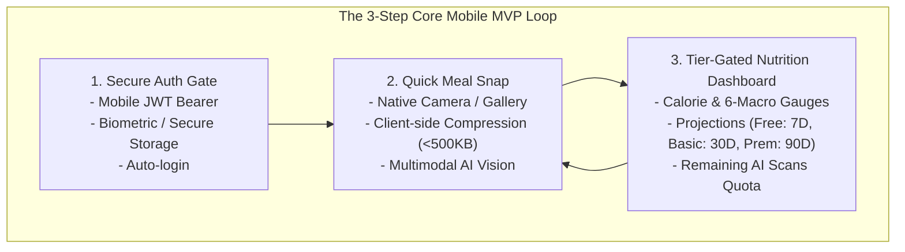
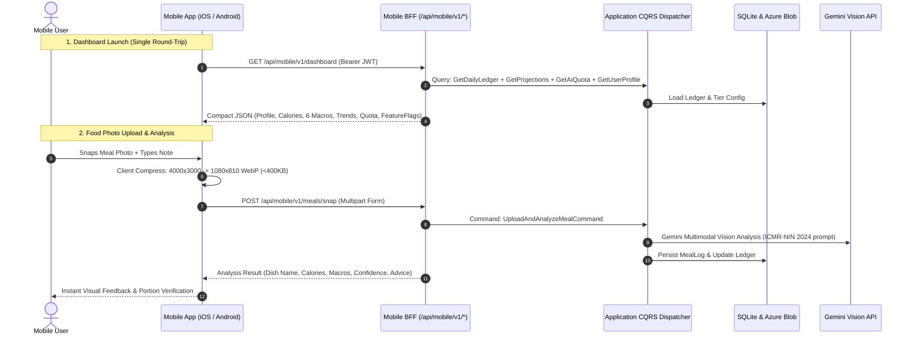

# Cross-Platform Mobile MVP & Mobile BFF Architecture: Diet-Dost

> **Mobile Target**: iOS & Android (Single Cross-Platform Codebase)  
> **Backend Target**: .NET 11 WebGateway / Mobile BFF &bull; Clean Architecture &bull; Native CQRS  
> **Core MVP Scope**: Secure Authentication &bull; Food Photo Upload with AI Analysis &bull; Tier-Gated Nutrition Charts  
> **Architect Perspective**: Written for Enterprise Cloud, AI, and .NET Architects building their first mobile client  

---

## 1. SMART & MVP Framework for Mobile Diet-Dost

Building a mobile client for a fitness and nutrition application is fundamentally different from building a web app. Mobile users snap photos on the go, often on cellular networks with battery and latency constraints. To ensure delivery without scope creep, we enforce the **SMART & Lean MVP Framework**:



### 1.1 The SMART Criteria for the MVP
- **Specific**: Deliver exactly 3 mobile screens:
  1. *Auth Screen*: Login with Email/Mobile + Password, storing JWT securely.
  2. *Quick Snap Screen*: Native camera/photo picker with text note input, uploading compressed image to `/api/mobile/v1/meals/snap`.
  3. *Nutrition Dashboard Screen*: Daily calorie/macro summary dials and trend chart gated by user tier (Free = 7D, Basic = 30D, Premium = 90D).
- **Measurable**:
  - Cold startup to dashboard: `< 1.8 seconds` on 4G.
  - Image upload and AI analysis latency: `< 3.5 seconds` on cellular connection.
  - Client crash rate: `< 0.1%`.
  - Image payload size over network: `< 500 KB` (enforced via client-side resizing).
- **Achievable**: Reuses 100% of the existing .NET 11 domain models, clinical calculators (ICMR-NIN 2024 / WHO), and CQRS handlers via a consolidated Mobile BFF endpoint.
- **Relevant**: Solves the biggest friction point of nutrition tracking: logging food immediately at the dining table with a mobile camera.
- **Time-Bound**: Ready for internal test flight / closed alpha in **2 to 3 weeks**.

---

## 2. Platform-Agnostic Mobile Technology Options (Enterprise Architect Lens)

The following matrix compares the 4 cross-platform technologies from the perspective of an enterprise .NET / Cloud / AI architect:

| Evaluation Dimension | Option 1: .NET MAUI / Blazor Hybrid (Recommended for .NET Architects) | Option 2: React Native + Expo (Recommended for Rapid Cloud-Build MVP) | Option 3: Flutter (Dart) | Option 4: Capacitor / PWA Shell (Fastest Web Reuse) |
| :--- | :--- | :--- | :--- | :--- |
| **Language & Ecosystem** | C# 13 / .NET 11 / XAML or Razor | TypeScript / React / Node.js | Dart / Flutter Widget Tree | JavaScript / HTML / CSS (Existing PWA) |
| **Skill Alignment for .NET Architect** | **100% Native Alignment**: Uses C#, LINQ, Dependency Injection, and shared DTOs from `Nutrition.Domain`. | **Moderate Alignment**: Requires JavaScript/TypeScript and React state management. | **Low Alignment**: Requires learning Dart and Flutter state management (Riverpod/Bloc). | **High Alignment**: Reuses existing `wwwroot` HTML partials and CSS. |
| **iOS Build without a Mac** | Requires Mac build agent or Azure DevOps Mac runner. | **Zero-Mac Setup**: Expo Application Services (EAS) builds iOS and Android binaries in the cloud. | Requires Mac build agent or Codemagic cloud builds. | Requires Mac build agent for Xcode packaging. |
| **Camera & Image Optimization** | Native `MediaPicker` + `SkiaSharp` or `ImageSharp` for client compression. | `expo-camera`, `expo-image-picker`, `expo-image-manipulator` (one-line resize). | `image_picker` + `flutter_image_compress`. | HTML `<input type="file" capture>` in WebView or Capacitor Camera plugin. |
| **Nutrition Charting** | `LiveChartsCore.SkiaSharpView.Maui` or Microcharts. | `react-native-chart-kit` or `victory-native`. | `fl_chart` (stunning 60fps animations). | Chart.js or SVG inside WebView. |
| **Pros** | &bull; Direct C# reuse.<br/>&bull; Can share client DTO contracts directly.<br/>&bull; Native platform performance. | &bull; Instant testing on physical devices via Expo Go app (no Xcode/Android Studio).<br/>&bull; Cloud builds without owning a Mac.<br/>&bull; Huge library ecosystem. | &bull; Pixel-perfect graphics rendering.<br/>&bull; Highly fluid 120Hz calorie ring animations. | &bull; Ships in 3 days by wrapping existing web app.<br/>&bull; Zero new UI to build. |
| **Cons** | &bull; Tooling on Windows for iOS requires Mac setup.<br/>&bull; MAUI ecosystem smaller than React Native. | &bull; JavaScript/React context switch.<br/>&bull; Separate dependency management (npm). | &bull; Need to learn Dart language and Flutter paradigms. | &bull; Does not feel truly native.<br/>&bull; Camera UX in WebView can feel sluggish on low-end Androids. |

### Architectural Recommendation:
- If you want **pure C# and shared .NET DTOs**: Choose **Option 1 (.NET MAUI)**.
- If you **do not own a Mac** and want to test on your iPhone/Android today via a QR code: Choose **Option 2 (React Native with Expo)**.
- If you want an **app in the stores next week**: Choose **Option 4 (Capacitor wrapper around current PWA)**.

---

## 3. Backend for Frontend (BFF) Design Pattern

### 3.1 Why a Dedicated Mobile BFF is Crucial
Desktop web applications on broadband can afford multiple sequential HTTP calls. On mobile, cellular latency, radio wake-up delays, and packet loss degrade the user experience. 

The Mobile BFF consolidates multiple domain CQRS queries into a **single, highly-optimized mobile contract**:



### 3.2 Mobile BFF Contract Specifications

#### Endpoint 1: Mobile Aggregated Dashboard (`GET /api/mobile/v1/dashboard`)
Combines 4 web queries into 1 payload:
```json
{
  "user": {
    "id": "user-123",
    "name": "Nikunj Banker",
    "tier": "Premium",
    "tierBadge": "👑 Premium Member"
  },
  "quota": {
    "todayScansUsed": 2,
    "dailyScanLimit": 20,
    "scansRemaining": 18,
    "canScan": true
  },
  "todayLedger": {
    "targetCalories": 1850.0,
    "consumedCalories": 1240.0,
    "remainingCalories": 610.0,
    "protein": { "consumed": 78.5, "target": 95.0, "unit": "g" },
    "carbs": { "consumed": 140.0, "target": 200.0, "unit": "g" },
    "fat": { "consumed": 38.0, "target": 50.0, "unit": "g" },
    "fiber": { "consumed": 22.0, "target": 30.0, "unit": "g" },
    "sugar": { "consumed": 12.0, "target": 25.0, "unit": "g" },
    "sodium": { "consumed": 1450.0, "target": 2000.0, "unit": "mg" }
  },
  "chartData": {
    "period": "30D",
    "availablePeriods": ["7D", "30D", "90D"],
    "points": [
      { "date": "2026-09-20", "calories": 1780, "target": 1850 },
      { "date": "2026-09-21", "calories": 1820, "target": 1850 }
    ]
  },
  "featureFlags": {
    "canComparePhotos": true,
    "canExportData": true,
    "unlimitedHistory": true
  }
}
```

#### Endpoint 2: Mobile Photo Snap (`POST /api/mobile/v1/meals/snap`)
- **Headers**: `Authorization: Bearer <JWT>`, `Content-Type: multipart/form-data`
- **Body Form Fields**:
  - `image`: Binary file (client-compressed to WebP or JPEG, max 500KB).
  - `description`: Optional text prompt (e.g. "2 roti and paneer bhurji").
  - `mealType`: Optional ("Breakfast", "Lunch", "Dinner", "Snack").
- **Response**:
```json
{
  "dishName": "Paneer Bhurji with 2 Phulka Roti",
  "confidenceScore": 0.94,
  "confidenceGated": false,
  "totalCalories": 420.0,
  "macros": {
    "proteinGrams": 22.5,
    "carbsGrams": 45.0,
    "fatGrams": 16.0,
    "fiberGrams": 6.5
  },
  "advice": "Excellent high-protein vegetarian meal. Balances daily protein deficit.",
  "items": [
    { "name": "Paneer Bhurji", "portion": "1 katori (150g)", "calories": 260 },
    { "name": "Phulka Roti", "portion": "2 pieces", "calories": 160 }
  ]
}
```

---

## 4. Enterprise Architect's Guide: What Cloud & .NET Architects Must Know for Mobile

As an enterprise backend and cloud architect, you already understand databases, APIs, distributed transactions, and security. However, mobile development introduces constraints unique to client hardware and app store ecosystems:

### 4.1 Client-Side Image Compression (Crucial Rule)
- **The Problem**: Modern smartphone cameras capture images at 12–48 megapixels (5MB to 20MB per photo). Uploading a 15MB photo over a cellular network takes 8–15 seconds, consumes massive battery, causes request timeouts, and burns unnecessary Azure bandwidth.
- **The Solution**: The mobile client **MUST resize and compress the image in memory before initiating the HTTP upload**:
  - Max dimension: `1080px` on the longest edge.
  - Format: `JPEG` at 80% quality or `WebP` at 75% quality.
  - Typical compressed size: `250 KB – 450 KB` (95% size reduction with zero visible loss for AI vision).
  - Result: Upload finishes in `< 1 second`.

### 4.2 App Store Review Guidelines for Health & AI Apps (Apple & Google)
Apple App Store and Google Play enforce strict review guidelines for health and AI applications:
1. **Mandatory Medical & Clinical Disclaimer (Apple Guideline 1.4.1)**:
   - Any app displaying nutritional advice, calorie deficits, or clinical feedback MUST display an unambiguous disclaimer before onboarding and in the settings:
     > *"Diet-Dost provides nutritional estimates based on ICMR-NIN guidelines for informational purposes only. It is not medical advice, diagnosis, or treatment. Consult a licensed dietitian or physician before starting any diet program."*
2. **Account Deletion Requirement (Apple Guideline 5.1.1(v))**:
   - If your app supports account creation, it **MUST provide an in-app account deletion button**. Diet-Dost already supports this in CQRS (`DeleteAccountCommand`)! Ensure the mobile settings screen has a "Delete Account" button that invokes this endpoint.
3. **App Review Demo Credentials**:
   - When submitting to the App Store, you must provide active test login credentials for Apple's review team. (Use a dedicated test account with pre-populated meal logs).

### 4.3 Secure Token Storage (Never use LocalStorage)
- **The Vulnerability**: On the web, developers often save JWTs in `localStorage`, which is vulnerable to XSS.
- **The Mobile Standard**: Mobile apps must store the JWT Bearer token in hardware-backed secure storage:
  - iOS: **Apple Keychain** (encrypted using device hardware enclave).
  - Android: **Android Keystore / EncryptedSharedPreferences** (AES-256 encrypted).
  - Libraries: `SecureStorage` in .NET MAUI, `expo-secure-store` in React Native, or `flutter_secure_storage` in Flutter.

### 4.4 Backward Compatibility & Version Gating (No Forced Web Refresh)
- In web apps, you can deploy a new release and all users get the latest JavaScript bundle immediately.
- On mobile, **users may run an older app version for months**.
- **Rule**: Never introduce breaking changes to existing `/api/mobile/v1/*` contracts. If changing a schema, introduce `/api/mobile/v2/*` or maintain additive, non-breaking JSON fields.
- Include a lightweight version check endpoint `GET /api/mobile/v1/config` returning `minSupportedVersion: "1.0.0"`. If the client is below that, display a friendly "Please update your app from the App Store" modal.

---

## 5. Mobile MVP Implementation Plan (3-Phase Execution)

### Phase 1: Mobile BFF Controller in WebGateway (Backend Readiness)
1. Add `MobileController.cs` in `src/Nutrition.WebGateway/Controllers/Mobile/`:
   - Endpoint 1: `GET /api/mobile/v1/dashboard` (aggregating profile, quota, ledger, and projections).
   - Endpoint 2: `POST /api/mobile/v1/meals/snap` (accepting compressed image + note).
   - Endpoint 3: `GET /api/mobile/v1/config` (versioning, disclaimers, tier definitions).
2. Reuse existing Application CQRS handlers with zero duplication of business logic.

### Phase 2: Cross-Platform Mobile Client Setup
1. Initialize chosen framework (e.g. Expo TypeScript or .NET MAUI).
2. Configure theme tokens matching Diet-Dost Obsidian Dark (`#0B0D13` background, `#1A1D27` cards, `#4F46E5` primary).
3. Implement 3 screens:
   - `LoginScreen`: Email/Mobile + Password -> saves JWT to SecureStorage.
   - `SnapScreen`: Native camera shutter -> client resize to 1080p -> upload -> portion confirmation.
   - `DashboardScreen`: Daily Calorie ring gauge, 6-macro mini-bars, and 7D/30D chart points.

### Phase 3: Build, Testing & Closed Alpha
1. Test on physical iOS and Android devices over cellular data.
2. Verify tier limits (e.g. Free user sees 7D chart, Basic sees 30D, Premium sees 90D).
3. Verify zero data loss and seamless synchronization between web PWA and mobile app.
