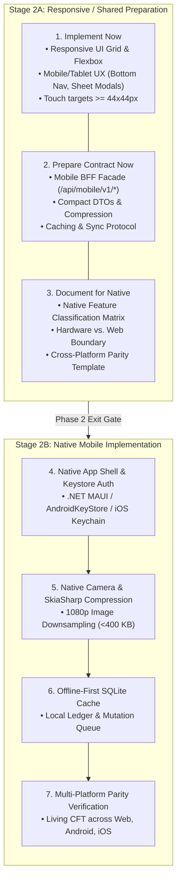

<!--
  Copyright (c) 2026 diet-dost and/or its contributors.
  Licensed under the "GNU Affero General Public License v3.0 only" and
  the "Server Side Public License, v 1"; you may not use this file except
  in compliance with, at your election, the "GNU Affero General Public
  License v3.0 only" or the "Server Side Public License, v 1".
-->

# Phase 2: Responsive Web & Mobile Readiness Architecture

> **Solution Phase**: Phase 2 (Milestone Alpha Release 02)  
> **Architecture Pattern**: Two-Stage Staged Execution — Stage 2A (Responsive / Shared Preparation) &bull; Stage 2B (Native Mobile Capabilities)  
> **Platforms**: Web PWA (Desktop, Tablet, Mobile) &bull; iOS & Android (.NET MAUI / Mobile BFF)  
> **Backend Baseline**: .NET 11 WebGateway &bull; Native CQRS &bull; Shared Query Handlers  

---

## 1. Two-Stage Execution Framework

Phase 2 bridges the gap between the desktop/laptop-first Phase 1 Web MVP and the device-specific native mobile app by enforcing a strict two-stage sequence:



### 1.1 Stage 2A: Responsive / Shared Preparation (Execute First)
1. **Implement Now (Responsive UI & Ergonomics)**:
   - Modern adaptive layouts spanning mobile (320px–639px), tablet (640px–1023px), and desktop (>=1024px).
   - Bottom navigation bar on mobile viewports for thumb-zone accessibility.
   - Responsive bottom sheet modals for meal logging and quota alerts.
   - Touch targets satisfying WCAG 2.2 Level AA / Apple HIG (>= 44x44px).
2. **Prepare Contract Now (API Mobile Readiness)**:
   - Mobile BFF facade (`/api/mobile/v1/dashboard/composite`) reusing Phase 1 shared CQRS query handlers.
   - Payload payload optimization: camelCase DTOs, ISO 8601 UTC timestamps, Brotli/Gzip compression.
   - HTTP caching via `ETag` and `If-None-Match` to conserve mobile bandwidth and battery.
3. **Document for Native (Feature Classification & Parity Baseline)**:
   - Strict classification of browser capabilities vs. native device hardware requirements.
   - Comprehensive cross-platform parity matrix template.
   - Responsive CFT execution across phones, tablets, and desktops.

### 1.2 Stage 2B: Native Mobile Implementation (Execute Next)
- Native mobile app project (.NET MAUI) consuming the live Azure backend.
- Hardware Keystore / Keychain secure JWT storage.
- Native hardware camera with SkiaSharp 1080p compression (<400 KB).
- Offline-first SQLite local ledger cache with sync metadata.
- End-to-end multi-platform acceptance verification.

---

## 2. Reference Playbooks Index

This skill provides 7 actionable, imperative reference playbooks located in `references/`:

| Playbook | Purpose & Scope | Execution Timing |
| :--- | :--- | :--- |
| [`references/responsive-ui-playbook.md`](references/responsive-ui-playbook.md) | Breakpoint tokens, CSS Grid/Flex, fluid typography, touch target enforcement, Obsidian-dark styling. | **Implement Now (Stage 2A)** |
| [`references/mobile-tablet-ux-playbook.md`](references/mobile-tablet-ux-playbook.md) | Bottom navigation bar, bottom sheet modals, thumb-zone ergonomics, tablet split-pane layouts. | **Implement Now (Stage 2A)** |
| [`references/api-mobile-readiness-playbook.md`](references/api-mobile-readiness-playbook.md) | Mobile BFF contracts, compact payloads, ETag caching, compression headers, sync metadata. | **Prepare Contract Now (Stage 2A)** |
| [`references/native-feature-classification.md`](references/native-feature-classification.md) | Web PWA vs. Native Mobile feature taxonomy (Camera, Keystore, Push, BLE, Offline Sync). | **Document for Native (Stage 2A)** |
| [`references/responsive-cft-template.md`](references/responsive-cft-template.md) | Acceptance test checklist across phone (375x667, 390x844), tablet (768x1024), and desktop viewports. | **Stage 2A CFT Gate** |
| [`references/cross-platform-parity-template.md`](references/cross-platform-parity-template.md) | Mathematical, authorization, and visual parity verification harness across Web, Android, iOS. | **Stage 2A & 2B Parity Gate** |
| [`references/phase-2-exit-gate.md`](references/phase-2-exit-gate.md) | Transition criteria and readiness signoff required before initiating Stage 2B Native Mobile work. | **Stage 2A Exit Gate** |

---

## 3. Guiding Architectural Principles

1. **Zero-Throwaway Preparation**:
   All CSS, HTML templates, and Mobile BFF endpoints built during Stage 2A must be directly consumable by the PWA and native webviews. Never build throwaway mobile mockups.
2. **Zero Duplicate Domain Logic**:
   The Mobile BFF must dispatch the exact same CQRS query handlers in `Nutrition.Application` as the Web BFF (`GetDailyLedgerQuery`, `GetHistoricalAnalyticsQuery`, `GetMealHistoryQuery`, `GetAiQuotaQuery`).
3. **Bandwidth & Battery Conservation**:
   Mobile network requests must minimize over-the-air payload size through single-roundtrip composite endpoints, payload field minification, and HTTP 304 Not Modified caching.
4. **Thumb-Zone Usability**:
   Core actions (log meal, switch dates, review macros) must be comfortably reachable with one thumb on devices up to 6.7 inches.

---

## 4. Automated CFT Verification & Living ADR Synchronization

### 4.1 Automated Responsive & Mobile Test Harness
Execute automated Puppeteer verification against `http://localhost:5240`:
- **Viewport Layout & Overflow Test**:
  ```bash
  node tests/verify_cft_viewports.mjs
  ```
- **Mobile Bottom Nav & Sheet Modal Core Flows**:
  ```bash
  node tests/verify_mobile_cft_core_flows.mjs
  ```
- **Mobile BFF Headless Endpoints**:
  ```bash
  node tests/verify_mobile_bff.mjs
  ```

### 4.2 Living ADR Synchronization
Record responsive and presentation architectural changes in `docs/adr/presentation/ADR-<YYYYMMDD>-<NNN>-<slug>.md` and run `pwsh -File scripts/sync-adr-index.ps1`.
