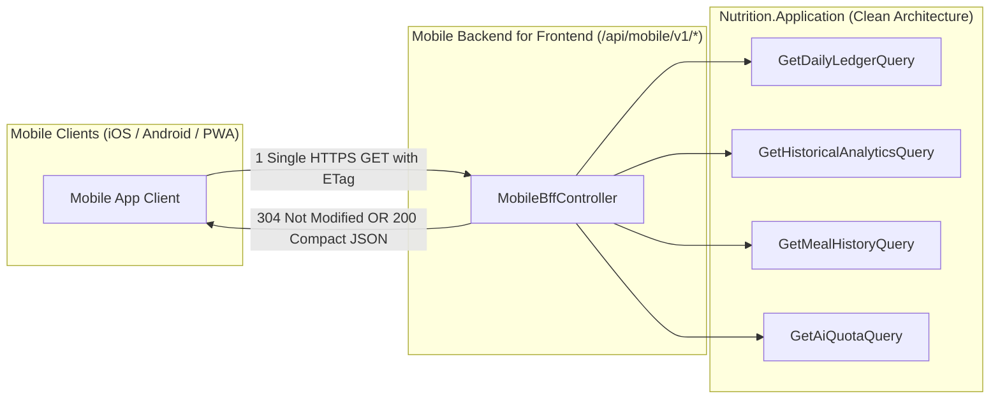

<!--
  Copyright (c) 2026 diet-dost and/or its contributors.
  Licensed under the "GNU Affero General Public License v3.0 only" and
  the "Server Side Public License, v 1"; you may not use this file except
  in compliance with, at your election, the "GNU Affero General Public
  License v3.0 only" or the "Server Side Public License, v 1".
-->

# API Mobile Readiness & Mobile BFF Playbook

> **Execution Stage**: Stage 2A (Responsive / Shared Preparation — Prepare Contract Now)  
> **Target Scope**: Mobile BFF Facade, Compact Payloads, ETag Caching, Compression, Offline Metadata  

---

## 1. The Mobile BFF Facade Pattern

Mobile clients on high-latency 4G/5G connections suffer greatly from chatty API calls. The **Mobile BFF** (`/api/mobile/v1/*`) aggregates multiple domain queries into a single roundtrip payload, identical in architectural principle to Phase 1's `WebBffController` but tailored for mobile efficiency:



---

## 2. API Contract Specifications

### 2.1 Composite Endpoint: `GET /api/mobile/v1/dashboard/composite`

**Query Parameters**:
- `date`: Optional ISO 8601 date string (default: current local date).
- `historyDays`: Optional integer (7, 30, or 90 based on tier limit; default: 7).

**Response Contract (`MobileDashboardCompositeDto`)**:
```json
{
  "summary": {
    "date": "2026-10-02",
    "budgetCalories": 1950,
    "consumedCalories": 1420,
    "remainingCalories": 530,
    "macros": {
      "proteinGrams": 85.0,
      "targetProteinGrams": 110.0,
      "carbsGrams": 175.0,
      "targetCarbsGrams": 220.0,
      "fatGrams": 42.0,
      "targetFatGrams": 55.0,
      "fiberGrams": 28.0,
      "targetFiberGrams": 30.0
    }
  },
  "todayMeals": [
    {
      "id": 104,
      "mealType": "Lunch",
      "name": "Dal Tadka with 2 Roti and Salad",
      "calories": 480,
      "protein": 18.5,
      "loggedAt": "2026-10-02T13:15:00Z",
      "imageUrl": "https://app.dietdost.com/uploads/meals/thumb_104.webp"
    }
  ],
  "quota": {
    "tier": "Free",
    "monthlyScanLimit": 15,
    "usedScans": 4,
    "remainingScans": 11,
    "resetDateUtc": "2026-11-01T00:00:00Z"
  },
  "etag": "W/\"3a7f8b9c-20261002\""
}
```

---

## 3. Compact Payload & Bandwidth Optimization Rules

1. **Strict camelCase JSON**: All DTO properties serialized with `JsonNamingPolicy.CamelCase`.
2. **Exclude Null Values**: Omit null fields over the wire using `JsonIgnoreCondition.WhenWritingNull` to minimize cellular data consumption.
3. **Response Compression**:
   - WebGateway must enable Brotli (`br`) and Gzip (`gzip`) compression for all `/api/mobile/v1/*` responses.
   - Target payload size for composite dashboard: `< 12 KB` uncompressed, `< 2.5 KB` compressed.
4. **Thumbnail Image Delivery**:
   - Mobile endpoints return optimized `.webp` thumbnail URLs (max dimension 480px, <50 KB) rather than full-resolution 4K captures.

---

## 4. HTTP Caching & ETag Header Protocol

To prevent battery drain and unnecessary data transfer:
1. WebGateway computes a lightweight hash of the composite data and emits:
   ```http
   ETag: W/"<hash-timestamp>"
   Cache-Control: private, no-cache
   ```
2. Mobile client stores the ETag in local cache (`Preferences` or SQLite).
3. On subsequent launches or background resumes, mobile sends:
   ```http
   If-None-Match: W/"<hash-timestamp>"
   ```
4. If unchanged, WebGateway immediately returns `304 Not Modified` with zero response body, terminating roundtrip in `< 50ms`.

---

## 5. Offline-First Mutation Synchronization Contracts

Every write operation (meal logging, portion adjustment) accepts client-generated sync metadata:

```json
{
  "clientMutationId": "c9a4e82b-4721-4a8f-9a11-8f4b50d32109",
  "clientTimestampUtc": "2026-10-02T12:30:00Z",
  "mealType": "Dinner",
  "foodName": "Paneer Bhurji",
  "servingGrams": 150,
  "calories": 280
}
```

- **Idempotency Guarantee**: If the network drops during transmission and the mobile client retries, the server uses `clientMutationId` to avoid duplicate meal entries.
