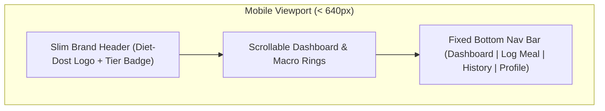

<!--
  Copyright (c) 2026 diet-dost and/or its contributors.
  Licensed under the "GNU Affero General Public License v3.0 only" and
  the "Server Side Public License, v 1"; you may not use this file except
  in compliance with, at your election, the "GNU Affero General Public
  License v3.0 only" or the "Server Side Public License, v 1".
-->

# Mobile & Tablet UX Architecture Playbook

> **Execution Stage**: Stage 2A (Responsive / Shared Preparation — Implement Now)  
> **Target Scope**: Bottom Navigation, Bottom Sheet Modals, Thumb-Zone Ergonomics, Tablet Split Views  

---

## 1. Thumb-Zone Navigation & Bottom App Bar

On mobile devices (<640px), top headers are hard to reach with one hand. We introduce a fixed **Bottom Navigation Bar** for smartphones while preserving the top/side rail on desktops:



### 1.1 Bottom Navigation HTML & CSS Structure
```html
<nav class="mobile-bottom-nav" aria-label="Mobile Navigation">
  <button class="nav-item active" data-target="dashboard">
    <span class="nav-icon">📊</span>
    <span class="nav-label">Overview</span>
  </button>
  <button class="nav-item action-btn" data-target="log-meal">
    <span class="nav-icon-fab">➕</span>
    <span class="nav-label">Log Meal</span>
  </button>
  <button class="nav-item" data-target="history">
    <span class="nav-icon">📅</span>
    <span class="nav-label">History</span>
  </button>
  <button class="nav-item" data-target="settings">
    <span class="nav-icon">⚙️</span>
    <span class="nav-label">Settings</span>
  </button>
</nav>
```

```css
/* Visible strictly on mobile viewports */
.mobile-bottom-nav {
  position: fixed;
  bottom: 0;
  left: 0;
  right: 0;
  height: 64px;
  background: rgba(15, 23, 42, 0.95);
  backdrop-filter: blur(12px);
  border-top: 1px solid rgba(255, 255, 255, 0.1);
  display: flex;
  justify-content: space-around;
  align-items: center;
  z-index: 1000;
  padding-bottom: env(safe-area-inset-bottom, 0px);
}

@media (min-width: 640px) {
  .mobile-bottom-nav {
    display: none; /* Hidden on tablet and desktop in favor of standard header */
  }
}
```

---

## 2. Responsive Bottom Sheet Modals

Centered popup dialogs on mobile phones create awkward reach and layout shift. On screens `<640px`, modals slide up from the bottom as **Bottom Sheets**:

```css
.modal-overlay {
  position: fixed;
  inset: 0;
  background: rgba(0, 0, 0, 0.65);
  display: flex;
  align-items: flex-end; /* Mobile: Aligns to bottom */
  z-index: 1050;
  transition: opacity 0.25s ease-out;
}

.modal-content {
  width: 100%;
  max-height: 85vh;
  background: #111827;
  border-top-left-radius: 20px;
  border-top-right-radius: 20px;
  border: 1px solid rgba(255, 255, 255, 0.1);
  padding: 1.5rem;
  overflow-y: auto;
  box-shadow: 0 -10px 25px rgba(0, 0, 0, 0.5);
  animation: slideUp 0.3s cubic-bezier(0.16, 1, 0.3, 1);
}

/* Tablet & Desktop: Centered dialog box */
@media (min-width: 640px) {
  .modal-overlay {
    align-items: center;
    justify-content: center;
  }
  .modal-content {
    width: 90%;
    max-width: 540px;
    border-radius: 16px;
    animation: fadeInScale 0.25s ease-out;
  }
}

@keyframes slideUp {
  from { transform: translateY(100%); }
  to { transform: translateY(0); }
}
```

---

## 3. Tablet Split-View Ergonomics (640px - 1023px)

Tablets offer ample width for dual-pane workflows without the full desktop 3-column footprint:
- **Left Pane (55%)**: Caloric HUD, 6-Macro dials, and interactive weight trend chart.
- **Right Pane (45%)**: Today's meal diary timeline, quick calorie estimator, and food vision upload card.
- **Orientation Awareness**: Adapts dynamically between portrait (stacked) and landscape (split-pane).

---

## 4. Touch & Gesture Best Practices

1. **No Accidental Double-Tap Zoom**: Apply `touch-action: manipulation` across all buttons and inputs.
2. **Smooth Touch Scrolling**: Enable `-webkit-overflow-scrolling: touch` for iOS momentum scrolling.
3. **Form Virtual Keyboard Adaptation**: Ensure inputs scroll smoothly into view above the virtual keyboard without cutting off submit buttons.
4. **Haptic Touch Targets**: Provide immediate `:active` scale visual feedback (`transform: scale(0.97)`) on tap.
