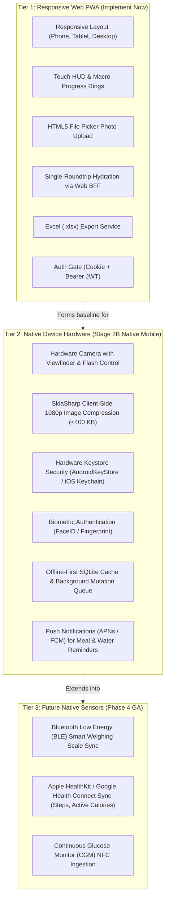

<!--
  Copyright (c) 2026 diet-dost and/or its contributors.
  Licensed under the "GNU Affero General Public License v3.0 only" and
  the "Server Side Public License, v 1"; you may not use this file except
  in compliance with, at your election, the "GNU Affero General Public
  License v3.0 only" or the "Server Side Public License, v 1".
-->

# Native Feature Classification & Device Boundary Blueprint

> **Execution Stage**: Stage 2A (Responsive / Shared Preparation — Document for Native)  
> **Target Scope**: Architectural Boundary between Responsive Web PWA and Native Mobile (.NET MAUI)  

---

## 1. Feature Classification Taxonomy

To prevent scope creep, accidental technical debt, and platform fragmentation, every feature in Diet-Dost is strictly classified into one of three tiers:

---

## 2. Comparative Platform Capability Matrix

| Feature Capability | Responsive Web PWA (Stage 2A) | Native Mobile .NET MAUI (Stage 2B) | Technical Rationale & Boundaries |
| :--- | :--- | :--- | :--- |
| **Viewport Ergonomics** | CSS Grid / Flexbox / Media queries / Bottom nav | Native XAML / MAUI Shell Navigation | Responsive Web adapts to any resolution; Native app matches OS navigation conventions. |
| **Authentication Storage** | HttpOnly Cookie + Session / Memory JWT | `AndroidKeyStore` / iOS Keychain | Web relies on browser sandbox; Native provides cryptographic hardware tamper-resistance. |
| **Camera & Photo Capture** | `<input type="file" accept="image/*">` | Native Camera API (`MediaPicker` / CameraView) | Web relies on OS photo gallery handoff; Native provides live viewfinder, macro lens zoom, and flash. |
| **Image Compression** | Browser Canvas API (variable quality/memory) | **SkiaSharp 1080p (<400 KB)** | High-resolution 48MP mobile photos must be hardware-downsampled natively before network transmission. |
| **Offline Data Persistence** | IndexedDB / CacheStorage | **Local SQLite database (`diet_dost_local.db`)** | SQLite provides ACID transactions, relational querying, and deterministic sync with backend. |
| **Background Sync** | Service Worker Background Sync (limited Safari) | Native Background Worker / JobScheduler | True background retry on cellular reconnect without requiring the browser tab to remain open. |
| **Push Notifications** | Web Push (requires user permission & active browser) | Native APNs (Apple) & FCM (Google) | High reliability for meal logging nudges, fasting timer alarms, and hydration reminders. |
| **Clinical Nutrition Math** | Consumes backend CQRS API | Consumes backend CQRS API | **Zero mathematical deviation**: Both clients consume identical backend clinical endpoints. |

---

## 3. Native Readiness Blueprint for Stage 2B

When Stage 2B begins, the native mobile implementation will implement the following device-specific services:

### 3.1 `ISecureTokenStore` (Hardware Security)
- **Android**: AES-256 GCM backed by AndroidKeyStore (`MasterKeys.getOrCreate`).
- **iOS**: Secure Enclave via iOS Keychain Services (`kSecAttrAccessibleAfterFirstUnlockThisDeviceOnly`).

### 3.2 `IImageCompressionService` (SkiaSharp)
- Decodes raw bitmap at native camera resolution.
- Resizes longest edge to `1080px` maintaining aspect ratio with `SKFilterQuality.Medium`.
- Encodes to WebP or JPEG at 82% quality.
- Asserts compressed size `< 400 KB` before initiating multi-part upload.

### 3.3 `ILocalLedgerSyncEngine` (Offline SQLite)
- Tables: `LocalMeals`, `LocalLedgerEntries`, `PendingMutations`.
- Mutation lifecycle: `Queued` &rarr; `InFlight` &rarr; `Acked` / `Conflict`.
- Dispatches queued mutations sequentially upon network connectivity recovery (`Connectivity.Current.NetworkAccess == NetworkAccess.Internet`).
