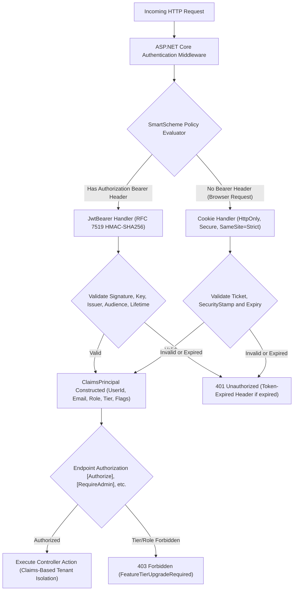
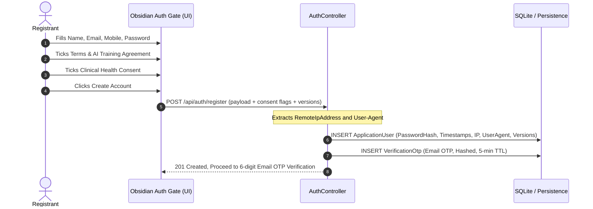

---
name: diet-dost-user-management-security
version: 1.6.0
status: Final Approved Production Specification & Security Rulebook
description: >-
  Complete User Management, Authentication, Authorization, Legal Consent
  Governance, Dynamic Tier Quota, and AI Telemetry implementation specification
  for Diet Dost. Covers Dual SmartScheme JWT Bearer (RFC 7519) + HttpOnly Cookie
  authentication, DPDPA 2023 dual-consent, OWASP Top 10 & AI LLM compliance,
  Role/Tier/Quota engine, SuperAdmin governance, Obsidian-dark Auth Gate UI,
  full test harness, and Living SDD synchronization mandate.
  Use this skill whenever implementing or modifying any aspect of authentication,
  authorization, user management, security middleware, tier enforcement, AI quota
  tracking, or legal consent handling in the Diet Dost solution.
---

# Diet Dost — User Management & Security Architecture Rulebook
> **Specification Version**: `v1.6.0-APPROVED-SPEC`
> **Standards**: OWASP Top 10 (2021), OWASP AI LLM Top 10 (2025), India DPDPA 2023, ISO/IEC 27001 Baseline, JWT RFC 7519, OpenID Connect Core 1.0
> **Target Framework**: `.NET 11 RC` (`net11.0`) · Standalone `.NET Aspire 13.5.4`
> **Super/God User Config**: Dynamic via `Auth:SuperAdminEmail` / env `SUPER_ADMIN_EMAIL`

---

## 0. Mandatory Pre-Conditions (Read Before Any Implementation)

> [!IMPORTANT]
> Before writing **any** auth, authorization, or user-management code, verify all of the following:
> 1. You are on a **feature branch** — never commit directly to `main`.
> 2. All C# projects target `<TargetFramework>net11.0</TargetFramework>`.
> 3. Build must produce **0 warnings, 0 errors**.
> 4. After implementation, run `dotnet test` and confirm 100% pass before pushing.
> 5. Synchronize Living SDD (`docs/sdd/*.md`) and append a log entry to `docs/sdd/07_living_documentation_log.md`.

---

## 1. Strict Gating Mandate — Zero Unauthorized Access

### 1.1 Server-Side Enforcement
- All protected routes (`/api/meals/*`, `/api/profile/*`, `/api/progressphotos/*`, `/api/analytics/*`) **MUST** return:
  - `HTTP 401 Unauthorized` for unauthenticated requests.
  - `HTTP 403 Forbidden` for insufficient tier or role.
- **Every controller** accessing user health data MUST carry `[Authorize]` (or a derived policy attribute).
- **Zero client-supplied `userId`**: All controllers resolve the acting user exclusively from `ClaimsPrincipal` via `UserClaimsExtensions.GetUserId(User)`.

### 1.2 Client-Side Enforcement
- The browser-side **Authentication Gate** (`partials/auth-gate.html`) MUST render before any dashboard or clinical DOM nodes are mounted.
- No health data, macro values, or profile information may appear in the DOM until a **valid, verified JWT session** is confirmed.

### 1.3 Cost-Optimized Verification Model
| Verification Step | Policy |
|---|---|
| **Email Verification** | **Mandatory** — 6-digit OTP, 5-minute TTL, max 3 attempts. Account activates only after `IsEmailVerified == true`. |
| **Mobile SMS Verification** | **Optional / Deferred** by default (`Auth:RequireMobileVerification = false`). Prevents external SMS gateway charges. `IsMobileVerified` starts `false` but does NOT block login after email is verified. |

---

## 2. Dual SmartScheme Authentication Architecture

### 2.1 Policy Scheme Routing (ASP.NET Core)
Register in `Program.cs` using `AddAuthentication("SmartScheme").AddPolicyScheme(...)`:

```csharp
// Requests with "Authorization: Bearer <token>" -> JwtBearerDefaults.AuthenticationScheme
// All other (browser) requests                  -> CookieAuthenticationDefaults.AuthenticationScheme
services.AddAuthentication("SmartScheme")
    .AddPolicyScheme("SmartScheme", "SmartScheme", opts =>
    {
        opts.ForwardDefaultSelector = ctx =>
            ctx.Request.Headers.Authorization.ToString().StartsWith("Bearer ", StringComparison.OrdinalIgnoreCase)
                ? JwtBearerDefaults.AuthenticationScheme
                : CookieAuthenticationDefaults.AuthenticationScheme;
    })
    .AddJwtBearer(opts => { /* see Section 2.3 */ })
    .AddCookie(opts  => { /* HttpOnly, Secure, SameSite=Strict */ });
```

### 2.2 Dual-Issuance Contract
- Successful `POST /api/auth/login` and `POST /api/auth/verify-otp` **MUST**:
  1. Set a **signed HttpOnly Secure cookie** for browser clients.
  2. Return a **JWT token** in the JSON response body for SPA/mobile/headless clients.
- `POST /api/auth/token` provides direct token generation for API-only and mobile clients.

### 2.3 JWT Token Service — `IJwtTokenService` / `JwtTokenService`
**Interface** (in `Nutrition.Application.Services`):
```csharp
public interface IJwtTokenService
{
    string GenerateToken(ApplicationUser user, int? expiryMinutes = null);
    ClaimsPrincipal? ValidateToken(string token);
}
```

**Cryptographic requirements**:
| Parameter | Requirement |
|---|---|
| Algorithm | `SecurityAlgorithms.HmacSha256Signature` (symmetric HMAC-SHA256) |
| Minimum Key Length | **256 bits (32 bytes)** — validated at startup; reject/throw on shorter keys |
| Default Lifetime | `1440` minutes (24 hours) — configurable via `Jwt:ExpiryMinutes` |
| Clock Skew | `TimeSpan.FromSeconds(30)` (tight 30-second tolerance) |
| Expiry Signal | Emit `Token-Expired: true` response header on expired token; client re-authenticates silently |

**Required Claims Payload**:
| Claim Key | ClaimTypes Equivalent | Value Example |
|---|---|---|
| `sub` | `ClaimTypes.NameIdentifier` | GUID string — unique user ID |
| `email` | `ClaimTypes.Email` | User email address |
| `name` | `ClaimTypes.Name` | User display name |
| `role` | `ClaimTypes.Role` | `User` / `Admin` / `SuperAdmin` |
| `tier` | (custom) | `Free` / `Basic` / `Premium` / `SuperAdmin` |
| `isEmailVerified` | (custom) | `"true"` or `"false"` |
| `isMobileVerified` | (custom) | `"true"` or `"false"` |
| `jti` | (JWT ID nonce) | `Guid.NewGuid().ToString()` |

### 2.4 JWT Configuration (`appsettings.json`)
```json
{
  "Jwt": {
    "Key": "<min-32-char-secret>",
    "Issuer": "https://dietdost.app",
    "Audience": "https://dietdost.app",
    "ExpiryMinutes": 1440
  }
}
```
- Environment variable overrides: `JWT_KEY`, `JWT_ISSUER`, `JWT_AUDIENCE`, `JWT_EXPIRY_MINUTES`.
- **Never commit the real signing key to Git** — use User Secrets or env vars for local dev.

### 2.5 Authorization Policies
Register these named policies in `Program.cs`:
```csharp
services.AddAuthorization(opts =>
{
    opts.AddPolicy("RequireAdmin",      p => p.RequireRole("Admin", "SuperAdmin"));
    opts.AddPolicy("RequireSuperAdmin", p => p.RequireRole("SuperAdmin"));
    opts.AddPolicy("RequireActiveUser", p => p.RequireClaim("isEmailVerified", "true"));
});
```

### 2.6 Universal Claim Mapping — `UserClaimsExtensions`
Must transparently map both **standard URI claim types** (XML/SOAP tokens) and **compact JWT claim names**:
```csharp
public static class UserClaimsExtensions
{
    public static string GetUserId(this ClaimsPrincipal user) =>
        user.FindFirstValue(ClaimTypes.NameIdentifier) ?? user.FindFirstValue("sub") ?? string.Empty;

    public static string GetEmail(this ClaimsPrincipal user) =>
        user.FindFirstValue(ClaimTypes.Email) ?? user.FindFirstValue("email") ?? string.Empty;

    public static string GetRole(this ClaimsPrincipal user) =>
        user.FindFirstValue(ClaimTypes.Role) ?? user.FindFirstValue("role") ?? string.Empty;

    public static string GetTier(this ClaimsPrincipal user) =>
        user.FindFirstValue("tier") ?? string.Empty;
}
```

---

## 3. Legal Dual-Consent & DPDPA 2023 Governance

> [!IMPORTANT]
> Under DPDPA 2023 Section 6, **bundled consents are legally invalid**. Two separate, unbundled, timestamped checkboxes are mandatory at registration.

### 3.1 Agreement 1 — Terms of Service, Privacy Policy & AI Training License (Required)
UI label:
> "I agree to the Terms of Service and Data & AI Privacy Policy" (Required)
> "I grant Diet Dost a worldwide, royalty-free license to use de-identified meal logs, food images, nutritional corrections, and anonymized app telemetry for internal research, AI model training/fine-tuning (including Indian Food SLM and Multimodal Vision models), and commercial sharing with trusted clinical, academic, and technology partners."

Covers:
- Medical Non-Liability and Wellness Scope (AI companion, NOT a licensed medical provider)
- Model Training and IP License (non-exclusive, irrevocable, PII-stripped)
- Company Internal Usage and Aggregated Analytics
- Trusted Partner Data Sharing

### 3.2 Agreement 2 — Sensitive Personal Health Data Processing Consent (Required)
UI label:
> "I provide explicit consent for Clinical Health & Nutrition Processing" (Required)
> "I explicitly authorize Diet Dost to collect, store, and process my health metrics (height, weight, biological sex, age), diagnosed medical conditions (e.g. Type 2 Diabetes, Hypertension, PCOS, Thyroid), and prescribed medications strictly to calculate personalized ICMR-NIN 2024 caloric budgets and clinical dietary alerts."

Covers:
- Sensitive Personal Data (SPD) Acknowledgment under DPDPA 2023
- Purpose Limitation (clinical dietetics only)
- Zero-Assumption Rule Compliance acknowledgment

### 3.3 Forensic Consent Audit Trail (Mandatory DB Fields on `ApplicationUser`)
| Field | Type | Purpose |
|---|---|---|
| `TermsAcceptedAtUtc` | `DateTime` (UTC) | Timestamp Agreement 1 was checked |
| `TermsVersionAccepted` | `string` | e.g. `"v1.0-202609"` |
| `HealthConsentAcceptedAtUtc` | `DateTime` (UTC) | Timestamp Agreement 2 was checked |
| `HealthConsentVersionAccepted` | `string` | e.g. `"v1.0-202609"` |
| `ConsentIpAddress` | `string` | Client IPv4/IPv6 from `HttpContext.Connection.RemoteIpAddress` |
| `ConsentUserAgent` | `string` | `Request.Headers["User-Agent"]` full string |

> [!CAUTION]
> Storing only a `bool` flag is **legally insufficient** under DPDPA 2023 Section 6(10). The forensic audit trail above is mandatory for evidentiary defence.

---

## 4. OWASP Compliance Matrix

### 4.1 OWASP Top 10 (2021) Mitigations
| Threat | Ref | Diet Dost Mitigation |
|---|---|---|
| Broken Access Control | A01 | Strict claim-based tenant isolation via `UserClaimsExtensions`. Zero client-supplied `userId`. EF Core global query filters (`UserId == CurrentUser.Id`). |
| Cryptographic Failures | A02 | PBKDF2 HMAC-SHA512 password hashing (100,000+ iterations). JWT HMAC-SHA256 >=256-bit key. Cookies: `HttpOnly`, `Secure`, `SameSite=Strict`. TLS 1.3 / HSTS enforced. |
| Injection | A03 | All DB queries via EF Core parameterized expressions. Anti-XSS encoding on all inputs. |
| Insecure Design / Brute Force | A04 | Polly sliding-window rate limiting on `/login`, `/verify-otp`, `/token` — max 5 attempts/15 min with account lockout. OTPs: 6-digit, 5-min TTL, max 3 attempts. |
| Tier & Quota Enforcement | A01+A04 | `403 Forbidden (FeatureTierUpgradeRequired)` for unauthorized feature access. `403 Forbidden (AiQuotaExceeded)` when daily limit exhausted. |
| Auth Failures / Session | A07 | Mandatory Email OTP before activation. JWT signature validation, 30s clock skew, `401` on tampering, unique `jti` nonces. |

### 4.2 OWASP AI LLM Top 10 (2025) Mitigations
| Threat | Ref | Diet Dost Mitigation |
|---|---|---|
| Prompt Injection & Output Handling | LLM01 / LLM02 | Input sanitization, strict JSON schema output contracts, confidence gating (>=70%). |
| Continuous Feedback Poisoning | LLM03 | Admin validation thresholds before corrections influence community heuristics. |
| Model Denial of Service | LLM04 | Dynamic tier quotas (Free:1/day, Basic:7/day, Premium:30/day) enforced atomically before routing to AI providers. |
| Sensitive Info Disclosure | LLM06 | PII redaction middleware — prompts sent to Gemini contain zero personal identifiers. |
| Model Theft / Key Exfiltration | LLM10 | Zero client-side AI keys. All LLM requests execute server-side via `Nutrition.Infrastructure.AI`. |

---

## 5. Domain Models & Entity Contracts

### 5.1 `ApplicationUser` (in `Nutrition.Domain`)
```csharp
public class ApplicationUser
{
    public string Id { get; set; }              // GUID string PK
    public string Email { get; set; }           // Unique, normalized
    public string MobileNumber { get; set; }    // Normalized
    public string PasswordHash { get; set; }    // PBKDF2 HMAC-SHA512
    public string SecurityStamp { get; set; }   // Invalidated on password change
    public string Role { get; set; }            // "User" | "Admin" | "SuperAdmin"
    public string Tier { get; set; }            // "Free" | "Basic" | "Premium" | "SuperAdmin"
    public bool IsEmailVerified { get; set; }   // MANDATORY for login
    public bool IsMobileVerified { get; set; }  // Optional/deferred
    public bool IsActive { get; set; }

    // Legal Compliance (DPDPA 2023) — all required
    public DateTime TermsAcceptedAtUtc { get; set; }
    public string TermsVersionAccepted { get; set; }
    public DateTime HealthConsentAcceptedAtUtc { get; set; }
    public string HealthConsentVersionAccepted { get; set; }
    public string ConsentIpAddress { get; set; }
    public string ConsentUserAgent { get; set; }

    public DateTime CreatedAtUtc { get; set; }
    public DateTime? LastLoginAtUtc { get; set; }
}
```

### 5.2 `VerificationOtp`
```csharp
public class VerificationOtp
{
    public string Id { get; set; }          // GUID string PK
    public string UserId { get; set; }      // FK -> ApplicationUser
    public string Target { get; set; }      // Email address or mobile number
    public string OtpCodeHash { get; set; } // Hashed 6-digit code (constant-time compare)
    public string Channel { get; set; }     // "Email" | "Sms"
    public DateTime ExpiresAtUtc { get; set; } // 5-minute TTL
    public int AttemptCount { get; set; }   // Max 3 attempts
    public bool IsUsed { get; set; }
}
```

### 5.3 `TierFeatureConfiguration`
```csharp
public class TierFeatureConfiguration
{
    public string Id { get; set; }
    public string Tier { get; set; }                // "Free"|"Basic"|"Premium"|"Admin"|"SuperAdmin"
    public int DailyAiDetectionLimit { get; set; }  // 1, 7, 30, -1 (unlimited)
    public bool AllowPhotoCompare { get; set; }
    public bool AllowDataExport { get; set; }
    public int AnalyticsHistoryDays { get; set; }   // 7, 30, 365
    public string Description { get; set; }
    public DateTime UpdatedAtUtc { get; set; }
    public string? UpdatedByUserId { get; set; }
}
```

### 5.4 `AiUsageLog`
```csharp
public class AiUsageLog
{
    public string Id { get; set; }                  // GUID string PK
    public string UserId { get; set; }              // FK -> ApplicationUser
    public string OperationType { get; set; }       // "PhotoDetection"|"TextDetection"|"ProgressCompare"
    public string ModelId { get; set; }             // e.g. "gemini-3.6-flash"
    public int EstimatedTokensUsed { get; set; }
    public long LatencyMs { get; set; }
    public bool IsSuccess { get; set; }
    public string? ErrorReason { get; set; }
    public DateTime TimestampUtc { get; set; }
}
```

---

## 6. Role Hierarchy & Dynamic Tier Matrix

### 6.1 Role Hierarchy
| Role | Capabilities |
|---|---|
| `SuperAdmin` | Infinite AI quotas, full user management, dynamic tier configuration governance. **Cannot be locked or demoted.** |
| `Admin` | Unlimited AI quotas, user management, feature toggling. Cannot lock/demote SuperAdmin. |
| `User` | Features and quotas governed strictly by assigned Tier. |

### 6.2 Dynamic Tier Feature Matrix (DB-Driven — Never Hardcoded)
| Feature | Free | Basic | Premium | Admin / SuperAdmin | Config Field |
|---|---|---|---|---|---|
| AI Photo Meal Detection | Max 1/day | Max 7/day | Max 30/day | Unlimited (-1) | `DailyAiDetectionLimit` |
| AI Text Food Detection | Max 1/day | Max 7/day | Max 30/day | Unlimited (-1) | `DailyAiDetectionLimit` |
| Visual Photo Compare | 403 Disabled | 403 Disabled | Enabled | Enabled | `AllowPhotoCompare` |
| Excel (.xlsx) / CSV Export | 403 Disabled | 403 Disabled | Enabled | Enabled | `AllowDataExport` |
| Historical Analytics | 7 Days | 30 Days | 365 Days | 365 Days | `AnalyticsHistoryDays` |
| Quota Rollover | Strict 0 | Strict 0 | Strict 0 | N/A | `AllowQuotaRollover=false` |
| User & Config Management | None | None | None | Full Control | `CanManageUsersAndTiers` |

### 6.3 Quota Exhaustion Response Contract (HTTP 403)
```json
{
  "error": "AiQuotaExceeded",
  "message": "Daily AI meal detection limit reached for Free tier (1/1). Limit resets at midnight.",
  "tier": "Free",
  "usedToday": 1,
  "dailyLimit": 1,
  "resetsAtUtc": "2026-09-24T18:30:00Z",
  "upgradeUrl": "/#pricing"
}
```

> [!IMPORTANT]
> Daily quotas reset at **00:00:00 local time** based on the user's `UserProfile.Timezone` (IANA, default `Asia/Kolkata`). Unused quotas are **forfeited — no carry-forward**.

---

## 7. Auth API Endpoint Catalogue

### `AuthController` Endpoints
| Method | Route | Auth Required | Description |
|---|---|---|---|
| POST | `/api/auth/register` | Anonymous | Validates dual consent, extracts IP/UserAgent, creates user, dispatches Email OTP. |
| POST | `/api/auth/verify-otp` | Anonymous | Validates OTP, activates account, signs Cookie + returns `{ token, tokenType: "Bearer", expiresIn, user }`. |
| POST | `/api/auth/login` | Anonymous | Validates email+password, requires `IsEmailVerified`, signs Cookie + returns token. |
| POST | `/api/auth/token` | Anonymous | Dedicated headless/mobile token issuance. |
| POST | `/api/auth/resend-otp` | Anonymous | Rate-limited OTP resend. |
| POST | `/api/auth/logout` | Auth | Clears cookie; instructs client to purge bearer token. |
| GET | `/api/auth/me` | Auth | Returns user identity, tier, role, legal consent version. |
| POST | `/api/auth/delete-account` | Auth | DPDPA-compliant self-service account and health data purge. |

### `AdminController` Endpoints — `[Authorize(Roles = "Admin,SuperAdmin")]`
| Method | Route | Description |
|---|---|---|
| GET | `/api/admin/users` | Paginated users list with roles, tiers, consent timestamps, AI consumption. |
| PUT | `/api/admin/users/{id}/tier` | Update user tier. |
| PUT | `/api/admin/users/{id}/status` | Toggle active/locked status. SuperAdmin immune — reject with `403`. |
| GET | `/api/admin/tier-configs` | View all dynamic tier configurations. |
| PUT | `/api/admin/tier-configs/{tier}` | Update daily limits and feature toggles dynamically. |

### Rate Limiting (Polly Sliding Window)
Apply Polly sliding-window rate limiting to `/api/auth/login`, `/api/auth/verify-otp`, `/api/auth/token`:
- **Max 5 requests per 15-minute sliding window** per client IP.
- Exceeding the limit triggers account lockout and `429 Too Many Requests`.

---

## 8. Local Development OTP Helper
In `IsDevelopment()` mode, OTP codes are delivered through two additional channels (no external cost):
1. Structured console log: `[OTP-DISPATCH] Channel: {Channel}, Target: {Target}, Code: {Code}`
2. Non-production response header `X-Dev-Otp-Code` + visible UI banner/toast on the Auth Gate.

---

## 9. UI Implementation: Obsidian-Dark Auth Gate

### 9.1 `partials/auth-gate.html` Requirements
- **Renders before any dashboard or clinical DOM** — unauthenticated users see ONLY the auth gate.
- Three tabs: **Sign In**, **Register**, **Verify Email OTP**.
- Register tab MUST include:
  - Email, Mobile, Name, Password fields.
  - **Checkbox 1** (Agreement 1 — Terms & AI Training License). Required.
  - **Checkbox 2** (Agreement 2 — Clinical Health Consent). Required.
  - Modal popups accessible for full Terms of Service and Data & AI Policy text.
- Dev mode badge: visible OTP code in a non-production helper banner.

### 9.2 Client-Side JWT Token Lifecycle (`auth-service.js`)
- Store JWT under `localStorage` key `dd_jwt_token`.
- Expose: `getToken()`, `isAdmin()`, `isSuperAdmin()`.
- On `401` response or `logout`: clear `dd_jwt_token` from `localStorage`.

### 9.3 API Client Auth Interceptor (`api-client.js`)
```javascript
_getAuthHeaders() {
    const token = authService.getToken();
    return token ? { 'Authorization': `Bearer ${token}` } : {};
}
```
- Detect `Token-Expired: true` response header and trigger silent re-authentication flow.

### 9.4 Header Tier Pills (`partials/header.html`)
| Tier | Badge |
|---|---|
| `SuperAdmin` | "Super User" |
| `Premium` | "Premium" |
| `Basic` | "Basic" |
| `Free` | "Free" |
Include account dropdown: Profile, AI Usage, Admin Panel (if Admin/SuperAdmin), Sign Out.

### 9.5 AI Quota & Usage HUD (`partials/profile-modal.html`)
- Today's usage gauge with remaining detections count.
- 1D / 7D / 30D AI usage aggregations.
- Countdown timer to localized midnight reset.
- Recent AI operations table.
- Amber advisory badge when `remainingDetections == 0`.

### 9.6 Admin Portal (`partials/admin-modal.html`)
- Full user management: paginated list, role/tier editing, lock/unlock toggle.
- Consent timestamps visible for each user (forensic audit).
- Dynamic tier limit editor.

---

## 10. Client-Side Tier & Quota Gating Rules

### 10.1 Analytics Chart (`analytics-chart.js`)
- Block Excel/CSV export button for Free and Basic users.
- Show upgrade CTA modal on blocked export attempt.
- Respect `AnalyticsHistoryDays` limit from tier configuration.

### 10.2 Progress Photo Modal (`progress-modal.js`)
- Display Obsidian-dark **locked state** with upgrade CTA on `#face-progress-card` for Free/Basic users.
- Do not render photo comparison UI elements for non-Premium users.

---

## 11. Service Architecture (`Nutrition.Infrastructure.Security`)

### 11.1 `ITierConfigurationService`
- Reads `TierFeatureConfigurations` table.
- Applies **in-memory caching** for dynamic tier rules (invalidate cache on Admin PUT).

### 11.2 `IAiQuotaService`
```csharp
public interface IAiQuotaService
{
    Task<QuotaStatus> GetQuotaStatusAsync(string userId, string operationType, CancellationToken ct = default);
    Task RecordAiOperationAsync(AiUsageLog log, CancellationToken ct = default);
}

public record QuotaStatus(
    bool IsAllowed,
    int UsedToday,
    int DailyLimit,         // -1 = unlimited
    int RemainingCalls,
    DateTime ResetsAtUtc
);
```
- Computes localized midnight boundaries from `UserProfile.Timezone`.
- Evaluates against `AiUsageLogs` for today's count.
- Atomic DB check-and-record before routing to AI provider.

### 11.3 `PasswordHasher` (PBKDF2 HMAC-SHA512)
- **Minimum 100,000 iterations** of PBKDF2 with HMAC-SHA512.
- Constant-time hash comparison to prevent timing attacks.

### 11.4 `IOtpService`
- Cryptographically random 6-digit code generation.
- Hash code before storage (`OtpCodeHash` — NEVER store plain OTP).
- Constant-time hash comparison for validation.
- 5-minute expiry (`ExpiresAtUtc`), max 3 `AttemptCount` before invalidation.

---

## 12. Testing Harness Requirements

> [!IMPORTANT]
> All six test suites below MUST pass (0 failures, 0 warnings) before merging to `main`.

### 12.1 JWT Authentication Tests (`JwtAuthenticationTests.cs`)
- `GenerateToken_ShouldProduceValidJwtStructure` — 3 segments, HS256, valid issuer/audience.
- `GenerateToken_ShouldEmbedRequiredClaims` — all 8 claim keys present and correct.
- `ValidateToken_ShouldRejectTamperedToken` — altered payload/signature returns `null`.
- `ValidateToken_ShouldRejectExpiredToken` — expired tokens rejected.
- `UserClaimsExtensions_ShouldMapBothStandardAndShortJwtClaimTypes` — both claim URI and compact JWT name.

### 12.2 Security Cryptography Tests (`SecurityCryptographyTests.cs`)
- Password hash/verify round-trip.
- OTP generation, hash storage, constant-time verify.
- OTP expiry and max-attempt enforcement.

### 12.3 Polly Rate Limiting Tests (`PollyRateLimitingTests.cs`)
- 5th attempt succeeds; 6th attempt within 15-min window returns `429`.

### 12.4 AI Quota & Tier Service Tests (`AiQuotaAndTierServiceTests.cs`)
- Free limit: 1/day (2nd call returns QuotaExceeded).
- Basic limit: 7/day.
- Premium limit: 30/day.
- SuperAdmin: unlimited.
- Midnight UTC reset verified against localized timezone boundary.
- Photo Compare 403 on Free/Basic; 200 on Premium/SuperAdmin.
- Excel Export 403 on Free/Basic; 200 on Premium/SuperAdmin.

### 12.5 Legal & Auth Integration Tests
- Registration rejected when either consent checkbox unchecked.
- Forensic `ConsentIpAddress` / `ConsentUserAgent` / UTC timestamps recorded correctly.
- Email OTP flow: register -> verify -> login succeeds.
- Login rejected for unverified email.
- Logout clears session and returns `401` on subsequent protected call.

### 12.6 Security / IDOR Tests
- User A cannot access User B's meals via any API param manipulation.
- Admin endpoints return `403` for standard `User` role.
- SuperAdmin lock/demotion returns `403`.
- Account deletion purges all health data including meals and progress photos.

---

## 13. Living SDD Synchronization Mandate

> [!IMPORTANT]
> **Every** implementation or modification touching auth/user-management/security **MUST** be followed by a Living SDD sync before the PR is opened.

### 13.1 Files to Update
| File | What to Update |
|---|---|
| `docs/sdd/00_sdd_index.md` | Feature status checkboxes and version stamp |
| `docs/sdd/02_solution_architecture.md` | Architecture diagrams if topology changed |
| `docs/sdd/03_data_models_and_contracts.md` | Entity schema if new fields/entities added |
| `docs/sdd/04_security_and_compliance.md` | OWASP matrix, legal consent, JWT config |
| `docs/sdd/07_living_documentation_log.md` | New `[LOG-YYYYMMDD-NNN]` entry |

### 13.2 Log Entry Format (`07_living_documentation_log.md`)
```markdown
## [LOG-YYYYMMDD-NNN] <Short Title>
- **Date**: YYYY-MM-DD
- **Branch**: `feature/<name>`
- **Commit**: `<sha>` — `<conventional commit message>`
- **Changes**:
  - <Bulleted list of what was implemented/modified>
- **Test Results**: `dotnet test` — N/N passing, 0 warnings, 0 errors
- **SDD Files Updated**: `02_solution_architecture.md`, `04_security_and_compliance.md`, etc.
```

---

## 14. SuperAdmin Configuration & Governance Rules

### 14.1 Configuration
- Config Key: `Auth:SuperAdminEmail` (or env var `SUPER_ADMIN_EMAIL`).
- Default (dev only): `admin@dietdost.app`.
- **Never commit a real personal email to Git** — use User Secrets or env vars.

### 14.2 SuperAdmin Invariants (Enforced at Runtime)
1. SuperAdmin account **cannot be locked** — `AdminController` must reject with `403 Forbidden`.
2. SuperAdmin role **cannot be demoted** via the Admin API.
3. SuperAdmin has **infinite AI quota** (`DailyAiDetectionLimit = -1`).
4. Existing seed data (sample profiles, meals, progress photos keyed to `"user-default"`) is migrated to the configured SuperAdmin account at startup.

---

## 15. Architecture Flow Diagrams (Reference)

### 15.1 SmartScheme Authentication Flow


### 15.2 Registration & Consent Flow


---

## 16. Quick-Reference Checklist for New Auth/Security Tasks

When implementing or modifying any feature touching auth, identity, or security:

- [ ] Branch created (`feature/`, `fix/`, or `docs/` prefix)
- [ ] `[Authorize]` attribute applied to all new protected endpoints
- [ ] `UserClaimsExtensions.GetUserId(User)` used — zero client-supplied `userId`
- [ ] Dual consent checked in registration flow (both checkboxes required)
- [ ] Forensic consent audit fields populated (IP, UserAgent, UTC timestamps, versions)
- [ ] Rate limiting applied to all new auth-adjacent endpoints
- [ ] JWT claims contract complete (all 8 claim keys in Section 2.3)
- [ ] Server-side tier/quota check before any AI provider call
- [ ] Client-side tier gating in JS (locked state UI for unauthorized features)
- [ ] All new AI operations recorded to `AiUsageLogs`
- [ ] SuperAdmin immunity invariants respected in Admin API
- [ ] Test coverage for new code (see Section 12 harness requirements)
- [ ] `dotnet test` — 0 failures, 0 warnings, 0 errors
- [ ] Living SDD updated (`04_security_and_compliance.md` + log entry in `07_living_documentation_log.md`)
- [ ] Branch pushed and PR opened (no direct merge to `main`)