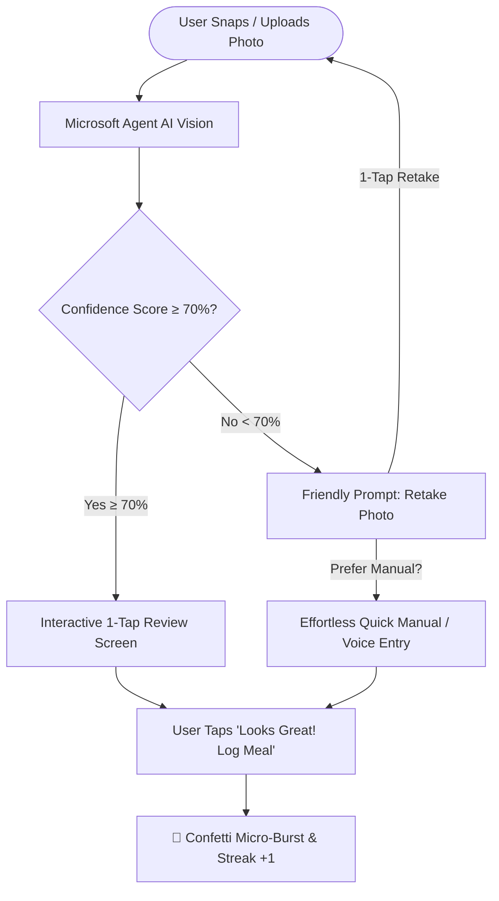
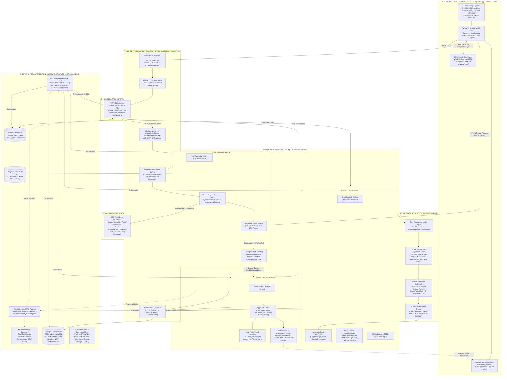
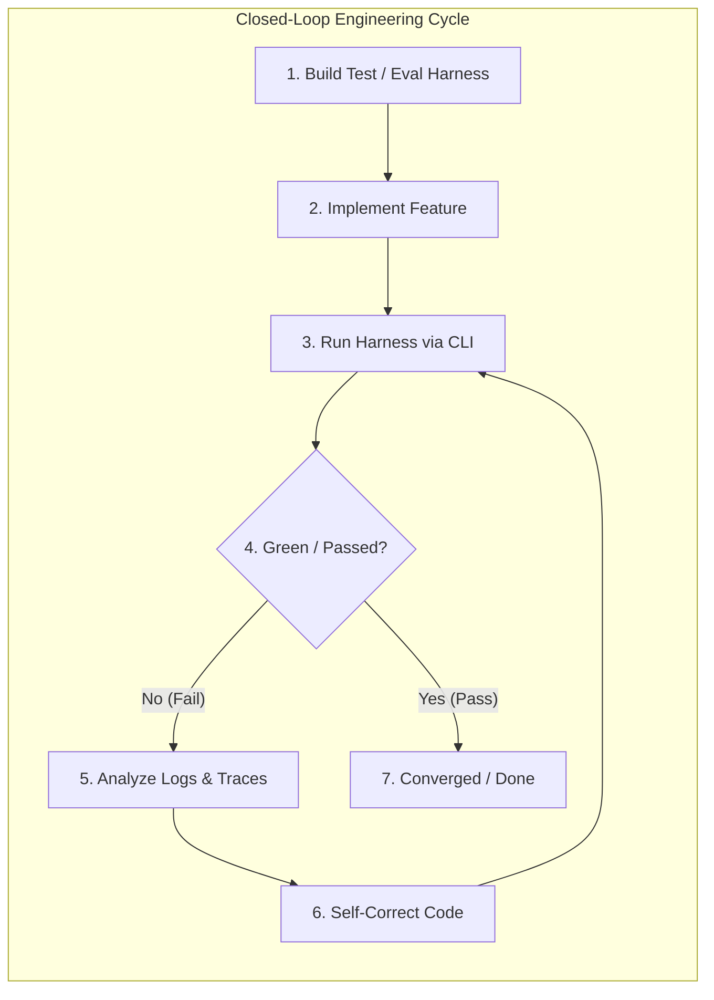
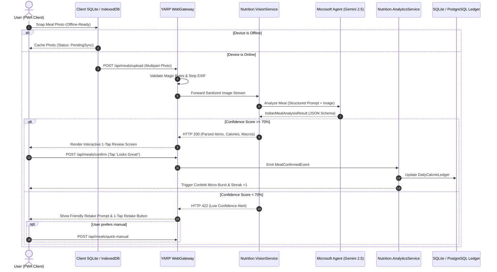
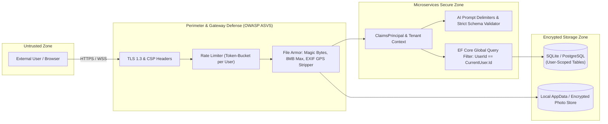
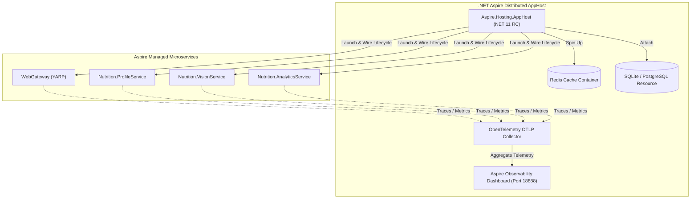

# Indian Diet Calorie & Weight Loss Tracker - Architecture & Implementation Skill
> **Specification Version**: `v1.4.0 (Production & Living SDD)`  
> **Classification**: Production Software Design Document (SDD), Architecture Blueprint & Clinical Rulebook  
> **Approved Domain Focus**: Indian Population, ICMR-NIN & WHO Medical Standards, Zero-Assumption Clinical Logic  
> **Tech Architecture**: .NET 11 RC (Exclusive, Zero Warnings, Pre-release Packages Enabled), Standalone Aspire.AppHost.Sdk 13.5.4+, Swappable SQLite V1 (PWA Offline-First), Multi-Provider AI Engine (Google Gemini 3.6-Flash / 3-Flash-Preview & Azure OpenAI gpt-5.6-luna), Podman 5.7.0 & Azure Container Apps, OWASP ASVS, Linear.app Design System (11 Modular UI Partials)  
> **Documentation Governance**: Mandatory `docs/sdd/*.md` deliverables, Multi-Dimensional Solution Architecture Mermaid Diagrams, Living Documentation Protocol for All Features & Bug Fixes  
> **Development Methodology**: Harness Engineering (`Aspire.Hosting.Testing`, Eval Harnesses), Git Branching & PR-Only Merge Mandate, Closed-Loop Feedback Cycles  

This skill guides the design, architecture, documentation, and development of a full-stack, enterprise-grade AI calorie tracking application tailored specifically for Indian dietary habits and sustainable weight loss. All implementations under this skill require creating and continuously synchronizing structured SDD markdown files.

### Mandatory .NET 11 & Package Governance Standard
1. **Exclusive .NET 11 Target**: All C# projects across the solution (`src/` and `tests/`) must strictly target `<TargetFramework>net11.0</TargetFramework>`. Do not dual-target with older versions like `.NET 10`.
2. **Pre-Release Package Policy**: All projects are authorized and instructed to use official Microsoft and third-party pre-release packages (e.g. `11.0.0-rc.*`, `Aspire.AppHost.Sdk 13.5.*`, `SQLitePCLRaw 3.*`) to ensure compatibility with .NET 11 previews.
3. **Zero-Warning & Zero-Vulnerability Build Standard**:
   - The solution must build with **0 Warnings and 0 Errors**.
   - Redundant implicit packages (e.g. `System.Net.Http.Json`) must be omitted.
   - Known transitive vulnerabilities (such as older `SQLitePCLRaw.lib.e_sqlite3 2.1.10`) must be explicitly resolved by referencing modern, patched versions (`SQLitePCLRaw.bundle_e_sqlite3 3.0.5+`).
   - Any compiler nullability warnings (e.g. `CS8602`) must be eliminated with defensive null-checks.
4. **Standalone Aspire AppHost SDK**: Aspire AppHost projects must use `<Project Sdk="Aspire.AppHost.Sdk/13.5.4">` directly instead of deprecated workload-dependent project SDKs.
5. **Mandatory Git Branching & PR-Only Merge Mandate**:
   - **Never commit directly to the `main` (or default production) branch**.
   - **Step 0 Pre-Flight Remote Fetch**: Before modifying any file, always fetch remote state:
     ```bash
     git fetch origin
     ```
   - **Independent Branching from Remote Main**: Always branch explicitly from `origin/main` for independent work:
     ```bash
     git checkout -b feature/<feature-name> origin/main
     git checkout -b fix/<defect-name> origin/main
     git checkout -b docs/<topic> origin/main
     ```
     *Strict Prohibition*: NEVER run `git checkout -b <branch>` from a local working branch without specifying `origin/main` (or the intended parent branch for stacked PRs). Doing so drags old pre-squash commits and causes severe merge conflicts on GitHub PRs.
   - **GitHub Stacked PR Workflow for Consecutive / Dependent Work**:
     When a new feature or task depends upon an active, unmerged Pull Request (Parent PR A on `feature/<parent-feature>`):
     1. Branch from the parent feature branch:
        ```bash
        git fetch origin
        git checkout -b feature/<child-feature> origin/feature/<parent-feature>
        ```
     2. Set the GitHub PR **Base branch** to `feature/<parent-feature>` (NOT `main`).
     3. Benefit from Stacked PR mechanics: GitHub isolates the child feature's diff, prevents commit pollution, and automatically retargets the child PR to `main` when the parent PR merges.
   - **Perform All Work in the Branch**: Apply targeted changes, run builds, execute test harnesses, and synchronize living documentation strictly within this branch.
   - **PR-Only Merge Enforcement**: Changes **MUST** be merged into `main` exclusively via a Pull Request (PR) after passing all CI validation checks and review gates. Direct commits or direct pushes to `main` are strictly forbidden.
6. **Mandatory End-to-End User Tier Validation**:
   - No refactoring, new feature implementation, or defect fix is complete without verifying actual product behavior across all 5 demo user tiers (`free@dietdost.app`, `basic@dietdost.app`, `premium@dietdost.app`, `admin.demo@dietdost.app`, `superadmin@dietdost.app` with password `DietDost@Demo2026!`).
   - Validate that tier quotas, feature gating (photo comparison, data export paywalls), and role permissions function accurately in the actual product with 0 runtime or console errors.
7. **Major Change Auto-Detection & Mandatory Living Synchronization**:
   - **Auto-Detection Requirement**: The agent MUST proactively evaluate whether the task introduces a **Major Change** (new layers, CQRS commands/queries, ports/adapters, database entities/tables, secret stores, security/debug environment gating, clinical algorithms, or tier quotas).
   - **Mandatory Actions**: Upon detecting any major change, the agent **MUST NOT** complete the turn without synchronizing:
     1. `README.md` (architecture diagram, technology stack, directory tree, test metrics).
     2. `docs/architecture/diagrams/*.mermaid` (all affected system and flow diagrams).
     3. `docs/sdd/*.md` (Living SDD system specifications, security threat matrix, and data models).
     4. `.agents/skills/*.md` (main skill and companion skills to preserve single source of truth).
     5. `docs/sdd/07_living_documentation_log.md` (append-only ledger entry).
     6. End-to-end verification across all 5 demo user tiers and automated test harnesses.
8. **Mandatory Confirmation & Zero-Unilateral-Decision Protocol (Strict Ask Rule)**:
   - In case of ANY ambiguity, doubt, conflicting options (such as whether a branch should be stacked vs independent, or resolving structural conflicts), **STOP and ask the user for confirmation** using interactive modal tools (`ask_question`).
   - **Never make unilateral decisions or assumptions** on git branching topology, architectural boundaries, or data contracts without user alignment.
9. **Mandatory Cross-Platform (Web & Mobile) Phased Migration & GitHub Stacked PR Protocol (Zero Big Bang)**:
   - Any architectural refactoring, Backend for Frontend (BFF) implementation, or cross-platform modernization across Web PWA, Android, and iOS **MUST NEVER be implemented as a big-bang release or massive PR**.
   - Work must proceed in small, platform-by-platform, independently reviewable increments following the **GitHub Stacked PR Protocol** as codified in [`docs/sdd/08_web_bff_clean_architecture_migration_plan.md`](file:///c:/Users/nikunj.banker/source/repos/diet-dost/docs/sdd/08_web_bff_clean_architecture_migration_plan.md).
   - Zero duplicate domain code guarantee: 100% of clinical calculations and food estimation must reside in `Nutrition.Domain` / `Nutrition.Application`. Zero domain math in client JavaScript or mobile code.
10. **Mandatory Platform-Specific CFT Documentation & Cross-Platform Parity Verification**:
    - Every platform capability (Web, Android, iOS) must have an associated Customer & Functional Acceptance Test (CFT) document in [`docs/cft/`](file:///c:/Users/nikunj.banker/source/repos/diet-dost/docs/cft/).
    - Before merging any feature or refactoring, contributors and agents must cross-check and execute the relevant CFT documents in [`docs/cft/`](file:///c:/Users/nikunj.banker/source/repos/diet-dost/docs/cft/) across all platforms:
      - [`cft_web_bff_and_clean_architecture.md`](file:///c:/Users/nikunj.banker/source/repos/diet-dost/docs/cft/cft_web_bff_and_clean_architecture.md) for Web PWA.
      - [`cft_mobile_mvp_cross_platform.md`](file:///c:/Users/nikunj.banker/source/repos/diet-dost/docs/cft/cft_mobile_mvp_cross_platform.md) for Android and iOS.
      - [`cft_cross_platform_functional_parity_matrix.md`](file:///c:/Users/nikunj.banker/source/repos/diet-dost/docs/cft/cft_cross_platform_functional_parity_matrix.md) to guarantee 100% mathematical, clinical, and feature parity between Web and Mobile.

---

## 1. Domain & Clinical Dietetics Specification (Indian Population)

### 1.1 Mandatory Dietitian Governance & Calculation Rules
Any implementation or agent operating under this skill **MUST** strictly adhere to the following clinical guidelines:

1. **Zero Assumption Rule (Never Guess Data)**:
   - **NEVER assume** missing user metrics (age, height, weight, activity, gender, health conditions).
   - **NEVER assume** hidden ingredients (e.g. amount of ghee, oil, sugar in tea). If a meal photo or log has ambiguities (e.g. unclear whether dal is cooked in 1 tsp or 2 tbsp ghee), the AI engine must prompt the user with a quick confirmation: *"Did this include ghee or extra oil tadka?"*
   - If user input is incomplete, pause calculations and prompt the user for the mandatory fields.
2. **Indian Medical Standards (ICMR-NIN 2024 Guidelines)**:
   - Follow the **Indian Council of Medical Research & National Institute of Nutrition (ICMR-NIN)** Dietary Guidelines for Indians (DGI) and Estimated Average Requirements (EAR).
   - Reference Adult: Indian Reference Male (65 kg), Indian Reference Female (55 kg).
   - **Cooking Oil Ceiling**: Maximum **20g to 25g visible cooking fat** (mustard, sunflower, groundnut, ghee) per person per day.
   - **Cereal-to-Pulse Ratio**: Maintain minimum **3:1 ratio** of cereals to pulses/millets to achieve complete essential amino acid profile (lysine + methionine complementation) in vegetarian diets.
3. **WHO (World Health Organization) Standards**:
   - **Asian-Indian BMI Cutoffs (WHO Expert Consultation for South Asians)**:
     - Underweight: `< 18.5 kg/m²`
     - Normal / Healthy: `18.5 – 22.9 kg/m²` *(Note: South Asians have elevated cardiometabolic risk above 23 kg/m²)*
     - Overweight: `23.0 – 24.9 kg/m²`
     - Obese Class I: `25.0 – 29.9 kg/m²`
     - Obese Class II: `>= 30.0 kg/m²`
   - **WHO Sodium Limits**: Maximum **5g salt/day (< 2,000 mg sodium/day)**. The engine must actively flag high-sodium Indian foods (achaar/pickles, papads, namkeen, processed chutneys).
   - **WHO Free Sugar Guidelines**: **< 5% of total caloric intake** (< 25g/day). The engine must flag Indian sweets (mithai), sweetened chai/filter coffee, and packaged beverages.
   - **WHO Trans Fat Elimination**: **< 1% of total energy**. Strictly flag vanaspati, dalda, and reused deep-frying oils in street snacks (samosas, bhaturas, pakodas).
4. **Mandatory Safety Thresholds & Contraindications**:
   - **Starvation Safety Floor**: Caloric target must **NEVER drop below 1,200 kcal/day for women or 1,500 kcal/day for men** without direct physician supervision.
   - **Maximum Safe Deficit**: Deficit must **NEVER exceed 1,000 kcal/day** or a rate of **> 1 kg (2.2 lbs) loss per week** to prevent acute cholelithiasis (gallstones), metabolic slowdown, and muscle wasting.
   - **Clinical Contraindications**: If the user reports Diabetes (on insulin/secretagogues), Chronic Kidney Disease (CKD), Pregnancy/Lactation, or Gout, block automated aggressive deficit planning and require medical practitioner consultation.

### 1.2 BMR & TDEE Formulae (Calibrated for South Asian Lean Mass)
- **Mifflin-St Jeor Baseline**:
  - **Men**: $BMR = (10 \times \text{weight in kg}) + (6.25 \times \text{height in cm}) - (5 \times \text{age}) + 5$
  - **Women**: $BMR = (10 \times \text{weight in kg}) + (6.25 \times \text{height in cm}) - (5 \times \text{age}) - 161$
- **Total Daily Energy Expenditure (TDEE)**:
  - Sedentary (desk job, < 5,000 steps): $BMR \times 1.2$
  - Lightly Active (1-3 days light exercise or 5,000–7,500 steps): $BMR \times 1.375$
  - Moderately Active (3-5 days moderate exercise or 7,500–10,000 steps): $BMR \times 1.55$
  - Very Active (6-7 days heavy training or > 12,000 steps): $BMR \times 1.725$
- **Target Calorie Deficit**:
  - Moderate Sustainable Pace: 0.5 kg/week = $-500\text{ kcal/day}$
  - Steady Pace: 0.25 kg/week = $-250\text{ kcal/day}$
  - Upper Safe Limit: 0.75 kg/week = $-750\text{ kcal/day}$

### 1.3 Indian Macronutrient Distribution
- **Protein Target**: $1.2\text{g to } 1.6\text{g per kg of ideal body weight}$ (25–30% of total calories). 
  - *Indian Veg Sources*: Soya chunks (52% protein), Paneer, Tofu, Sprouted Moong, Besan/Chana, Low-fat curd/Greek yogurt, Whey/Plant isolate.
  - *Non-Veg Sources*: Eggs, Chicken breast, Rohu/Katla/Fish, Prawns.
- **Complex Carbohydrates**: 40–45% of total calories (Jowar, Bajra, Ragi, Whole wheat phulka, Brown/Hand-pounded rice).
- **Healthy Fats**: 25–30% of total calories, accounting for visible cooking oils.

### 1.4 Mandatory User Intake Questionnaire
The application must collect every parameter before calculating targets. Under the **Zero Assumption Rule**, if any metric or medical field is missing, the system must halt and prompt the user:

1. **Biological Sex** (Male / Female)
2. **Age** (Years)
3. **Current Height** (cm or ft/inches)
4. **Current Weight** (kg or lbs)
5. **Target Weight** (kg) & Desired Pace (0.25 kg, 0.5 kg, or 0.75 kg/week)
6. **Daily Activity Level** (Sedentary, Light, Moderate, High)
7. **Dietary Preference** (Pure Veg, Lacto-Veg, Lacto-Ovo, Vegan, Non-Veg)
8. **Regional Cuisine Preference** (North Indian, South Indian, Gujarati, Maharashtrian, Bengali, etc.)
9. **Diagnosed Illnesses / Health Conditions (MANDATORY)**:
   - Options: None / Type 2 Diabetes / Pre-diabetes / Type 1 Diabetes / Hypertension (High BP) / Hypothyroidism / Hyperthyroidism / Dyslipidemia (High Cholesterol) / Fatty Liver (NAFLD) / PCOS-PCOD / Hyperuricemia (Gout) / Chronic Kidney Disease (CKD) / GERD-Acidity.
10. **Current Medications & Dosages (MANDATORY)**:
    - Examples: Metformin, Insulin, Glimepiride, Amlodipine, Telmisartan, Atorvastatin, Levothyroxine (Thyronorm/Eltroxin), Oral Contraceptives, None.
    - *Clinical Directive*: Prescribing calorie deficits or macro shifts without medication awareness risks acute hypoglycemia (e.g. on insulin/sulfonylureas) or hyperkalemia (e.g. on ACE inhibitors with potassium-rich salt substitutes).
11. **Timezone (MANDATORY for Circadian Day-Boundary)**:
    - Standard IANA timezone identifier (e.g. "Asia/Kolkata", "UTC", "Asia/Dubai", "Europe/London", "America/New_York").
    - Auto-detected via browser `Intl.DateTimeFormat().resolvedOptions().timeZone` with user confirmation/override in profile.
    - Essential for calculating the user's true local day window, circadian eating windows, and preventing timezone-drift in daily calorie ledgers.

---

### 1.5 Clinical Matrix: Illness & Medication Adjustments & Food Prescriptions

The engine applies automated clinical adjustments to caloric targets, macronutrient splits, and AI food suggestions based on diagnosed illnesses and medications:

| Condition & Common Medications | Clinical Calculation Adjustments | Therapeutic Indian Foods to Recommend | Contraindicated / Harmful Foods | Critical Medication-Food Interactions |
|---|---|---|---|---|
| **Diabetes / High Blood Sugar**<br>*(Metformin, Insulin, Glimepiride, Gliclazide, Dapagliflozin)* | • Cap net carbohydrates to **35%–40%** of total calories.<br>• Max meal Glycemic Load (GL) < 10.<br>• **NO crash deficits** (>500 kcal); distribute carbs evenly to avert **hypoglycemia**. | • Whole moong dal, Methi (fenugreek) paratha/dana.<br>• Karela, Jamun seed powder.<br>• Barley (Jau) rotis, Besan chilla.<br>• Pre-meal raw cucumber/kakdi salad (viscous fiber). | • Polished white rice, Maida, Poha, Sabudana.<br>• Jaggery / Gur *(GI 84! Myth: Gur is not safe for diabetes)*.<br>• Fruit juices, sweetened chai, packaged diabetic biscuits with maltodextrin. | If on **Insulin or Sulfonylureas (Glimepiride)**: Never skip meals or do extended intermittent fasting. Keep 15g fast-acting glucose accessible. |
| **Hypertension / High BP**<br>*(Amlodipine, Telmisartan, Ramipril, Atenolol)* | • Stricter sodium ceiling: **< 1,500 mg sodium/day** (< 3.75g salt), lower than general WHO limit.<br>• Target Potassium: 3,500–4,700 mg/day (DASH principle). | • Lauki (bottle gourd), Torai (ridge gourd), Palak.<br>• Fresh unsalted chaas with roasted jeera.<br>• Garlic (lehsun - allicin), Flaxseed powder.<br>• Potassium-rich green leafy subzis. | • Achaar (pickles - salt reservoir), Papad, Namkeen, Sev.<br>• Baking soda in dhoklas, idlis, and bhaturas.<br>• Packaged soup cubes, Chinese soy sauce, Ajinomoto. | If taking **ACE inhibitors (Ramipril) or ARBs (Telmisartan)**: Prohibit potassium-based salt substitutes (Lona/diet salt) and excessive coconut water to prevent **fatal hyperkalemia**. |
| **Hypothyroidism**<br>*(Levothyroxine: Thyronorm, Eltroxin)* | • **Metabolic Factor Reduction**: Reduce baseline TDEE by **10% to 15%** to offset suppressed metabolic rate and avoid weight loss plateaus. | • Brazil nuts (1/day for Selenium), Sunflower seeds.<br>• Cooked pumpkin seeds (Zinc), Moringa / Drumstick.<br>• Iodized salt within sodium limits. | • **Raw goitrogens**: Raw cabbage, raw cauliflower, raw broccoli, raw radish (must be thoroughly cooked).<br>• High-dose unfermented soy (soya milk, large quantities of soy chunks). | **Mandatory Timing Rule**: Levothyroxine must be taken on an empty stomach with plain water. Prohibit all breakfast, tea, high-fiber bran, iron/calcium supplements, or walnuts within **60 minutes** of dose. |
| **High Cholesterol / Dyslipidemia**<br>*(Atorvastatin, Rosuvastatin)* | • Saturated fat capped to **< 7% of total calories**.<br>• Minimum soluble fiber: 10g–15g/day. | • Isabgol (psyllium husk - binds bile acids), Steel-cut oats.<br>• Walnuts, Chia seeds, Methi seeds.<br>• Cold-pressed mustard oil in strict moderation (max 15ml/day). | • Vanaspati, Dalda, Palm oil.<br>• Excessive Ghee (> 1 tsp/day), Full-fat dairy/cream, Khoya/Mawa.<br>• Bakery puffs, biscuits, fried street snacks. | Grapefruit/Pomelo (Chakotra) strictly prohibited with Statins (inhibits CYP3A4 metabolism). |
| **PCOS / PCOD**<br>*(Metformin, Inositol)* | • High protein: **1.3g–1.5g/kg body weight**.<br>• Anti-inflammatory, low-GI carb focus to improve insulin sensitivity. | • Spearmint tea (lowers androgenic free testosterone).<br>• Haldi-ginger infusion, Cinnamon powder.<br>• Sprouted lentils, Tofu, Paneer, Pumpkin seeds. | • Refined flours, dairy desserts, sugary milk tea, ultra-processed packaged snacks. | Speeds insulin sensitization when combined with post-meal 10-minute brisk walks. |
| **Hyperuricemia / Gout**<br>*(Febuxostat, Allopurinol)* | • Hydration mandate: **3.5L to 4L water/day**.<br>• Avoid extreme low-carb/keto diets (ketones compete with uric acid excretion). | • Low-fat curd, Fresh cherries, Lemon water (alkalizes urine), Cucumber, Lauki, Oats. | • High-purine foods: Organ meats, Red meat, Sardines/Mackerel.<br>• High yeast extracts, High fructose corn syrup.<br>• Limit concentrated pulses (chana/rajma) to 1 small katori. | Avoid acute caloric deprivation which triggers uric acid spikes and gout flares. |
| **Fatty Liver (NAFLD)**<br>*(Saroglitazar, Vitamin E)* | • Gradual weight loss pace capped at **0.5 kg to 0.75 kg/week**.<br>• Absolute zero added fructose/refined sugars. | • Amla (Indian gooseberry - antioxidant), Black coffee (hepatoprotective), Green leafy vegetables, Turmeric. | • High-fructose corn syrup, Fruit juice concentrates, Mango/Chikoo in excess, Fried gravies. | Rapid weight loss (>1.5 kg/week) can paradoxically worsen hepatic steatohepatitis. |


---

## 2. AI Engine: Multi-Provider Architecture (Google Gemini & Azure OpenAI)

### 2.1 Strategy + Factory Multi-Provider Architecture
The AI Vision & Dietitian subsystem implements a decoupled Strategy + Factory pattern allowing seamless swapping and cascading between AI model families without altering application logic or API contracts:

- **Analysis Provider Abstraction (`IAiFoodAnalysisProvider`)**:
  ```csharp
  public interface IAiFoodAnalysisProvider
  {
      Task<IndianMealAnalysisResult> AnalyzePhotoAsync(
          Stream imageStream, 
          string mimeType, 
          string? mealType, 
          UserProfile? profile, 
          IReadOnlyList<UserCorrectionRecord>? corrections, 
          CancellationToken ct = default);

      Task<IndianMealAnalysisResult> AnalyzeTextAsync(
          string description, 
          string? mealType, 
          UserProfile? profile, 
          IReadOnlyList<UserCorrectionRecord>? corrections, 
          CancellationToken ct = default);
  }
  ```

- **Runtime Dynamic Factory (`AiFoodProviderFactory`)**:
  Resolves the active provider at runtime based on configuration (`AI:Provider`):
  - `"GoogleAI"` or `"Gemini"` $\rightarrow$ `GoogleGeminiProvider`
  - `"AzureOpenAI"` $\rightarrow$ `AzureOpenAiProvider`
  - Fallback / Mock provider for offline development.

- **Unified Configuration Schema (`AiProviderOptions`)**:
  Supports isolated configuration blocks for each model family, model transparency toggle, and fallback chain:
  ```json
  {
    "AI": {
      "Provider": "GoogleAI",
      "ShowModelDetails": true,
      "GoogleAI": {
        "ModelId": "gemini-3.6-flash",
        "FallbackModelId": "gemini-3.7-flash",
        "ApiKey": "${GOOGLE_AI_KEY}",
        "MaxOutputTokens": 8192,
        "Temperature": 0.2
      },
      "AzureOpenAI": {
        "Endpoint": "https://my-resource.openai.azure.com/",
        "ApiKey": "${AZURE_OPENAI_KEY}",
        "DeploymentName": "gpt-5.6-luna",
        "MaxTokens": 4096,
        "Temperature": 0.2
      }
    }
  }
  ```

### 2.2 Google Gemini Provider & Cascade Fallback Chain
1. **Active Production Endpoints**:
   - **Primary Model**: `gemini-3.6-flash` (balanced reasoning, high throughput, low latency).
   - **High-Speed Vision Alternative**: `gemini-3-flash-preview`.
   - **Automated Fallback**: `gemini-3.7-flash`.
2. **Resilience & Key Resolution**:
   - `ResolveApiKey` traverses `AI:GoogleAI:ApiKey`, `AI:ApiKey`, `Gemini:ApiKey`, `AI__ApiKey`, `GEMINI_API_KEY`, and `GOOGLE_AI_KEY`, discarding masked values (`*******`).
   - Generous timeout parameters: 30s for multimodal image analysis, 20s for textual meal analysis.
   - Sets `max_output_tokens: 8192` to avoid truncation caused by reasoning/thought tokens.
   - Thought-parts traversal handles modern thinking-model response objects seamlessly.

### 2.3 Azure OpenAI Provider (gpt-5.6-luna)
1. **Client Integration**:
   - Uses the official `OpenAI.Responses.ResponsesClient` / `OpenAI.Chat.ChatClient` with direct Azure endpoint binding.
   - Utilizes multimodal input items (`ChatMessageContentItem.CreateImageContentItem`) with base64 data URIs.
2. **Structured Outputs**:
   - Enforces strict JSON Schema response formats (`ChatResponseFormat.CreateJsonSchemaFormat`).

### 2.4 Resilient JSON Parsing & Boundary Extraction (`AiJsonParser`)
1. **Fence & Boundary Extraction**:
   - Automatically cleans raw LLM output by locating the first `{` and last `}` braces, safely ignoring auxiliary thinking chatter or markdown backticks (` ```json ... ``` `).
2. **Flexible Key Traversal**:
   - Tolerates schema variations from different SLMs/LLMs, reading dish items from `identifiedItems`, `items`, `dishes`, or `foodItems`.
3. **Automatic Mathematical Aggregation**:
   - If the AI model omits top-level macro totals, `AiJsonParser` computes the exact mathematical sum across all identified items:
     - `totalCalories = sum(item.calories)`
     - `totalProteinGrams = sum(item.proteinGrams)`
     - `totalCarbsGrams = sum(item.carbsGrams)`
     - `totalFatGrams = sum(item.fatGrams)`
     - `totalFiberGrams = sum(item.fiberGrams)`
     - `totalSugarGrams = sum(item.sugarGrams)`
     - `totalSodiumMg = sum(item.sodiumMg)`

### 2.5 Dynamic Food-Based Dish Name Synthesis & Inline Title Editing
1. **Never Return Generic Titles**:
   - Prompt directive strictly mandates: *"DISH NAME SYNTHESIS (NEVER USE GENERIC TITLES): In 'dishName', generate a natural, descriptive name reflecting the exact foods on the plate... NEVER return generic titles like 'Custom Indian Meal' or 'Plate Photo'!"*
2. **Server-Side & Client-Side Synthesis (`SynthesizeMealDishName`)**:
   - Detects canonical Indian food pairings (e.g. *Phulkas & Dal Tadka*, *Masala Dosa & Sambar*, *Idli Sambar*, *Kanda Poha & Masala Chai*, *North Indian Thali*).
   - Cleans item names (removing portion numbers like "2" or "(150g)").
   - Generates elegant composite titles (e.g., *"Whole Wheat Phulkas with Yellow Moong Dal Tadka & Bhindi Masala"*).
3. **Editable Title with Custom Title Persistence**:
   - Editable `#review-dish-name-input` on the review modal.
   - If the user renames the meal, their custom title is strictly preserved (`_hasUserRenamedTitle = true`). If cleared, it gracefully reverts to the synthesized title.

### 2.6 Textual Food AI Search & Single Item Updates
1. **Dual Ingestion Endpoints**:
   - `POST /api/meals/upload`: Multimodal vision photo analysis.
   - `POST /api/meals/analyze-text`: Full natural language meal parsing (e.g. *"2 rotis with yellow dal and cucumber salad"*).
   - `POST /api/meals/estimate-item`: Per-item single dish estimation with user clinical profile and learned memory context.
2. **In-Screen Meal Search by Text Box**:
   - Dedicated search bar above the item list in `review-modal.html` with instant suggest chips (`🫓 2 Phulkas + Ghee`, `🥣 1 Bowl Dal Tadka`, `🥬 Palak Paneer`, `🥛 1 Cup Curd`, `🥒 Cucumber Salad`).
   - Searching or describing dishes triggers `analyzeMealText` and merges items directly into the current meal.
3. **Inline Per-Item AI Refinement & Live Recalculation**:
   - Inline `⚡ AI` button on each item row for targeted nutrition re-estimation.
   - Editing an item's title or portion auto-triggers textual AI re-estimation with loading indicator (`🤖 AI Searching...`).
   - Live recalculation updates all 6 macros, pulses the Top Aggregated Nutrition Summary Bar, re-evaluates WHO flags (Sodium > 800mg, Sugar > 15g), and regenerates ICMR-NIN dietitian advice.

### 2.7 Model Detection Transparency Badge
- Whenever `"AI:ShowModelDetails": true` is enabled in configuration, the analysis result includes `detectedByModel` (e.g. `"Google Gemini (gemini-3.6-flash)"` or `"Azure OpenAI (gpt-5.6-luna)"`).
- The review modal displays a sleek, Obsidian violet badge (`🤖 Analyzed by gemini-3.6-flash • 95% confidence`) providing total AI transparency to the user.

### 2.8 Indian Meal Extraction JSON Contract
```json
{
  "$schema": "http://json-schema.org/draft-07/schema#",
  "title": "IndianMealAnalysisResult",
  "type": "object",
  "properties": {
    "mealType": { "type": "string", "enum": ["Breakfast", "Lunch", "Snack", "Dinner"] },
    "dishName": { "type": "string" },
    "detectedByModel": { "type": "string", "description": "Active model identifier e.g. gemini-3.6-flash" },
    "identifiedItems": {
      "type": "array",
      "items": {
        "type": "object",
        "properties": {
          "name": { "type": "string" },
          "hindiOrRegionalName": { "type": "string" },
          "quantity": { "type": "number", "description": "Portion multiplier, default 1.0" },
          "estimatedPortion": { "type": "string" },
          "grams": { "type": "number" },
          "calories": { "type": "number" },
          "proteinGrams": { "type": "number" },
          "carbsGrams": { "type": "number" },
          "fatGrams": { "type": "number" },
          "fiberGrams": { "type": "number" },
          "sugarGrams": { "type": "number" },
          "sodiumMg": { "type": "number" },
          "cookingMediumEstimate": { "type": "string", "description": "e.g., Ghee on roti, mustard oil tadka" },
          "confidenceScore": { "type": "number" }
        },
        "required": ["name", "estimatedPortion", "grams", "calories", "proteinGrams", "carbsGrams", "fatGrams"]
      }
    },
    "totalCalories": { "type": "number" },
    "totalProteinGrams": { "type": "number" },
    "totalCarbsGrams": { "type": "number" },
    "totalFatGrams": { "type": "number" },
    "totalFiberGrams": { "type": "number" },
    "totalSugarGrams": { "type": "number" },
    "totalSodiumMg": { "type": "number" },
    "whoComplianceFlags": {
      "type": "array",
      "items": { "type": "string" },
      "description": "e.g. High sodium alert (>800mg in meal), High saturated fat, Sugar > 15g"
    },
    "medicationWarnings": {
      "type": "array",
      "items": { "type": "string" },
      "description": "e.g. 'Do not consume potassium salt with Telmisartan', 'High carb load risk on Metformin'"
    },
    "conditionSpecificAdvice": { "type": "string" },
    "dietitianAdvice": { "type": "string" }
  },
  "required": ["mealType", "dishName", "identifiedItems", "totalCalories", "totalProteinGrams", "totalCarbsGrams", "totalFatGrams"]
}
```

### 2.4 Frictionless Meal Calorie Extraction Flow & Confidence Gating (≥ 70%)

The meal logging experience must be **ultra-fast, engaging, and frictionless** so users never feel bored or fatigued by daily tracking:



1. **One-Tap Instant Photo Ingestion**:
   - Single tap on the camera icon or drag-and-drop on desktop.
   - Instant optimistic shimmer feedback: *"Scanning your delicious meal with AI..."*
2. **Confidence Score Threshold Gate (≥ 70%)**:
   - The Microsoft Agent calculates an `overallConfidenceScore` (0.0 to 1.0) based on visual clarity, dish boundaries, and portion visibility.
   - **Pass (Confidence ≥ 0.70)**: Automatically populates items, calories, and macros in the review card with zero typing required.
   - **Fail (Confidence < 0.70)**: 
     - Explains the issue in a friendly, constructive way: *"A bit too shadowy or blurry to count the rotis accurately! 📸"*
     - Provides clear visual tips: *"Tip: Center the plate under room light and keep the katoris visible."*
     - Offers a prominent **1-Tap 'Retake Photo'** button.
3. **Interactive 1-Tap Micro-Adjustments (Never Force Re-typing)**:
   - **Quantity Steppers**: `[ − 2 Phulkas + ]` (increment/decrement with one tap).
   - **Portion Size Pills**: `[ Half Katori (75g) | Regular (150g) | Full (250g) ]`.
   - **Hidden Cooking Fat Toggles**: Quick pill chips for `[+ Ghee Smear (+45 kcal)]`, `[Extra Oil Tadka (+60 kcal)]`, `[Dry / Oil-Free (0 kcal)]`, `[With Sugar in Chai]`.
4. **Failsafe Option: Ultra-Fast Quick Manual & Voice Logging**:
   - If a photo cannot be taken or the user is eating in low light:
     - ⚡ **Instant Indian Smart Search**: Predictive auto-suggest covering 1,500+ Indian dishes with instant portion estimates (e.g. typing *"Moong"* instantly suggests *"1 Katori Moong Dal Tadka (160 kcal)"*).
     - 🎙️ **One-Tap Voice Logger**: *"Had 2 bajra rotis with methi subzi and half cup curd"* $\rightarrow$ parsed instantly by the Microsoft Agent into structured items.
     - 🔢 **Direct Quick Calorie Add**: For unlisted items or quick logging on the go: *"Quick Add: 250 kcal (Evening Snack)"*.

---

## 3. Storage Architecture: Decoupled, SQLite V1 & PWA Offline-First

### 3.1 Swappable Persistence Pattern (Clean Architecture)
The application strictly abstracts database access behind repository and unit-of-work abstractions. **No domain logic depends on EF Core or specific database engines.**
- **Repository Interface**: `IRepository<TEntity>`, `IUnitOfWork`
- **Database Engine Switch**: Controlled entirely via configuration (`Database:Provider = "Sqlite" | "PostgreSql" | "SqlServer"`).

```csharp
public static IServiceCollection AddStorageInfrastructure(this IServiceCollection services, IConfiguration configuration)
{
    var provider = configuration["Database:Provider"] ?? "Sqlite";
    
    switch (provider.ToLowerInvariant())
    {
        case "sqlite":
            services.AddDbContext<DietTrackerDbContext>(options =>
                options.UseSqlite(configuration.GetConnectionString("DefaultConnection") 
                    ?? "Data Source=diettracker.db"));
            break;
            
        case "postgresql":
            services.AddDbContext<DietTrackerDbContext>(options =>
                options.UseNpgsql(configuration.GetConnectionString("PostgreSqlConnection")));
            break;

        case "sqlserver":
            services.AddDbContext<DietTrackerDbContext>(options =>
                options.UseSqlServer(configuration.GetConnectionString("SqlServerConnection")));
            break;
    }

    services.AddScoped(typeof(IRepository<>), typeof(EfRepository<>));
    services.AddScoped<IUnitOfWork, EfUnitOfWork>();
    return services;
}
```

### 3.2 Progressive Web App (PWA) & Mobile Browser Offline Storage
When accessed from mobile browsers (Chrome on Android, Safari on iOS) or installed as a PWA:
1. **Client-Side Storage**:
   - Uses **SQLite compiled to WebAssembly with OPFS (Origin Private File System)** via `sqlite3-wasm` or browser **IndexedDB** (`idb-keyval` / Dexie.js).
2. **Offline-First Synchronization**:
   - User can snap food photos and log meals with zero internet connection.
   - Offline logs are queued locally with state: `SyncStatus: "PendingSync"`.
   - As soon as network connectivity is detected via `navigator.onLine` / Service Worker Background Sync API:
     - Photos and cached logs are securely synced to the backend ASP.NET Core service.
     - Backend reconciles with SQLite/Postgres and updates the user's daily ledger.

### 3.3 Universal UTC Temporal Storage & Timezone Normalization Standard
1. **Universal UTC Persistence Rule**:
   - **ALL timestamps stored in the database MUST be in UTC format (`DateTimeKind.Utc`).**
   - No local machine time or ambiguous offsets are ever written to SQLite, PostgreSQL, or SQL Server.
   - All EF Core entity configurations and model builders MUST implement universal UTC value converters:
     ```csharp
     var utcConverter = new ValueConverter<DateTime, DateTime>(
         v => v.Kind == DateTimeKind.Utc ? v : v.ToUniversalTime(),
         v => DateTime.SpecifyKind(v, DateTimeKind.Utc)
     );
     var nullableUtcConverter = new ValueConverter<DateTime?, DateTime?>(
         v => !v.HasValue ? null : (v.Value.Kind == DateTimeKind.Utc ? v.Value : v.Value.ToUniversalTime()),
         v => !v.HasValue ? null : DateTime.SpecifyKind(v.Value, DateTimeKind.Utc)
     );
     ```
2. **User Circadian Local Day Resolution**:
   - The user's circadian day begins and ends according to their configured local `Timezone` in their `UserProfile` (defaulting to `"Asia/Kolkata"` / IST).
   - Aggregations (daily ledgers, 1D/7D/30D/90D/365D trends, food diaries) bucket events by resolving:
     `var localDate = DateOnly.FromDateTime(TimeZoneInfo.ConvertTimeFromUtc(meal.LoggedAt, userTimeZoneInfo));`
   - This ensures a late-night meal logged at 11:30 PM IST (18:00 UTC) belongs to the correct circadian day, while 1:00 AM IST (19:30 UTC previous day) belongs to the next day.

### 3.4 Generic Date Instruction for Architecture & Development
Whenever designing, modifying, or querying date/time fields across the system:
1. **API Ingestion**: Always accept ISO-8601 strings (e.g. `2026-09-18T18:00:00Z` or with local offset). Immediately normalize to UTC (`.ToUniversalTime()`) before domain processing.
2. **Database Queries**: Date range queries must either:
   - Compute the UTC start and end bounds corresponding to the user's local day range:
     `[TimeZoneInfo.ConvertTimeToUtc(startOfDayLocal, userTz), TimeZoneInfo.ConvertTimeToUtc(endOfDayLocal, userTz)]`
   - Or evaluate records against user's converted local date in domain memory.
3. **PWA / Client Display**: Timestamps sent to the client in ISO-8601 UTC format are localized by the browser via standard `toLocaleDateString()` and `toLocaleTimeString()` or explicit user timezone formatters.
4. **Timezone Cross-Platform Interoperability**: Support both IANA IDs (e.g. `Asia/Kolkata`, `America/New_York`) and Windows IDs (e.g. `India Standard Time`) with safe fallbacks (`TimeZoneInfo.TryConvertIanaIdToWindowsId`).

### 3.5 Image Fallback & Placeholder Asset Standard
1. **Zero Broken Image Rule**:
   - An application must **NEVER display a broken image icon** or empty alt text if an image URL fails to load (due to missing static files, 404s, slow network, corrupted blobs, or offline PWA mode).
2. **Cohesive Design System Integration**:
   - All placeholders must be custom-crafted SVG vector graphics styled in Obsidian Dark (`#08090a`, `#14171a`, `#5e6ad2`, `#27c380`) adhering to the Linear.app design aesthetic.
   - Dedicated assets:
     - `/assets/placeholder-meal.svg`: Obsidian dark thali plate silhouette with neon glowing rim and cutlery.
     - `/assets/placeholder-progress.svg`: Obsidian silhouette with body contours and framing grid.
3. **Multi-Layered Fallback Defense**:
   - **Inline HTML**: `onerror="this.onerror=null; this.src='/assets/placeholder-meal.svg';"`
   - **Global Event Capturing**: `window.addEventListener('error', (e) => { ... }, true)` with `useCapture: true` in `main.js` to catch any non-bubbling image error anywhere in the DOM.
   - **Lightbox / Zoom Protection**: Modal lightbox inspectors must reset their images and fall back gracefully if source image load fails.

---

## 4. Technical Architecture: .NET 11 RC & Aspire Topology

### 4.1 Master Solution Architecture Blueprint
The architecture spans five coordinated dimensions: **UI/UX Design System**, **Application Microservices**, **OWASP Security Boundary**, **DevOps & Observability**, and **Clinical Dietetics Functional Engine**:



### Aspire `AppHost` Orchestration Topology (`src/Nutrition.AppHost/Program.cs`)
```csharp
var builder = DistributedApplication.CreateBuilder(args);

// Resolve AI Provider Keys & Configuration
var geminiKey = builder.Configuration["AI:GoogleAI:ApiKey"]
    ?? builder.Configuration["AI:ApiKey"] 
    ?? builder.Configuration["Gemini:ApiKey"]
    ?? Environment.GetEnvironmentVariable("AI__GoogleAI__ApiKey")
    ?? Environment.GetEnvironmentVariable("AI__ApiKey")
    ?? Environment.GetEnvironmentVariable("GEMINI_API_KEY");

var aiProvider = builder.Configuration["AI:Provider"] 
    ?? Environment.GetEnvironmentVariable("AI__Provider") 
    ?? "GoogleAI";

var azureKey = builder.Configuration["AI:AzureOpenAI:ApiKey"]
    ?? Environment.GetEnvironmentVariable("AI__AzureOpenAI__ApiKey");
var azureEndpoint = builder.Configuration["AI:AzureOpenAI:Endpoint"]
    ?? Environment.GetEnvironmentVariable("AI__AzureOpenAI__Endpoint");
var azureDeployment = builder.Configuration["AI:AzureOpenAI:DeploymentName"]
    ?? Environment.GetEnvironmentVariable("AI__AzureOpenAI__DeploymentName")
    ?? "gpt-5.6-luna";

// Web Gateway hosting the Linear.app PWA and microservice endpoints
var webGateway = builder.AddProject<Projects.Nutrition_WebGateway>("web-gateway")
       .WithHttpEndpoint(port: 5240, isProxied: false)
       .WithExternalHttpEndpoints()
       .WithEnvironment("Database__Provider", "Sqlite")
       .WithEnvironment("ConnectionStrings__DefaultConnection", "Data Source=diettracker.db")
       .WithEnvironment("AI__Provider", aiProvider)
       .WithEnvironment("AI__GoogleAI__ApiKey", geminiKey ?? "")
       .WithEnvironment("AI__ApiKey", geminiKey ?? "")
       .WithEnvironment("AI__GoogleAI__ModelId", builder.Configuration["AI:GoogleAI:ModelId"] ?? builder.Configuration["AI:ModelId"] ?? "gemini-3-flash-preview")
       .WithEnvironment("AI__GoogleAI__FallbackModelId", builder.Configuration["AI:GoogleAI:FallbackModelId"] ?? builder.Configuration["AI:FallbackModelId"] ?? "gemini-3.6-flash");

if (!string.IsNullOrWhiteSpace(azureKey))
{
    webGateway.WithEnvironment("AI__AzureOpenAI__ApiKey", azureKey);
}
if (!string.IsNullOrWhiteSpace(azureEndpoint))
{
    webGateway.WithEnvironment("AI__AzureOpenAI__Endpoint", azureEndpoint);
}
if (!string.IsNullOrWhiteSpace(azureDeployment))
{
    webGateway.WithEnvironment("AI__AzureOpenAI__DeploymentName", azureDeployment);
}

builder.Build().Run();
```

### 4.2 Telemetry, Tracing & Non-PII Diagnostic Logging
1. **HTTP Payload Telemetry Middleware (`HttpPayloadTelemetryMiddleware`)**:
   - Inspects and records inbound request bodies and outbound responses to OpenTelemetry spans (`http.request.body`, `http.response.body`).
   - Automatically sanitizes PII, password hashes, and large image byte blobs.
2. **GenAI Semantic Spans (`NutritionTelemetry.ActivitySource`)**:
   - Standardized semantic tags: `gen_ai.system` (`"google.gemini"` or `"azure.openai"`), `gen_ai.request.model`, `gen_ai.response.model`, `gen_ai.usage.prompt_tokens`, `gen_ai.usage.completion_tokens`.
3. **Database Schema-Safe Migrations & Continuous Memory**:
   - `PRAGMA table_info` checks verify column existence dynamically before issuing `ALTER TABLE` commands.
   - EF Core collection `ValueComparer`s prevent false dirty-tracking exceptions on mutable lists.
   - `UserCorrectionRecord` entity stores manual user item corrections, building user-specific adaptive memory.

### 4.3 Production DevOps & Cloud Deployment (Podman & Azure Container Apps)
1. **Container Engine: Podman 5.7.0 (WSL2 Backend)**:
   - Rootless, daemonless OCI container management.
   - Multi-stage Dockerfile targeting `mcr.microsoft.com/dotnet/sdk:11.0` and `mcr.microsoft.com/dotnet/aspnet:11.0`.
2. **Azure Container Apps (ACA) & Azure Container Registry (ACR)**:
   - Serverless container execution with automated scaling, ingress routing, and health probes.
   - Native ACR image push via Podman credentials.
3. **Custom Domain & Managed TLS 1.3**:
   - Custom domain binding with free DigiCert managed TLS 1.3 certificates and automatic renewal.

### 4.4 Domain-Driven Design (DDD) Bounded Contexts with Clinical Logic

1. **User Profile & Clinical Assessment Context (`Nutrition.ProfileService`)**:
   - **Aggregate Root**: `UserProfile`
   - **Entities**: `ClinicalRecord`, `MedicationRegimen` (DrugName, Dosage, Frequency, PrescriptionDate).
   - **Value Objects**: `Height`, `Weight`, `TargetWeight`, `DiagnosedCondition` (ICMR/WHO classifications), `Medication` (Drug, Class, MealTimingConstraint), `CaloricBudget` (BMR, TDEE, Deficit, AdjustedMetabolicFactor).
   - **Domain Events**: `UserProfileCreatedEvent`, `MedicationRegimenUpdatedEvent`, `ClinicalCaloricTargetCalculatedEvent`.

2. **AI Food Vision & Meal Ingestion Context (`Nutrition.VisionService`)**:
   - **Aggregate Root**: `MealLog` (MealType, PhotoUri, Status: Uploaded -> Analyzing -> Verified).
   - **Entities**: `FoodItemRecord` (Grams, Calories, Macros, Sodium, PreparationMedium, Quantity).
   - **Value Objects**: `PortionMetric`, `MedicationInteractionFlag`, `GlycemicIndexCategory`.
   - **Domain Events**: `MealPhotoUploadedEvent`, `MealAnalyzedWithClinicalAlertsEvent`, `MealConfirmedEvent`.

3. **Calorie Ledger & Clinical Analytics Context (`Nutrition.AnalyticsService`)**:
   - **Aggregate Root**: `DailyCalorieLedger` (Date, Budget, Consumed, Pending, SodiumTotal, NetCarbs).
   - **Projections**:
     - *Daily*: Pending calories, macro progress, medication timing reminders (e.g., Thyronorm fasting window).
     - *Weekly*: Rolling caloric deficit, glycemic compliance score, sodium warning count.
     - *Monthly & Quarterly*: Weight trajectory vs predicted deficit, HbA1c/BP correlation trends, metabolic plateau alert.

---

## 5. UI/UX Design System Specification (Linear.app Style)

Reference: [Linear Design MD](https://getdesign.md/linear.app/design-md)

### 5.1 Color Tokens & Typography
- **Backgrounds**: `#08090a` (Obsidian canvas), `#0f1012` (Card surface), `#141518` (Popover/Modal).
- **Borders**: `#222326` (Subtle 1px border), `#2e3035` (Hover border).
- **Brand Accent**: `#5e6ad2` / `#7070ea` (Linear Violet).
- **Status Colors**:
  - `#27c380` (Emerald Green for calories within daily target).
  - `#f5a623` (Amber warning for within 200 kcal of ceiling or WHO sodium warning).
  - `#eb5757` (Rose Red for calorie over-budget or unsafe crash deficit).
- **Typography**: Geist Sans & Geist Mono with tabular numbers (`font-variant-numeric: tabular-nums`).

### 5.2 Dashboard Layout Requirements
1. **Daily Calorie HUD (Top Hero)**:
   - Big Tabular Numbers: `Consumed (kcal)` / `Daily Budget (kcal)` / `Pending Remaining (kcal)`
   - Glowing Linear progress bar with gradient transitions.
   - 4-column Macro pill gauges (Protein, Carbs, Fats, Fiber) with ICMR RDA targets.
2. **Quick Meal Photo Capture Card**:
   - Camera snap trigger / drag-drop with offline cache indicator.
   - Real-time meal breakdown with instant Indian portion edits (e.g. adjust 2 rotis to 3, add ghee).
3. **Weekly, Monthly & Quarterly Analytics Tabs**:
   - `[ Daily HUD | Weekly (7D) | Monthly (30D) | Quarterly (90D) ]`
   - **Weekly**: 7-day rolling deficit, daily protein compliance, weight drop projection.
   - **Monthly**: 30-day deficit trend vs actual weigh-ins, sodium/sugar WHO flags.
   - **Quarterly**: 90-day metabolic adaptation, body fat reduction curve, plateau alerts.

### 5.3 Gamification, Fun Engagement & Daily Motivation Engine (Anti-Boredom)

To prevent tracking fatigue and make daily calorie logging delightful and rewarding:

1. **AI Dietitian Companion Persona ("Dietitian Dost")**:
   - Delivers warm, culturally relatable, cheerful micro-copy after every log:
     - *"Shabash! 2 rotis and palak paneer logged. You've hit 28g protein and still have 620 kcal left for dinner! 🌟"*
     - *"Tadka detected! Smells tempting — logged 360 kcal. You're right on track for your 0.5 kg/week goal! 💪"*
     - *"Wah! You resisted extra mithai today. That's elite level willpower! 🏆"*
2. **Micro-Celebrations & Delightful Feedback**:
   - **Confetti Micro-Burst**: Subtly sparkles for 1 second upon completing a meal log or achieving daily targets.
   - **Haptic Feedback**: Satisfying tactile confirmation on mobile PWA browsers when tapping 'Log Meal'.
3. **Daily Habit Streaks & Milestone Badges**:
   - Minimalist Linear-styled streak HUD: `🔥 7-Day Consistency Streak` with a glowing gradient ring.
   - Culturally Resonant Achievement Badges:
     - 🥷 **Tadka Ninja**: 5 consecutive days staying within the 20g visible cooking fat allowance.
     - 🛡️ **Sugar Rakshak**: 7 consecutive days without refined sweets or sweetened sodas.
     - 🥗 **Salad Starter Pro**: Consistently eating raw cucumber/kakdi salad prior to main meals.
     - 💧 **Hydration Maharaja**: Reached the 3.5L daily hydration target.
     - 🎯 **Deficit Sniper**: Landed within ±50 kcal of the daily caloric deficit target.
4. **Daily Health Score (0–100) & Evening Snapshot**:
   - A single composite metric combining caloric deficit, protein goal adherence, and WHO sodium/sugar compliance.
   - 15-Second Evening Snapshot: *"Today: 1,480 / 1,600 kcal consumed. Deficit achieved: -420 kcal! 1 step closer to your 70 kg goal. Sleep well! 🌙"*

### 5.4 Modular Component Architecture & 11 UI Partials
The frontend is cleanly structured into 11 independent HTML partials dynamically mounted by the DI container (`di-container.js`) and EventBus:
1. `header.html`: Global branding, active profile pill, and navigation.
2. `hero-hud.html`: Calorie budget HUD, tabular counters, and 6-macro pill gauges.
3. `meal-logger.html`: Camera snap trigger, drag-and-drop zone, and offline status badge.
4. `review-modal.html`: In-screen meal search by text box, inline editable title, per-item `⚡ AI` search, quantity steppers, and model transparency badge.
5. `analytics-card.html`: Food diary with multi-period filters (1D/7D/30D/90D/365D), Card/Grid views, and XLSX/CSV export.
6. `companion-card.html`: "Dietitian Dost" culturally resonant feedback and streak rewards.
7. `face-progress-card.html`: Check-in visual HUD with thumbnail timeline.
8. `progress-modal.html`: Baseline vs latest photo comparison for Face, Full Body, and Check-In captures.
9. `profile-modal.html`: Zero-assumption clinical intake form with conditions, medications, and timezone selector.
10. `delete-meal-modal.html`: Obsidian danger confirmation modal with 6-macro impact pills and deficit reversal warning.
11. `transparency-modal.html`: Deep-dive AI explainability modal (prompt details, tokens, confidence breakdown).

### 5.5 Visual Transformation & Progress Tracking (Face & Body)
1. **Side-by-Side Visual Comparison**:
   - Tracks visual changes over time across two primary categories: Face and Full Body.
   - Features side-by-side comparison between **Baseline** (initial registration) and **Latest Check-In**.
2. **Universal Obsidian SVG Image Fallbacks**:
   - Zero broken image policy: `/assets/placeholder-progress.svg` and `/assets/placeholder-meal.svg` prevent empty alt texts on offline mode or network errors.

### 5.6 Food Diary & Excel (.xlsx) / CSV Export Engine
1. **Circadian Meal Journaling**:
   - Groups logged meals into the user's circadian day using their configured `Timezone` (`Asia/Kolkata` default).
   - Supports 1D, 7D, 30D, 90D, and 365D range filtering.
2. **Multi-Format Data Export**:
   - Generates formatted Excel (.xlsx) spreadsheets via SheetJS and standard CSV files containing all meal timestamps, items, portion sizes, calories, and complete 6-macro nutrition breakdowns.

### 5.7 Obsidian Dark Danger Delete Confirmation Modal
1. **Deficit Impact Warning**:
   - Deleting a meal warns the user of the exact impact on their daily deficit and streak.
2. **6-Macro Reversal Pills**:
   - Visual chips display the exact calories, protein, carbs, fats, fiber, and sodium being subtracted from the daily ledger.

---

## 6. OWASP Security Blueprint

1. **A01: Broken Access Control**: Strict tenant and user ID scoping using EF Core Global Query Filters (`UserId == CurrentUser.Id`).
2. **A02: Cryptographic Failures**: Meal images stored securely with private URLs or encrypted local storage; tokens use short TTLs.
3. **A03: Injection & AI Prompt Guardrails**: Strict JSON-schema constraints on Microsoft Agent outputs; system prompt delimiters; parameterized SQLite/EF Core queries.
4. **A04: Insecure Design & Rate Limiting**: Token-bucket rate limiting via ASP.NET Core RateLimiter per user.
5. **A05: Security Misconfiguration**: HTTPS, strict Content-Security-Policy (CSP), minimal CORS.
6. **A08: Software and Data Integrity Failures**: Uploaded file verification:
   - Magic byte validation (`image/jpeg`, `image/png`, `image/webp` only).
   - EXIF metadata (GPS location) stripped before storage.
   - Upload file size capped at 8MB.

---

## 7. Development Methodology: Harness & Loop Engineering Protocol

Any AI agent or engineer implementing this application **MUST** execute development using **Harness Engineering** and **Closed-Loop Feedback Cycles**. Direct unverified code generation without an automated harness is strictly prohibited.



### 7.1 Harness Engineering Specifications

1. **Aspire Integration Test Harness (`Aspire.Hosting.Testing`)**:
   - Uses the official .NET Aspire Testing framework (`xUnit` / `NUnit` + `Aspire.Hosting.Testing`) to launch the full distributed microservice environment in memory.
   - Spins up WebGateway, ProfileService, VisionService, AnalyticsService, and local SQLite/Redis instances programmatically.
   - Verifies end-to-end HTTP and event communication without requiring manual container starts or browser clicks.
   ```csharp
   [Fact]
   public async Task EndToEnd_MealIngestion_UpdatesDailyCalorieLedger_Successfully()
   {
       // Arrange: In-memory Aspire Test Harness
       var appHost = await DistributedApplicationTestingBuilder
           .CreateAsync<Projects.Nutrition_AppHost>();
       await using var app = await appHost.BuildAsync();
       await app.StartAsync();

       var httpClient = app.CreateHttpClient("web-gateway");

       // Act: Simulate meal photo upload
       var response = await httpClient.PostAsync("/api/meals/upload", testImageContent);

       // Assert: Closed-loop contract verification
       response.EnsureSuccessStatusCode();
       var ledger = await httpClient.GetFromJsonAsync<DailyLedgerDto>("/api/analytics/daily");
       Assert.True(ledger.ConsumedCalories > 0);
       Assert.True(ledger.PendingCalories == (ledger.BudgetedCalories - ledger.ConsumedCalories));
   }
   ```

2. **AI Multimodal Vision Evaluation Harness (Eval Harness)**:
   - Maintains an automated benchmark suite with curated Indian food test fixtures:
     - `Fixture 1`: 2 Phulkas + 1 Katori Dal Tadka + Cucumber Salad (Expected: ~380 kcal ± 10%, Confidence $\ge 70\%$).
     - `Fixture 2`: Masala Dosa + Coconut Chutney + Sambar (Expected: ~450 kcal ± 10%, Sodium flag triggered).
     - `Fixture 3`: Blurry / Overexposed plate (Expected: Confidence $< 70\%$, Retake prompt triggered).
   - The harness feeds images through the Microsoft Agent Framework and validates JSON schema compliance, portion heuristic tolerances, and medication safety flags.

3. **Clinical Dietetics Unit Test Harness**:
   - Tests Mifflin-St Jeor, ICMR-NIN reference baselines, and WHO BMI edge cases (underweight, severe obesity, elderly, sedentary vs active).
   - Validates medical adjustment matrix (e.g. verifying that a user with Hypothyroidism receives a 12% TDEE reduction and Levothyroxine fasting warning).

4. **OWASP Security Verification Harness**:
   - Automated tests attempting to upload invalid extensions, spoofed MIME types, oversized payloads (>8MB), and script-injected text in food notes.

---

### 7.2 Closed-Loop Engineering Workflow (Agentic Execution Runbook)

When implementing components from this skill, follow this strict loop:

1. **Step 0: Branch Creation & Feature Isolation Gate (MANDATORY FIRST STEP)**:
   - **Never make changes or commit directly on `main`**.
   - Create and check out a dedicated branch before editing any file:
     ```bash
     git checkout -b feature/<descriptive-name>   # For new features or enhancements
     git checkout -b fix/<defect-name>           # For bug or defect fixes
     git checkout -b docs/<topic-name>           # For documentation-only changes
     ```
2. **Step 1: Define the Harness First (Test-First & Contract-First)**:
   - Before writing service code, construct the unit or integration test harness verifying the input, output, and domain invariant.
3. **Step 2: Implement Component Core**:
   - Write clean, decoupled DDD code implementing the minimal logic to satisfy the harness on the isolated branch.
4. **Step 3: Execute the Local CLI Loop**:
   - Run `dotnet test` or `dotnet run --project Nutrition.AppHost` synchronously.
5. **Step 4: Automated Self-Correction Loop**:
   - If tests fail, compile errors occur, or OpenTelemetry traces show exceptions:
     - **Inspect**: Read the exact CLI output, stack trace, and diagnostic log.
     - **Hypothesize**: Identify the root cause (e.g., missing DI registration, schema mismatch, SQLite concurrency lock).
     - **Patch**: Apply targeted code edits.
     - **Re-verify**: Re-run the test harness immediately.
     - **Repeat** until 100% of tests in the harness pass.
6. **Step 5: Telemetry & Performance Loop Convergence**:
   - Verify OpenTelemetry spans: AI Vision processing latency within SLA, database query execution times, zero unhandled errors.
7. **Step 6: Continuous Documentation Synchronization (Zero Drift Mandate)**:
   - **MANDATORY**: After passing the test harness and before closing any work, the developer or agent **MUST** update the project's Software Design Documents (`docs/sdd/*.md`) and regenerate affected architecture diagrams.
   - Update `docs/sdd/07_living_documentation_log.md` with the feature summary, bug fix root-cause analysis, and harness verification results.
8. **Step 7: Task Convergence Gate**:
   - The branch is ready for submission only when both the executable code passes 100% of tests AND the SDD documentation accurately reflects the new system state.
9. **Step 8: Push Branch & PR-Only Merge Gate (MANDATORY)**:
   - Commit the changes on the branch and push to the remote repository:
     ```bash
     git push -u origin <branch-name>
     ```
   - **PR-Only Merge Mandate**: All changes **MUST** be merged into the target branch (`main`) via a **Pull Request (PR)** only.
   - Direct merges into `main` or direct pushes to `main` without PR review and CI green light are strictly prohibited.

---

## 8. Mandatory SDD Documentation Artifacts & Directory Structure

Any codebase implemented under this skill **MUST** establish and maintain a dedicated `docs/sdd/` documentation hierarchy directly in the repository root. These `.md` files constitute the authoritative Software Design Document (SDD) and must be created during project bootstrap:

```
<project-root>/
├── docs/
│   ├── sdd/
│   │   ├── 00_sdd_index.md                     # SDD Master Index, Roadmap & Traceability Matrix
│   │   ├── 01_clinical_dietetics_spec.md       # ICMR-NIN & WHO Clinical Rules, Math & Medical Matrix
│   │   ├── 02_solution_architecture.md         # Master Solution Architecture & Multi-Dimensional Diagrams
│   │   ├── 03_data_models_and_contracts.md     # DDD Aggregates, SQLite Schema & JSON Schemas
│   │   ├── 04_security_and_compliance.md       # OWASP ASVS Matrix, Threat Model & Guardrails
│   │   ├── 05_devops_and_infrastructure.md     # .NET Aspire 11 AppHost, OTel, Docker & CI/CD
│   │   ├── 06_test_harness_and_evals.md        # Aspire Testing, Multimodal Vision Evals & Unit Suites
│   │   └── 07_living_documentation_log.md      # Living Synchronization Log (Features & Bug Fixes)
│   └── architecture/
│       └── diagrams/
│           ├── solution_architecture.mermaid   # Standalone Master Architecture Mermaid Source
│           ├── functional_meal_flow.mermaid    # Functional Meal Capture & Confidence Flow
│           ├── security_boundary.mermaid       # OWASP Perimeter & Data Isolation Pipeline
│           └── devops_observability.mermaid    # Aspire AppHost & Distributed OTel Topology
```

### 8.1 Required SDD File Contents & Specifications

#### 1. `docs/sdd/00_sdd_index.md` (Master Index & Executive Summary)
- **Purpose**: Central roadmap, document inventory, architecture status tracker, and system capability checklist.
- **Required Sections**:
  - Executive Architecture Summary.
  - Document Inventory table with links to `01` through `07`.
  - Implementation Progress Matrix (Domain, AI Vision, Storage, Aspire Host, PWA UI).
  - Traceability Matrix mapping user requirements to microservices and domain aggregates.

#### 2. `docs/sdd/01_clinical_dietetics_spec.md` (Domain & Medical Specifications)
- **Purpose**: Authoritative clinical rulebook derived from ICMR-NIN (2024) and WHO expert guidelines.
- **Required Sections**:
  - Zero-Assumption intake enforcement rules.
  - South Asian BMR (Mifflin-St Jeor) and TDEE multiplier math formulas.
  - Safe caloric deficit ranges (0.25 to 0.75 kg/week, safety floor of 1200/1500 kcal).
  - Indian macronutrient ratios (Protein, Complex Carbs, Cooking oil ceiling of 20-25g/day).
  - Complete Clinical Adjustment Matrix (Diabetes, HTN, Hypothyroid, Dyslipidemia, PCOS, Gout, NAFLD) with therapeutic food prescriptions and medication-food interaction contraindications.

#### 3. `docs/sdd/02_solution_architecture.md` (Master Architecture & Diagrams)
- **Purpose**: Comprehensive technical blueprint detailing design, application, security, devops, and functional flows.
- **Required Mermaid Diagrams**:
  - **Diagram A: Master Solution Architecture**: Complete 5-layer diagram (Design, Security, Gateway, Application Microservices, Functional Engine, External AI, DevOps/Observability).
  - **Diagram B: Functional Ingestion & Confidence Gating Flow**: Capturing photo upload $\rightarrow$ Microsoft Agent reasoning $\rightarrow \ge 70\%$ confidence gate $\rightarrow$ 1-tap micro-adjustments $\rightarrow$ DailyCalorieLedger reconciliation.
  - **Diagram C: Security Perimeter & Data Isolation Boundary**: Detailing TLS 1.3, RateLimiting token bucket, File armor (Magic-bytes, EXIF stripper), AI prompt delimiter guards, and EF Core Global Query Filters (`UserId == CurrentUser.Id`).
  - **Diagram D: DevOps & Observability Topology**: Detailing .NET Aspire 11 AppHost orchestration, OTel traces/metrics pipeline, Redis caching, swappable SQLite/Postgres persistence, and Docker deployment containers.

#### 4. `docs/sdd/03_data_models_and_contracts.md` (Domain Models & Schemas)
- **Purpose**: Complete specification of DDD aggregates, entities, value objects, domain events, and persistence schemas.
- **Required Sections**:
  - `Nutrition.ProfileService` domain models (`UserProfile`, `ClinicalRecord`, `MedicationRegimen`).
  - `Nutrition.VisionService` domain models (`MealLog`, `FoodItemRecord`, `PortionMetric`).
  - `Nutrition.AnalyticsService` domain models (`DailyCalorieLedger`, projections, gamification state).
  - JSON Schema contract for Indian Meal Analysis (`IndianMealAnalysisResult`).
  - Entity Framework Core SQLite V1 schema definitions and entity configuration mappings.
  - Client-side offline storage schema (WASM SQLite tables / IndexedDB stores).

#### 5. `docs/sdd/04_security_and_compliance.md` (OWASP ASVS & Privacy Blueprint)
- **Purpose**: Formal security architecture and threat mitigation plan aligned with OWASP Top 10 and ASVS Level 2.
- **Required Sections**:
  - Threat Modeling table (Threat, Impact, Mitigation, Test Verification).
  - Broken Access Control defense (Multi-tenant global query filters, JWT/Cookie scoping).
  - File upload defense specifications (Magic byte checks, 8MB limit, EXIF metadata stripping).
  - AI Safety: Prompt injection defense, delimiter isolation, structured output schema verification, PII anonymization.
  - Rate limiting rules per endpoint (e.g., 10 meal uploads/min, 60 ledger reads/min).

#### 6. `docs/sdd/05_devops_and_infrastructure.md` (Aspire 11 & Deployment Runbook)
- **Purpose**: Operational runbook for running locally via Aspire and deploying to cloud containers.
- **Required Sections**:
  - .NET Aspire AppHost configuration code and service references.
  - OpenTelemetry configuration (Traces, Metrics, Logs exported to Aspire Dashboard / OTLP).
  - Environment variables and configuration keys reference (`appsettings.json`).
  - Redis cache configuration for distributed rate limiting and response caching.
  - Local execution instructions (`dotnet run --project Nutrition.AppHost`).
  - Containerization guidelines (Multi-stage `Dockerfile`, Container Apps deployment, CI/CD GitHub Actions).

#### 7. `docs/sdd/06_test_harness_and_evals.md` (Quality Engineering & Eval Suites)
- **Purpose**: Specification of all integration test harnesses, AI eval suites, and clinical unit test cases.
- **Required Sections**:
  - `Aspire.Hosting.Testing` in-memory microservice integration test harness setup.
  - AI Multimodal Vision benchmark fixtures and evaluation scoring criteria.
  - Clinical dietetics calculation test cases covering edge cases (underweight, elderly, extreme obesity, thyroid, diabetes).
  - OWASP automated security penetration and fuzzing test cases.
  - Command-line test execution instructions (`dotnet test --logger "console;verbosity=detailed"`).

#### 8. `docs/sdd/07_living_documentation_log.md` (Continuous Living Log)
- **Purpose**: Append-only chronological ledger of every feature implementation, architectural change, and bug/defect fix.
- **Format**: See Section 9.2 for the mandatory entry format.

---

## 9. Living Documentation Protocol: Continuous Post-Implementation & Defect-Fix Synchronization

To prevent documentation decay, any development or maintenance activity under this skill **MUST** strictly adhere to the **Zero Documentation Drift Mandate**:

### 9.1 The Zero Documentation Drift Mandate
1. **Never Commit Code Without Documentation Updates**:
   - Any commit or pull request that alters code, configurations, database schemas, API contracts, clinical calculation logic, or UI workflows **MUST** include corresponding updates to the affected files in `docs/sdd/*.md`.
2. **Defect & Bug Fix Synchronization Rule**:
   - When a bug or defect is fixed, the engineer or agent **MUST NOT** only patch the code. They must:
     1. Analyze and record the **Root Cause Analysis (RCA)**.
     2. Update the relevant SDD specification (e.g., if a medication interaction bug was fixed, update `01_clinical_dietetics_spec.md`; if an offline sync error occurred, update `03_data_models_and_contracts.md`).
     3. Add regression test cases to the test harness in `06_test_harness_and_evals.md`.
     4. Append an entry to `07_living_documentation_log.md`.
3. **Architecture Diagram Evolution Rule**:
   - If a microservice, gateway route, database entity, security guardrail, or external AI provider is added, modified, or decommissioned:
     - The master Mermaid diagram in `docs/sdd/02_solution_architecture.md` and `docs/architecture/diagrams/*.mermaid` **MUST be updated immediately**.

### 9.2 Standard Entry Schema for `docs/sdd/07_living_documentation_log.md`
Every change must append a record following this exact format:

```markdown
### [LOG-YYYYMMDD-###] <Descriptive Title of Change>
- **Date / Timestamp**: YYYY-MM-DD HH:MM:SS UTC
- **Change Type**: `[FEATURE]` | `[DEFECT_FIX]` | `[REFACTOR]` | `[SECURITY]` | `[CLINICAL_UPDATE]`
- **Affected Microservices / Components**: e.g., `Nutrition.VisionService`, `WebGateway`, `PWA Client`
- **Summary of Change**:
  Brief explanation of the business or technical purpose of the change.
- **Root Cause Analysis (Mandatory for DEFECT_FIX)**:
  - *Symptom*: What failed or exhibited unexpected behavior?
  - *Root Cause*: Why did the defect occur (e.g., unhandled null, concurrency lock in SQLite, missing prompt delimiter)?
  - *Preventative Action*: What guardrail or test was added to prevent recurrence?
- **Modified Code Files**:
  - `src/Nutrition.VisionService/Agent/MicrosoftAgentFoodVisionService.cs`
  - `tests/Nutrition.VisionService.Tests/FoodVisionEvalHarness.cs`
- **Updated SDD Documents & Diagrams**:
  - `docs/sdd/02_solution_architecture.md` (Updated Diagram B with confidence retry loop)
  - `docs/sdd/06_test_harness_and_evals.md` (Added Fixture 4 for overexposed lighting)
- **Harness Verification Result**:
  - CLI Command: `dotnet test tests/Nutrition.AllTests.sln`
  - Result: `Passed: 42, Failed: 0, Skipped: 0, Total Duration: 4.8s`
- **Sign-Off Status**: `VERIFIED & SYNCHRONIZED`
```

---

## 10. Specialized Architectural Sub-Diagrams

The following diagrams must be maintained in `docs/sdd/02_solution_architecture.md` and `docs/architecture/diagrams/`:

### 10.1 Functional Ingestion, AI Vision & Confidence Gating Flow


### 10.2 Security Perimeter & Data Isolation Boundary


### 10.3 DevOps & Observability Orchestration Topology (.NET Aspire 11)


---

## 11. Mandatory End-to-End User Tier Validation & Verification Playbook

> [!CAUTION]
> **Zero Assumptions Policy**: No refactoring, architecture change, clinical update, or new feature implementation is considered complete or approved for pull request merge without verifying actual product behavior on the running live application across **all 5 seeded demo user accounts**.

### 11.1 Demo Accounts Matrix

| Account | Password | Tier | Role | AI Daily Quota | Feature Gating Behavior |
| :--- | :--- | :--- | :--- | :--- | :--- |
| `free@dietdost.app` | `DietDost@Demo2026!` | `Free` (0) | `User` | 1 / day | Photo comparison & data export gated with 403 / Upgrade Paywall modal. |
| `basic@dietdost.app` | `DietDost@Demo2026!` | `Basic` (1) | `User` | 7 / day | Photo comparison & data export gated with 403 / Upgrade Paywall modal. |
| `premium@dietdost.app` | `DietDost@Demo2026!` | `Premium` (2) | `User` | 30 / day | Photo comparison & CSV export unlocked (200 OK). |
| `admin.demo@dietdost.app` | `DietDost@Demo2026!` | `Premium` (2) | `Admin` | 30 / day | Photo comparison & CSV export unlocked (200 OK), Admin directory accessible. |
| `superadmin@dietdost.app` | `DietDost@Demo2026!` | `SuperAdmin` (3) | `SuperAdmin` | Unlimited (`-1`) | Full access, SuperAdmin governance console with live telemetry unlocked. |

### 11.2 Verification Mandate
Before raising a PR or completing any task:
1. Run `pwsh -File tests/validate_e2e_tiers.ps1` against the running WebGateway (`http://localhost:5240`) to verify 100% pass across all 5 accounts.
2. Confirm 0 console errors and 0 unhandled runtime exceptions.

---

## 12. Automated Major Change Detection & Living Artifact Synchronization Protocol

> [!IMPORTANT]
> **Mandatory Rule for All Agents & Engineers**: To prevent architectural and documentation drift, you MUST continuously auto-detect major changes across the solution and execute the living artifact synchronization checklist before concluding any work.

### 12.1 Auto-Detection Triggers & Evaluation Matrix

An automated audit trigger fires whenever an edit or proposal touches any of the following 5 dimensions:

| Trigger ID | Dimension | Detection Criteria / Examples | Action Required |
| :--- | :--- | :--- | :--- |
| **TRIGGER-1** | **Clean Architecture & CQRS** | Introducing new layers, CQRS commands/queries, ports (`I*Repository`, `I*Service`), pipeline decorators, or modifying dependency registration. | Update `README.md`, `docs/architecture/diagrams/*.mermaid`, `docs/sdd/02_solution_architecture.md`, `diet-dost-clean-architecture/SKILL.md`. |
| **TRIGGER-2** | **Persistence & Secret Management** | New database entities/tables (e.g. `AppSecret`), changes to EF Core configurations, migration scripts, or secret storage mechanisms. | Update `README.md`, `docs/sdd/03_data_models_and_contracts.md`, `docs/sdd/04_security_and_compliance.md`, `docs/architecture/diagrams/security_boundary.mermaid`. |
| **TRIGGER-3** | **Security & Environment Boundaries** | Changes to authentication schemes, `#if DEBUG` guards, `IAppEnvironment` gates, demo user release prohibitions (`THREAT-12`), or CORS/CSP headers. | Update `docs/sdd/04_security_and_compliance.md`, `docs/architecture/diagrams/security_boundary.mermaid`, `diet-dost-user-management-security/SKILL.md`. |
| **TRIGGER-4** | **Clinical & Domain Intelligence** | Changes to ICMR-NIN 2024 equations, WHO Asian-Indian cutoffs, macronutrient splits, food database schemas, or multi-provider AI prompt templates. | Update `docs/sdd/01_clinical_dietetics_spec.md`, `README.md`, `indian-diet-calorie-tracker/SKILL.md`. |
| **TRIGGER-5** | **Tier Quotas & Feature Gating** | Adjusting daily AI quota limits, role permissions, or feature gating (photo comparison paywall, CSV export paywall). | Update `README.md`, `docs/sdd/05_api_and_integration.md`, `docs/cft/scratchpad_e2e_user_tier_verification_checklist.md`, run `validate_e2e_tiers.ps1`. |

### 12.2 Mandatory Artifact Synchronization Checklist

When any trigger fires, the agent **MUST** complete all of the following steps:
1. **Update `README.md`**:
   - Refresh the Feature Matrix, Solution File Tree, and Technology Stack table.
   - Synchronize the Master Architecture Mermaid diagram to match current code layers and components.
   - Update test suite metrics (`dotnet test` count and results).
2. **Synchronize Mermaid Architecture Diagrams**:
   - `docs/architecture/diagrams/solution_architecture.mermaid`: Verify 7-layer clean architecture alignment.
   - `docs/architecture/diagrams/security_boundary.mermaid`: Verify environment gates, auth schemes, and secret stores.
   - `docs/architecture/diagrams/functional_meal_flow.mermaid`: Verify meal ingestion, AI provider cascade, and confidence score paths.
3. **Synchronize Living SDD Specifications (`docs/sdd/*.md`)**:
   - `02_solution_architecture.md`: Architecture diagrams and layer topology.
   - `04_security_and_compliance.md`: Threat matrix entries, environment isolation rules, and secret storage.
4. **Harmonize Solution Skills (`.agents/skills/*.md`)**:
   - Update `indian-diet-calorie-tracker/SKILL.md`, `diet-dost-clean-architecture/SKILL.md`, and `diet-dost-user-management-security/SKILL.md` to ensure rules, contracts, and patterns remain synchronized with the codebase.
5. **Append Entry to Living SDD Log**:
   - Append a complete entry with timestamp, change type, modified files, diagrams synchronized, and test results to `docs/sdd/07_living_documentation_log.md`.
6. **Execute Automated & E2E Verification**:
   - Run `dotnet test` (targeting .NET 11, 0 warnings, 0 errors).
   - Run `pwsh -File tests/validate_e2e_tiers.ps1` against live running application to verify all 5 tiers.

