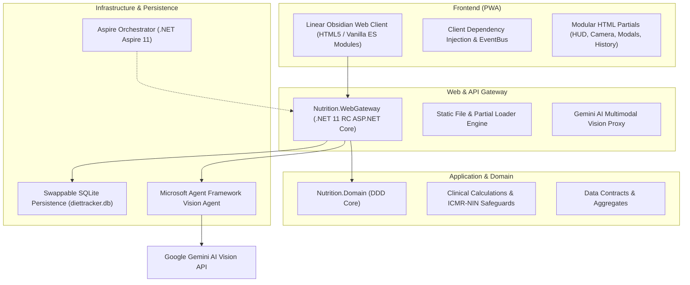

# Diet Dost 🥗 | AI-Powered Indian Diet & Calorie Tracker

[](https://dotnet.microsoft.com/)
[](https://learn.microsoft.com/dotnet/aspire/)
[](https://www.nin.res.in/)
[](https://linear.app)
[](LICENSE)

> **Diet Dost** (डाइट दोस्त / ડાયેટ દોસ્ત) is an enterprise-grade nutrition companion engineered specifically for the Indian population and South Asian metabolic phenotypes. It bridges clinical dietetics (ICMR-NIN 2024 and WHO guidelines) with modern multimodal AI meal vision (Microsoft Agent Framework powered by Google AI Gemini models).

---

## 🌟 Key Highlights

- **🇮🇳 South Asian & Indian Phenotype Specific**: Tailored for Indian dietary realities—including dal, sabzi, roti, rice, street snacks, and regional preparations—calibrated with WHO Asian-Indian BMI cutoffs (Normal: 18.5–22.9, Overweight: 23–24.9, Obese: $\ge$ 25 kg/m²).
- **🔬 Zero-Assumption Clinical Engine**: Zero hallucination or guesswork. Requires complete clinical profile metrics (age, biological sex, height, weight, activity multiplier, health conditions) before issuing caloric and macronutrient targets.
- **📸 Multimodal AI Meal Vision**: Upload or take photos of Indian dishes. Powered by Microsoft Agent Framework + Google Gemini multimodal vision with a strict $\ge 70\%$ confidence gating floor and editable 1-tap review modals.
- **💡 Real-Time AI Macro Recalculation**: Change food items, serving quantities, or oil levels on the fly. The intelligent client/gateway recalculates calories, protein, carbs, fats, fiber, and sodium in real-time.
- **🛡️ ICMR-NIN 2024 Clinical Safeguards**:
  - Enforced starvation caloric floors (1,200 kcal/day for females, 1,500 kcal/day for males).
  - Condition-specific metabolic adjustments (Hypothyroidism -12% TDEE, Diabetes low GI / low carb distribution, Hypertension 2g/day sodium ceiling, NAFLD saturated fat limits).
- **📸 Visual Transformation & Progress Tracking**: Face-fat reduction tracking, side-by-side baseline vs latest progress comparisons, and check-in timeline logging.
- **✨ Obsidian Linear-Class UI**: Ultra-refined dark glassmorphic design inspired by Linear.app with micro-animations, real-time HUD stats, and full calculation transparency sheets.

---

## 🏛️ Architecture & Tech Stack

Diet Dost is built on a clean **Domain-Driven Design (DDD)** onion architecture:



### Technology Matrix

| Layer | Technologies |
|---|---|
| **Platform** | [.NET 11 RC](https://dotnet.microsoft.com/) / C# 13 |
| **Orchestration** | [.NET Aspire 11](https://learn.microsoft.com/dotnet/aspire/) |
| **Domain Logic** | Clean Architecture / Domain-Driven Design (DDD) |
| **AI / Multimodal Vision** | Microsoft Agent Framework + Google Gemini AI models |
| **Frontend** | Vanilla ES Modules, CSS Glassmorphism, Chart.js, HTML5 Canvas, PWA |
| **Database** | SQLite V1 (Swappable with PostgreSQL via EF Core) |
| **Clinical Guidelines** | ICMR-NIN 2024, WHO Asian-Indian Guidelines, Mifflin-St Jeor Equation |

---

## 📁 Repository Structure

```
diet-dost/
├── src/
│   ├── Nutrition.AppHost/           # .NET Aspire orchestration host
│   ├── Nutrition.ServiceDefaults/   # Resilience, telemetry, health checks
│   ├── Nutrition.Domain/            # DDD entities, clinical calculators, aggregates
│   ├── Nutrition.Infrastructure/    # AI Vision agent, EF Core DbContext, repositories
│   └── Nutrition.WebGateway/        # ASP.NET Core gateway, API endpoints, PWA frontend
│       └── wwwroot/
│           ├── css/                 # Linear.app glassmorphic stylesheets
│           ├── js/                  # ES Module client (di, services, state, ui)
│           ├── partials/            # 10 modular HTML UI components
│           └── index.html           # Single Page App shell
├── tests/
│   ├── Nutrition.Domain.Tests/      # Unit tests for clinical formulas & safeguards
│   └── Nutrition.Vision.Evals/      # AI food vision evaluation harness & benchmark tests
├── docs/
│   └── sdd/                         # Comprehensive Software Design Documents (SDD v1.1.0)
│       ├── 00_sdd_index.md          # Master index & traceability matrix
│       ├── 01_clinical_dietetics_spec.md
│       ├── 02_solution_architecture.md
│       ├── 03_data_models_and_contracts.md
│       ├── 04_security_and_compliance.md
│       ├── 05_devops_and_infrastructure.md
│       ├── 06_test_harness_and_evals.md
│       └── 07_living_documentation_log.md
├── LICENSE                          # MIT License
└── README.md                        # Project documentation
```

---

## 🚀 Getting Started

### Prerequisites

- [.NET 11 SDK (or .NET 9+)](https://dotnet.microsoft.com/download)
- Visual Studio 2024 / 2026 or VS Code with C# Dev Kit
- Google Gemini API Key (for AI Multimodal Food Vision)

### 1. Clone the Repository

```bash
git clone https://github.com/nikunjbanker/diet-dost.git
cd diet-dost
```

### 2. Configure AI API Key

Add your Gemini API Key in `src/Nutrition.WebGateway/appsettings.json` or use .NET User Secrets:

```json
{
  "Gemini": {
    "ApiKey": "YOUR_GEMINI_API_KEY",
    "Model": "gemini-2.5-flash"
  }
}
```

Or via .NET Secret Manager (recommended for local development):

```bash
cd src/Nutrition.WebGateway
dotnet user-secrets set "Gemini:ApiKey" "YOUR_API_KEY"
```

### 3. Build and Run

#### Using .NET CLI:
```bash
dotnet run --project src/Nutrition.WebGateway
```

Open your browser and navigate to:
```
http://localhost:5240
```

#### Using .NET Aspire:
```bash
dotnet run --project src/Nutrition.AppHost
```

Navigate to the Aspire Dashboard URL displayed in the console to inspect logs, traces, and metrics.

---

## 🧪 Running Tests

Execute the automated clinical unit tests and evaluation harnesses:

```bash
dotnet test
```

Test coverage includes:
- Mifflin-St Jeor basal metabolic rate calculations.
- WHO South Asian BMI classification boundaries.
- ICMR-NIN 2024 starvation floor compliance (male & female).
- Health condition adjustments (Hypothyroidism, Hypertension, Diabetes, NAFLD).
- Food vision prompt evaluation gating.

---

## 📚 Living Documentation (SDD)

Diet Dost strictly adheres to living documentation practices. Every architectural decision, clinical dietetic formula, and security standard is documented in detail:

- **[00: Master Index & Traceability](docs/sdd/00_sdd_index.md)**
- **[01: Clinical Dietetics Specification](docs/sdd/01_clinical_dietetics_spec.md)**
- **[02: Solution Architecture Blueprint](docs/sdd/02_solution_architecture.md)**
- **[03: Data Models & Contracts](docs/sdd/03_data_models_and_contracts.md)**
- **[04: Security & Compliance (OWASP)](docs/sdd/04_security_and_compliance.md)**
- **[05: DevOps & Infrastructure](docs/sdd/05_devops_and_infrastructure.md)**
- **[06: Test Harness & AI Vision Evals](docs/sdd/06_test_harness_and_evals.md)**
- **[07: Living Documentation & Audit Log](docs/sdd/07_living_documentation_log.md)**

---

## 📄 License

This project is licensed under the [MIT License](LICENSE).
