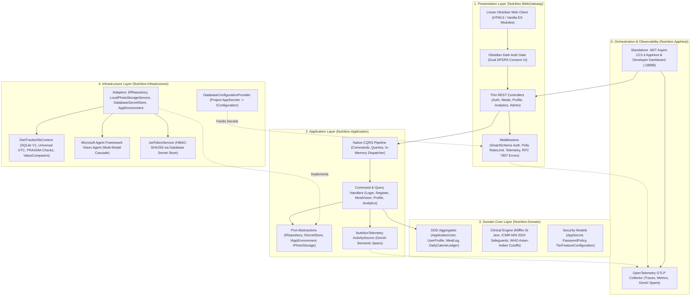

# Diet Dost 🥗 | AI-Powered Indian Diet & Calorie Tracker

[](https://dotnet.microsoft.com/)
[](https://learn.microsoft.com/dotnet/aspire/)
[](https://www.nin.res.in/)
[](https://linear.app)
[](LICENSE)

> **Diet Dost** (डाइट दोस्त / ડાયેટ દોસ્ત) is an enterprise-grade nutrition companion engineered specifically for the Indian population and South Asian metabolic phenotypes. It bridges clinical dietetics (ICMR-NIN 2024 and WHO guidelines) with modern multimodal AI meal vision (Microsoft Agent Framework powered by Google AI Gemini models).

---

## 🌟 Key Highlights

- **🏛️ .NET 11 Clean Architecture & Native CQRS**: Pure dependency-inversion Onion architecture with native CQRS (`ICommand`, `IQuery`, `ICommandHandler`, `IQueryHandler`) implemented via `Microsoft.Extensions.DependencyInjection`—eliminating commercial licensing risks (Zero MediatR RPL-1.5). Thin controllers delegate exclusively to application handlers.
- **🔐 Swappable Database Secret Store**: Zero hardcoded secrets in source code or `appsettings.json`. Secrets are persisted in the `AppSecrets` database table via `ISecretStore` with in-memory caching and projected directly into ASP.NET Core `IConfiguration` via a custom `DatabaseConfigurationProvider` during host startup.
- **🛡️ Debug-Only Demo User Security Isolation**: Prevents production data breaches by restricting seeded demo accounts (`free@`, `basic@`, `premium@`, `admin.demo@`, `superadmin@dietdost.app`) strictly to Debug builds in Development hosting environments. In Release mode, demo user seeding is suppressed, login attempts are blocked with `HTTP 403 DemoAccessForbidden`, and any pre-existing demo accounts are proactively deactivated with revoked security stamps.
- **⚡ Dual SmartScheme Auth & Tier Quota Engine**: RFC 7519 JWT Bearer + HttpOnly Cookie dual authentication with India DPDPA 2023 forensic consent audit logging. Features dynamic tier quotas (`Free`: 1/day, `Basic`: 7/day, `Premium`: 30/day, `SuperAdmin`: Unlimited) with automated feature gating (visual progress comparisons and meal data exports).
- **🧪 Mandatory End-to-End Tier Verification Harness**: 122 automated unit/eval tests plus an automated live E2E PowerShell test harness (`pwsh -File tests/validate_e2e_tiers.ps1`) verifying all 5 demo user tiers, quotas, feature gating, and admin permissions on the running WebGateway.
- **🇮🇳 South Asian & Indian Phenotype Specific**: Tailored for Indian dietary realities—including dal, sabzi, roti, rice, street snacks, and regional preparations—calibrated with WHO Asian-Indian BMI cutoffs (Normal: 18.5–22.9, Overweight: 23–24.9, Obese: $\ge$ 25 kg/m²).
- **🔬 Zero-Assumption Clinical Engine**: Zero hallucination or guesswork. Requires complete clinical profile metrics (age, biological sex, height, weight, activity multiplier, health conditions) before issuing caloric and macronutrient targets.
- **📸 Multimodal AI Meal Vision**: Upload or take photos of Indian dishes. Powered by Microsoft Agent Framework + Google Gemini multimodal vision with a strict $\ge 70\%$ confidence gating floor and editable 1-tap review modals.
- **🤖 Configurable Model Detection Transparency**: Real-time badge in the review modal displaying the active model that parsed the food (e.g. `gemini-3-flash-preview` or `gemini-2.5-flash`). Configurable via `"AI:ShowModelDetails": true`.
- **⚡ Gemini 3 Flash Thinking & Multi-Model Cascade**: Built-in resiliency for Gemini 3 Flash preview models with 8192 output token allocations and thinking tokens traversal, cascading seamlessly to Gemini 2.5 Flash and Gemini 2.5 Pro on quota or timeout.
- **🔍 End-to-End Aspire Observability & Tracing**: Complete HTTP request and response payload inspection in Aspire distributed traces (`HttpPayloadTelemetryMiddleware`), coupled with child `ai.food_detection` GenAI semantic spans (`gen_ai.system_prompt`, `user.diagnosed_conditions`, `user.medications`).
- **🔒 Resilient Database Engine & Non-PII Safeguards**: Schema-aware idempotent column migrations (`PRAGMA table_info`), EF Core collection `ValueComparer` instances (preventing change-tracking loss), and strict non-PII diagnostic error logging.
- **💡 Real-Time AI Macro Recalculation & Quantity Parsing**: Flexible detection of Indian cooking quantities (e.g. *"1.5 Cup"*, *"1 Katori"*, *"5-6 Slices"*, *"2 Phulkas"*). Dynamically recalculates total calories, protein, carbs, fat, fiber, and sugar whenever portions or ingredients are adjusted.
- **🥗 Complete Fiber & Sugar Nutrition Tracking**: Tracks dietary fiber (30g/day ICMR-NIN target) and free sugars (< 25g/day WHO threshold) across all meals, daily ledgers, and clinical targets.
- **📖 Logged Meals Diary & Excel Export**: Filter historical meals by graph section (1D, 7D, 30D, 90D, 365D), switch between interactive Card and Data Grid layouts, update or delete entries in place, and export complete nutritional history to Excel.
- **🗑️ Obsidian Dark Custom Delete Modal**: Replaces browser-native popups with a polished Linear.app modal featuring a pulsing danger icon, 6-macro mini-pills, and clinical deficit recalculation advisories.
- **🌍 User Profile Timezone & Universal UTC Storage**: Configurable user timezone with automatic browser detection (`Intl.DateTimeFormat`), EF Core universal UTC value converters, and circadian day-boundary meal groupings.
- **🖼️ Universal Obsidian Image Fallbacks**: Custom SVG vector graphics (`placeholder-meal.svg` and `placeholder-progress.svg`) with global capturing phase error interceptors ensuring zero broken image icons across all views.
- **🛡️ ICMR-NIN 2024 Clinical Safeguards**:
  - Enforced starvation caloric floors (1,200 kcal/day for females, 1,500 kcal/day for males).
  - Condition-specific metabolic adjustments (Hypothyroidism -12% TDEE, Diabetes low GI / low carb distribution, Hypertension 1.5g/day sodium ceiling, NAFLD saturated fat limits).
- **📸 Visual Transformation & Progress Tracking**: Face-fat reduction tracking, side-by-side baseline vs latest progress comparisons, and check-in timeline logging.
- **✨ Obsidian Linear-Class UI**: Ultra-refined dark glassmorphic design inspired by Linear.app with micro-animations, real-time HUD stats, and full calculation transparency sheets.

---

## 🏛️ Architecture & Tech Stack

Diet Dost is built on a decoupled **Clean Architecture & Native CQRS** pattern:



### Technology Matrix

| Layer | Technologies |
|---|---|
| **Platform** | [.NET 11 RC](https://dotnet.microsoft.com/) (`net11.0`) / C# 13 |
| **Architecture** | Clean Architecture (Onion/Hexagonal), Native CQRS via `Microsoft.Extensions.DependencyInjection` (Zero MediatR) |
| **Orchestration & Dashboard** | [.NET Aspire 13.5.4](https://learn.microsoft.com/dotnet/aspire/) (Standalone AppHost SDK) |
| **Secrets Management** | Database Secret Store (`AppSecrets` table, `ISecretStore` port, `DatabaseConfigurationProvider`) |
| **Security & Environment** | `IAppEnvironment` dual-guard (#if DEBUG & `IHostEnvironment`), Dual SmartScheme JWT Bearer + HttpOnly Cookies |
| **Observability** | OpenTelemetry, `HttpPayloadTelemetryMiddleware`, GenAI Semantic Conventions |
| **Domain Logic** | Domain-Driven Design (DDD), ICMR-NIN 2024, WHO Asian-Indian Guidelines, Mifflin-St Jeor Equation |
| **AI / Multimodal Vision** | Microsoft Agent Framework + Google Gemini AI (3-Flash, 2.5-Flash, 2.5-Pro Cascade) |
| **Frontend** | Vanilla ES Modules, CSS Glassmorphism (Linear.app aesthetic), Chart.js, HTML5 Canvas, PWA |
| **Database** | SQLite V1 (Universal UTC `ValueConverter`, Schema-aware `PRAGMA table_info` checks, EF Core collection `ValueComparer`s) |

---

## 📁 Repository Structure

```
diet-dost/
├── src/
│   ├── Nutrition.AppHost/           # Standalone .NET Aspire 13.5.4 AppHost orchestration topology
│   ├── Nutrition.Domain/            # DDD core entities, clinical calculators, AppSecret, password policy
│   ├── Nutrition.Application/       # Native CQRS commands, queries, handlers, ISecretStore, IAppEnvironment
│   ├── Nutrition.Infrastructure/    # DatabaseSecretStore, DatabaseConfigurationProvider, EF Core DbContext, AI Agent
│   └── Nutrition.WebGateway/        # ASP.NET Core WebGateway, thin controllers, SmartScheme auth, PWA static files
│       └── wwwroot/
│           ├── assets/              # SVG vectors (placeholder-meal.svg, placeholder-progress.svg)
│           ├── css/                 # Linear.app glassmorphic stylesheets
│           ├── js/                  # ES Module client (di, services, state, ui)
│           ├── partials/            # 11 modular HTML components (auth-gate, review-modal, delete-meal-modal, HUD, etc.)
│           └── index.html           # Single Page App shell
├── tests/
│   ├── Nutrition.Domain.Tests/      # Unit tests for clinical formulas & medical safeguards (36 tests)
│   ├── Nutrition.EvalHarness.Tests/ # AI Vision evals, auth, rate limiting, and secret store tests (86 tests)
│   └── validate_e2e_tiers.ps1       # Automated live end-to-end user tier validation test harness
├── docs/
│   ├── architecture/diagrams/       # Standalone synchronized Mermaid architecture diagrams
│   └── sdd/                         # Comprehensive Living Software Design Documents (SDD v1.3.1)
│       ├── 00_sdd_index.md          # Master index & traceability matrix
│       ├── 01_clinical_dietetics_spec.md
│       ├── 02_solution_architecture.md
│       ├── 03_data_models_and_contracts.md
│       ├── 04_security_and_compliance.md
│       ├── 05_devops_and_infrastructure.md
│       ├── 06_test_harness_and_evals.md
│       └── 07_living_documentation_log.md
├── LICENSE                          # MIT License
└── README.md                        # Project documentation
```

---

## 🚀 Getting Started

### Prerequisites

- [.NET 11 SDK](https://dotnet.microsoft.com/download)
- Visual Studio 2024 / 2026 or VS Code with C# Dev Kit
- Google Gemini API Key (for AI Multimodal Food Vision)

### 1. Clone the Repository

```bash
git clone https://github.com/nikunjbanker/diet-dost.git
cd diet-dost
```

### 2. Configure AI API Key & Model Troubleshooting Badge

Add your Gemini API Key in `src/Nutrition.WebGateway/appsettings.json` or use .NET User Secrets:

```json
{
  "AI": {
    "Provider": "GoogleAI",
    "ApiKey": "YOUR_GEMINI_API_KEY",
    "ModelId": "gemini-3-flash-preview",
    "FallbackModelId": "gemini-3.6-flash",
    "ShowModelDetails": true
  }
}
```

Or via .NET Secret Manager (recommended for local development):

```bash
cd src/Nutrition.WebGateway
dotnet user-secrets set "AI:ApiKey" "YOUR_API_KEY"
```

### 3. Build and Run

#### Using .NET CLI:
```bash
dotnet run --project src/Nutrition.WebGateway
```

Open your browser and navigate to:
```
http://localhost:5240
```

#### Using .NET Aspire:
```bash
dotnet run --project src/Nutrition.AppHost
```

- **Aspire Dashboard**: [`http://localhost:18888`](http://localhost:18888) (Inspect live resources, logs, traces with request/response bodies, and GenAI spans)
- **Application (Linear PWA)**: [`http://localhost:5240`](http://localhost:5240)

---

## 🧪 Running Tests & Validation

### 1. Automated Test Suite (129 Tests, 0 Warnings, 0 Errors)
Execute the comprehensive domain, clinical, security, and AI evaluation suite:

```bash
dotnet test
```

Test coverage includes:
- **Clinical & Safeguards (`Nutrition.Domain.Tests` - 36 tests)**:
  - Mifflin-St Jeor South Asian BMR/TDEE calculations.
  - WHO Asian-Indian BMI boundaries and cardiometabolic cutoffs.
  - ICMR-NIN 2024 starvation caloric floors (1,200 kcal F / 1,500 kcal M).
  - Health condition macro adjustments (Diabetes, HTN, Thyroid, NAFLD).
- **Security & Infrastructure (`Nutrition.EvalHarness.Tests` - 93 tests)**:
  - Multimodal AI food vision prompt defense, confidence gating ($\ge 70\%$), and fallback cascade.
  - PBKDF2 password hashing (HMAC-SHA512) and strict password policy validation.
  - RFC 7519 JWT Bearer authentication and HttpOnly session validation.
  - Polly sliding-window rate limiting resilience pipelines.
  - Database Secret Store (`AppSecrets` table, `ISecretStore` port, and caching).
  - Debug-only demo user isolation and release mode login rejection (`HTTP 403 DemoAccessForbidden`).

### 2. Live End-to-End User Tier Validation Harness
Run the automated end-to-end product verification across all 5 demo user tiers on the running WebGateway (`http://localhost:5240`):

```powershell
pwsh -File tests/validate_e2e_tiers.ps1
```

Validates real-time authentication, JWT issuance, profile calculations, daily AI quotas (`Free`: 1, `Basic`: 7, `Premium`: 30, `SuperAdmin`: Unlimited), feature gating (progress photos & CSV export paywalls), and Admin role authorization.

---

## 📚 Living Documentation (SDD v1.3.1)

Diet Dost strictly adheres to living documentation practices. Every architectural decision, clinical dietetic formula, and security standard is documented in detail:

- **[00: Master Index & Traceability (v1.3.1)](docs/sdd/00_sdd_index.md)**
- **[01: Clinical Dietetics Specification (v1.3.1)](docs/sdd/01_clinical_dietetics_spec.md)**
- **[02: Solution Architecture Blueprint (v1.3.1)](docs/sdd/02_solution_architecture.md)**
- **[03: Data Models & Contracts (v1.3.1)](docs/sdd/03_data_models_and_contracts.md)**
- **[04: Security & Compliance / OWASP (v1.3.1)](docs/sdd/04_security_and_compliance.md)**
- **[05: DevOps & Infrastructure (v1.3.1)](docs/sdd/05_devops_and_infrastructure.md)**
- **[06: Test Harness & AI Vision Evals (v1.3.1)](docs/sdd/06_test_harness_and_evals.md)**
- **[07: Living Documentation & Audit Log (Synchronized)](docs/sdd/07_living_documentation_log.md)**
- **[Local Indian Food Text/Vision SLM Training Guide](docs/LOCAL_INDIAN_FOOD_SLM_TRAINING_GUIDE.md)** — dataset design, local QLoRA training, Microsoft Agent Framework + Ollama integration, and evaluation gates

---

## 📄 License & Governance

This project is dual-licensed under the **GNU Affero General Public License v3.0 only (AGPLv3)** and the **Server Side Public License, v 1 (SSPL)**. See [LICENSE](LICENSE) and [CONTRIBUTING.md](CONTRIBUTING.md) for full terms. License governance and automated header verification are maintained via `.agents/skills/diet-dost-license-governance/`.
