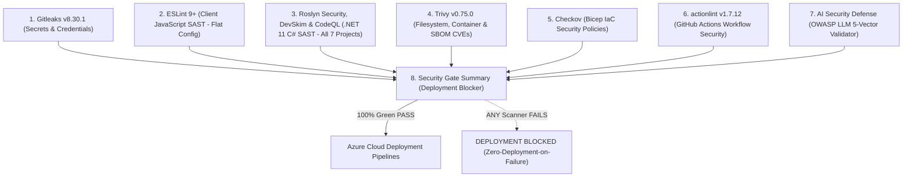

<!--
  Copyright (c) 2026 diet-dost and/or its contributors.
  Licensed under the "GNU Affero General Public License v3.0 only" and
  the "Server Side Public License, v 1"; you may not use this file except
  in compliance with, at your election, the "GNU Affero General Public
  License v3.0 only" or the "Server Side Public License, v 1".
-->

# Security Policy: Diet Dost 🥗

Diet Dost is an enterprise-grade nutrition and calorie-tracking platform for the Indian population. Because Diet Dost processes sensitive clinical intake data, personal metabolic profiles, and multimodal meal imagery, security, patient privacy, and algorithmic integrity are foundational to every architectural layer.

---

## 1. Supported Versions

We maintain and provide security patches for the following versions and tiers:

| Version / Tier | Supported | Security SLA Applicability | Target Runtime | Notes |
| :--- | :---: | :---: | :--- | :--- |
| **Officially Released Production Versions (GA)** | 🟢 Yes | Full Response SLA (Section 2.3) | .NET 11 (`net11.0`) & Aspire 13.5 | Tagged production releases on `main`. |
| **Alpha & Beta Versions (Active Development)** | 🟡 Active Dev | Best Effort (No Binding SLA) | .NET 11 (`net11.0`) & Aspire 13.5 | Milestone previews and release candidate branches. |
| **Legacy / Deprecated Prototype Versions** | 🔴 No | None | Legacy runtimes | Archived or experimental iterations. |

---

## 2. Reporting a Vulnerability (Coordinated Vulnerability Disclosure)

We take security vulnerabilities seriously and appreciate the efforts of security researchers and contributors who discover and report issues responsibly.

### 2.1 Private Reporting Channels
> [!IMPORTANT]
> **Please DO NOT report security vulnerabilities through public GitHub issues, discussions, or pull requests.**

To report a vulnerability privately, use one of the following methods:
1. **GitHub Private Vulnerability Reporting (Preferred)**:
   Navigate to the [GitHub Security Advisory](https://github.com/nikunjbanker/diet-dost/security/advisories/new) page of the repository and open a private advisory draft.
2. **Direct Contact to Sole Security Authority**:
   Contact the project's Sole Administrative & Security Authority:
   - **Maintainer**: `@nikunjbanker`
   - **Repository**: [https://github.com/nikunjbanker/diet-dost](https://github.com/nikunjbanker/diet-dost)

### 2.2 What to Include in Your Report
To accelerate triage and resolution, please include:
- A clear description of the potential vulnerability and its real-world impact.
- The affected component(s), endpoints, or file paths (e.g., `Nutrition.WebGateway`, `PromptShieldValidator`, `infra.bicep`).
- Step-by-step reproduction instructions or a minimal Proof-of-Concept (PoC).
- Relevant Common Weakness Enumeration (CWE) or OWASP category (e.g., OWASP Top 10, OWASP LLM Top 10).
- Any recommended remediation steps, if known.

### 2.3 Response Timelines & SLAs (Released Versions Only)

> [!NOTE]
> **Release Scope Notice**: The response timelines and remediation targets listed below are **strictly applicable to officially released (General Availability) production versions**. Pre-release, experimental, Alpha, and Beta versions are maintained on a **best-effort development cycle** and are remediated through regular sprint milestones without binding SLA guarantees.

- **Initial Acknowledgment**: Minimum **7 business days** (starting from verified receipt of report).
- **Triage & Severity Assessment**: Within **14 business days**, validating reproduction steps, threat vector, and clinical impact.
- **Fix & Patch Target (Released Versions Only)**:
  - **Critical / High Severity**: Targeted for remediation within **30 calendar days** following successful triage.
  - **Medium / Low Severity**: Targeted for remediation within **45 to 60 calendar days** (or incorporated into the next scheduled release).
- **Alpha & Beta Versions**: Resolved during normal active development sprints; security patches are rolled forward into subsequent preview builds.
- **Coordinated Disclosure**: We adhere to standard 90-day coordinated vulnerability disclosure, collaborating on advisory details once a verified patch has been packaged and deployed.

### 2.4 Safe Harbor Policy
If you conduct security research in good faith:
- We will not pursue legal action against you for accidental violations or responsible testing.
- We ask that you avoid accessing, modifying, or destroying user data, degrading system availability (DoS), or testing against production user accounts without consent.

---

## 3. Security Practices & Architecture Standards Followed

Diet Dost enforces defense-in-depth across the entire Software Development Life Cycle (SDLC):

### 3.1 Pre-Commit & Pre-Deployment Security Gate (8 Scanners)
Every commit and pull request must clear an automated **8-job Static Analysis & Code Scanning Pipeline** defined in [`.github/workflows/security-scan.yml`](file:///c:/Users/nikunj.banker/source/repos/diet-dost/.github/workflows/security-scan.yml) with **0 errors and 0 warnings**:



1. **Gitleaks (v8.30.1)**: Scans full repository Git history and working tree for leaked API keys, tokens, or credentials with SARIF reporting.
2. **ESLint (v9+ / v10)**: Strict static analysis of native ES Modules using modern zero-dependency flat config (`eslint.config.mjs`) with SARIF output.
3. **Microsoft Roslyn Security, DevSkim & CodeQL SAST**: Comprehensive multi-layer .NET 11 C# SAST executed across **all 7 solution projects** combining first-party Microsoft Roslyn CA Security rules (`/p:AnalysisLevel=latest /p:AnalysisModeSecurity=All`), Microsoft DevSkim CLI, and GitHub CodeQL semantic taint analysis.
4. **Trivy (v0.75.0)**: Scans filesystem dependencies, packages, and container images for known CVEs.
5. **Checkov**: Validates Infrastructure-as-Code (`infra/*.bicep`) against CIS benchmarks and cloud security best practices with `soft_fail: false`.
6. **actionlint (v1.7.12)**: Inspects GitHub Actions workflows for syntax errors, untrusted input interpolation, and script injection risks.
7. **AI Security Defense**: Executes `scripts/verify-ai-security-defense.ps1` to detect prompt injection bypasses, slopsquatting, and unsafe LLM defaults.
8. **Security Gate Summary**: Publishes an aggregated verdict comment to pull requests and strictly blocks Azure deployment if any check fails.

---

### 3.2 Sole Authority Secret Governance & Zero-Hardcoded Secrets
- **Sole Administrative Authority**: Contributor `@nikunjbanker` holds sole authority over solution secrets, Azure Key Vault provisioning, and cloud RBAC roles.
- **Zero Hardcoded Secrets Policy**: Hardcoded secrets, static connection strings, or private API keys in Git commits or configuration files are strictly forbidden and enforced by Gitleaks pre-commit hooks and CI.
- **Dynamic Azure Cloud Context**: Administrative scripts ([`scripts/setup-azure-pre-deployment.ps1`](file:///c:/Users/nikunj.banker/source/repos/diet-dost/scripts/setup-azure-pre-deployment.ps1)) dynamically resolve subscriptions, tenants, and application registrations at runtime via authenticated `az account` session queries—preventing credential exposure.
- **Azure Key Vault Purge Protection**: Key Vault is provisioned with `enablePurgeProtection: true` and 7-day soft-delete retention in `infra/infra.bicep`.
- **Passwordless Managed Identity**: Container workloads interact with Azure Container Registry (ACR) via system-assigned and user-assigned managed identities assigned `AcrPull`, and read secrets using least-privilege `Key Vault Secrets User`.

---

### 3.3 Enterprise AI Prompt Shield & Content Safety (OWASP Top 10 for LLM)
Multimodal meal ingestion uses the Microsoft Agent Framework with Google AI Gemini:
- **Zero Harmful / Violent / Sexual / Communal Content**: Every prompt is evaluated by `PromptShieldValidator` prior to model dispatch. Natural language containing weapons, violence, adult content, or communal/religious disharmony is rejected with zero token consumption.
- **Prompt Injection Delimiter Isolation**: User-submitted dish descriptions and feedback are isolated with strict delimiter boundaries to prevent system prompt extraction or role override ("DAN" attacks).
- **Google AI StrictSafetySettings**: Declared on all Gemini API calls at `BLOCK_LOW_AND_ABOVE` across harassment, hate speech, sexual content, and dangerous activities.
- **Self-Learning Data Poisoning Protection**: Continual feedback retraining loops validate correction data against adversarial poisoning heuristics.

---

### 3.4 Authentication, Authorization & Session Security
- **Dual SmartScheme Authentication**: Supports RFC 7519 JWT Bearer tokens and HttpOnly Secure SameSite=Strict cookies via `AddPolicyScheme` routing.
- **HMAC-SHA256 Cryptographic Tokens**: Minimum 256-bit symmetric signing keys (`Jwt:Key`), verified on startup. Expired or tampered tokens return structured `HTTP 401 Unauthorized`.
- **PBKDF2 Password Hashing**: Passwords hashed with HMAC-SHA512 (100,000 iterations, 128-bit cryptographically random salt).
- **Broken Object-Level Authorization (BOLA/IDOR) Defense**: Server-side controllers extract user identity exclusively from cryptographically verified claims (`UserClaimsExtensions.GetUserId(User)`). Multi-tenant entity filtering guarantees cross-tenant isolation (`UserId == CurrentUser.Id`).
- **Dynamic Tier Quota & Feature Gating**: Rate limits and AI quotas (Free: 1/day, Basic: 7/day, Premium: 30/day, SuperAdmin: Unlimited) are evaluated atomically before AI vision execution.
- **Non-Development Isolation Mandate**: Seeded demo accounts (`free@`, `basic@`, `premium@`, `admin.demo@`, `superadmin@dietdost.app`) are strictly forbidden in Release mode and non-Development hosting environments (`IAppEnvironment.AllowsDemoUsers`). Any attempt to authenticate demo credentials in production results in `HTTP 403 DemoAccessForbidden`.

---

### 3.5 Privacy, Health Data Governance & India DPDPA 2023
- **India Digital Personal Data Protection Act (DPDPA 2023)**:
  - Unbundled dual consent model: Explicit Terms of Service / AI license acceptance, plus independent Sensitive Personal Data (Health/Dietary) consent.
  - Forensic audit logging persists consent timestamp in UTC (`TermsAcceptedAtUtc`), IP address, user agent, and consent policy version.
- **PII-Free Observability**: Structured logs and OpenTelemetry traces strictly redact Personal Identifiable Information (PII) and medical diagnoses from error traces.
- **Universal UTC Persistence**: All database timestamps are persisted in Universal Time (`DateTimeKind.Utc`) via EF Core `ValueConverter` to prevent circadian boundary tampering and timezone spoofing.

---

### 3.6 File Armor & Content Security Policy (CSP)
- **Magic Byte File Header Validation**: All meal photo uploads are inspected at the binary stream level (`ImageUploadValidator`):
  - JPEG (`FF D8 FF`)
  - PNG (`89 50 4E 47`)
  - WebP (`52 49 46 46 .... 57 45 42 50`)
  - Maximum upload ceiling: 8MB. Polyglot payloads and web shells are rejected.
- **Automated EXIF Stripping**: GPS location coordinates and camera metadata are stripped before image persistence.
- **Strict Content-Security-Policy (CSP)**:
  ```http
  default-src 'self';
  img-src 'self' data: blob:;
  style-src 'self' 'unsafe-inline' fonts.googleapis.com;
  font-src fonts.gstatic.com;
  script-src 'self' 'unsafe-inline';
  connect-src 'self' https://generativelanguage.googleapis.com;
  object-src 'none';
  ```
- **Static SVG Vector Armor**: Fallback placeholders (`placeholder-meal.svg`, `placeholder-progress.svg`) are static declarative vectors containing zero `<script>`, `onload`, or foreign object tags.

---

### 3.7 Supply Chain Security & Immutable Action Pinning
- **Immutable Commit SHA Pinning**: All GitHub Actions workflows pin actions to immutable 40-character commit SHAs rather than mutable tags.
- **Vetted Package Registries**: NuGet and npm packages are audited against verified registries with automated slopsquatting checks.

---

## 4. Security Incident Response Process

In the event of a confirmed security incident:
1. **Containment**: Immediate mitigation via Azure Container Apps revision freeze, firewall boundary update, or Key Vault secret rotation.
2. **Remediation**: Dedicated branch creation from freshly fetched remote state (`origin/main`), unit test regression authoring, and verification via the 8-job security pipeline.
3. **Disclosure & Advisory**: Coordinated disclosure published through GitHub Security Advisories with remediation guidance for self-hosters and contributors.

---

## 5. License Governance
Diet Dost is licensed under a dual-licensing model:
- **GNU Affero General Public License v3.0 only (AGPLv3)**
- **Server Side Public License, v 1 (SSPL v1)**

All contributors and deployers must comply with license governance codified in [`.agents/skills/diet-dost-license-governance/`](file:///c:/Users/nikunj.banker/source/repos/diet-dost/.agents/skills/diet-dost-license-governance/SKILL.md).
