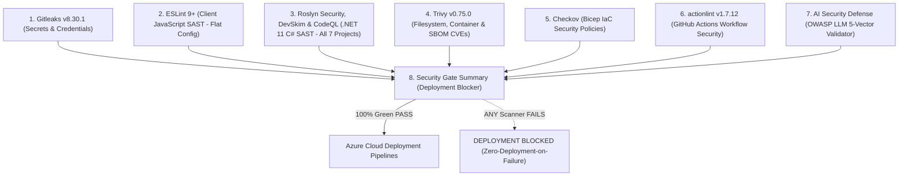

<!--
  Copyright (c) 2026 diet-dost and/or its contributors.
  Licensed under the "GNU Affero General Public License v3.0 only" and
  the "Server Side Public License, v 1"; you may not use this file except
  in compliance with, at your election, the "GNU Affero General Public
  License v3.0 only" or the "Server Side Public License, v 1".
-->

# Security Policy: Diet Dost 🥗

Diet Dost is an enterprise-grade nutrition and calorie-tracking platform for the Indian population. Because Diet Dost processes sensitive clinical intake data, personal metabolic profiles, and multimodal meal imagery, security, patient privacy, and algorithmic integrity are foundational to every architectural layer.

---

## 1. Supported Versions

We maintain and provide security patches for the following versions and tiers:

| Version / Tier | Supported | Security SLA Applicability | Target Runtime | Notes |
| :--- | :---: | :---: | :--- | :--- |
| **Officially Released Production Versions (GA)** | 🟢 Yes | Full Response SLA (Section 2.3) | .NET 11 (`net11.0`) & Aspire 13.5 | Tagged production releases on `main`. |
| **Alpha & Beta Versions (Active Development)** | 🟡 Active Dev | Best Effort (No Binding SLA) | .NET 11 (`net11.0`) & Aspire 13.5 | Milestone previews and release candidate branches. |
| **Legacy / Deprecated Prototype Versions** | 🔴 No | None | Legacy runtimes | Archived or experimental iterations. |

---

## 2. Reporting a Vulnerability (Coordinated Vulnerability Disclosure)

We take security vulnerabilities seriously and appreciate the efforts of security researchers and contributors who discover and report issues responsibly.

### 2.1 Private Reporting Channels
> [!IMPORTANT]
> **Please DO NOT report security vulnerabilities through public GitHub issues, discussions, or pull requests.**

To report a vulnerability privately, use one of the following methods:
1. **GitHub Private Vulnerability Reporting (Preferred)**:
   Navigate to the [GitHub Security Advisory](https://github.com/nikunjbanker/diet-dost/security/advisories/new) page of the repository and open a private advisory draft.
2. **Direct Contact to Sole Security Authority**:
   Contact the project's Sole Administrative & Security Authority:
   - **Maintainer**: `@nikunjbanker`
   - **Repository**: [https://github.com/nikunjbanker/diet-dost](https://github.com/nikunjbanker/diet-dost)

### 2.2 What to Include in Your Report
To accelerate triage and resolution, please include:
- A clear description of the potential vulnerability and its real-world impact.
- The affected component(s), endpoints, or file paths (e.g., `Nutrition.WebGateway`, `PromptShieldValidator`, `infra.bicep`).
- Step-by-step reproduction instructions or a minimal Proof-of-Concept (PoC).
- Relevant Common Weakness Enumeration (CWE) or OWASP category (e.g., OWASP Top 10, OWASP LLM Top 10).
- Any recommended remediation steps, if known.

### 2.3 Response Timelines & SLAs (Released Versions Only)

> [!NOTE]
> **Release Scope Notice**: The response timelines and remediation targets listed below are **strictly applicable to officially released (General Availability) production versions**. Pre-release, experimental, Alpha, and Beta versions are maintained on a **best-effort development cycle** and are remediated through regular sprint milestones without binding SLA guarantees.

- **Initial Acknowledgment**: Minimum **7 business days** (starting from verified receipt of report).
- **Triage & Severity Assessment**: Within **14 business days**, validating reproduction steps, threat vector, and clinical impact.
- **Fix & Patch Target (Released Versions Only)**:
  - **Critical / High Severity**: Targeted for remediation within **30 calendar days** following successful triage.
  - **Medium / Low Severity**: Targeted for remediation within **45 to 60 calendar days** (or incorporated into the next scheduled release).
- **Alpha & Beta Versions**: Resolved during normal active development sprints; security patches are rolled forward into subsequent preview builds.
- **Coordinated Disclosure**: We adhere to standard 90-day coordinated vulnerability disclosure, collaborating on advisory details once a verified patch has been packaged and deployed.

### 2.4 Safe Harbor Policy & Responsible Security Research Terms

Diet-Dost values the contributions of the cybersecurity research community and is committed to fostering a safe, collaborative environment for coordinated vulnerability disclosure. We provide safe harbor protection for security research conducted in accordance with this policy.

#### 2.4.1 Good-Faith Safe Harbor Protection
If you conduct security research in genuine good faith, adhere strictly to coordinated disclosure principles, and comply fully with the guidelines outlined below:
- **Authorization**: We consider your research activities to be **authorized conduct** under applicable computer security and access laws.
- **Protection from Legal Action**: Diet-Dost will **not initiate civil lawsuits or pursue criminal complaints** against you for accidental, inadvertent, or good-faith violations arising from responsible security testing within scope.
- **Support & Collaboration**: If legal action is initiated by a third party against you for research activities conducted strictly under this policy, we will make this safe harbor commitment known to confirm your authorized standing.

#### 2.4.2 Strict Scope Boundaries & Prohibited Activities
Safe harbor protection is **strictly conditioned** upon honoring the following non-negotiable boundaries. Researchers must strictly refrain from:
1. **Accessing or Exfiltrating Private Data**: Accessing, viewing, downloading, retaining, altering, or exfiltrating any user data, personally identifiable information (PII), sensitive personal health or dietary records, credentials, or encryption keys. If sensitive data is inadvertently discovered, **stop testing immediately**, avoid copying or caching the data, and report the finding confidentially to our security team.
2. **Disrupting System Availability (DoS/DDoS)**: Executing volumetric, resource-exhaustion, stress, or distributed denial-of-service attacks that impair, degrade, or disrupt system availability, latency, or responsiveness for legitimate users.
3. **Data Modification or Destruction**: Deleting, corrupting, altering, or destroying database entries, Azure SMB file shares, cache stores, or infrastructure configurations.
4. **Extortion & Unlawful Demands**: Demanding financial compensation, bounties, or perks under threat of disclosure, withholding vulnerability details, or holding project assets hostage (including ransomware or coercive bug-bounty holding tactics).
5. **Social Engineering & Physical Attacks**: Performing phishing, spear-phishing, social engineering, credential stuffing, or physical security attacks against maintainers, contributors, or hosting facilities.
6. **Testing Beyond Designated Scope**: Testing against production user accounts other than isolated sandbox or test accounts created and controlled entirely by the researcher.
7. **Premature Public Disclosure**: Disclosing vulnerability technical details, proof-of-concept exploits, or sensitive architectural specifics to third parties or the public before a verified patch has been packaged and deployed under coordinated disclosure timelines.

#### 2.4.3 Legal Reservation & Statutory Enforcement Clause
Diet-Dost encourages constructive, ethical security research and seeks to work cooperatively with researchers. However, safe harbor protections apply **exclusively** to activities conducted in full compliance with Sections 2.4.1 and 2.4.2.

> [!IMPORTANT]
> **Reservation of Statutory Rights and Remedies**:
> Any testing, research, or system interaction conducted in bad faith, outside the defined scope, in breach of user privacy, or in intentional disregard of the prohibited activities listed above falls entirely outside this Safe Harbor policy.
>
> In such events, Diet-Dost expressly reserves all legal rights, claims, remedies, and statutory actions available under applicable domestic and international law, including without limitation civil claims for damages, injunctive relief, and formal referral to law enforcement authorities under:
> - **The Information Technology Act, 2000 (India)** (including without limitation Sections 43, 66, 66B, 66C, 66D, 70, and 72A, and subsequent amendments),
> - **The Digital Personal Data Protection Act, 2023 (DPDPA, India)** (for breaches affecting user health and personal data),
> - **The Computer Fraud and Abuse Act (CFAA, 18 U.S.C. § 1030)** (United States), and
> - Equivalent cybercrime, unauthorized access, and data privacy statutes in the applicable jurisdiction.
>
> Non-compliance with this policy results in the immediate and automatic forfeiture of all safe harbor protections.


---

## 3. Security Practices & Architecture Standards Followed

Diet Dost enforces defense-in-depth across the entire Software Development Life Cycle (SDLC):

### 3.1 Pre-Commit & Pre-Deployment Security Gate (8 Scanners)
Every commit and pull request must clear an automated **8-job Static Analysis & Code Scanning Pipeline** defined in [`.github/workflows/security-scan.yml`](file:///c:/Users/nikunj.banker/source/repos/diet-dost/.github/workflows/security-scan.yml) with **0 errors and 0 warnings**:



1. **Gitleaks (v8.30.1)**: Scans full repository Git history and working tree for leaked API keys, tokens, or credentials with SARIF reporting.
2. **ESLint (v9+ / v10)**: Strict static analysis of native ES Modules using modern zero-dependency flat config (`eslint.config.mjs`) with SARIF output.
3. **Microsoft Roslyn Security, DevSkim & CodeQL SAST**: Comprehensive multi-layer .NET 11 C# SAST executed across **all 7 solution projects** combining first-party Microsoft Roslyn CA Security rules (`/p:AnalysisLevel=latest /p:AnalysisModeSecurity=All`), Microsoft DevSkim CLI, and GitHub CodeQL semantic taint analysis.
4. **Trivy (v0.75.0)**: Scans filesystem dependencies, packages, and container images for known CVEs.
5. **Checkov**: Validates Infrastructure-as-Code (`infra/*.bicep`) against CIS benchmarks and cloud security best practices with `soft_fail: false`.
6. **actionlint (v1.7.12)**: Inspects GitHub Actions workflows for syntax errors, untrusted input interpolation, and script injection risks.
7. **AI Security Defense**: Executes `scripts/verify-ai-security-defense.ps1` to detect prompt injection bypasses, slopsquatting, and unsafe LLM defaults.
8. **Security Gate Summary**: Publishes an aggregated verdict comment to pull requests and strictly blocks Azure deployment if any check fails.

---

### 3.2 Sole Authority Secret Governance & Zero-Hardcoded Secrets
- **Sole Administrative Authority**: Contributor `@nikunjbanker` holds sole authority over solution secrets, Azure Key Vault provisioning, and cloud RBAC roles.
- **Zero Hardcoded Secrets Policy**: Hardcoded secrets, static connection strings, or private API keys in Git commits or configuration files are strictly forbidden and enforced by Gitleaks pre-commit hooks and CI.
- **Dynamic Azure Cloud Context**: Administrative scripts ([`scripts/setup-azure-pre-deployment.ps1`](file:///c:/Users/nikunj.banker/source/repos/diet-dost/scripts/setup-azure-pre-deployment.ps1)) dynamically resolve subscriptions, tenants, and application registrations at runtime via authenticated `az account` session queries—preventing credential exposure.
- **Azure Key Vault Purge Protection**: Key Vault is provisioned with `enablePurgeProtection: true` and 7-day soft-delete retention in `infra/infra.bicep`.
- **Passwordless Managed Identity**: Container workloads interact with Azure Container Registry (ACR) via system-assigned and user-assigned managed identities assigned `AcrPull`, and read secrets using least-privilege `Key Vault Secrets User`.

---

### 3.3 Enterprise AI Prompt Shield & Content Safety (OWASP Top 10 for LLM)

Multimodal food intake analysis and clinical dietetics reasoning utilize the Microsoft Agent Framework across multiple Large Language Model (LLM) backends (Google AI Gemini, Azure OpenAI Service, and future inference engines). Diet-Dost enforces a **defense-in-depth content safety architecture** aligned with the OWASP Top 10 for LLM Applications:

#### 3.3.1 Universal Content Safety & Prompt Shielding Invariants
1. **Pre-Flight Prompt Shield Invariant (`PromptShieldValidator`)**:
   - Every text prompt and multimodal input is evaluated synchronously by `PromptShieldValidator` prior to model dispatch, incurring **zero token consumption** on rejection.
   - Deterministically intercepts and blocks:
     - *Harmful & Violent Content*: Weapons, explosive fabrication, assault, self-harm, and violent acts.
     - *Sexually Explicit Content*: Adult media, pornography, and sexually explicit phrasing.
     - *Communal & Hate Speech*: Religious disharmony, communal slurs, discrimination, and hate speech.
     - *Prompt Injections & Jailbreaks (OWASP LLM01)*: "DAN" exploits, developer role override, system prompt extraction, delimiter escaping, and multi-turn jailbreak payloads.
2. **Prompt Injection Delimiter Isolation**:
   - User-supplied dish descriptions, dietary notes, and feedback are strictly isolated inside `[USER_MEAL_INTAKE_DATA]` delimiter blocks in system prompts, ensuring the model never interprets user input as system instructions.
3. **Self-Learning Data Poisoning Protection (OWASP LLM03)**:
   - Continual feedback retraining loops and nutritional correction memories validate all ingested correction data via `PromptShieldValidator.ValidateFeedback` to prevent adversarial memory poisoning.

#### 3.3.2 Multi-LLM Provider Native Safety Configuration Baseline
Diet-Dost mandates that **all active and future LLM providers** enforce strict content safety settings at the native SDK/API level before token generation:
- **Google AI Gemini**:
  - Configures explicit `StrictSafetySettings` on every `generateContent` API invocation set to `BLOCK_LOW_AND_ABOVE` across:
    - `HARM_CATEGORY_HARASSMENT`
    - `HARM_CATEGORY_HATE_SPEECH`
    - `HARM_CATEGORY_SEXUALLY_EXPLICIT`
    - `HARM_CATEGORY_DANGEROUS_CONTENT`
    - `HARM_CATEGORY_CIVIC_INTEGRITY`
- **Azure OpenAI Service**:
  - Enforces Azure AI Content Safety filters configured with **Strict (Low threshold)** blocking across all primary harm categories (`Hate`, `Sexual`, `Violence`, `Self-Harm`) along with active `Prompt Shield / Jailbreak Detection`.
- **Future LLMs (Anthropic Claude, DeepSeek, AWS Bedrock, Meta Llama, Local ONNX/Ollama)**:
  - Any future provider implementing `IAiFoodAnalysisProvider` or agentic reasoning **MUST declare and enforce equivalent strict safety controls** (provider-level moderation APIs, system-level safety policies, or strict content filtering thresholds).
  - Operating with permissive defaults, unconfigured safety settings, or disabled moderation filters is **strictly prohibited**.

#### 3.3.3 Autonomous Agent Validation & Proactive Reminder Mandate
To guarantee zero security drift during AI-assisted software engineering and human contributions:
- **Autonomous Agent Verification Rule**: AI agents (Antigravity, Cursor, GitHub Copilot, etc.) and CI scanners are **mandated** to inspect all AI provider implementations under [`src/Nutrition.Infrastructure/AI/`](file:///c:/Users/nikunj.banker/source/repos/diet-dost/src/Nutrition.Infrastructure/AI/) and [`src/Nutrition.Application/Agents/`](file:///c:/Users/nikunj.banker/source/repos/diet-dost/src/Nutrition.Application/Agents/).
- **Validation Checklist**:
  1. *Provider Safety Settings Asserted*: Verify that every class implementing `IAiFoodAnalysisProvider` configures explicit, strict safety settings or content moderation controls.
  2. *Delimiter Isolation Asserted*: Verify that user inputs are encapsulated within `[USER_MEAL_INTAKE_DATA]` delimiters.
  3. *Pre-Flight Validation Asserted*: Verify that `PromptShieldValidator.ValidateInput` and `ValidateFeedback` guard all intake pipelines.
- **Proactive Developer Reminder & Blocker Protocol**:
  If a developer, contributor, or agent adds or refactors an LLM provider without explicit strict content safety settings or with relaxed thresholds:
  - The AI agent **MUST proactively remind and alert the developer** before generating or approving code:
    > *"⚠️ **Content Safety Governance Alert**: LLM provider `{ProviderName}` does not declare explicit strict content safety settings. Per SECURITY.md Section 3.3 and OWASP Top 10 for LLM, all LLM providers must enforce strict content moderation (equivalent to Google AI BLOCK_LOW_AND_ABOVE / Azure Strict Content Filters). Please configure provider-level safety settings before submitting."*
  - The agent **MUST refuse to finalize or approve** any PR that leaves LLM safety settings unconfigured, disabled, or reliant on permissive vendor defaults.
- **Continuous CI Automated Gate**:
  - Validated automatically on every commit by `scripts/verify-ai-security-defense.ps1` under **Vector 4** in the pre-commit and pre-deployment security scan.

---

### 3.4 Authentication, Authorization & Session Security
- **Dual SmartScheme Authentication**: Supports RFC 7519 JWT Bearer tokens and HttpOnly Secure SameSite=Strict cookies via `AddPolicyScheme` routing.
- **HMAC-SHA256 Cryptographic Tokens**: Minimum 256-bit symmetric signing keys (`Jwt:Key`), verified on startup. Expired or tampered tokens return structured `HTTP 401 Unauthorized`.
- **PBKDF2 Password Hashing**: Passwords hashed with HMAC-SHA512 (100,000 iterations, 128-bit cryptographically random salt).
- **Broken Object-Level Authorization (BOLA/IDOR) Defense**: Server-side controllers extract user identity exclusively from cryptographically verified claims (`UserClaimsExtensions.GetUserId(User)`). Multi-tenant entity filtering guarantees cross-tenant isolation (`UserId == CurrentUser.Id`).
- **Dynamic Tier Quota & Feature Gating**: Rate limits and AI quotas (Free: 1/day, Basic: 7/day, Premium: 30/day, SuperAdmin: Unlimited) are evaluated atomically before AI vision execution.
- **Non-Development Isolation Mandate**: Seeded demo accounts (`free@`, `basic@`, `premium@`, `admin.demo@`, `superadmin@dietdost.app`) are strictly forbidden in Release mode and non-Development hosting environments (`IAppEnvironment.AllowsDemoUsers`). Any attempt to authenticate demo credentials in production results in `HTTP 403 DemoAccessForbidden`.

---

### 3.5 Privacy, Health Data Governance & India DPDPA 2023
- **India Digital Personal Data Protection Act (DPDPA 2023)**:
  - Unbundled dual consent model: Explicit Terms of Service / AI license acceptance, plus independent Sensitive Personal Data (Health/Dietary) consent.
  - Forensic audit logging persists consent timestamp in UTC (`TermsAcceptedAtUtc`), IP address, user agent, and consent policy version.
- **PII-Free Observability**: Structured logs and OpenTelemetry traces strictly redact Personal Identifiable Information (PII) and medical diagnoses from error traces.
- **Universal UTC Persistence**: All database timestamps are persisted in Universal Time (`DateTimeKind.Utc`) via EF Core `ValueConverter` to prevent circadian boundary tampering and timezone spoofing.

---

### 3.6 File Armor & Content Security Policy (CSP)
- **Magic Byte File Header Validation**: All meal photo uploads are inspected at the binary stream level (`ImageUploadValidator`):
  - JPEG (`FF D8 FF`)
  - PNG (`89 50 4E 47`)
  - WebP (`52 49 46 46 .... 57 45 42 50`)
  - Maximum upload ceiling: 8MB. Polyglot payloads and web shells are rejected.
- **Automated EXIF Stripping**: GPS location coordinates and camera metadata are stripped before image persistence.
- **Strict Content-Security-Policy (CSP)**:
  ```http
  default-src 'self';
  img-src 'self' data: blob:;
  style-src 'self' 'unsafe-inline' fonts.googleapis.com;
  font-src fonts.gstatic.com;
  script-src 'self' 'unsafe-inline';
  connect-src 'self' https://generativelanguage.googleapis.com;
  object-src 'none';
  ```
- **Static SVG Vector Armor**: Fallback placeholders (`placeholder-meal.svg`, `placeholder-progress.svg`) are static declarative vectors containing zero `<script>`, `onload`, or foreign object tags.

---

### 3.7 Supply Chain Security & Immutable Action Pinning
- **Immutable Commit SHA Pinning**: All GitHub Actions workflows pin actions to immutable 40-character commit SHAs rather than mutable tags.
- **Vetted Package Registries**: NuGet and npm packages are audited against verified registries with automated slopsquatting checks.

---

## 4. Security Incident Response Process

In the event of a confirmed security incident:
1. **Containment**: Immediate mitigation via Azure Container Apps revision freeze, firewall boundary update, or Key Vault secret rotation.
2. **Remediation**: Dedicated branch creation from freshly fetched remote state (`origin/main`), unit test regression authoring, and verification via the 8-job security pipeline.
3. **Disclosure & Advisory**: Coordinated disclosure published through GitHub Security Advisories with remediation guidance for self-hosters and contributors.

---

## 5. License Governance
Diet Dost is licensed under a dual-licensing model:
- **GNU Affero General Public License v3.0 only (AGPLv3)**
- **Server Side Public License, v 1 (SSPL v1)**

All contributors and deployers must comply with license governance codified in [`.agents/skills/diet-dost-license-governance/`](file:///c:/Users/nikunj.banker/source/repos/diet-dost/.agents/skills/diet-dost-license-governance/SKILL.md).
