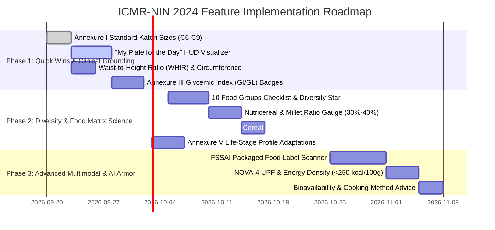

<!--
  Copyright (c) 2026 diet-dost and/or its contributors.
  Licensed under the "GNU Affero General Public License v3.0 only" and
  the "Server Side Public License, v 1"; you may not use this file except
  in compliance with, at your election, the "GNU Affero General Public
  License v3.0 only" or the "Server Side Public License, v 1".
-->

# ICMR-NIN 2024 Dietary Guidelines for Indians (DGI): Comprehensive Feature Roadmap & Recommendations

> **Reference Source**: *Dietary Guidelines for Indians (DGI) - 2024 (Revised Edition)*  
> **Issuing Authority**: ICMR - National Institute of Nutrition (NIN), Hyderabad, Ministry of Health and Family Welfare, Government of India  
> **Document Scope**: 17 Clinical Guidelines, 5 Technical Annexures, 148 Pages (`diet-ref/DGI_2024.pdf`)  
> **Target Application**: **Diet Dost** (.NET 11 RC, .NET Aspire, Linear.app Design System PWA)  
> **Status**: Feature Recommendations & Prioritization Analysis  

---

## 1. Executive Summary: The ICMR-NIN 2024 Paradigm Shift

The **2024 Dietary Guidelines for Indians (DGI)** represent the most comprehensive, evidence-based overhaul of nutritional policy for the Indian population in over a decade. Spearheaded by the ICMR-NIN Expert Committee, the guidelines directly target the alarming rise of **diet-related non-communicable diseases (DR-NCDs)**—specifically type-2 diabetes (15.6%), hypertension (24.0%), abdominal obesity (56.7%), and metabolic syndrome—which coexist with subclinical micronutrient deficiencies (anaemia, vitamin D/B12).

### Core Scientific Principles Introduced in DGI 2024:
1. **Food-Based Guidelines Over Isolated Nutrients**: Health is determined by food matrices and whole meals, not just isolated calorie counting.
2. **"My Plate for the Day" (2000 Kcal Standard)**: Half the plate (500g raw weight: 400g vegetables/GLVs + 100g fruits) must come from protective fresh produce.
3. **Carbohydrate Ceiling (50%–55%) & Cereal Diversification**: Total energy from cereals capped at 45% (~250g raw). At least **30%–40%** of cereals must be whole-grain millets (*nutricereals*).
4. **Mutual Protein Complementation (3:1 or 4:1 Cereal:Pulse Ratio)**: Combining cereals with pulses/legumes to supply all 9 essential amino acids (EAAs) without requiring expensive or risky commercial protein powders.
5. **Strict Ceilings on Free Sugar and Cooking Fat**: Added sugar strictly restricted to **20g–25g/day** (<5% total calories); visible cooking fat capped at **27g/day** (20–25g/day for lower calorie targets).
6. **Cooked Food Energy Density Ceiling**: Cooked preparations should not exceed **250 kcal per 100g**, discouraging ultra-processed and deep-fried items.
7. **South Asian Abdominal Adiposity Focus**: Waist circumference cutoffs (**>90 cm for men, >80 cm for women**) and Waist-to-Height Ratio (<0.5) prioritized over BMI alone.

---

## 2. Current Diet Dost Implementation vs. DGI 2024 Audit

| DGI 2024 Guideline / Benchmark | Current Diet Dost Implementation | Status | Gap / Enhancement Opportunity |
|---|---|---|---|
| **WHO Asian-Indian BMI Cutoffs** | 18.5–22.9 Normal, 23–24.9 Overweight, $\ge 25$ Obese | ✅ **Fully Implemented** | Add Waist Circumference & Waist-to-Height Ratio (WHtR) |
| **Starvation Floors & Deficit Safety** | 1200 kcal F / 1500 kcal M floor; 500–1000 kcal/day max deficit | ✅ **Fully Implemented** | Complete alignment with clinical safety principles |
| **Dietary Fiber Target (30g/day)** | Tracked across meals, items, ledgers, and HUD gauges | ✅ **Fully Implemented** | Add GLV / vegetable gram breakdown |
| **Free Sugar Ceiling (<25g/day)** | Tracked with warning flags when exceeding 25g/day | ✅ **Fully Implemented** | Enforce cereal calorie deduction rule when sugar is logged |
| **Visible Cooking Oil (20–25g/day)** | 1-tap ghee/tadka modifiers & oil grams tracking | ✅ **Fully Implemented** | Add vegetable oil rotation / MUFA:PUFA balance tips |
| **"My Plate for the Day" Proportions** | Daily macro grams tracked, but plate visual missing | ⚠️ **Partial** | Implement interactive "My Plate" donut/pie chart on HUD |
| **10 Food Groups & Dietary Diversity** | Meals classified by meal type, not by 10 food groups | ⚠️ **Partial** | Introduce 10 Food Group classification & 5–7 group daily score |
| **Millet / Nutricereal Ratio (30%–40%)** | Millets recognized in food items, but ratio untracked | ⚠️ **Partial** | Introduce Nutricereal Ratio gauge (millets vs refined grains) |
| **Annexure III Glycemic Index & Load** | Total carbs tracked, but GI/GL not computed per dish | ❌ **Missing** | Integrate Annexure III GI/GL database & dish badge |
| **Annexure I Standard Katori Sizes** | Generic "Katori" (150ml) used | ⚠️ **Partial** | Add standardized C6 (360ml), C7 (200ml), C8 (155ml), C9 (115ml) |
| **Protein Complementation (3:1 Cereal:Pulse)** | Protein grams summed, but amino acid quality unrated | ❌ **Missing** | Add Cereal:Pulse complementarity check & supplement warning |
| **Energy Density Ceiling (<250 kcal/100g)** | Total calories tracked, density per 100g untracked | ❌ **Missing** | Flag meals exceeding 2.5 kcal/g cooked weight |
| **FSSAI Food Label Misleading Claim Guard** | Photo meal vision active; packaged label scan missing | ❌ **Missing** | Add front-of-pack & nutrition table scanner |

---

## 3. Recommended Features (Grouped by Clinical Pillar)

### Pillar A: "My Plate for the Day" & Dietary Diversity (Guidelines 1, 6, Annexure IV, V)

#### Feature A.1: "My Plate for the Day" Interactive HUD Visualizer & Adherence Score
- **Clinical Basis**: Guideline 1 & Figure 1.3 (*My Plate for the Day for 2000 Kcal*). Sourcing energy from proper proportions: Vegetables/GLVs (400g), Fruits (100g), Cereals (250g), Pulses (85g), Milk/Curd (300ml), Nuts/Seeds (35g), Fats (27g).
- **Functionality**:
  - A dynamic, visual circular plate on the Dashboard partitioned into 4 quadrants: **Vegetables & Fruits (50% by weight)**, **Cereals/Millets (25%)**, **Pulses/Proteins/Dairy (20%)**, and **Nuts & Healthy Fats (5%)**.
  - As meals are confirmed throughout the day, the quadrants fill proportionally.
  - Generates a real-time **My Plate Adherence Score (0–100%)** rewarding balanced distributions and warning when cereals dominate (>45% energy).

#### Feature A.2: 10 Food Groups Tracker & Daily Diversity Score (DDS)
- **Clinical Basis**: Guideline 1, Table 1.1. Categorization into 10 groups:
  1. Cereals & Nutricereals
  2. Pulses & Legumes
  3. Green Leafy Vegetables (GLV)
  4. Other Vegetables
  5. Roots & Tubers
  6. Fresh Fruits
  7. Dairy (Milk, Curd, Buttermilk)
  8. Nuts & Oilseeds
  9. Flesh Foods / Eggs
  10. Spices & Herbs
- **Functionality**:
  - The AI vision and text parser tags each identified ingredient to its corresponding ICMR food group.
  - Daily HUD displays a horizontal micro-pill checklist of the 10 groups.
  - **Clinical Target**: Consuming foods from **at least 5 to 7 food groups daily** unlocks the *"ICMR Diversity Star"* badge.

#### Feature A.3: Nutricereal & Millet Ratio Tracker (Target: 30%–40% Millets)
- **Clinical Basis**: Guideline 1 (p. 23) & Annexure V. Whole-grain millets (Bajra, Ragi, Jowar, Foxtail, Kodo, Barnyard, Little millet) must constitute 20% to 40% of cereal intake to provide antioxidants, slow-release fiber, and gut microbiome diversity.
- **Functionality**:
  - Dedicated micro-progress bar on Dashboard: `Millets Consumed / Total Cereals`.
  - Color-coded indicator: Grey (<20%), Emerald (20%–40% Optimal), Gold (>40%).
  - 1-Tap AI Swap Tip: If user logs plain white rice, suggest: *"Swapping 50% with Foxtail Millet drops glycemic load by 35% and adds 4g fiber."*

#### Feature A.4: 500g Daily Protective Produce Goal (400g Veg/GLV + 100g Whole Fruit)
- **Clinical Basis**: Guideline 6 (*Eat plenty of vegetables and legumes*). Recommends 400g vegetables (including at least 100g GLV like spinach, methi, sarson, amaranth) + 100g fresh whole fruits (excluding juice).
- **Functionality**:
  - Produce tracker widget showing total raw grams of vegetables and whole fruits.
  - Distinct warning when potato/tapioca are consumed: *"Potatoes count towards root tubers, not the 400g protective vegetable target."*

---

### Pillar B: Protein Quality & Complementarity (Guideline 8, Table 1.2, Table 1.3)

#### Feature B.1: Cereal-to-Pulse Protein Quality Index (Lysine-Methionine Mutual Supplementation)
- **Clinical Basis**: Guideline 8 (*Obtain good quality proteins through appropriate combination of foods*). Cereals lack lysine; pulses lack methionine. Consuming them in a **3:1 or 4:1 cereal-to-pulse ratio** (or 2:1 for vegetarian muscle repair) provides high-biological value protein equal to animal sources.
- **Functionality**:
  - Computes the day's Cereal:Pulse ratio.
  - If a meal is pure refined cereal (e.g. 3 Parathas with Achar, or Instant Noodles) with zero pulses, display a subtle blue hint: *"Low Protein Quality: Pair with a katori of Dal, Sprouted Moong, or Curd for complete essential amino acids."*

#### Feature B.2: "Real-Food Protein First" & Commercial Supplement Safety Guard
- **Clinical Basis**: Guideline 8 explicitly warns: *"Avoid protein supplements to build muscle mass."* High intake of protein powders without medical monitoring risks renal strain, digestive distress, and heavy metal/additive ingestion.
- **Functionality**:
  - When user logs "Whey Protein", "BCAA", or "Protein Bar", display an ICMR safety badge: *"ICMR 2024 recommends whole food protein sources (Eggs, Paneer, Sattu, Roasted Chana, Curd, Fish) over commercial powders."*
  - Daily protein intake ceiling check: flags if protein intake exceeds $1.6\text{ g/kg/day}$ without heavy athletic physical activity.

---

### Pillar C: Glycemic Load, Abdominal Obesity & Metabolic Health (Guidelines 9, 11, 15, Annexure III)

#### Feature C.1: Annexure III Glycemic Index (GI) & Glycemic Load (GL) Analyzer
- **Clinical Basis**: Annexure III (pp. 125–126). Official in vitro tested GI and GL for common Indian foods and breakfast recipes:
  - *High GI ($\ge 70$)*: White Rice (78.2), Plain Dosa (79.4), Onion Dosa (79.7), Lemon Rice (79.3), Bisibelebhath (74.6), Veg Biryani (74.5).
  - *Medium GI (56–69)*: Idli Sambar (68.7), Curd Rice (64.9), Chapati (62.4–65.7), Pesarattu (60.7).
  - *Low GI ($\le 55$)*: Mixed Dal (43.6), Toor Dal (43.0), Moong Dal (42.5), Masoor Dal (42.2), Bengal Gram (38.0), Wheat + Chana Dal Missi Roti (32.4).
- **Functionality**:
  - Automatically lookup or estimate the GI and Glycemic Load (GL) for identified meals in the Review Modal and Food Diary.
  - Display a clean, subtle badge: `Low GL (8.2)` or `High GL (38.4)`.
  - Daily Glycemic Load accumulator: Target $< 100\text{ GL/day}$ for diabetic and insulin-resistant profiles.

#### Feature C.2: Abdominal Obesity & Waist-to-Height Ratio (WHtR) Tracker
- **Clinical Basis**: Guideline 9 (*Adopt healthy lifestyle to prevent abdominal obesity*). Visceral fat is the primary driver of cardiovascular disease and diabetes in South Asians. Cutoffs:
  - Waist Circumference: **Men $\le 90\text{ cm}$ (35.4 in)**; **Women $\le 80\text{ cm}$ (31.5 in)**.
  - Waist-to-Hip Ratio: Men $< 0.90$, Women $< 0.85$.
  - Waist-to-Height Ratio (WHtR): **$\text{WHtR} < 0.5$** (*"Keep your waist circumference to less than half your height"*).
- **Functionality**:
  - Add optional Waist Circumference and Hip Circumference input fields in Profile Modal & Check-In modal.
  - Automatically calculate WHtR and display a visceral health dial in the Dashboard HUD.

#### Feature C.3: Sodium-to-Potassium Balance & Hidden Salt Alert (Guideline 11)
- **Clinical Basis**: Guideline 11 (*Restrict salt intake*). Maximum 5g of salt/day ($\le 2000\text{ mg}$ sodium). Recommends counterbalancing sodium with dietary potassium from fresh produce.
- **Functionality**:
  - "Salt Teaspoon Converter": Displays sodium not just in milligrams, but in intuitive household teaspoons ($2000\text{ mg sodium} \approx 1\text{ tsp salt}$).
  - "Hidden Salt Warning": Automatically triggers on high-sodium Indian staples: Achar (pickles), Papad, Namkeen, Chaat chutney, Bakery breads, and instant soups.

#### Feature C.4: Energy Density Ceiling Guard ($< 250\text{ kcal / 100g}$ Cooked)
- **Clinical Basis**: Guideline 1 (p. 23). The ICMR cut-off for healthy cooked food is **$250\text{ kcal per 100g}$**. Foods exceeding this threshold are hyper-concentrated in refined fats and sugars.
- **Functionality**:
  - Calculate `Total Calories / Estimated Cooked Weight (g) * 100`.
  - Flag high-density items (e.g. Samosa, Gulab Jamun, Bhujia, Puris) with an Amber/Red indicator: `High Energy Density: 340 kcal/100g`.

#### Feature C.5: NOVA-4 Ultra-Processed Food (UPF) & HFSS Alert Engine (Guideline 15)
- **Clinical Basis**: Guideline 15 (*Minimize the consumption of high fat, sugar, salt (HFSS) and ultra-processed foods*).
- **Functionality**:
  - Tag food items with their NOVA classification (1: Unprocessed/Minimally processed, 2: Processed culinary ingredients, 3: Processed foods, 4: Ultra-processed foods).
  - Food Diary visual breakdown showing `% of Calories from UPF`. Goal: $<10\%$ daily UPF energy.

---

### Pillar D: Household Measuring Utensils & Culinary Science (Guidelines 13, Annexure I, II)

#### Feature D.1: Annexure I Standard Indian Katori & Spoon Calibrator
- **Clinical Basis**: Annexure I (*Suggested measuring katori/cups and spoons*) & Annexure II (*Raw food item measures using household utensils*). Standardizes Indian kitchen bowls:
  - **Large Katori (C6)**: $360\text{ ml}$
  - **Medium Katori (C7)**: $200\text{ ml}$
  - **Small Katori (C8)**: $155\text{ ml}$
  - **Extra-Small Katori (C9)**: $115\text{ ml}$
  - **Tablespoon**: $15\text{ g / ml}$
  - **Teaspoon**: $5\text{ g / ml}$
  - **Steel Glass**: $100\text{ ml}$ (small) / $200\text{ ml}$ (regular)
- **Functionality**:
  - Upgrade the portion dropdown in the Review Modal from generic "1 Katori" to exact Annexure I sizes:
    - `1 Medium Katori (200ml)`
    - `1 Small Katori (155ml)`
    - `1 Extra-Small Katori (115ml)`
    - `1 Large Katori (360ml)`
    - `1 Tablespoon (15g)`
    - `1 Teaspoon (5g)`
  - Automatically updates raw and cooked gram equivalents according to Annexure II conversion tables.

#### Feature D.2: Culinary Preparation & Bioavailability Tips (Guideline 13)
- **Clinical Basis**: Guideline 13 (*Adopt appropriate pre-cooking and cooking methods*). Soaking pulses and millets deactivates anti-nutritional phytates, doubling zinc and iron absorption. Sprouting increases vitamin C and folate. Fermentation (idli/dosa) boosts B-vitamins and probiotics. Repeated heating of vegetable oil generates carcinogenic polycyclic aromatic hydrocarbons and trans fats.
- **Functionality**:
  - Context-aware preparation advice in Review Modal:
    - If user logs Dal/Rajma: *"Pro Tip: Soaking rajma/chana for 8-12 hours reduces phytates and boosts iron absorption by 40%."*
    - If user logs Moong: *"Sprouted Moong has 3x higher Vitamin C and lower glycemic load."*
    - If user logs fried items: *"Reheating cooking oil produces trans fats; fresh cold-pressed or single-use oil is recommended."*

---

### Pillar E: FSSAI Label Scanner & Life-Stage Nutrition (Guidelines 2, 4, 16, 17, Annexure V)

#### Feature E.1: FSSAI Front-of-Pack Label Scanner & "Misleading Claims" Inspector
- **Clinical Basis**: Guideline 17 (*Read information on food labels*). Decodes misleading marketing on Indian packaged foods:
  - *"Made with Whole Grain"*: Often 90% refined wheat flour (maida) with nominal bran.
  - *"No Cholesterol"*: Plant oils naturally have zero cholesterol, but remain 100% fat ($9\text{ kcal/g}$).
  - *"Sugar Free"*: Loaded with hidden maltitol, sorbitol, or refined starch.
  - *"Real Fruit"*: Only requires 10% fruit pulp under FSSAI rules, rest is sugar syrup.
- **Functionality**:
  - Multimodal Vision Mode: User photographs the back-of-pack Nutrition Information panel or ingredient list.
  - AI parses: Calories per serve, Added Sugar, Saturated Fat, Sodium, and Trans Fat.
  - Automatically computes `% Daily Value (% RDA)` based on ICMR-NIN 2000 kcal standards.
  - Red Flag Banner: Detects and warns about misleading label claims.

#### Feature E.2: Annexure V Life-Stage Target Templates
- **Clinical Basis**: Annexure V (*Suggested food groups for specific body weights and life stages*).
- **Functionality**:
  - Extend Profile Intake with specific physiological stages:
    - **Adult Sedentary vs. Moderate vs. Heavy Work** (Men: 1900–2400 kcal; Women: 1600–2000 kcal).
    - **Pregnancy (2nd & 3rd Trimester)**: Adds $+350\text{ kcal}$, $+68\text{ g}$ protein, $+100\text{ ml}$ milk, higher folate/iron targets.
    - **Lactation (0–6 months)**: Adds $+520\text{ kcal}$, $+77\text{ g}$ protein, $+40\text{ g}$ nuts, $+400\text{ ml}$ milk.
    - **Senior Citizens ($>60\text{ years}$)**: Tailored soft nutrient-dense targets (1530–1740 kcal, 56–62g protein, 400ml dairy for bone calcium, enhanced B12).

---

## 4. Value vs. Impact Prioritization Matrix

Each feature is evaluated on a 5-point scale across four dimensions:
- **Clinical Value (CV)**: Health impact, adherence to ICMR-NIN medical guidelines, and prevention of DR-NCDs.
- **User Delight & Experience (UD)**: Usability, visual engagement, and reduction in user friction.
- **Technical Feasibility (TF)**: Ease of implementation within the current .NET 11 / Vanilla JS architecture.
- **Strategic Differentiation (SD)**: Uniqueness compared to generic Western apps (MyFitnessPal, HealthifyMe).

$$\text{Priority Score} = (\text{CV} \times 0.35) + (\text{UD} \times 0.25) + (\text{TF} \times 0.20) + (\text{SD} \times 0.20)$$

| Ref | Proposed Feature Name | Clinical Value (1-5) | User Delight (1-5) | Technical Feasibility (1-5) | Strategic Diff (1-5) | Priority Score | Quadrant / Action |
|---|---|:---:|:---:|:---:|:---:|:---:|---|
| **A.1** | **"My Plate for the Day" Interactive HUD Visualizer** | 5.0 | 5.0 | 4.5 | 5.0 | **4.90** | 🚀 **Top Priority (P1)** |
| **D.1** | **Annexure I Standard Katori Sizes (C6–C9) Selector** | 5.0 | 4.8 | 5.0 | 4.5 | **4.85** | 🚀 **Top Priority (P1)** |
| **C.1** | **Annexure III Glycemic Index (GI) & Load (GL) Badge** | 5.0 | 4.5 | 4.5 | 5.0 | **4.78** | 🚀 **Top Priority (P1)** |
| **A.2** | **10 Food Groups Tracker & 5–7 Group Daily Diversity** | 4.8 | 4.8 | 4.0 | 5.0 | **4.68** | 🚀 **Top Priority (P1)** |
| **C.2** | **Waist Circumference & Waist-to-Height Ratio (WHtR)** | 5.0 | 4.2 | 4.8 | 4.5 | **4.66** | 🚀 **Top Priority (P1)** |
| **A.3** | **Nutricereal & Millet Ratio Tracker (30%–40% Target)** | 4.5 | 4.5 | 4.5 | 5.0 | **4.60** | ⚡ **High Impact (P2)** |
| **B.1** | **Cereal:Pulse Protein Quality & Complementarity Check** | 4.5 | 4.2 | 4.5 | 4.8 | **4.48** | ⚡ **High Impact (P2)** |
| **C.3** | **Hidden Salt & Sodium-to-Potassium Balance Alert** | 4.5 | 4.2 | 4.2 | 4.5 | **4.37** | ⚡ **High Impact (P2)** |
| **E.2** | **Annexure V Life-Stage Templates (Pregnancy/Elderly)** | 4.8 | 4.0 | 4.2 | 4.2 | **4.36** | ⚡ **High Impact (P2)** |
| **C.4** | **Energy Density Ceiling Guard (<250 kcal/100g)** | 4.2 | 3.8 | 4.8 | 4.0 | **4.18** | 💡 **Medium Priority (P3)** |
| **B.2** | **"Real-Food Protein First" & Supplement Warning** | 4.2 | 3.8 | 4.5 | 4.2 | **4.16** | 💡 **Medium Priority (P3)** |
| **D.2** | **Soaking/Sprouting Bioavailability Prep Tips** | 4.0 | 4.2 | 4.5 | 3.8 | **4.11** | 💡 **Medium Priority (P3)** |
| **C.5** | **NOVA-4 Ultra-Processed Food (UPF) & HFSS Alert** | 4.2 | 4.0 | 3.5 | 4.5 | **4.07** | 💡 **Medium Priority (P3)** |
| **E.1** | **FSSAI Package Label Scanner & Claim Inspector** | 4.5 | 4.8 | 3.0 | 4.8 | **4.33** | 🔮 **Strategic Bet (P3)** |

---

## 5. Phased Implementation Strategy

### Phase 1: High-Impact Clinical Quick Wins (Immediate Value)
1. **Annexure I Standard Katori Dropdown (C6–C9)**: Update Review Modal portion picker to include calibrated Indian kitchen bowls with exact ml/gram conversions.
2. **"My Plate for the Day" Dashboard Donut**: Visual representation of the 50% produce / 25% cereals / 20% pulses & dairy / 5% fats proportion.
3. **Waist Circumference & WHtR in Profile & Check-In**: Captures abdominal fat metrics directly addressing South Asian metabolic risk.
4. **Annexure III Glycemic Index / Glycemic Load Badges**: Color-coded badges for Indian breakfast dishes (Dosa, Idli, Pesarattu, Chapati, Rice).

### Phase 2: Food Matrix Science & Habit Transformation (Medium Term)
1. **10 Food Group Diversity Counter**: Promotes consuming 5–7 groups daily with interactive badge rewards.
2. **Millet-to-Cereal Ratio Indicator**: Encourages replacing refined rice/wheat with millets.
3. **Cereal-to-Pulse Complementarity Warning**: Advises pairing cereals with lentils/dairy for complete proteins.
4. **Life-Stage Nutrition Profiles (Annexure V)**: Specific caloric and micronutrient guidelines for pregnancy, lactation, and elderly users.

### Phase 3: Advanced AI Vision & Multimodal Features (Long Term)
1. **FSSAI Package Label Scanner**: Multimodal camera capture of packaged food nutrition panels with red-flag detection for misleading marketing claims.
2. **Cooked Energy Density Ceiling ($<250\text{ kcal/100g}$)**: Flags hyper-palatable, calorie-dense foods.
3. **Culinary Prep Bioavailability Advisor**: Context-sensitive tips for soaking, germination, and fermentation.

---

## 6. Living Documentation Log Update

- **Document Added**: `docs/ICMR_NIN_2024_FEATURE_ROADMAP.md`
- **Reference Spec**: `docs/sdd/01_clinical_dietetics_spec.md` updated to cite DGI 2024 Annexures I–V.
- **Review Advisory**: Stakeholders can review this document and select which priority tier (Phase 1, 2, or 3) to implement first.
