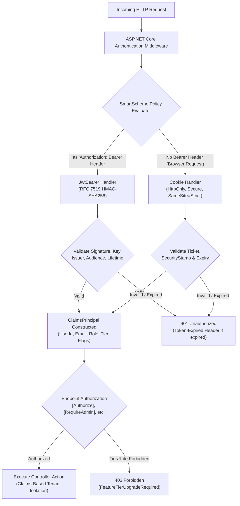
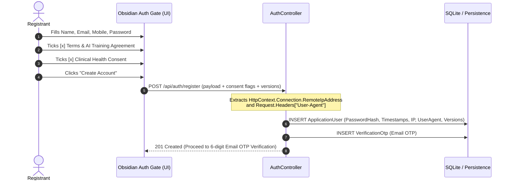
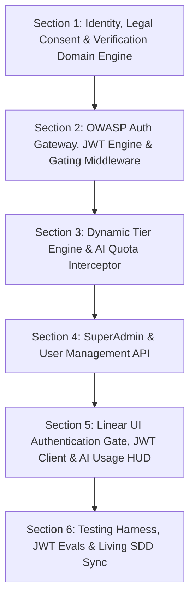

# User Management & Security Architecture Plan: Diet Dost
> **Specification Version**: `v1.6.0-APPROVED-SPEC` (JWT Bearer RFC 7519 & Dual SmartScheme Enhanced)  
> **Target Framework**: `.NET 11 RC` (`net11.0`) with Standalone `.NET Aspire 13.5.4`  
> **Security Standards**: OWASP Top 10 (2021), OWASP Top 10 for LLM / AI Applications (2025), India DPDPA 2023, ISO/IEC 27001 Baseline, JWT Bearer (RFC 7519) & OpenID Connect Core 1.0  
> **Legal Compliance**: Digital Personal Data Protection Act (DPDPA 2023) §6, Consumer Protection (E-Commerce) Rules, Unbundled Health Consent & AI Model Training Governance  
> **Primary Super/God User Configuration**: Configured dynamically via `SUPER_ADMIN_EMAIL` (e.g., `admin@dietdost.app` / parameterized in environment)  

---

## Implementation Progress & Execution Checklist

- [x] **Section 1: Identity, Legal Consent & Verification Domain Engine**
  - [x] Create domain entities (`ApplicationUser`, `VerificationOtp`, `TierFeatureConfiguration`, `AiUsageLog`)
  - [x] Implement PBKDF2 HMAC-SHA512 password hasher (`PasswordHasher`)
  - [x] Implement cryptographic OTP generator (`OtpService`) with 6-digit generation and 5-min TTL
  - [x] Configure EF Core schema mappings & SQLite migration routines in `DietTrackerDbContext`
  - [x] Seed dynamic tier configurations (`Free`, `Basic`, `Premium`, `Admin`, `SuperAdmin`)
  - [x] Migrate legacy sample profiles and records to configured SuperAdmin account
  - [x] Verify domain invariants and unit test suite in `IdentityDomainModelTests` (36/36 passing)

- [x] **Section 2: OWASP Auth Gateway, JWT Engine & Gating Middleware**
  - [x] Define `IJwtTokenService` interface and implement `JwtTokenService` with HMAC-SHA256 signing
  - [x] Configure ASP.NET Core `AddPolicyScheme` ("SmartScheme") for dual JWT Bearer & Cookie routing
  - [x] Implement `AuthController` endpoints (`/register`, `/verify-otp`, `/login`, `/token`, `/resend-otp`, `/logout`, `/me`, `/delete-account`)
  - [x] Implement Polly sliding-window rate limiting on login/OTP/token endpoints (max 5 attempts / 15 mins)
  - [x] Implement claim-based tenant isolation in `UserClaimsExtensions` supporting both URI and JWT claims
  - [x] Enforce `[Authorize]` attributes across all clinical endpoints (`Meals`, `Profile`, `ProgressPhotos`, `Analytics`)

- [x] **Section 3: Dynamic Tier Engine & AI Quota Interceptor**
  - [x] Implement `ITierConfigurationService` with memory caching for dynamic tier thresholds
  - [x] Implement `IAiQuotaService` computing localized midnight resets based on user timezone
  - [x] Enforce `403 Forbidden` (`AiQuotaExceeded`) on photo & text meal detection endpoints when daily limit is exhausted
  - [x] Record all AI operations (photo, text, retakes) and token telemetry in `AiUsageLogs`
  - [x] Enforce `403 Forbidden` (`FeatureTierUpgradeRequired`) on Photo Compare and Excel export for Free/Basic tiers
  - [x] Enforce client-side tier defense: block Excel client export and show upgrade prompt for Free/Basic tiers in `analytics-chart.js`
  - [x] Enforce client-side tier defense: display Obsidian-dark locked state with upgrade CTA on `#face-progress-card` in `progress-modal.js`

- [x] **Section 4: SuperAdmin & User Management API**
  - [x] Implement `AdminController` protected by `[Authorize(Roles = "Admin,SuperAdmin")]`
  - [x] Expose user management APIs (paginated users list, tier upgrades, account lock/unlock)
  - [x] Expose runtime tier configuration APIs (GET / PUT dynamic tier parameters)
  - [x] Enforce SuperAdmin lock/demotion immunity invariants

- [x] **Section 5: Linear UI Authentication Gate, JWT Client & AI Usage HUD**
  - [x] Build Obsidian-dark `auth-gate.html` modal blocking unauthorized DOM rendering
  - [x] Implement dual legal consent checkboxes (Terms & AI Training License + Sensitive Health Consent)
  - [x] Implement local dev OTP helper banner for testing without external SMS/SMTP bills
  - [x] Integrate client-side JWT token storage in `auth-service.js` (`localStorage`)
  - [x] Update `api-client.js` with `_getAuthHeaders()` injecting `Authorization: Bearer <token>`
  - [x] Implement `Token-Expired: true` detection and automatic session re-authentication
  - [x] Update `header.html` with tier pill badges (`⚡ Premium`, `👑 Super User`, `🆓 Free`) and account dropdown
  - [x] Build interactive "AI Quota & Usage" HUD in `profile-modal.html` and admin portal in `admin-modal.html`

- [x] **Section 6: Testing Harness, JWT Evals & Living SDD Sync**
  - [x] Build automated test suite for JWT authentication (`JwtAuthenticationTests.cs`)
  - [x] Build automated test suite for cryptography, password hashing, and OTPs (`SecurityCryptographyTests.cs`)
  - [x] Build automated test suite for Polly rate limiting (`PollyRateLimitingTests.cs`)
  - [x] Build automated test suite for AI quotas, photo telemetry, and tier feature gating (`AiQuotaAndTierServiceTests.cs`)
  - [x] Synchronize Living SDD (`00_sdd_index.md`, `02_solution_architecture.md`, `04_security_and_compliance.md`)
  - [x] Append comprehensive log entries in `docs/sdd/07_living_documentation_log.md` (`[LOG-20260924-009]`, `[LOG-20260924-010]`, `[LOG-20260924-011]`)
  - [x] Full solution test verification (`dotnet test`: 86/86 passing, 0 warnings, 0 errors)

---

## 1. Executive Summary & Gating Mandate

This document defines the complete engineering specification for implementing **User Management, Cost-Optimized Dual-Identifier Authentication, Dual SmartScheme Authentication (JWT Bearer RFC 7519 + HttpOnly Cookie), Role-Based Authorization, Dynamic Tier Quotas, Legal Dual-Consent Governance, and AI Telemetry Tracking** for **Diet Dost**.

### 1.1 Strict Gating Mandate (Zero Unauthorized Data or UI Access)
1. **Unauthenticated / Unverified State**:
   - The application strictly forbids unauthorized users from accessing **any** health data, meals, clinical profiles, progress photos, or dashboard UI elements.
   - All protected API routes (`/api/meals/*`, `/api/profile/*`, `/api/progressphotos/*`, `/api/analytics/*`) return `HTTP 401 Unauthorized` or `HTTP 403 Forbidden`.
   - The client-side application renders an impenetrable **Authentication & Verification Gate** (Obsidian Dark design aesthetic) and **never** mounts or caches any dashboard or clinical DOM nodes until a valid, verified session is confirmed.
2. **Cost-Optimized Verification Model**:
   - **Mandatory Registration Fields**: Every user **must provide both Email and Mobile Phone Number** during registration.
   - **Verification Requirement**: 
     - **Email Verification is Mandatory**: Verified via a 6-digit One-Time Password (OTP) before the account is activated (`IsEmailVerified == true`).
     - **Mobile SMS Verification is Optional / Deferred**: To prevent external SMS gateway fees (e.g. Twilio / AWS SNS SMS charges), mobile verification is initially optional (`IsMobileVerified` defaults to `false`, but account activates upon email verification). An SMS verification flow can be triggered later by the user or toggled globally via configuration (`Auth:RequireMobileVerification = false`).
3. **Primary Super/God User Governance (Zero-PII Standard)**:
   - The initial Super/God User (`SuperAdmin`) email is parameterized via configuration:
     - Configuration Key: `Auth:SuperAdminEmail` (or Environment Variable `SUPER_ADMIN_EMAIL`).
     - Default in development: `admin@dietdost.app` (configurable in `appsettings.json` or local secrets to match the administrator's private email without committing personal PII to Git).
   - The designated SuperAdmin has infinite AI quotas, full user management capabilities, and dynamic tier configuration governance.
   - Existing sample profile (`Aarav Sharma`), meals, and progress photos currently tied to `"user-default"` will be migrated directly to the configured SuperAdmin account.

### 1.2 Dual SmartScheme Authentication Architecture (JWT Bearer RFC 7519 + Secure Cookie)
To support diverse client types—including browser-based Single Page Applications (SPAs), mobile applications (Flutter/MAUI), IoT health devices, and automated test evaluation harnesses—Diet Dost implements an ASP.NET Core **Dual SmartScheme Authentication Architecture**:



1. **SmartScheme Dynamic Routing**:
   - Registered via `builder.Services.AddAuthentication("SmartScheme").AddPolicyScheme(...)`.
   - Checks `context.Request.Headers.Authorization`: if the header starts with `Bearer `, requests are forwarded to `JwtBearerDefaults.AuthenticationScheme`; otherwise, they seamlessly route to `CookieAuthenticationDefaults.AuthenticationScheme`.
2. **Dual-Issuance Model**:
   - Successful calls to `/api/auth/login` and `/api/auth/verify-otp` establish the browser session cookie AND emit a cryptographically signed JWT token in the response JSON payload.
   - A dedicated endpoint `POST /api/auth/token` provides direct token generation for headless, API-only, or mobile clients.
3. **Claims Payload Contract**:
   - `sub` (`ClaimTypes.NameIdentifier`): Unique user GUID string.
   - `email` (`ClaimTypes.Email`): User email address.
   - `name` (`ClaimTypes.Name`): User display name.
   - `role` (`ClaimTypes.Role`): Role (`User`, `Admin`, `SuperAdmin`).
   - `tier`: Dynamic tier (`Free`, `Basic`, `Premium`, `SuperAdmin`).
   - `isEmailVerified`: `"true"` or `"false"`.
   - `isMobileVerified`: `"true"` or `"false"`.
   - `jti`: Cryptographically random GUID per token instance.
4. **Cryptographic Integrity & Defense**:
   - Algorithm: Symmetric HMAC-SHA256 (`SecurityAlgorithms.HmacSha256Signature`).
   - Secret Key Minimum: 256 bits (32 bytes), validated upon startup via `JwtTokenService`.
   - Default Lifetime: 1440 minutes (24 hours), configurable via `Jwt:ExpiryMinutes`.
   - Clock Skew Tolerance: Tight 30-second window (`ClockSkew = TimeSpan.FromSeconds(30)`).
   - Expiration Signaling: Emits `Token-Expired: true` response header on expired tokens for clean client re-authentication.

---

## 2. Legal Advisor Framework: Dual-Consent & Data Governance Agreement

Under Section 6 of India's **Digital Personal Data Protection Act (DPDPA 2023)**, global health privacy norms (GDPR Art. 9, HIPAA de-identification standards), and the Consumer Protection Act, **bundled "take-it-or-leave-it" consents are legally vulnerable and face severe regulatory penalties**.

To give **Diet Dost complete legal immunity, regulatory compliance, and unambiguous intellectual property rights** over AI model training and commercial partner data sharing, registration enforces **two distinct, unbundled, timestamped agreements**.

### 2.1 The Two Mandatory Legal Agreements at Registration

#### Agreement 1: General Terms of Service, Privacy Policy & AI Training/Partner Data License
- **UI Label**: 
  > 🔲 **I agree to the [Terms of Service](javascript:openTermsModal()) and [Data & AI Privacy Policy](javascript:openPrivacyModal())** *(Required)*  
  > *"I grant Diet Dost a worldwide, royalty-free license to use de-identified meal logs, food images, nutritional corrections, and anonymized app telemetry for internal research, AI model training/fine-tuning (including Indian Food SLM and Multimodal Vision models), and commercial sharing with trusted clinical, academic, and technology partners."*
- **Binding Legal Clauses Covered**:
  1. **Medical Non-Liability & Wellness Scope**: Explicitly establishes that Diet Dost is an AI nutrition companion and informational tool—**not** a licensed medical provider or diagnostic tool. No physician-patient relationship is formed. Users agree to consult a registered physician before initiating caloric deficits.
  2. **Model Training & Intellectual Property License**: Users grant Diet Dost the non-exclusive, irrevocable right to strip PII and utilize food photography, meal descriptions, and user feedback corrections to train, benchmark, and deploy local SLM (Small Language Models) and multimodal vision models.
  3. **Company Internal Usage & Analytics**: Diet Dost may analyze aggregated usage trends, macro distributions, and regional dietary patterns for product development and marketing insights.
  4. **Trusted Partner Sharing**: Diet Dost reserves the right to share de-identified and aggregated dietary cohorts with institutional research partners, ICMR/nutrition researchers, and commercial health partners.

#### Agreement 2: Sensitive Personal Health Data Processing Consent
- **UI Label**:
  > 🔲 **I provide explicit consent for Clinical Health & Nutrition Processing** *(Required)*  
  > *"I explicitly authorize Diet Dost to collect, store, and process my health metrics (height, weight, biological sex, age), diagnosed medical conditions (e.g. Type 2 Diabetes, Hypertension, PCOS, Thyroid), and prescribed medications strictly to calculate personalized ICMR-NIN 2024 caloric budgets and clinical dietary alerts."*
- **Binding Legal Clauses Covered**:
  1. **Sensitive Personal Data (SPD) Acknowledgment**: Acknowledges processing of clinical markers protected under DPDPA 2023.
  2. **Purpose Limitation**: Health data is processed strictly for clinical dietetics calculations and drug-nutrient interaction warnings.
  3. **Zero Assumption Rule Compliance**: Acknowledges that accurate inputs are mandatory for safe Mifflin-St Jeor calculations.

### 2.2 Tamper-Evident Legal Audit Trail (Evidentiary Defense)
Under DPDPA 2023 §6(10), the *Data Fiduciary* (Diet-Dost) bears the burden of proving that consent was affirmatively granted. Storing a simple `true` boolean without forensic telemetry is legally insufficient in arbitration or regulatory inquiries.

The database records a forensic consent manifest for every user account:
- `TermsAcceptedAtUtc`: Precise UTC timestamp when Agreement 1 was checked.
- `TermsVersionAccepted`: Version string (e.g. `"v1.0-202609"`).
- `HealthConsentAcceptedAtUtc`: Precise UTC timestamp when Agreement 2 was checked.
- `HealthConsentVersionAccepted`: Version string (e.g. `"v1.0-202609"`).
- `ConsentIpAddress`: Client IPv4/IPv6 address recorded at the registration transaction boundary.
- `ConsentUserAgent`: Full browser / operating system client string (e.g. `Mozilla/5.0...`).



---

## 3. OWASP Top 10 & OWASP AI Top 10 Compliance Matrix

| Vulnerability Domain | Standard Ref | Threat Scenario | Mitigation in Diet Dost Architecture |
|---|---|---|---|
| **Broken Access Control** | OWASP A01:2021 | User tampers with `userId` query/body param to access another user's meals or clinical metrics. | Strict Claim-Based Tenant Isolation: All controllers extract `UserId` strictly from cryptographically validated Claims (`UserClaimsExtensions.GetUserId(User)`). Client-supplied `userId` parameters are completely eliminated. |
| **Tier & Quota Enforcement** | OWASP A01 & A04 | User bypasses tier restrictions to use unauthorized features (e.g., Free user attempting Photo Compare or Excel export) or exhausts AI quota. | Granular `403 Forbidden` Enforcement: If an unauthorized feature is attempted, return `403 Forbidden` (`FeatureTierUpgradeRequired`). If daily AI quota is exhausted, return `403 Forbidden` (`AiQuotaExceeded`) with localized reset countdown. |
| **Cryptographic Failures** | OWASP A02:2021 | Password compromise, weak token signing, or plain-text auth tokens in transit. | Passwords hashed with PBKDF2 (HMAC-SHA512, 100,000+ iterations). JWT tokens signed using HMAC-SHA256 with minimum 256-bit keys (`Jwt:Key`). Browser cookies protected via `HttpOnly`, `Secure`, `SameSite=Strict`. Transport enforced via TLS 1.3 / HSTS. |
| **Injection** | OWASP A03:2021 | SQL injection or script injection via user input fields. | All queries executed through EF Core parameterized expressions. Anti-XSS encoding on all dynamic inputs. |
| **Insecure Design & Brute Force** | OWASP A04:2021 | Automated OTP guessing or password dictionary attacks on auth endpoints. | Polly Resilience sliding-window rate limiting on login/OTP/token endpoints (max 5 failed attempts per 15 minutes with account lockouts). OTPs cryptographically generated, 6 digits, 5-minute expiry, max 3 verification attempts. |
| **Identification & Auth Failures** | OWASP A07:2021 | Credential stuffing, token tampering, session fixation, unverified fake account spam. | Mandatory Email OTP verification before account activation. JWT signature validation, 30s clock skew tolerance, immediate `401 Unauthorized` on signature tampering, unique `jti` nonces, and sliding expiration. |
| **Model Denial of Service** | OWASP AI LLM04 | Malicious or runaway users bombarding multimodal Gemini vision endpoints, draining API budgets. | Dynamic Tier Quotas (Free: 1/day, Basic: 7/day, Premium: 30/day) evaluated and locked in atomic DB transaction before routing requests to `MicrosoftAgentFoodVisionService`. |
| **Prompt Injection & Output Handling** | OWASP AI LLM01 & LLM02 | User manipulates meal notes to alter AI nutritional assessment or exfiltrate model prompts. | Input sanitization, strict JSON schema output contracts, and confidence gating ($\ge 70\%$). |
| **Sensitive Info Disclosure** | OWASP AI LLM06 | Leaking user health conditions, names, or contact data to AI providers or telemetry logs. | PII redaction middleware: Prompts sent to Gemini contain zero personal identifiers (only meal image stream or dish description). Operational traces log only non-PII operational metadata. |
| **Continuous Feedback Poisoning** | OWASP AI LLM03 | User submits bogus correction data to degrade adaptive model memory. | Admin validation threshold and frequency count thresholds before correction records influence community heuristics. |
| **Model Theft / Key Exfiltration** | OWASP AI LLM10 | API key leak via client-side source code. | Zero client-side AI keys: All LLM requests execute strictly server-side through `Nutrition.Infrastructure.AI`. |

---

## 4. User Roles, Tiers & Dynamic Feature Matrix

### 4.1 Role Hierarchy
- **`SuperAdmin`** (`[SUPER_ADMIN_EMAIL]`): Supreme permissions. Unlimited AI quotas, dynamic tier limits administration, user role assignments, audit logs.
- **`Admin`**: Administrative permissions. Unlimited AI quotas, user management, feature toggling.
- **`User`**: Standard client user. Features and quotas governed strictly by their assigned Tier.

### 4.2 Dynamic Tier Configurations (Database-Driven, Not Hardcoded)
All tier parameters are stored in the database (`TierFeatureConfigurations` table) and can be modified at runtime by `SuperAdmin` or `Admin`:

| Feature / Capability | Free Tier | Basic Tier | Premium Tier | Admin / SuperAdmin | Dynamic Config Field |
|---|---|---|---|---|---|
| **AI Photo Meal Detection** | Max 1 / day | Max 7 / day | Max 30 / day | **Unlimited** ($\infty$) | `DailyAiDetectionLimit` |
| **AI Text Food Detection** | Max 1 / day | Max 7 / day | Max 30 / day | **Unlimited** ($\infty$) | `DailyAiDetectionLimit` |
| **Visual Photo Compare** | ❌ **Disabled** (`403`) | ❌ **Disabled** (`403`) | ✅ **Enabled** | ✅ **Enabled** | `AllowPhotoCompare` |
| **Excel (.xlsx) / CSV Export**| ❌ **Disabled** (`403`) | ❌ **Disabled** (`403`) | ✅ **Enabled** | ✅ **Enabled** | `AllowDataExport` |
| **Historical Analytics** | Up to 7 Days | Up to 30 Days | Full History (365D) | Full History (365D) | `AnalyticsHistoryDays` |
| **Quota Rollover Policy** | **Strict 0** (No carry forward) | **Strict 0** (No carry forward) | **Strict 0** (No carry forward) | N/A | `AllowQuotaRollover = false` |
| **User & Config Management** | ❌ None | ❌ None | ❌ None | ✅ **Full Control** | `CanManageUsersAndTiers` |

> [!IMPORTANT]
> **Daily Reset & Quota Rejection Semantics**:
> - All daily AI detection limits reset automatically at **midnight (00:00:00)** based on the user's localized IANA timezone (`UserProfile.Timezone`, default: `Asia/Kolkata`).
> - Unused quotas from any day are forfeited immediately; **no carry-forward is permitted**.
> - When a user exhausts their daily quota, subsequent calls return:
>   ```json
>   {
>     "error": "AiQuotaExceeded",
>     "message": "Daily AI meal detection limit reached for Free tier (1/1). Limit resets at midnight.",
>     "tier": "Free",
>     "usedToday": 1,
>     "dailyLimit": 1,
>     "resetsAtUtc": "2026-09-24T18:30:00Z",
>     "upgradeUrl": "/#pricing"
>   }
>   ```

---

## 5. Domain Models, Schema Architecture & JWT Configuration

### 5.1 Updated Entities in `Nutrition.Domain`
1. **`ApplicationUser`**:
   - `Id`: GUID string primary key.
   - `Email`: Unique normalized string.
   - `MobileNumber`: Normalized string.
   - `PasswordHash`: PBKDF2 HMAC-SHA512 hash.
   - `SecurityStamp`: Invalidation token on password change.
   - `Role`: `User`, `Admin`, `SuperAdmin`.
   - `Tier`: `Free`, `Basic`, `Premium`, `SuperAdmin`.
   - `IsEmailVerified`: Bool (mandatory for login).
   - `IsMobileVerified`: Bool (optional/deferred for SMS cost control).
   - `IsActive`: Bool.
   - **Legal Compliance Fields**:
     - `TermsAcceptedAtUtc`: DateTime (mandatory).
     - `TermsVersionAccepted`: String (`"v1.0"`).
     - `HealthConsentAcceptedAtUtc`: DateTime (mandatory).
     - `HealthConsentVersionAccepted`: String (`"v1.0"`).
     - `ConsentIpAddress`: String (forensic IP recording).
     - `ConsentUserAgent`: String (forensic browser/device recording).
   - `CreatedAtUtc`, `LastLoginAtUtc`: DateTime.
2. **`VerificationOtp`**:
   - `Id`: GUID string.
   - `UserId`: Foreign key.
   - `Target`: Email or mobile.
   - `OtpCodeHash`: Hashed 6-digit OTP.
   - `Channel`: `Email` or `Sms`.
   - `ExpiresAtUtc`: DateTime (5-minute TTL).
   - `AttemptCount`: Int (max 3).
   - `IsUsed`: Bool.
3. **`TierFeatureConfiguration`**:
   - `Id`: String.
   - `Tier`: `Free`, `Basic`, `Premium`, `Admin`, `SuperAdmin`.
   - `DailyAiDetectionLimit`: Int (1, 7, 30, -1).
   - `AllowPhotoCompare`: Bool.
   - `AllowDataExport`: Bool.
   - `AnalyticsHistoryDays`: Int.
   - `Description`: String.
   - `UpdatedAtUtc`, `UpdatedByUserId`: Audit metadata.
4. **`AiUsageLog`**:
   - `Id`: GUID string.
   - `UserId`: Foreign key.
   - `OperationType`: `PhotoDetection`, `TextDetection`, `ProgressCompare`.
   - `ModelId`: Model identifier.
   - `EstimatedTokensUsed`, `LatencyMs`: Telemetry metrics.
   - `IsSuccess`: Bool.
   - `ErrorReason`: Nullable string.
   - `TimestampUtc`: Universal UTC timestamp.

### 5.2 Local Development Mode OTP Delivery
- In local development mode (`Environment.IsDevelopment()`), OTP codes are:
  1. Emitted to structured Aspire / OpenTelemetry console logs: `[OTP-DISPATCH] Channel: {Channel}, Target: {Target}, Code: {Code}`.
  2. Returned in a non-production development helper header (`X-Dev-Otp-Code`) and displayed in a UI helper banner/toast for frictionless local testing without SMS/SMTP carrier bills.

### 5.3 JWT Configuration & Cryptographic Key Management
JWT token generation and validation are governed by configuration parameters loaded from `appsettings.json`, environment variables, or secret managers:

```json
{
  "Jwt": {
    "Key": "DietDost_SuperSecret_Jwt_SigningKey_2026_Min256BitsLong!",
    "Issuer": "https://dietdost.app",
    "Audience": "https://dietdost.app",
    "ExpiryMinutes": 1440
  }
}
```
- **Configuration Contract**:
  - `Jwt:Key` (or `JWT_KEY`): Symmetric secret key. Validated at startup to enforce $\ge 32$ bytes (256 bits).
  - `Jwt:Issuer` (or `JWT_ISSUER`): Authority identifier string (`https://dietdost.app`).
  - `Jwt:Audience` (or `JWT_AUDIENCE`): Target audience string (`https://dietdost.app`).
  - `Jwt:ExpiryMinutes` (or `JWT_EXPIRY_MINUTES`): Lifespan in minutes (default `1440` / 24 hours).
- **Service Registration**:
  - `IJwtTokenService` registered as a singleton service in `Nutrition.Infrastructure.Security.SecurityInfrastructureExtensions`.

---

## 6. Phased Implementation Roadmap (6 Sections)



### Section 1: Identity, Legal Consent & Verification Domain Engine
- **Git Branch**: `feature/user-management-identity`
- **Deliverables**:
  1. Create domain entities: `ApplicationUser` (with legal dual-consent audit properties), `VerificationOtp`, `TierFeatureConfiguration`, `AiUsageLog`.
  2. Implement PBKDF2 password hasher (`PasswordHasher.cs`) with HMAC-SHA512.
  3. Implement `IOtpService` with 6-digit cryptographic generation and constant-time hash comparison.
  4. Register new `DbSet`s in `DietTrackerDbContext` with safe SQLite schema migration routines.
  5. Seed default dynamic tier configurations.
  6. Data migration: Migrate existing `"user-default"` records to the configured `SuperAdmin` account.
  7. Unit tests for password hashing, OTP verification, legal consent validation invariants, and domain constraints (0 warnings, 100% pass).

### Section 2: OWASP Auth Gateway, JWT Engine & Gating Middleware
- **Git Branch**: `feature/jwt-authentication`
- **Deliverables**:
  1. **JWT Cryptographic Token Service (`IJwtTokenService`, `JwtTokenService`)**:
     - `IJwtTokenService` definition in `Nutrition.Application.Services`:
       - `string GenerateToken(ApplicationUser user, int? expiryMinutes = null)`
       - `ClaimsPrincipal? ValidateToken(string token)`
     - `JwtTokenService` implementation in `Nutrition.Infrastructure.Security`:
       - Enforces minimum 256-bit symmetric key validation.
       - Generates tokens using `SecurityAlgorithms.HmacSha256Signature`.
       - Embeds claims: `sub`, `email`, `name`, `role`, `tier`, `isEmailVerified`, `isMobileVerified`, and `jti`.
       - Validates tokens with strict issuer, audience, signature, and 30-second clock skew tolerance.
  2. **Dual SmartScheme Authentication Pipeline (`Program.cs`)**:
     - Configures ASP.NET Core `AddPolicyScheme("SmartScheme", ...)`:
       - Requests with `Authorization: Bearer <token>` route to `JwtBearerDefaults.AuthenticationScheme`.
       - Requests without Bearer header route to `CookieAuthenticationDefaults.AuthenticationScheme`.
     - Configures `JwtBearerOptions` with `TokenValidationParameters` matching `JwtTokenService`.
     - Configures events: OnAuthenticationFailed sets `Token-Expired: true` header when lifetime expires.
     - Adds explicit authorization policies: `RequireAdmin`, `RequireSuperAdmin`, `RequireActiveUser`.
  3. **Gateway Endpoints in `AuthController`**:
     - `POST /api/auth/register` (Email, Mobile, Password, Name, AcceptsTerms, AcceptsHealthConsent) -> Validates dual consent, extracts client IP/UserAgent, dispatches Email OTP.
     - `POST /api/auth/verify-otp` (Target, Channel, Code) -> Validates OTP, activates account, signs cookie AND returns `{ token, tokenType: "Bearer", expiresIn, user }`.
     - `POST /api/auth/login` (Email or Mobile, Password) -> Requires verified email, signs cookie AND returns `{ token, tokenType: "Bearer", expiresIn, user }`.
     - `POST /api/auth/token` -> Dedicated token issuance endpoint for headless/mobile clients.
     - `POST /api/auth/resend-otp` (Target, Channel) -> Rate-limited OTP resend.
     - `POST /api/auth/logout` -> Clears auth cookie and instructs client to purge bearer token.
     - `GET /api/auth/me` -> Returns current user identity, tier, role, and legal consent version.
     - `POST /api/auth/delete-account` -> DPDPA-compliant self-service account and health data purge.
  4. **Polly Sliding-Window Rate Limiting**:
     - Throttles `/api/auth/login`, `/api/auth/verify-otp`, and `/api/auth/token` (max 5 requests per 15-minute sliding window) to prevent brute force and credential stuffing.
  5. **Universal Claim Mapping & Tenant Isolation (`UserClaimsExtensions.cs`)**:
     - Maps `GetUserId()`, `GetEmail()`, `GetRole()`, `GetTier()` transparently across both standard URI claim types and short JWT claim types (`sub`, `role`, `email`, `name`).
     - Eliminates client-supplied `userId` vulnerabilities across all clinical endpoints (`MealsController`, `ProfileController`, `ProgressPhotosController`, `AnalyticsController`).

### Section 3: Dynamic Tier Engine & AI Quota Interceptor
- **Deliverables**:
  1. Implement `ITierConfigurationService` with memory caching for dynamic tier rules.
  2. Implement `IAiQuotaService`:
     - Computes localized midnight boundaries based on `UserProfile.Timezone`.
     - Queries `AiUsageLogs` for today's AI executions.
     - Returns structured quota status (`Allowed`, `LimitExceeded`, `RemainingCalls`, `ResetsAtUtc`).
  3. Enforce `403 Forbidden` (`AiQuotaExceeded`) on `/api/meals/upload` and `/api/meals/analyze-text` when daily limit is exhausted.
  4. Enforce `403 Forbidden` (`FeatureTierUpgradeRequired`) on `/api/progressphotos/compare` and Excel export for Free and Basic users.
  5. Record all AI operations in `AiUsageLogs`.

### Section 4: SuperAdmin & User Management API
- **Deliverables**:
  1. Create `AdminController` protected by `[Authorize(Roles = "Admin,SuperAdmin")]`:
     - `GET /api/admin/users`: Paginated list of users, their roles, tiers, legal consent timestamps, and AI consumption.
     - `PUT /api/admin/users/{id}/tier`: Update user tier.
     - `PUT /api/admin/users/{id}/status`: Toggle active / locked status.
     - `GET /api/admin/tier-configs`: View all dynamic tier rules.
     - `PUT /api/admin/tier-configs/{tier}`: Update daily limits, feature toggles dynamically.
  2. Hardened rule: SuperAdmin cannot be locked or demoted.

### Section 5: Linear UI Authentication Gate, JWT Client & AI Usage HUD
- **Deliverables**:
  1. `partials/auth-gate.html`: Obsidian-dark Authentication Gate modal blocking the entire dashboard when unauthenticated/unverified.
     - Tabs: **Sign In**, **Register** (with mandatory Email, Mobile, Terms & AI Training Checkbox, and Health Consent Checkbox), **Verify Email OTP**.
     - Accessible legal modal popups for full Terms of Service and Data & AI Training Policy.
     - Shows dev helper badge in local dev mode displaying the generated test OTP.
  2. **Client-Side JWT Token Lifecycle Management**:
     - `auth-service.js`: Stores JWT in `localStorage` under key `diet_dost_jwt_token`. Provides `getToken()`, `setToken()`, and `clearToken()`. Clears token upon logout or 401 response.
     - `api-client.js`: `_getAuthHeaders()` interceptor automatically attaches `Authorization: Bearer <token>` to all outgoing API requests. Detects `Token-Expired: true` header to trigger re-authentication.
  3. `partials/header.html` update:
     - Logged-in user badge with tier pill (`⚡ Premium`, `👑 Super User`, `🆓 Free`).
     - Account dropdown menu (Profile, AI Usage, Admin Panel if eligible, Sign Out).
  4. `partials/profile-modal.html` update:
     - New interactive **"AI Quota & Usage"** section with today's gauge, 1D/7D/30D aggregations, countdown to midnight reset, and recent operations table.
     - Low-quota amber advisory badge when remaining detections = 0.
  5. `partials/admin-modal.html`:
     - Full Admin / Super User portal to manage users, inspect consent dates, and edit tier limits dynamically.
  6. JavaScript state & services updates:
     - `auth-service.js`, `auth-gate.js`, `admin-service.js`, `admin-modal.js`.

### Section 6: Testing Harness, JWT Evals & Living SDD Sync
- **Deliverables**:
  1. **Comprehensive Automated Test Harness**:
     - **JWT Authentication Tests (`JwtAuthenticationTests.cs`)**:
       - `GenerateToken_ShouldProduceValidJwtStructure`: Validates 3 segments (header.payload.signature), HS256 algorithm, issuer, and audience.
       - `GenerateToken_ShouldEmbedRequiredClaims`: Validates extraction of `sub`, `email`, `name`, `role`, `tier`, `isEmailVerified`, `isMobileVerified`, and `jti`.
       - `ValidateToken_ShouldRejectTamperedToken`: Verifies that altering payload bytes or signature causes immediate token rejection (`null`).
       - `ValidateToken_ShouldRejectExpiredToken`: Verifies expired tokens are rejected.
       - `UserClaimsExtensions_ShouldMapBothStandardAndShortJwtClaimTypes`: Confirms parity between XML/SOAP claim URIs and compact JWT claim names.
     - **Legal & Auth Tests**: Registration rejection when consent unchecked, forensic timestamp/IP capture, email OTP verification, login, logout, unauthorized rejection.
     - **Security Tests**: IDOR prevention, rate-limit defense, unverified account lockdown, account deletion purge.
     - **AI Quota Tests**: Free limit (1), Basic limit (7), Premium limit (30), SuperAdmin unlimited, daily midnight reset.
     - **Tier Gate Tests**: Photo compare & Excel export return 403 on Free/Basic.
  2. **Synchronize Living SDD**:
     - Update `docs/sdd/00_sdd_index.md`, `02_solution_architecture.md`, `03_data_models_and_contracts.md`, `04_security_and_compliance.md`.
     - Append comprehensive log entry to `docs/sdd/07_living_documentation_log.md` (`[LOG-20260924-010]`).
  3. **Verification**:
     - `dotnet test` passing with 0 warnings and 0 errors across all test projects.
