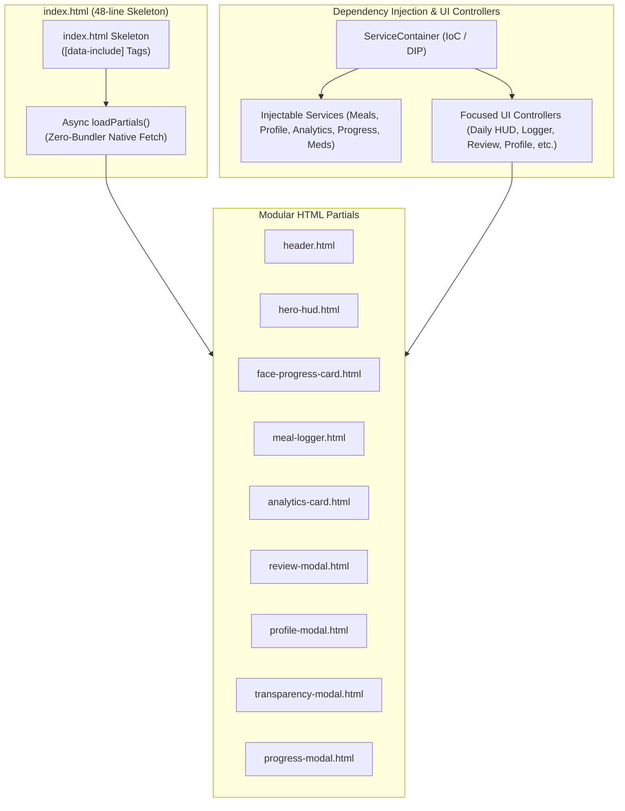
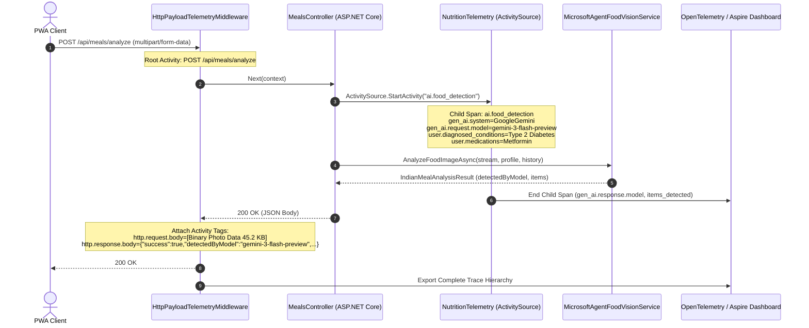

# Master Solution Architecture & Multi-Dimensional Diagrams
> **Specification Version**: `v1.3.1 (Production & Living SDD)`  
> **Architecture Topology**: Distributed Clean Architecture & .NET 11 RC Aspire AppHost  
> **Key Dimensions**: Design System, Application Microservices, Security Boundary, DevOps, Functional Engine  

---

## 1. Master Solution Architecture Blueprint

The solution architecture integrates core architectural dimensions into a cohesive, decoupled topology:

```mermaid
graph TB
    subgraph LAYER_DESIGN ["1. DESIGN & CLIENT PRESENTATION LAYER (Linear.app Aesthetic & PWA)"]
        direction TB
        UI_Linear["Linear Design System<br/>(Obsidian #08090a, Linear Violet #5e6ad2, Emerald #27c380)<br/>Geist Sans & Tabular Numbers"]
        UI_PWA["PWA Web Client & Mobile Shell<br/>(Camera / Photo Capture, Habit Streak HUD, Macro Gauges)"]
        UI_Badge["Model Transparency Badge<br/>('AI:ShowModelDetails': true, Live Model Indicator)"]
        UI_Diary["Food Diary & Logged Meals<br/>(Section Filters: 1D/7D/30D/90D/365D, Card/Grid Views, Excel Export)"]
        UI_DeleteModal["Obsidian Delete Modal<br/>(Danger Pulse, 6-Macro Mini-Pills, Deficit Advisory)"]
        UI_Fallback["Obsidian SVG Image Fallbacks<br/>(Plate & Progress Vector Assets, Capturing Error Interceptor)"]
        UI_Feedback["Delight & Micro-Interactions<br/>(Confetti Micro-Burst, Haptic Feedback, 1-Tap Pill Chips)"]
        UI_Offline["Client-Side Offline Engine<br/>(WASM SQLite with OPFS / IndexedDB Dexie.js & ServiceWorker)"]
        
        UI_Linear --- UI_PWA
        UI_PWA --- UI_Badge
        UI_PWA --- UI_Diary
        UI_PWA --- UI_DeleteModal
        UI_PWA --- UI_Fallback
        UI_PWA --- UI_Feedback
        UI_PWA <-->|Offline Caching & Background Sync| UI_Offline
    end

    subgraph LAYER_SECURITY ["2. SECURITY & BOUNDARY DEFENSE LAYER (OWASP ASVS & Guardrails)"]
        direction TB
        SEC_Perimeter["Perimeter & Transport Security<br/>(TLS 1.3, Strict CSP, Minimal CORS, Secure HTTPOnly Cookies)"]
        SEC_RateLimit["ASP.NET Core RateLimiter<br/>(Token-Bucket per User IP / Bearer Token)"]
        SEC_FileArmor["File Ingestion Armor<br/>(Magic Byte Check: JPEG/PNG/WEBP, Max 8MB, EXIF GPS Stripper)"]
        SEC_AIGuard["AI Prompt Guardrails & Safety<br/>(Prompt Delimiters, Strict JSON Schema, PII Redaction)"]
        SEC_NonPiiLog["Non-PII Diagnostic Logging<br/>(Sanitized DB Exception Logger: Class & Action Only, Zero Clinical Values)"]
        SEC_DataFilter["Data Isolation Guardrails<br/>(EF Core Global Query Filters: UserId == CurrentUser.Id)"]
    end

    subgraph LAYER_GATEWAY ["3. INGRESS & ORCHESTRATION GATEWAY"]
        YARP["YARP API Gateway / Reverse Proxy (.NET 11 RC)<br/>(Path Routing, Auth Token Verification, Distributed Rate Limiting)"]
        MW_Payload["HttpPayloadTelemetryMiddleware<br/>(Request/Response Body Capture -> Activity.SetTag http.request/response.body)"]
    end

    subgraph LAYER_APPLICATION ["4. APPLICATION SERVICES LAYER (DDD Bounded Contexts)"]
        direction TB
        subgraph SVC_PROFILE ["Nutrition.ProfileService"]
            MOD_Profile["User Profile & Clinical Assessment Context"]
            AGG_Profile["Aggregate Root: UserProfile<br/>(Height, Weight, Pace, Dietary Preference, Timezone)"]
            VO_ClinIntake["Value Objects: ClinicalRecord & MedicationRegimen<br/>(Metformin, Thyronorm, Telmisartan, etc.)"]
            VO_Tz["Timezone & Circadian Window<br/>(Auto-Detected IANA Timezone, UTC Normalization)"]
            CALC_BMR["Mifflin-St Jeor & TDEE Calculation Engine"]
        end

        subgraph SVC_VISION ["Nutrition.VisionService"]
            MOD_Vision["AI Multimodal Meal Ingestion Context"]
            AGG_Meal["Aggregate Root: MealLog<br/>(MealType, PhotoUri, Status: Uploaded->Analyzed->Verified)"]
            QTY_Parser["Indian Cooking Quantity Parser<br/>(1.5 Cup, 1 Katori, 5-6 Slices, Steppers)"]
            MACRO_Nutrients["6-Macro Real-Time Aggregator<br/>(Calories, Protein, Carbs, Fat, Fiber, Sugar)"]
            AGENT_Food["Microsoft Agent Framework Agent<br/>(Multi-Model Cascade: 3-Flash -> 2.5-Flash -> 2.5-Pro)"]
            GATE_Confidence["Confidence Gating Engine (>= 70% Auto-Log vs < 70% Retake)"]
            LEARN_Memory["Adaptive Memory & Continuous Learning<br/>(UserCorrectionRecord: Original vs Modified Diff Log)"]
        end

        subgraph SVC_ANALYTICS ["Nutrition.AnalyticsService"]
            MOD_Ledger["Calorie Ledger & Analytics Context"]
            AGG_Ledger["Aggregate Root: DailyCalorieLedger<br/>(User Local Circadian Date, Consumed, Budget, Sugar Ceiling)"]
            PROJ_Trends["Multi-Period Trend Projections<br/>(1D, 7D Deficit, 30D Weight Curve, 90D, 365D Trends)"]
            ENG_Game["Dietitian Dost & Gamification Engine<br/>(Streaks, Daily Health Score 0-100, Achievement Badges)"]
        end
    end

    subgraph LAYER_FUNCTIONAL ["5. FUNCTIONAL CLINICAL DIETETICS ENGINE (ICMR-NIN & WHO)"]
        direction TB
        FUNC_ZeroAssump["Zero-Assumption Intake Engine<br/>(HALTS on missing height/weight/conditions/meds)"]
        FUNC_Matrix["Clinical & Medication Adjustment Matrix<br/>(Diabetes: NetCarbs <= 40% | HTN: Sodium < 1500mg | Thyroid: -12% TDEE)"]
        FUNC_WHO["WHO & ICMR-NIN Rulebook<br/>(Max 20-25g Visible Cooking Fat | 3:1 Cereal:Pulse | Salt < 5g | Free Sugar < 25g | Trans Fat < 1%)"]
        FUNC_Safety["Clinical Safety Floor Checks<br/>(Floor: 1200 kcal F / 1500 kcal M | Max Deficit: 1000 kcal/day)"]
    end

    subgraph LAYER_AI ["6. EXTERNAL AI FOUNDATION"]
        CLOUD_AI["Google AI Pro Cascade<br/>(Gemini 3 Flash Preview [8192 Max Tokens + Thinking] -> 2.5 Flash -> 2.5 Pro)<br/>Tag: detectedByModel"]
    end

    subgraph LAYER_DEVOPS ["7. DEVOPS, INFRASTRUCTURE & OBSERVABILITY LAYER (.NET Aspire 11 RC)"]
        direction TB
        ASPIRE_Host[".NET Aspire AppHost (NET 11 RC)<br/>(Distributed Orchestration & Typed Resource Topology)"]
        ASPIRE_Dash["Aspire Developer Dashboard (Port 18888)<br/>(Blazor Virtualize JS Patched, Live Resources, Traces, Structured Logs)"]
        OTEL_Collector["OpenTelemetry (OTel) Pipeline<br/>(NutritionTelemetry ActivitySource 'Nutrition.DietDost')<br/>GenAI Semantic Tags & Structured Logging Scopes"]
        STORE_Cache[("Redis Cache Cluster<br/>(Session Store, Token Bucket, Query Acceleration)")]
        STORE_Db[("Decoupled Persistence: SQLite V1 / PostgreSQL<br/>(Universal UTC ValueConverters, Schema-Aware PRAGMA Checks, EF ValueComparers)")]
        STORE_Blob[("Encrypted Meal Photo Storage<br/>(Local AppData / Cloud Blob Storage)")]
        CONTAINERS["Containerization & CI/CD<br/>(Docker / Podman, GitHub Actions Pipeline, Health Watchdogs)"]
    end

    %% Flow Relationships
    UI_PWA -->|HTTPS / WSS| SEC_Perimeter
    SEC_Perimeter --> SEC_RateLimit
    SEC_RateLimit --> YARP
    YARP --- MW_Payload

    YARP -->|Route /api/profiles| SVC_PROFILE
    YARP -->|Route /api/meals/upload| SEC_FileArmor
    SEC_FileArmor --> SVC_VISION
    YARP -->|Route /api/analytics| SVC_ANALYTICS

    SVC_PROFILE --> FUNC_ZeroAssump
    FUNC_ZeroAssump --> FUNC_Matrix
    FUNC_Matrix --> FUNC_WHO
    FUNC_WHO --> FUNC_Safety
    FUNC_Safety --> AGG_Profile

    SVC_VISION --> SEC_AIGuard
    SEC_AIGuard --> AGENT_Food
    AGENT_Food <-->|Multimodal Request / Response with Fallback| CLOUD_AI
    AGENT_Food --> GATE_Confidence
    GATE_Confidence -->|Confidence >= 70% Verified| AGG_Meal
    GATE_Confidence -->|< 70% Retake Prompt / Manual Fallback| UI_PWA
    AGG_Meal --> LEARN_Memory

    AGG_Meal -.->|Domain Event: MealConfirmedEvent| SVC_ANALYTICS
    SVC_ANALYTICS --> AGG_Ledger
    AGG_Ledger --> PROJ_Trends
    AGG_Ledger --> ENG_Game
    ENG_Game -.->|Streak & Badge Notifications| UI_Feedback

    %% Data Isolation & Persistence
    SVC_PROFILE --> SEC_DataFilter
    SVC_VISION --> SEC_DataFilter
    SVC_ANALYTICS --> SEC_DataFilter
    SEC_DataFilter --> STORE_Db
    SVC_VISION --> STORE_Blob
    YARP <--> STORE_Cache
    STORE_Db --- SEC_NonPiiLog

    %% DevOps & Telemetry Wiring
    ASPIRE_Host -->|Orchestrates| YARP
    ASPIRE_Host -->|Orchestrates| SVC_PROFILE
    ASPIRE_Host -->|Orchestrates| SVC_VISION
    ASPIRE_Host -->|Orchestrates| SVC_ANALYTICS
    ASPIRE_Host -->|Orchestrates| STORE_Cache
    ASPIRE_Host -->|Orchestrates| STORE_Db

    YARP -.->|Traces with Payloads| OTEL_Collector
    SVC_PROFILE -.->|Traces & Metrics| OTEL_Collector
    SVC_VISION -.->|GenAI Semantic Spans & Scopes| OTEL_Collector
    SVC_ANALYTICS -.->|Traces & Metrics| OTEL_Collector
    OTEL_Collector --> ASPIRE_Dash
```

---

## 2. Specialized Flow & Security Sub-Diagrams

### 2.1 Functional Meal Ingestion & Confidence Gating Flow
Refer to standalone source: [`functional_meal_flow.mermaid`](file:///c:/Users/nikunj.banker/source/repos/diet-dost/docs/architecture/diagrams/functional_meal_flow.mermaid).

### 2.2 Security Perimeter & Data Isolation Boundary
Refer to standalone source: [`security_boundary.mermaid`](file:///c:/Users/nikunj.banker/source/repos/diet-dost/docs/architecture/diagrams/security_boundary.mermaid).

### 2.3 DevOps & Observability Topology (.NET Aspire 11 RC)
Refer to standalone source: [`devops_observability.mermaid`](file:///c:/Users/nikunj.banker/source/repos/diet-dost/docs/architecture/diagrams/devops_observability.mermaid).

### 2.4 Presentation Layer: Native ES Modules & HTML Partials Architecture
Refer to standalone source: [`frontend_modular_architecture.mermaid`](file:///c:/Users/nikunj.banker/source/repos/diet-dost/docs/architecture/diagrams/frontend_modular_architecture.mermaid).

---

### 2.5 End-to-End Trace & Observability Hierarchy

To achieve transparent observability in the .NET Aspire Dashboard without compromising clinical privacy or PII, the request and detection pipeline is instrumented with hierarchical OpenTelemetry spans:

