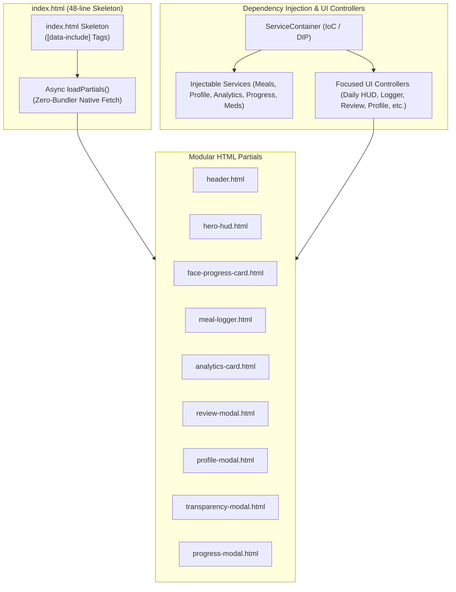
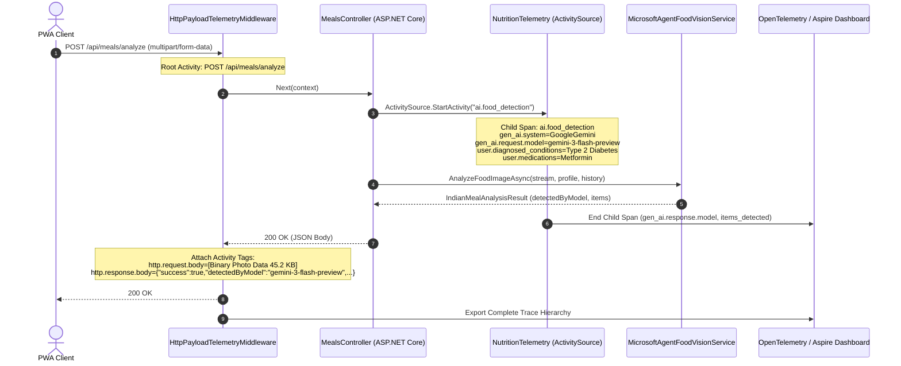
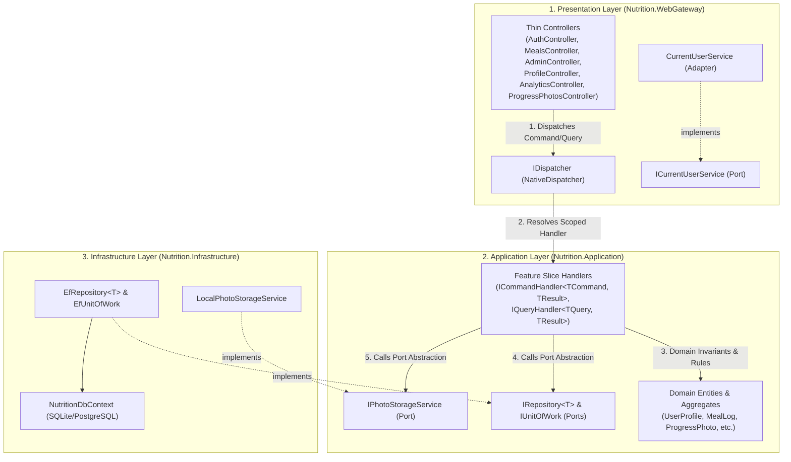
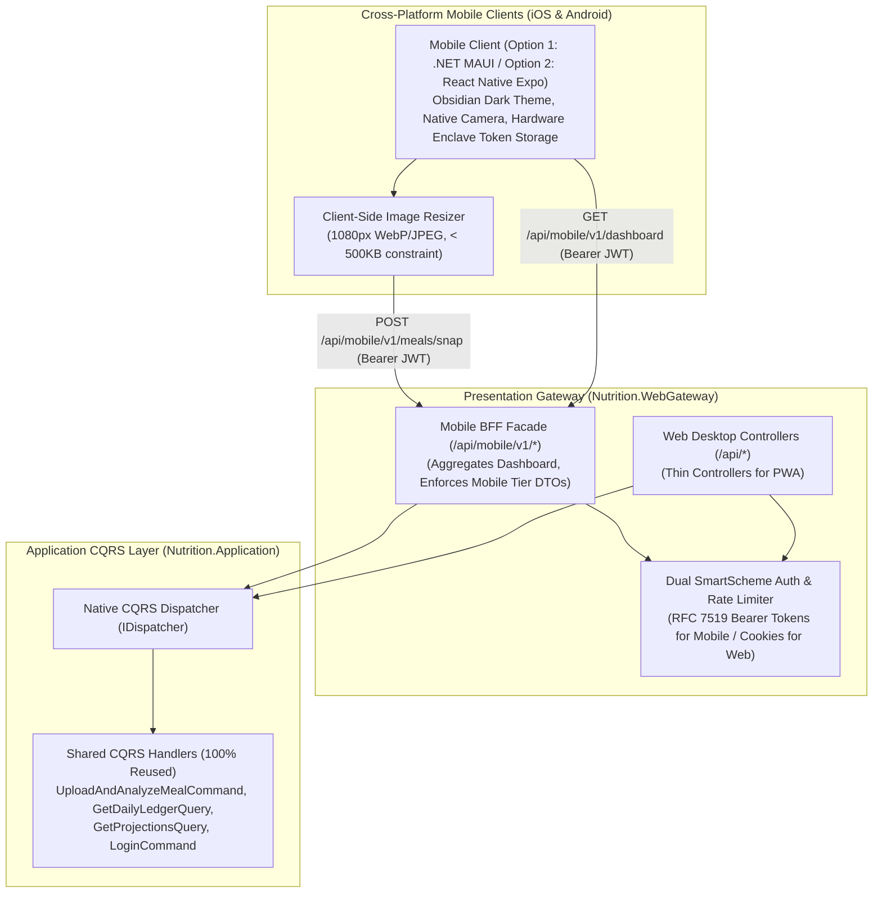

<!--
  Copyright (c) 2026 diet-dost and/or its contributors.
  Licensed under the "GNU Affero General Public License v3.0 only" and
  the "Server Side Public License, v 1"; you may not use this file except
  in compliance with, at your election, the "GNU Affero General Public
  License v3.0 only" or the "Server Side Public License, v 1".
-->

# Master Solution Architecture & Multi-Dimensional Diagrams
> **Specification Version**: `v1.3.1 (Production & Living SDD)`  
> **Architecture Topology**: Distributed Clean Architecture & .NET 11 RC Aspire AppHost  
> **Key Dimensions**: Design System, Application Microservices, Security Boundary, DevOps, Functional Engine  

---

## 1. Master Solution Architecture Blueprint

The solution architecture integrates core architectural dimensions into a cohesive, decoupled topology:

```mermaid
graph TB
    %% =========================================================================
    %% MASTER SOLUTION ARCHITECTURE: DIET DOST (.NET 11 RC & ASPIRE)
    %% Clean Architecture, Native CQRS, Database Secret Store, Debug-Only Isolation
    %% =========================================================================

    subgraph LAYER_DESIGN ["1. PRESENTATION LAYER (Linear.app Glassmorphic PWA Client)"]
        direction TB
        UI_Linear["Linear Design System<br/>(Obsidian #08090a, Linear Violet #5e6ad2, Emerald #27c380)<br/>Geist Sans & Tabular Numbers"]
        UI_AuthGate["Obsidian Dark Auth Gate<br/>(Dual DPDPA 2023 Forensic Consent & Tier Engine)"]
        UI_PWA["PWA Web Client & Mobile Shell<br/>(Camera / Photo Capture, Habit Streak HUD, Macro Gauges)"]
        UI_Tiers["Dynamic Tier Status Badges<br/>(Free, Basic, ⚡ Premium, 👑 SuperAdmin)"]
        UI_Diary["Food Diary & History<br/>(1D/7D/30D/90D/365D Filter, Card/Grid Toggle, Excel Export)"]
        UI_DeleteModal["Custom Obsidian Delete Modal<br/>(Danger Pulse & Deficit Recalculation Advisory)"]
        UI_Fallback["Static Vector Fallback Armor<br/>(placeholder-meal.svg & placeholder-progress.svg)"]
        UI_Offline["Client-Side Offline Engine<br/>(WASM SQLite with OPFS / IndexedDB Dexie.js & ServiceWorker)"]
        
        UI_Linear --- UI_AuthGate
        UI_AuthGate --- UI_PWA
        UI_PWA --- UI_Tiers
        UI_PWA --- UI_Diary
        UI_Diary --- UI_DeleteModal
        UI_PWA --- UI_Fallback
        UI_PWA <-->|Offline Caching & Background Sync| UI_Offline
    end

    subgraph LAYER_SECURITY ["2. SECURITY & BOUNDARY DEFENSE LAYER (OWASP ASVS & Guardrails)"]
        direction TB
        SEC_Perimeter["Perimeter & Transport Security<br/>(TLS 1.3, Strict CSP, Minimal CORS, Secure HTTPOnly Cookies)"]
        SEC_DualAuth["Dual SmartScheme Authentication<br/>(RFC 7519 JWT Bearer + Secure HttpOnly Cookie)"]
        SEC_DebugGuard["Debug-Only Demo User Security Isolation<br/>(#if DEBUG & IAppEnvironment.AllowsDemoUsers)<br/>Release Mode Seeding Suppression & Auto-Deactivation"]
        SEC_RateLimit["ASP.NET Core RateLimiter<br/>(Polly Sliding Window per User IP / Bearer Token)"]
        SEC_FileArmor["File Ingestion Armor<br/>(Magic Byte Check: JPEG/PNG/WEBP, Max 8MB, EXIF GPS Stripper)"]
        SEC_AIGuard["AI Prompt Guardrails & Safety<br/>(Prompt Delimiters, Strict JSON Schema, PII Redaction)"]
        SEC_DataFilter["Data Isolation Guardrails<br/>(EF Core Global Query Filters: UserId == CurrentUser.Id)"]
    end

    subgraph LAYER_GATEWAY ["3. PRESENTATION GATEWAY (Nutrition.WebGateway)"]
        direction TB
        CONTROLLERS["Thin REST Controllers (.NET 11 RC)<br/>(AuthController, MealsController, ProfileController, AnalyticsController, AdminController)"]
        MW_Pipeline["HTTP Middleware Pipeline<br/>(Authentication, Rate Limiting, Exception Handling RFC 7807, HttpPayloadTelemetry)"]
        CONFIG_DB["DatabaseConfigurationProvider<br/>(Loads AppSecrets into ASP.NET Core IConfiguration during startup)"]
    end

    subgraph LAYER_APPLICATION ["4. APPLICATION LAYER (Nutrition.Application - Clean Architecture)"]
        direction TB
        CQRS_Engine["Native CQRS Pipeline (Zero MediatR Dependency)<br/>(Pure Microsoft.Extensions.DependencyInjection Handlers)"]
        
        subgraph USECASES_AUTH ["Identity & Security Use Cases"]
            CMD_Login["LoginCommandHandler<br/>(Debug-Only Demo Guard & JWT Generation)"]
            CMD_Register["RegisterUserCommandHandler<br/>(DPDPA Consent & PasswordPolicy)"]
            CMD_Reset["ResetPasswordCommandHandler<br/>(Active User Check & Policy)"]
        end

        subgraph USECASES_VISION ["Meal Vision Use Cases"]
            CMD_MealUpload["UploadMealCommandHandler<br/>(Tier Quota Check & Cascade Vision)"]
            CMD_MealReview["ReviewMealCommandHandler<br/>(Macro Recalculation)"]
        end

        subgraph USECASES_PROFILE ["Clinical Profile Use Cases"]
            CMD_SaveProfile["SaveProfileCommandHandler<br/>(Mifflin-St Jeor & ICMR-NIN Safeguards)"]
            QRY_GetProfile["GetProfileQueryHandler<br/>(TDEE & Target Budget Calculation)"]
        end

        subgraph USECASES_ANALYTICS ["Analytics & Ledger Use Cases"]
            QRY_Ledger["GetTodayLedgerQueryHandler<br/>(6-Macro Balances & Daily Deficit)"]
            QRY_History["GetMealHistoryQueryHandler<br/>(Multi-Period Trend Filtering)"]
        end

        PORTS["Application Ports & Abstractions<br/>(ISecretStore, IAppEnvironment, IPhotoStorageService, IRepository, IUnitOfWork)"]
    end

    subgraph LAYER_DOMAIN ["5. DOMAIN CORE LAYER (Nutrition.Domain - DDD)"]
        direction TB
        subgraph AGGREGATES ["Domain Aggregates & Entities"]
            AGG_User["ApplicationUser (Aggregate Root)<br/>(DPDPA Consent Timestamps, SecurityStamp, DemoEmails, Tier, Role)"]
            AGG_Profile["UserProfile (Aggregate Root)<br/>(Height, Weight, Pace, Dietary Preference, IANA Timezone)"]
            AGG_Meal["MealLog (Aggregate Root)<br/>(MealType, PhotoUri, Status: Uploaded->Analyzed->Verified)"]
            AGG_Ledger["DailyCalorieLedger (Aggregate Root)<br/>(Date, Consumed, Budget, Pending Deficit)"]
            ENT_Secret["AppSecret Entity<br/>(Key, Value, Description, CreatedAtUtc, UpdatedAtUtc)"]
            ENT_TierConfig["TierFeatureConfiguration<br/>(DailyAiLimit: 1, 7, 30, -1; PhotoCompare; DataExport)"]
        end

        subgraph CLINICAL ["Clinical Dietetics Safeguards (ICMR-NIN 2024 & WHO)"]
            CALC_BMR["Mifflin-St Jeor BMR & TDEE Multipliers"]
            CLIN_Floors["Starvation Floors (1200 kcal F / 1500 kcal M)"]
            CLIN_Rules["Clinical Matrix (Diabetes, HTN, Thyroid, NAFLD Adjustments)"]
            CLIN_WHO["WHO Asian-Indian Cutoffs & 3:1 Cereal:Pulse Ratio"]
        end
    end

    subgraph LAYER_INFRASTRUCTURE ["6. INFRASTRUCTURE LAYER (Nutrition.Infrastructure - Adapters)"]
        direction TB
        ADAPTER_Secrets["DatabaseSecretStore Adapter<br/>(ConcurrentDictionary In-Memory Cache)"]
        ADAPTER_Env["AppEnvironment Adapter<br/>(#if DEBUG Preprocessor & IHostEnvironment)"]
        ADAPTER_Repo["EfRepository & EfUnitOfWork<br/>(Generic EF Core Data Access)"]
        ADAPTER_Photo["LocalPhotoStorageService<br/>(Cryptographic SHA-256 Hashed File Storage)"]
        ADAPTER_Jwt["JwtTokenService<br/>(HMAC-SHA256 Token Issuer via ISecretStore)"]
        ADAPTER_Agent["Microsoft Agent Framework Vision Agent<br/>(Multi-Model Cascade: 3-Flash -> 2.5-Flash -> 2.5-Pro)"]
        
        DB_Context["DietTrackerDbContext<br/>(SQLite V1, Universal UTC ValueConverter, Schema-Aware PRAGMA, Collection ValueComparers)"]
        TABLE_Secrets[("AppSecrets Table<br/>(Jwt:Key, Auth:DemoPassword, AI:GoogleAI:ApiKey)")]
    end

    subgraph LAYER_ORCHESTRATION ["7. DEVOPS & OBSERVABILITY (.NET Aspire 13.5.4)"]
        direction TB
        ASPIRE_Host[".NET Aspire AppHost (net11.0)<br/>(Distributed Orchestration & Typed Topology)"]
        ASPIRE_Dash["Aspire Developer Dashboard (:18888)<br/>(Live Resources, Distributed Traces, GenAI Semantic Spans)"]
        OTEL_Collector["OpenTelemetry (OTel) Pipeline<br/>(NutritionTelemetry ActivitySource 'Nutrition.DietDost')"]
        TEST_Harness["Validation Harnesses<br/>(122 Automated Tests + pwsh validate_e2e_tiers.ps1)"]
    end

    %% Flow Connections
    UI_PWA -->|HTTPS / WSS| SEC_Perimeter
    SEC_Perimeter --> SEC_RateLimit
    SEC_RateLimit --> SEC_DualAuth
    SEC_DualAuth --> CONTROLLERS
    
    CONTROLLERS --> MW_Pipeline
    CONTROLLERS --> CQRS_Engine
    CONFIG_DB -.->|Injects DB Secrets| CONTROLLERS
    
    CQRS_Engine --> CMD_Login
    CQRS_Engine --> CMD_Register
    CQRS_Engine --> CMD_MealUpload
    CQRS_Engine --> CMD_SaveProfile
    CQRS_Engine --> QRY_Ledger

    CMD_Login --> SEC_DebugGuard
    CMD_Login --> PORTS
    CMD_MealUpload --> PORTS
    CMD_SaveProfile --> PORTS
    QRY_Ledger --> PORTS

    PORTS -.->|Implements| ADAPTER_Secrets
    PORTS -.->|Implements| ADAPTER_Env
    PORTS -.->|Implements| ADAPTER_Repo
    PORTS -.->|Implements| ADAPTER_Photo

    ADAPTER_Repo --> DB_Context
    ADAPTER_Secrets --> DB_Context
    DB_Context --> TABLE_Secrets
    ADAPTER_Agent --> CLOUD_AI["Google Gemini Multimodal Vision API"]

    CMD_SaveProfile --> CLINICAL
    CLINICAL --> AGG_Profile
    CMD_Login --> AGG_User

    %% Telemetry & Observability
    MW_Pipeline -.->|Payload Telemetry| OTEL_Collector
    CQRS_Engine -.->|GenAI Semantic Spans| OTEL_Collector
    OTEL_Collector --> ASPIRE_Dash
    ASPIRE_Host -->|Orchestrates| CONTROLLERS
    ASPIRE_Host -->|Orchestrates| ASPIRE_Dash
    TEST_Harness -.->|Validates E2E Tiers| CONTROLLERS
```

---

## 2. Specialized Flow & Security Sub-Diagrams

### 2.1 Functional Meal Ingestion & Confidence Gating Flow
Refer to standalone source: [`functional_meal_flow.mermaid`](file:///c:/Users/nikunj.banker/source/repos/diet-dost/docs/architecture/diagrams/functional_meal_flow.mermaid).

### 2.2 Security Perimeter & Data Isolation Boundary
Refer to standalone source: [`security_boundary.mermaid`](file:///c:/Users/nikunj.banker/source/repos/diet-dost/docs/architecture/diagrams/security_boundary.mermaid).

### 2.3 DevOps & Observability Topology (.NET Aspire 11 RC)
Refer to standalone source: [`devops_observability.mermaid`](file:///c:/Users/nikunj.banker/source/repos/diet-dost/docs/architecture/diagrams/devops_observability.mermaid).

### 2.4 Presentation Layer: Native ES Modules & HTML Partials Architecture
Refer to standalone source: [`frontend_modular_architecture.mermaid`](file:///c:/Users/nikunj.banker/source/repos/diet-dost/docs/architecture/diagrams/frontend_modular_architecture.mermaid).

---

### 2.5 End-to-End Trace & Observability Hierarchy

To achieve transparent observability in the .NET Aspire Dashboard without compromising clinical privacy or PII, the request and detection pipeline is instrumented with hierarchical OpenTelemetry spans:

---

### 2.6 Native .NET 11 Clean Architecture & Zero-Dependency CQRS Specification

To enforce strict separation of concerns, eliminate fat presentation controllers, and completely eliminate commercial licensing risks associated with MediatR v13+ (Lucky Penny Software LLC RPL-1.5 / commercial dual licensing), the application utilizes a **Native .NET 11 Zero-Dependency CQRS & Clean Architecture Engine**.

#### 2.6.1 Layer Inversion & Port/Adapter Topology

#### 2.6.2 Key Architectural Tenets
1. **Zero External CQRS Package**: No MediatR or Third-Party Dispatcher dependencies. Uses pure `Microsoft.Extensions.DependencyInjection` with reflection-cached handler invocation.
2. **Thin Controllers**: Controllers contain 0 business logic, 0 direct EF Core queries, 0 direct file system manipulation. They simply extract user claims, bind request objects, dispatch via `_dispatcher.SendAsync(...)` or `_dispatcher.QueryAsync(...)`, and map `Result<T>` envelopes into HTTP responses.
3. **Decoupled Ports & Adapters**: File storage is abstracted behind `IPhotoStorageService` (allowing transparent swaps between local disk, Azure Blob, AWS S3, or Google Cloud Storage). Identity is abstracted behind `ICurrentUserService`.
4. **Universal Result Envelope**: `Result<T>` and `Result` encapsulate operation outcome, typed data payloads, error messages, and HTTP status codes, decoupling application use cases from ASP.NET Core presentation contracts.

---

### 2.7 Cross-Platform Mobile Backend for Frontend (BFF) Topology

To extend Diet-Dost to cross-platform mobile devices (iOS & Android) without duplicating business logic or burdening cellular clients with chatty desktop payloads, the architecture introduces a **Mobile Backend for Frontend (Mobile BFF)** facade:

#### 2.7.1 Key Mobile BFF Tenets
1. **Single-Roundtrip Aggregation**: Mobile dashboard queries combine user profile, daily calorie ledger, remaining AI detection quota, and tier projection history into a single compact JSON response (`/api/mobile/v1/dashboard`), avoiding battery and latency drain on 4G/5G connections.
2. **Client-Side Image Guardrail**: Mobile clients must resize photos to a maximum width of 1080px and compress to under 500KB before transmission, reducing network transit time from ~10s to <1s.
3. **Hardware Enclave Token Storage**: Mobile clients persist the RFC 7519 JWT in native secure storage (iOS Keychain and Android Keystore) rather than unencrypted browser local storage.

