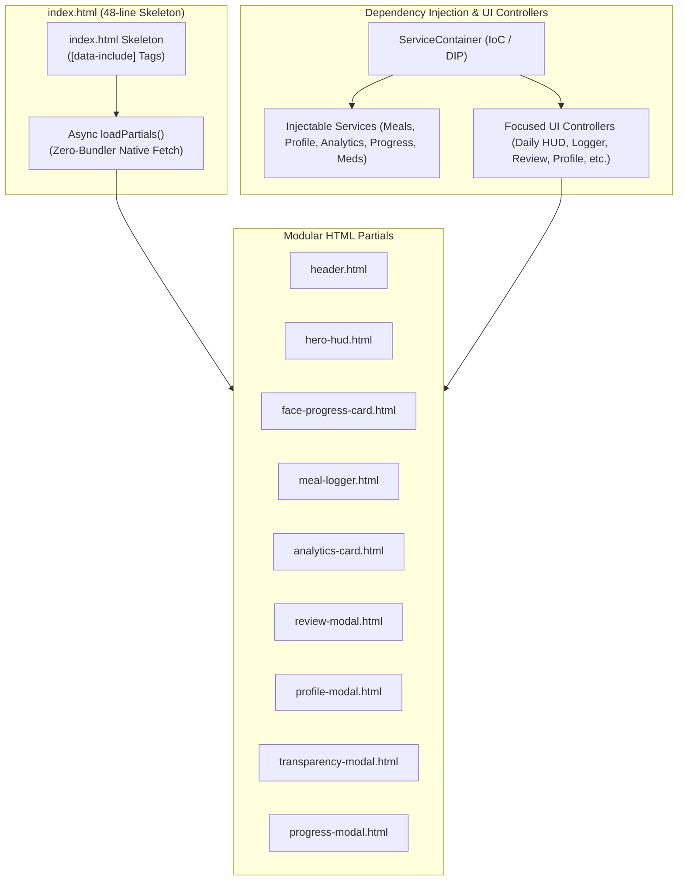
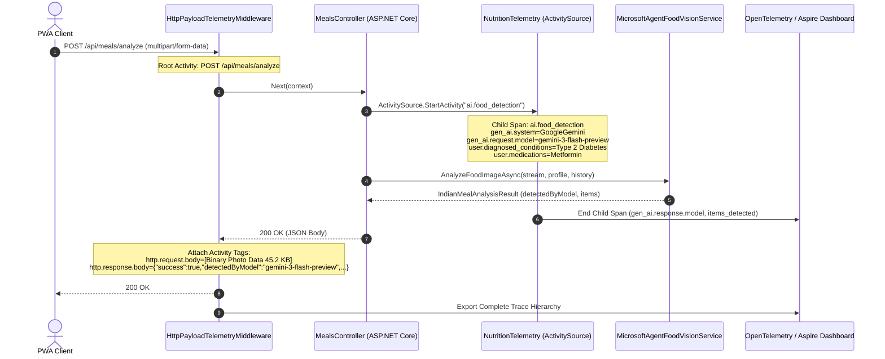
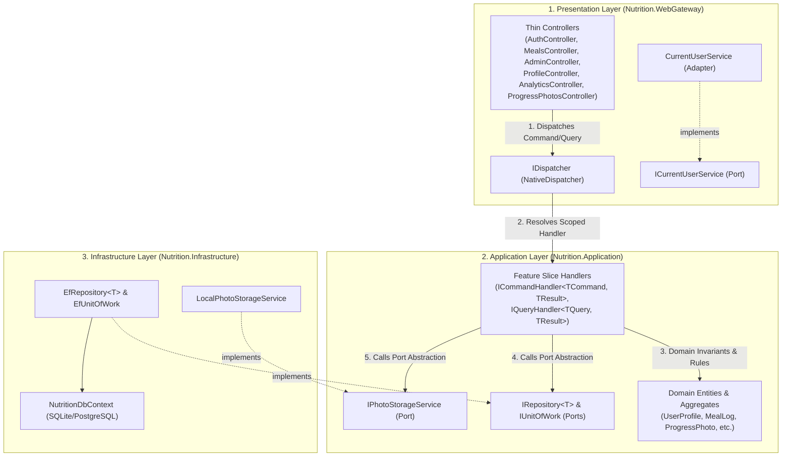
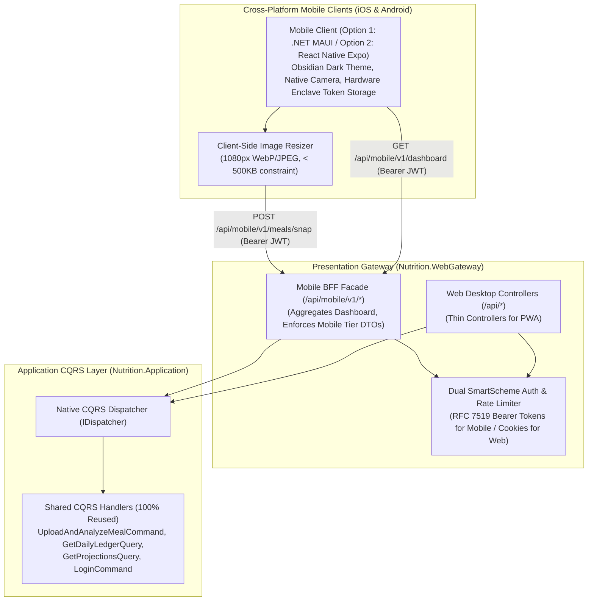
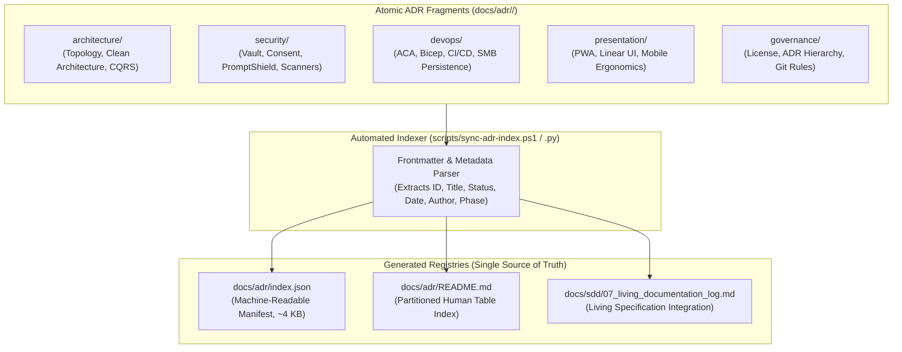

<!--
  Copyright (c) 2026 diet-dost and/or its contributors.
  Licensed under the "GNU Affero General Public License v3.0 only" and
  the "Server Side Public License, v 1"; you may not use this file except
  in compliance with, at your election, the "GNU Affero General Public
  License v3.0 only" or the "Server Side Public License, v 1".
-->

# Master Solution Architecture & Multi-Dimensional Diagrams
> **Specification Version**: `v1.4.0 (Production & Living SDD)`  
> **Architecture Topology**: Distributed Clean Architecture, .NET 11 Aspire AppHost, Azure Container Apps & Key Vault  
> **Key Dimensions**: Design System, Application Microservices, Security Boundary, DevOps, Functional Engine, Subsystem ADR Hierarchy  

---

## 1. Master Solution Architecture Blueprint

The solution architecture integrates core architectural dimensions into a cohesive, decoupled topology:

```mermaid
graph TB
%%
%% Copyright (c) 2026 diet-dost and/or its contributors.
%% Licensed under the "GNU Affero General Public License v3.0 only" and
%% the "Server Side Public License, v 1"; you may not use this file except
%% in compliance with, at your election, the "GNU Affero General Public
%% License v3.0 only" or the "Server Side Public License, v 1".
%%

    %% =========================================================================
    %% MASTER SOLUTION ARCHITECTURE: DIET DOST (.NET 11 & ASPIRE)
    %% Clean Architecture, Native CQRS, Azure Container Apps, SQLite SMB Mount, Key Vault
    %% =========================================================================

    subgraph LAYER_CICD ["0. CI/CD & PRE-DEPLOYMENT SECURITY GATE (Zero Deployment on Failure)"]
        direction TB
        GATE_Scanners["Security & Code Scanning Pipeline (security-scan.yml)<br/>Gitleaks | ESLint | SecurityCodeScan (All 7 .csproj) | Trivy | Checkov | actionlint | AI Defense"]
        GATE_Summary["Security Gate Summary Table & PR Comment Publisher<br/>Blocks Azure Deployment if Any Scanner Fails"]
        GATE_Deploy["Two-Stage Automated Deployment Workflows<br/>Stage 1: azure-infra-deploy.yml (Bicep IaC) | Stage 2: azure-app-deploy.yml (ACA & Custom Domain TLS)"]
        GATE_Scanners --> GATE_Summary
        GATE_Summary -->|100% Green PASS| GATE_Deploy
    end

    subgraph LAYER_DESIGN ["1. PRESENTATION LAYER (Linear.app Glassmorphic PWA Client)"]
        direction TB
        UI_Linear["Linear Design System<br/>(Obsidian #08090a, Linear Violet #5e6ad2, Emerald #27c380)<br/>Geist Sans & Tabular Numbers"]
        UI_AuthGate["Obsidian Dark Auth Gate<br/>(Dual DPDPA 2023 Forensic Consent & Tier Engine)"]
        UI_PWA["PWA Web Client & Mobile Ergonomics<br/>(Camera Capture, Habit Streak HUD, Macro Gauges, Mobile Bottom Nav)"]
        UI_Tiers["Dynamic Tier Status Badges<br/>(Free, Basic, ⚡ Premium, 👑 SuperAdmin)"]
        UI_Diary["Food Diary & History<br/>(1D/7D/30D/90D/365D Filter, Card/Grid Toggle, Excel Export)"]
        UI_DeleteModal["Custom Obsidian Delete Modal<br/>(Danger Pulse & Deficit Recalculation Advisory)"]
        UI_Fallback["Static Vector Fallback Armor<br/>(placeholder-meal.svg & placeholder-progress.svg)"]
        UI_Offline["Client-Side Offline Engine<br/>(WASM SQLite with OPFS / IndexedDB Dexie.js & ServiceWorker)"]
        
        UI_Linear --- UI_AuthGate
        UI_AuthGate --- UI_PWA
        UI_PWA --- UI_Tiers
        UI_PWA --- UI_Diary
        UI_Diary --- UI_DeleteModal
        UI_PWA --- UI_Fallback
        UI_PWA <-->|Offline Caching & Background Sync| UI_Offline
    end

    subgraph LAYER_SECURITY ["2. SECURITY & BOUNDARY DEFENSE LAYER (OWASP ASVS & LLM Defenses)"]
        direction TB
        SEC_Perimeter["Perimeter & Transport Security<br/>(TLS 1.3, Strict CSP, Minimal CORS, Secure HTTPOnly Cookies)"]
        SEC_DualAuth["Dual SmartScheme Authentication<br/>(RFC 7519 JWT Bearer + Secure HttpOnly Cookie)"]
        SEC_DebugGuard["Debug-Only Demo User Security Isolation<br/>(#if DEBUG & IAppEnvironment.AllowsDemoUsers)<br/>Release Mode Seeding Suppression & Auto-Deactivation"]
        SEC_RateLimit["ASP.NET Core RateLimiter<br/>(Polly Sliding Window per User IP / Bearer Token)"]
        SEC_FileArmor["File Ingestion Armor<br/>(Magic Byte Check: JPEG/PNG/WEBP, Max 8MB, EXIF GPS Stripper)"]
        SEC_AIGuard["PromptShieldValidator & Content Safety<br/>(Harmful, Violent, Sexual, Communal & Self-Learning Injection Shields)"]
        SEC_GoogleSafety["Google AI StrictSafetySettings<br/>(BLOCK_LOW_AND_ABOVE Harassment, Hate Speech, Sex, Dangerous)"]
        SEC_DataFilter["Data Isolation Guardrails<br/>(EF Core Global Query Filters: UserId == CurrentUser.Id)"]
        SEC_VaultAuth["Sole Authority Secret Governance (@nikunjbanker)<br/>Azure Key Vault with Purge Protection & Passwordless Managed Identity"]
    end

    subgraph LAYER_GATEWAY ["3. PRESENTATION GATEWAY & BACKEND-FOR-FRONTEND (Nutrition.WebGateway)"]
        direction TB
        CONTROLLERS["Thin REST Controllers (.NET 11)<br/>(AuthController, MealsController, ProfileController, AnalyticsController, AdminController)"]
        BFF_Composite["Web BFF Composite Hydration (/api/web/v1/dashboard)<br/>Parallel Task.WhenAll CQRS Execution & Sub-50ms Payload"]
        BFF_Mobile["Mobile BFF Facade (/api/mobile/v1/*)<br/>Compact Cellular DTOs & Hardware Token Handshake"]
        MW_Pipeline["HTTP Middleware Pipeline<br/>(Authentication, Rate Limiting, Exception Handling RFC 7807, HttpPayloadTelemetry)"]
        CONFIG_DB["Configuration Architecture<br/>(Strongly-Typed Options Pattern + FluentValidation + Azure Key Vault Provider)"]
    end

    subgraph LAYER_APPLICATION ["4. APPLICATION LAYER (Nutrition.Application - Clean Architecture)"]
        direction TB
        CQRS_Engine["Native CQRS Pipeline (Zero MediatR Dependency)<br/>(Pure Microsoft.Extensions.DependencyInjection Handlers)"]
        
        subgraph USECASES_AUTH ["Identity & Security Use Cases"]
            CMD_Login["LoginCommandHandler<br/>(Debug-Only Demo Guard & JWT Generation)"]
            CMD_Register["RegisterUserCommandHandler<br/>(DPDPA Consent & PasswordPolicy)"]
            CMD_Reset["ResetPasswordCommandHandler<br/>(Active User Check & Policy)"]
        end

        subgraph USECASES_VISION ["Meal Vision Use Cases"]
            CMD_MealUpload["UploadMealCommandHandler<br/>(Tier Quota Check & Cascade Vision)"]
            CMD_MealReview["ReviewMealCommandHandler<br/>(Macro Recalculation)"]
        end

        subgraph USECASES_PROFILE ["Clinical Profile Use Cases"]
            CMD_SaveProfile["SaveProfileCommandHandler<br/>(Mifflin-St Jeor & ICMR-NIN Safeguards)"]
            QRY_GetProfile["GetProfileQueryHandler<br/>(TDEE & Target Budget Calculation)"]
        end

        subgraph USECASES_ANALYTICS ["Analytics & Ledger Use Cases"]
            QRY_Ledger["GetTodayLedgerQueryHandler<br/>(6-Macro Balances & Daily Deficit)"]
            QRY_History["GetMealHistoryQueryHandler<br/>(Multi-Period Trend Filtering)"]
        end

        PORTS["Application Ports & Abstractions<br/>(ISecretStore, IAppEnvironment, IPhotoStorageService, IRepository, IUnitOfWork)"]
    end

    subgraph LAYER_DOMAIN ["5. DOMAIN CORE LAYER (Nutrition.Domain - DDD)"]
        direction TB
        subgraph AGGREGATES ["Domain Aggregates & Entities"]
            AGG_User["ApplicationUser (Aggregate Root)<br/>(DPDPA Consent Timestamps, SecurityStamp, DemoEmails, Tier, Role)"]
            AGG_Profile["UserProfile (Aggregate Root)<br/>(Height, Weight, Pace, Dietary Preference, IANA Timezone)"]
            AGG_Meal["MealLog (Aggregate Root)<br/>(MealType, PhotoUri, Status: Uploaded->Analyzed->Verified)"]
            AGG_Ledger["DailyCalorieLedger (Aggregate Root)<br/>(Date, Consumed, Budget, Pending Deficit)"]
            ENT_Secret["AppSecret Entity<br/>(Key, Value, Description, CreatedAtUtc, UpdatedAtUtc)"]
            ENT_TierConfig["TierFeatureConfiguration<br/>(DailyAiLimit: 1, 7, 30, -1; PhotoCompare; DataExport)"]
        end

        subgraph CLINICAL ["Clinical Dietetics Safeguards (ICMR-NIN 2024 & WHO)"]
            CALC_BMR["Mifflin-St Jeor BMR & TDEE Multipliers"]
            CLIN_Floors["Starvation Floors (1200 kcal F / 1500 kcal M)"]
            CLIN_Rules["Clinical Matrix (Diabetes, HTN, Thyroid, NAFLD Adjustments)"]
            CLIN_WHO["WHO Asian-Indian Cutoffs & 3:1 Cereal:Pulse Ratio"]
        end
    end

    subgraph LAYER_INFRASTRUCTURE ["6. INFRASTRUCTURE & ZERO-TRUST CLOUD (Nutrition.Infrastructure & Azure)"]
        direction TB
        ADAPTER_Secrets["KeyVault & DatabaseSecretStore Adapters<br/>(ConcurrentDictionary In-Memory Cache)"]
        ADAPTER_Env["AppEnvironment Adapter<br/>(#if DEBUG Preprocessor & IHostEnvironment)"]
        ADAPTER_Repo["EfRepository & EfUnitOfWork<br/>(Generic EF Core Data Access)"]
        ADAPTER_Photo["LocalPhotoStorageService<br/>(Cryptographic SHA-256 Hashed File Storage)"]
        ADAPTER_Jwt["JwtTokenService<br/>(HMAC-SHA256 Token Issuer via ISecretStore)"]
        ADAPTER_Agent["Microsoft Agent Framework Vision Agent<br/>(Multi-Model Cascade: 3-Flash -> 2.5-Flash -> 2.5-Pro)"]
        
        DB_Context["DietTrackerDbContext<br/>(Universal UTC ValueConverter, Schema-Aware PRAGMA, Collection ValueComparers)"]
        AZURE_NSG["Network Security Group: nsg-dietdost-dev<br/>Stateful Zero-Trust Firewall (Checkov CKV_AZURE_9 & CKV_AZURE_160)<br/>HTTPS Inbound 443 | Port 445 Storage | 443 Cloud & Gemini AI"]
        AZURE_ACA["Azure Container Apps (Serverless MicroVM)<br/>Single Replica Invariant (min:1, max:1)<br/>Custom Domain: dev.dietdost.app with Free Managed TLS"]
        AZURE_SMB[("Azure Files Persistent SMB Share<br/>Mount: /app/data/diet_dost.db<br/>SMB 3.1.1 AES-128/256-GCM Wire Encryption<br/>7-Day Soft-Delete Protection (Zero Data Loss)")]
        AZURE_AKV[("Azure Key Vault (Purge Protection Enabled)<br/>Sole Authority: @nikunjbanker<br/>Managed Identity Access & AuditEvent Diagnostics")]
        AZURE_ACR[("Azure Container Registry (ACR)<br/>Passwordless Image Pull (acrPullRole)")]
        AZURE_ALERT["Azure Monitor Threat Metric Alert<br/>Key Vault 401/403 Unauthorized Spikes (>5 in 5m)"]
    end

    subgraph LAYER_ORCHESTRATION ["7. DEVOPS, GOVERNANCE & OBSERVABILITY (.NET Aspire 13.5.4)"]
        direction TB
        ASPIRE_Host[".NET Aspire AppHost (net11.0 / Sdk 13.5.4)<br/>(Distributed Orchestration & Typed Topology)"]
        ASPIRE_Dash["Aspire Developer Dashboard (:18888)<br/>(Live Resources, Distributed Traces, GenAI Semantic Spans)"]
        OTEL_Collector["OpenTelemetry (OTel) Pipeline<br/>(NutritionTelemetry ActivitySource 'Nutrition.DietDost')"]
        TEST_Harness["Validation Harnesses<br/>(242 Automated Tests across 7 Projects + validate_e2e_tiers.ps1 Across 5 Demo User Tiers)"]
        ADR_Registry["Subsystem Domain ADR Architecture (docs/adr/)<br/>(architecture, security, devops, presentation, governance)<br/>docs/adr/index.json Machine-Readable Registry (~4 KB)"]
    end

    %% Flow Connections
    GATE_Deploy -.->|Deploys Infrastructure & Container| AZURE_ACA
    UI_PWA -->|HTTPS / WSS| SEC_Perimeter
    SEC_Perimeter --> SEC_RateLimit
    SEC_RateLimit --> SEC_DualAuth
    SEC_DualAuth --> CONTROLLERS
    
    CONTROLLERS --> MW_Pipeline
    CONTROLLERS --> CQRS_Engine
    CONFIG_DB -.->|Injects Options & Secrets| CONTROLLERS
    
    CQRS_Engine --> CMD_Login
    CQRS_Engine --> CMD_Register
    CQRS_Engine --> CMD_MealUpload
    CQRS_Engine --> CMD_SaveProfile
    CQRS_Engine --> QRY_Ledger

    CMD_Login --> SEC_DebugGuard
    CMD_Login --> PORTS
    CMD_MealUpload --> SEC_AIGuard
    SEC_AIGuard --> SEC_GoogleSafety
    CMD_MealUpload --> PORTS
    CMD_SaveProfile --> PORTS
    QRY_Ledger --> PORTS

    PORTS -.->|Implements| ADAPTER_Secrets
    PORTS -.->|Implements| ADAPTER_Env
    PORTS -.->|Implements| ADAPTER_Repo
    PORTS -.->|Implements| ADAPTER_Photo

    ADAPTER_Repo --> DB_Context
    ADAPTER_Secrets --> DB_Context
    DB_Context --> AZURE_SMB
    ADAPTER_Secrets -.->|Runtime Secrets| AZURE_AKV
    AZURE_NSG --- AZURE_ACA
    AZURE_ACA -->|Volume Mount (SMB 3.1.1)| AZURE_SMB
    AZURE_ACA -.->|Pulls Image| AZURE_ACR
    AZURE_AKV -.->|Diagnostic Audit Logs| OTEL_Collector
    AZURE_AKV -.->|Monitored By| AZURE_ALERT
    ADAPTER_Agent --> CLOUD_AI["Google Gemini Multimodal Vision API"]

    CMD_SaveProfile --> CLINICAL
    CLINICAL --> AGG_Profile
    CMD_Login --> AGG_User

    %% Telemetry & Observability
    MW_Pipeline -.->|Payload Telemetry| OTEL_Collector
    CQRS_Engine -.->|GenAI Semantic Spans| OTEL_Collector
    OTEL_Collector --> ASPIRE_Dash
    ASPIRE_Host -->|Orchestrates| CONTROLLERS
    ASPIRE_Host -->|Orchestrates| ASPIRE_Dash
    TEST_Harness -.->|Validates Solution| CONTROLLERS
```

---

## 2. Specialized Flow & Security Sub-Diagrams

### 2.1 Functional Meal Ingestion & Confidence Gating Flow
Refer to standalone source: [`functional_meal_flow.mermaid`](file:///c:/Users/nikunj.banker/source/repos/diet-dost/docs/architecture/diagrams/functional_meal_flow.mermaid).

### 2.2 Security Perimeter & Data Isolation Boundary
Refer to standalone source: [`security_boundary.mermaid`](file:///c:/Users/nikunj.banker/source/repos/diet-dost/docs/architecture/diagrams/security_boundary.mermaid).

### 2.3 DevOps & Observability Topology (.NET Aspire & Azure Container Apps)
Refer to standalone source: [`devops_observability.mermaid`](file:///c:/Users/nikunj.banker/source/repos/diet-dost/docs/architecture/diagrams/devops_observability.mermaid).

### 2.4 Presentation Layer: Native ES Modules & HTML Partials Architecture
Refer to standalone source: [`frontend_modular_architecture.mermaid`](file:///c:/Users/nikunj.banker/source/repos/diet-dost/docs/architecture/diagrams/frontend_modular_architecture.mermaid).

```mermaid
graph TB
    subgraph SKELETON ["index.html (48-line Skeleton)"]
        HTML_Root["index.html Skeleton<br/>([data-include] Tags)"]
        LOADER["Async loadPartials()<br/>(Zero-Bundler Native Fetch)"]
    end

    subgraph PARTIALS ["Modular HTML Partials"]
        P_Header["header.html"]
        P_HUD["hero-hud.html"]
        P_Face["face-progress-card.html"]
        P_Logger["meal-logger.html"]
        P_Analytics["analytics-card.html"]
        P_Review["review-modal.html"]
        P_Profile["profile-modal.html"]
        P_TP["transparency-modal.html"]
        P_Progress["progress-modal.html"]
    end

    subgraph DI_LAYER ["Dependency Injection & UI Controllers"]
        DI["ServiceContainer (IoC / DIP)"]
        SERVICES["Injectable Services (Meals, Profile, Analytics, Progress, Meds)"]
        CONTROLLERS["Focused UI Controllers (Daily HUD, Logger, Review, Profile, etc.)"]
    end

    HTML_Root --> LOADER
    LOADER --> PARTIALS
    DI --> SERVICES
    DI --> CONTROLLERS
    CONTROLLERS --> PARTIALS
```

---

### 2.5 End-to-End Trace & Observability Hierarchy

To achieve transparent observability in the .NET Aspire Dashboard without compromising clinical privacy or PII, the request and detection pipeline is instrumented with hierarchical OpenTelemetry spans:

```mermaid
sequenceDiagram
    autonumber
    actor Client as PWA Client
    participant MW as HttpPayloadTelemetryMiddleware
    participant API as MealsController (ASP.NET Core)
    participant Telemetry as NutritionTelemetry (ActivitySource)
    participant AI as MicrosoftAgentFoodVisionService
    participant OTel as OpenTelemetry / Aspire Dashboard

    Client->>MW: POST /api/meals/analyze (multipart/form-data)
    Note over MW: Root Activity: POST /api/meals/analyze
    MW->>API: Next(context)
    API->>Telemetry: ActivitySource.StartActivity("ai.food_detection")
    Note over Telemetry: Child Span: ai.food_detection<br/>gen_ai.system=GoogleGemini<br/>gen_ai.request.model=gemini-3-flash-preview<br/>user.diagnosed_conditions=Type 2 Diabetes<br/>user.medications=Metformin
    API->>AI: AnalyzeFoodImageAsync(stream, profile, history)
    AI-->>API: IndianMealAnalysisResult (detectedByModel, items)
    Telemetry->>OTel: End Child Span (gen_ai.response.model, items_detected)
    API-->>MW: 200 OK (JSON Body)
    Note over MW: Attach Activity Tags:<br/>http.request.body=[Binary Photo Data 45.2 KB]<br/>http.response.body={"success":true,"detectedByModel":"gemini-3-flash-preview",...}
    MW-->>Client: 200 OK
    MW->>OTel: Export Complete Trace Hierarchy
```

---

### 2.6 Native .NET 11 Clean Architecture & Zero-Dependency CQRS Specification

To enforce strict separation of concerns, eliminate fat presentation controllers, and completely eliminate commercial licensing risks associated with MediatR v13+ (Lucky Penny Software LLC RPL-1.5 / commercial dual licensing), the application utilizes a **Native .NET 11 Zero-Dependency CQRS & Clean Architecture Engine**.

#### 2.6.1 Layer Inversion & Port/Adapter Topology

```mermaid
graph TD
    subgraph PRESENTATION ["1. Presentation Layer (Nutrition.WebGateway)"]
        direction TB
        TC["Thin Controllers<br/>(AuthController, MealsController, AdminController,<br/>ProfileController, AnalyticsController, ProgressPhotosController)"]
        TC -->|"1. Dispatches Command/Query"| DISP["IDispatcher (NativeDispatcher)"]
        CUS["CurrentUserService (Adapter)"] -.->|"implements"| ICUS["ICurrentUserService (Port)"]
    end

    subgraph APPLICATION ["2. Application Layer (Nutrition.Application)"]
        direction TB
        DISP -->|"2. Resolves Scoped Handler"| HANDLERS["Feature Slice Handlers<br/>(ICommandHandler&lt;TCommand, TResult&gt;,<br/>IQueryHandler&lt;TQuery, TResult&gt;)"]
        HANDLERS -->|"3. Domain Invariants & Rules"| DOMAIN["Domain Entities & Aggregates<br/>(UserProfile, MealLog, ProgressPhoto, etc.)"]
        HANDLERS -->|"4. Calls Port Abstraction"| REPO_PORT["IRepository&lt;T&gt; & IUnitOfWork (Ports)"]
        HANDLERS -->|"5. Calls Port Abstraction"| PHOTO_PORT["IPhotoStorageService (Port)"]
    end

    subgraph INFRASTRUCTURE ["3. Infrastructure Layer (Nutrition.Infrastructure)"]
        direction TB
        EF_REPO["EfRepository&lt;T&gt; & EfUnitOfWork"] -.->|"implements"| REPO_PORT
        LOCAL_PHOTO["LocalPhotoStorageService"] -.->|"implements"| PHOTO_PORT
        SQLITE_CTX["NutritionDbContext (SQLite/PostgreSQL)"]
        EF_REPO --> SQLITE_CTX
    end
```

#### 2.6.2 Key Architectural Tenets
1. **Zero External CQRS Package**: No MediatR or Third-Party Dispatcher dependencies. Uses pure `Microsoft.Extensions.DependencyInjection` with reflection-cached handler invocation.
2. **Thin Controllers**: Controllers contain 0 business logic, 0 direct EF Core queries, 0 direct file system manipulation. They simply extract user claims, bind request objects, dispatch via `_dispatcher.SendAsync(...)` or `_dispatcher.QueryAsync(...)`, and map `Result<T>` envelopes into HTTP responses.
3. **Decoupled Ports & Adapters**: File storage is abstracted behind `IPhotoStorageService` (allowing transparent swaps between local disk, Azure Blob, AWS S3, or Google Cloud Storage). Identity is abstracted behind `ICurrentUserService`.
4. **Universal Result Envelope**: `Result<T>` and `Result` encapsulate operation outcome, typed data payloads, error messages, and HTTP status codes, decoupling application use cases from ASP.NET Core presentation contracts.

---

### 2.7 Cross-Platform Mobile Backend for Frontend (BFF) Topology

To extend Diet-Dost to cross-platform mobile devices (iOS & Android) without duplicating business logic or burdening cellular clients with chatty desktop payloads, the architecture introduces a **Mobile Backend for Frontend (Mobile BFF)** facade:

```mermaid
graph TD
    subgraph MOBILE_CLIENTS ["Cross-Platform Mobile Clients (iOS & Android)"]
        direction TB
        UI_Mobile["Mobile Client (Option 1: .NET MAUI / Option 2: React Native Expo)<br/>Obsidian Dark Theme, Native Camera, Hardware Enclave Token Storage"]
        UI_Compress["Client-Side Image Resizer<br/>(1080px WebP/JPEG, &lt; 500KB constraint)"]
        UI_Mobile --> UI_Compress
    end

    subgraph WEB_GATEWAY ["Presentation Gateway (Nutrition.WebGateway)"]
        direction TB
        BFF_Mobile["Mobile BFF Facade (/api/mobile/v1/*)<br/>(Aggregates Dashboard, Enforces Mobile Tier DTOs)"]
        TC_Web["Web Desktop Controllers (/api/*)<br/>(Thin Controllers for PWA)"]
        MW_Auth["Dual SmartScheme Auth & Rate Limiter<br/>(RFC 7519 Bearer Tokens for Mobile / Cookies for Web)"]
        
        UI_Compress -->|"POST /api/mobile/v1/meals/snap (Bearer JWT)"| BFF_Mobile
        UI_Mobile -->|"GET /api/mobile/v1/dashboard (Bearer JWT)"| BFF_Mobile
        BFF_Mobile --> MW_Auth
        TC_Web --> MW_Auth
    end

    subgraph APPLICATION_CQRS ["Application CQRS Layer (Nutrition.Application)"]
        DISPATCHER["Native CQRS Dispatcher (IDispatcher)"]
        BFF_Mobile --> DISPATCHER
        TC_Web --> DISPATCHER
        
        HANDLERS_REUSED["Shared CQRS Handlers (100% Reused)<br/>UploadAndAnalyzeMealCommand, GetDailyLedgerQuery,<br/>GetProjectionsQuery, LoginCommand"]
        DISPATCHER --> HANDLERS_REUSED
    end
```

#### 2.7.1 Key Mobile BFF Tenets
1. **Single-Roundtrip Aggregation**: Mobile dashboard queries combine user profile, daily calorie ledger, remaining AI detection quota, and tier projection history into a single compact JSON response (`/api/mobile/v1/dashboard`), avoiding battery and latency drain on 4G/5G connections.
2. **Client-Side Image Guardrail**: Mobile clients must resize photos to a maximum width of 1080px and compress to under 500KB before transmission, reducing network transit time from ~10s to <1s.
3. **Hardware Enclave Token Storage**: Mobile clients persist the RFC 7519 JWT in native secure storage (iOS Keychain and Android Keystore) rather than unencrypted browser local storage.

---

### 2.8 Subsystem Domain ADR Architecture & Automated Indexing

To eliminate git merge conflicts across stacked PRs, comply with agent tool buffer limits (<46 KB), and save ~87% in context token consumption, architectural decision records are organized into a **Subsystem Domain ADR Hierarchy**:

```mermaid
graph TD
    subgraph ADR_INPUT ["Atomic ADR Fragments (docs/adr/<domain>/)"]
        direction TB
        ADR_ARCH["architecture/<br/>(Topology, Clean Architecture, CQRS)"]
        ADR_SEC["security/<br/>(Vault, Consent, PromptShield, Scanners)"]
        ADR_DEV["devops/<br/>(ACA, Bicep, CI/CD, SMB Persistence)"]
        ADR_PRES["presentation/<br/>(PWA, Linear UI, Mobile Ergonomics)"]
        ADR_GOV["governance/<br/>(License, ADR Hierarchy, Git Rules)"]
    end

    subgraph SYNC_SCRIPT ["Automated Indexer (scripts/sync-adr-index.ps1 / .py)"]
        PARSER["Frontmatter & Metadata Parser<br/>(Extracts ID, Title, Status, Date, Author, Phase)"]
    end

    subgraph ADR_OUTPUT ["Generated Registries (Single Source of Truth)"]
        direction TB
        JSON_INDEX["docs/adr/index.json<br/>(Machine-Readable Manifest, ~4 KB)"]
        README_INDEX["docs/adr/README.md<br/>(Partitioned Human Table Index)"]
        SDD_INDEX["docs/sdd/07_living_documentation_log.md<br/>(Living Specification Integration)"]
    end

    ADR_INPUT --> PARSER
    PARSER --> JSON_INDEX
    PARSER --> README_INDEX
    PARSER --> SDD_INDEX
```

#### 2.8.1 Key Architectural Benefits
1. **Merge Conflict Immunity**: Each PR writes an isolated file (`docs/adr/<domain>/ADR-YYYYMMDD-NNN-slug.md`). Git rebases succeed deterministically with 0 table merge conflicts.
2. **Agentic Token Efficiency**: Agents read the ~4 KB `index.json` instead of loading a monolithic markdown log, slashing context overhead from ~145,000 tokens to ~18,500 tokens over a 10-PR roadmap.
3. **Automated Dual Indexing**: Executing `pwsh -File scripts/sync-adr-index.ps1` regenerates both `index.json` and human-facing `README.md` automatically.

