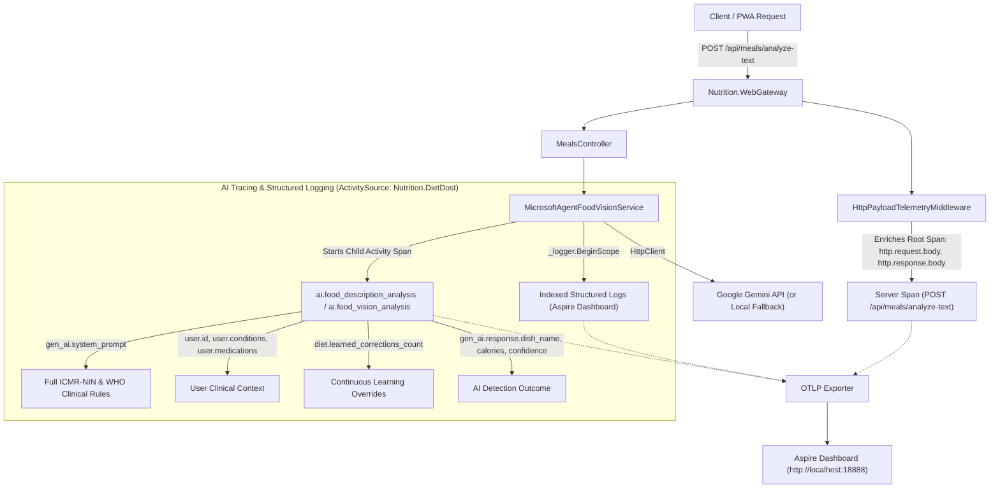

# DevOps, Infrastructure & Aspire Orchestration
> **Specification Version**: `v1.2.0 (Production & Living SDD)`  
> **Host Framework**: .NET Aspire 11 RC (`Aspire.Hosting.AppHost` v13.5.4)  
> **Runtime**: .NET 11 RC (`net11.0`)  

---

## 1. Aspire AppHost Topology

```csharp
var builder = DistributedApplication.CreateBuilder(args);

// Web Gateway hosting the Linear.app PWA and microservice endpoints
builder.AddProject<Projects.Nutrition_WebGateway>("web-gateway")
       .WithHttpEndpoint(port: 5240, isProxied: false)
       .WithExternalHttpEndpoints()
       .WithEnvironment("Database__Provider", "Sqlite")
       .WithEnvironment("ConnectionStrings__DefaultConnection", "Data Source=diettracker.db");

builder.Build().Run();
```

### 1.1 Local Launch Configuration (`launchSettings.json`)
The AppHost uses deterministic HTTP bindings for local development and observability:
- **Aspire Dashboard**: `http://localhost:18888`
- **OTLP Ingestion Endpoint**: `http://localhost:18889` (HTTP) / `http://localhost:18890` (gRPC)
- **WebGateway Application**: `http://localhost:5240`
- **Unsecured Dev Transport**: Configured with `ASPIRE_ALLOW_UNSECURED_TRANSPORT=true` and `DOTNET_DASHBOARD_UNSECURED_ALLOW_ANONYMOUS=true` to eliminate browser cookie drops over HTTP during local development.

---

## 2. OpenTelemetry (OTel) Pipeline & Distributed Tracing

Diet Dost implements an end-to-end observability pipeline conforming to modern OpenTelemetry semantic conventions and .NET Aspire Dashboard tooling:



### 2.1 HTTP Request & Response Payload Telemetry
Implemented in `Nutrition.WebGateway.Middleware.HttpPayloadTelemetryMiddleware`:
- Inspects `/api/*` endpoints and calls `context.Request.EnableBuffering()` so request bodies can be read without consuming the stream for controllers.
- Captures JSON and URL-encoded request payloads (up to 64KB) as `http.request.body` on `Activity.Current`.
- Captures multipart image uploads as structured metadata (`[Multipart Form Upload: ... bytes, ContentType=...]`), avoiding multi-megabyte binary allocations.
- Intercepts the response body via a temporary `MemoryStream`, reads the response payload, sets `http.response.body` and `http.response.status_code` on the span, and copies the stream back to the client.

### 2.2 Dedicated AI ActivitySource (`Nutrition.DietDost`)
Implemented in `Nutrition.Application.Common.NutritionTelemetry`:
- Emits dedicated child activity spans for meal parsing:
  - `ai.food_description_analysis` (text description analysis)
  - `ai.food_vision_analysis` (photo analysis)
- Semantic attributes recorded on AI spans:
  - `gen_ai.system`: `"google_gemini"`
  - `gen_ai.system_prompt`: Full ICMR-NIN 2024 & WHO prompt + subzi recognition rules
  - `gen_ai.user_prompt`: Meal description or image metadata
  - `gen_ai.request.model` & `gen_ai.response.model`: Model attribution (e.g. `gemini-3-flash-preview` or `Local Clinical Engine (Offline)`)
  - `user.id`, `user.name`, `user.diagnosed_conditions`, `user.medications`, `user.dietary_preference`
  - `diet.learned_corrections_count` & `diet.learned_corrections_summary`
  - `gen_ai.response.dish_name`, `total_calories`, `total_protein_g`, `total_carbs_g`, `total_fat_g`, `confidence_score`, `items_summary`

### 2.3 Non-PII Diagnostic Logging
Implemented in `Nutrition.Infrastructure.Persistence.EfRepository<T>` and `EfUnitOfWork`:
- All CRUD and `SaveChangesAsync` calls catch exceptions and log operational diagnostics:
  - `Operation`: e.g. `AddAsync`, `GetByIdAsync`, `SaveChangesAsync`
  - `EntityType`: e.g. `UserProfile`, `MealLog`, `DailyCalorieLedger`
  - `RecordId` and `EntityState`: e.g. `user-default`, `Modified`
  - `DbUpdateException`: Entries summary and SQLite error code
- **Strict PII Protection**: User personal names, phone numbers, medications, and clinical notes are NEVER logged.

---

## 3. Local Execution & Launch Runbook

```bash
# 1. Restore & Build Solution (0 Warnings, 0 Errors)
dotnet build src/Nutrition.WebGateway/Nutrition.WebGateway.csproj

# 2. Run Test Harness
dotnet test

# 3. Launch App via Aspire AppHost (includes Dashboard + WebGateway)
dotnet run --project src/Nutrition.AppHost/Nutrition.AppHost.csproj --launch-profile http
```

### Service Access URLs
- **Web Application**: `http://localhost:5240/`
- **Aspire Dashboard (Traces, Logs, Metrics)**: `http://localhost:18888/`

