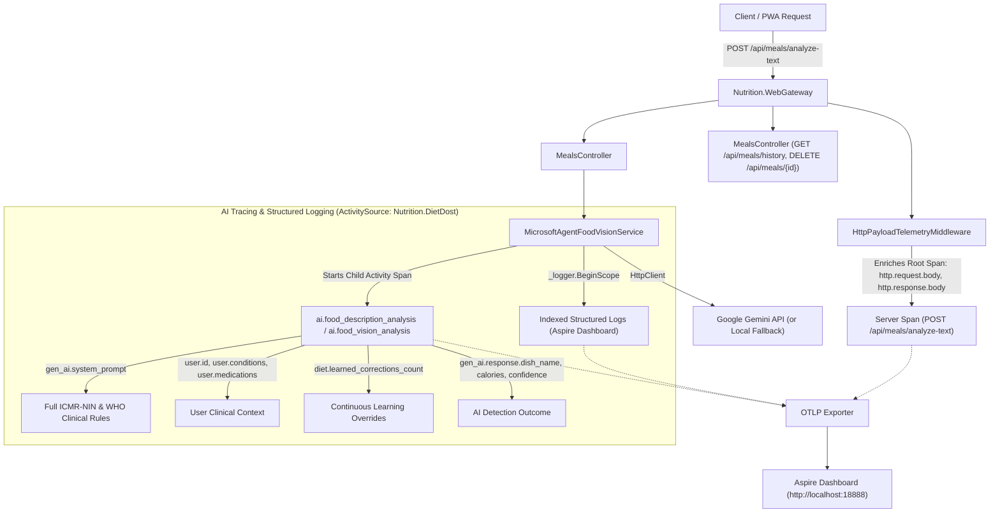
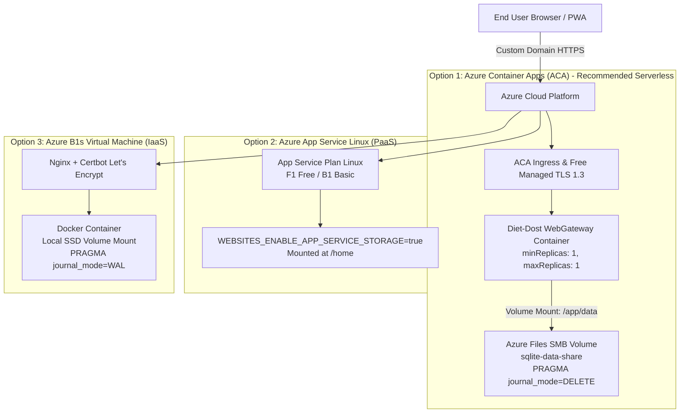

# DevOps, Infrastructure & Aspire Orchestration
> **Specification Version**: `v1.3.1 (Production & Living SDD)`  
> **Host Framework**: .NET Aspire 11 RC (`Aspire.Hosting.AppHost` v13.5.4)  
> **Runtime**: .NET 11 RC (`net11.0`)  

---

## 1. Aspire AppHost Topology

```csharp
var builder = DistributedApplication.CreateBuilder(args);

// Web Gateway hosting the Linear.app PWA and microservice endpoints
builder.AddProject<Projects.Nutrition_WebGateway>("web-gateway")
       .WithHttpEndpoint(port: 5240, isProxied: false)
       .WithExternalHttpEndpoints()
       .WithEnvironment("Database__Provider", "Sqlite")
       .WithEnvironment("ConnectionStrings__DefaultConnection", "Data Source=diettracker.db");

builder.Build().Run();
```

### 1.1 Local Launch Configuration (`launchSettings.json`)
The AppHost uses deterministic HTTP bindings for local development and observability:
- **Aspire Dashboard**: `http://localhost:18888`
- **OTLP Ingestion Endpoint**: `http://localhost:18889` (HTTP) / `http://localhost:18890` (gRPC)
- **WebGateway Application**: `http://localhost:5240`
- **Unsecured Dev Transport**: Configured with `ASPIRE_ALLOW_UNSECURED_TRANSPORT=true` and `DOTNET_DASHBOARD_UNSECURED_ALLOW_ANONYMOUS=true` to eliminate browser cookie drops over HTTP during local development.

---

## 2. OpenTelemetry (OTel) Pipeline & Distributed Tracing

Diet Dost implements an end-to-end observability pipeline conforming to modern OpenTelemetry semantic conventions and .NET Aspire Dashboard tooling:



### 2.1 HTTP Request & Response Payload Telemetry
Implemented in `Nutrition.WebGateway.Middleware.HttpPayloadTelemetryMiddleware`:
- Inspects `/api/*` endpoints and calls `context.Request.EnableBuffering()` so request bodies can be read without consuming the stream for controllers.
- Captures JSON and URL-encoded request payloads (up to 64KB) as `http.request.body` on `Activity.Current`.
- Captures multipart image uploads as structured metadata (`[Multipart Form Upload: ... bytes, ContentType=...]`), avoiding multi-megabyte binary allocations.
- Intercepts the response body via a temporary `MemoryStream`, reads the response payload, sets `http.response.body` and `http.response.status_code` on the span, and copies the stream back to the client.

### 2.2 Dedicated AI ActivitySource (`Nutrition.DietDost`)
Implemented in `Nutrition.Application.Common.NutritionTelemetry`:
- Emits dedicated child activity spans for meal parsing:
  - `ai.food_description_analysis` (text description analysis)
  - `ai.food_vision_analysis` (photo analysis)
- Semantic attributes recorded on AI spans:
  - `gen_ai.system`: `"google_gemini"`
  - `gen_ai.system_prompt`: Full ICMR-NIN 2024 & WHO prompt + subzi recognition rules
  - `gen_ai.user_prompt`: Meal description or image metadata
  - `gen_ai.request.model` & `gen_ai.response.model`: Model attribution (e.g. `gemini-3-flash-preview` or `Local Clinical Engine (Offline)`)
  - `user.id`, `user.name`, `user.diagnosed_conditions`, `user.medications`, `user.dietary_preference`
  - `diet.learned_corrections_count` & `diet.learned_corrections_summary`
  - `gen_ai.response.dish_name`, `total_calories`, `total_protein_g`, `total_carbs_g`, `total_fat_g`, `confidence_score`, `items_summary`

### 2.3 Non-PII Diagnostic Logging
Implemented in `Nutrition.Infrastructure.Persistence.EfRepository<T>` and `EfUnitOfWork`:
- All CRUD and `SaveChangesAsync` calls catch exceptions and log operational diagnostics:
  - `Operation`: e.g. `AddAsync`, `GetByIdAsync`, `SaveChangesAsync`, `DeleteAsync`
  - `EntityType`: e.g. `UserProfile`, `MealLog`, `DailyCalorieLedger`
  - `RecordId` and `EntityState`: e.g. `user-default`, `Modified`, `Deleted`
  - `DbUpdateException`: Entries summary and SQLite error code
- **Strict PII Protection**: User personal names, phone numbers, medications, and clinical notes are NEVER logged.

---

## 3. Frontend Architecture & Modular Partial Pipeline

The frontend is served as a Single Page Application from `Nutrition.WebGateway/wwwroot` using modular HTML partials dynamically mounted into `#app`:

```
wwwroot/
├── assets/
│   ├── placeholder-meal.svg        # Obsidian Dark fallback for meals (48x48 fork & knife)
│   └── placeholder-progress.svg    # Obsidian Dark fallback for selfies (48x48 camera & silhouette)
├── css/
│   └── index.css                   # Obsidian Dark theme tokens, layout, and component styles
├── js/
│   ├── app.js                      # Root orchestrator & global error fallback interceptor
│   ├── state.js                    # Reactive application state
│   ├── api.js                      # REST client with UTC normalization & period filtering
│   └── ui/
│       ├── clinical-modal.js       # Clinical dietary setup & guidance
│       ├── dashboard.js            # Daily calorie & 6-macro gauges + period trends
│       ├── delete-meal-modal.js    # Custom modal for meal deletion with deficit recalculation
│       ├── face-progress-card.js   # Face progress comparison & baseline visualizer
│       ├── food-diary.js           # Card/Grid food diary with Excel export & period switcher
│       ├── header.js               # Header navigation & user status
│       ├── profile-modal.js        # User profile, body metrics & IANA timezone selector
│       ├── progress-gallery-modal.js # Full progress photo timeline
│       ├── progress-modal.js       # Progress photo capture & metadata entry
│       ├── quick-log.js            # Multimodal photo/text meal analyzer
│       └── review-modal.js         # Interactive meal verification & portion editor
└── partials/
    ├── clinical-modal.html
    ├── dashboard.html
    ├── delete-meal-modal.html      # Obsidian danger modal with 6-macro mini-pills
    ├── face-progress-card.html
    ├── food-diary.html             # Period filter, Card/Grid toggle, Export, and meal list
    ├── header.html
    ├── profile-modal.html          # Includes Timezone selector with auto-detect button
    ├── progress-gallery-modal.html
    ├── progress-modal.html
    ├── quick-log.html
    └── review-modal.html           # Includes quantity input, portion dropdown, 6-macro pills
```

### 3.1 Global SVG Fallback Pipeline
In `app.js`, a capturing-phase `error` event listener intercepts all `HTMLImageElement` load failures:
```javascript
window.addEventListener('error', (e) => {
    if (e.target && e.target.tagName === 'IMG') {
        const isProgress = e.target.classList.contains('progress-thumb') || 
                           e.target.closest('.progress-card');
        const fallback = isProgress ? '/assets/placeholder-progress.svg' : '/assets/placeholder-meal.svg';
        if (e.target.src !== window.location.origin + fallback) {
            e.target.src = fallback;
            e.target.classList.add('img-fallback-applied');
        }
    }
}, true);
```

---

## 4. Local Execution & Troubleshooting Runbook

```bash
# 1. Restore & Build Solution (0 Warnings, 0 Errors)
dotnet build src/Nutrition.WebGateway/Nutrition.WebGateway.csproj

# 2. Run Test Harness (100% Pass)
dotnet test

# 3. Launch App via Aspire AppHost (includes Dashboard + WebGateway)
dotnet run --project src/Nutrition.AppHost/Nutrition.AppHost.csproj --launch-profile http
```

### 4.1 Multi-Process / Orphan DCP Resolution
If `dotnet run` fails with port conflicts (`EADDRINUSE 18888`, `5240`) or temp kubeconfig lock errors:
```powershell
# Terminate lingering background orchestrators
Stop-Process -Name dcp, Nutrition.AppHost, Nutrition.WebGateway -Force -ErrorAction SilentlyContinue
```

### 4.2 Service Access URLs
- **Web Application**: `http://localhost:5240/?v=1.3.1`
- **Aspire Dashboard (Traces, Logs, Metrics)**: `http://localhost:18888/`

---

## 5. Git Branching & Pull Request Governance

To maintain production stability and adherence to the Zero Documentation Drift Mandate, the following source control policy is enforced:

### 5.1 Branching Strategy
- **Protected Trunk (`main`)**: Direct commits and direct pushes to `main` are strictly prohibited.
- **Dedicated Branching**: Every feature, bug fix, refactor, or documentation update must originate on an isolated branch:
  - Features: `feature/<feature-name>`
  - Bug fixes: `fix/<defect-name>`
  - Documentation: `docs/<topic-name>`

### 5.2 Pull Request (PR) Merge Mandate
- **PR-Only Integration**: All code and documentation changes must be integrated into `main` exclusively through Pull Requests.
- **Verification Gates Before PR Merge**:
  1. Build compiles with **0 warnings and 0 errors** on `.NET 11`.
  2. All automated tests in `tests/` pass with 100% success rate.
  3. Living documentation in `docs/sdd/*.md` is updated, including an entry in `docs/sdd/07_living_documentation_log.md`.

---

## 6. Azure Production Cloud Deployment Architectures (SQLite & Custom Domain)

### 6.1 Deployment Options Evaluation



| Dimension | Option 1: Azure Container Apps (ACA) + Azure Files (Recommended) | Option 2: Azure App Service Linux (F1 Free / B1 Basic) | Option 3: Azure B1s Linux VM (Docker + Nginx + Certbot) |
| :--- | :--- | :--- | :--- |
| **Compute Model** | Serverless MicroVM Containers | Managed PaaS Web App | IaaS Virtual Machine (Ubuntu 24.04 LTS) |
| **Cost Profile** | **Monthly Free Grant**: 180k vCPU-s + 360k GiB-s + 2M requests/mo free. Standard Azure File Share: ~$0.10–$0.30/mo. | **F1 Tier**: 100% Free (60 CPU-min/day, sleeps). **B1 Tier**: ~$13/mo (AlwaysOn, dedicated core). | **12 Months 100% Free**: Standard_B1s (1 vCPU, 1GB RAM, 750 hrs/mo) + 2x 64GB Managed SSDs. |
| **Persistence Mechanism** | Azure Storage Account File Share mounted to `/app/data` via ACA Environment Volume. | Built-in `/home` persistent storage (`WEBSITES_ENABLE_APP_SERVICE_STORAGE=true`). | Local SSD ext4 volume mounted to container `/data` (`-v /var/lib/dietdost/data:/app/data`). |
| **Zero Data Loss Guarantee** | **Guaranteed**: Data lives in Azure File Share outside container lifecycle. | **Guaranteed**: Data lives in `/home` persistent storage. | **Guaranteed**: Data lives on durable Azure Managed OS/Data Disk. |
| **SQLite Concurrency & Locking** | **Single Replica Mandate (`maxReplicas: 1`)**. SMB does not support POSIX `mmap` WAL mode; must use `journal_mode=DELETE`. | **Single Instance Mandate**. Backed by Azure Files SMB under the hood. Must use `journal_mode=DELETE`. | **Best SQLite Performance**: Native POSIX file locks, full `journal_mode=WAL` support, concurrent readers, 0 network lag. |
| **Custom Domain & SSL** | **100% Free Azure Managed Certificates** (`Microsoft.App/managedEnvironments/managedCertificates`) with auto-renewal. | **Free Managed Cert on B1+**. F1 does **NOT** support free Azure SSL (requires Cloudflare proxy workaround). | **100% Free via Let's Encrypt / Certbot** with automated cron renewal. |
| **Security Posture** | Managed Identity, Azure Key Vault references, internal/external ingress, DDoS basic. | Managed Identity, Key Vault references, HTTPS only, IP access restrictions. | OS hardening required (UFW firewall, SSH key pairs, fail2ban, unattended-upgrades). |
| **CI/CD Integration** | GitHub Actions / Azure DevOps (`azure/container-apps-deploy-action`). | GitHub Actions / Azure DevOps (`azure/webapps-deploy`). | GitHub Actions via SSH or Container Registry webhook / Watchtower. |

### 6.2 SQLite Zero-Data-Loss Invariants on Azure
1. **The Single-Replica Invariant (`maxReplicas: 1`)**: Auto-scaling across multiple container instances accessing the same SQLite database file will corrupt the database. All container deployments must constrain scaling to exactly 1 replica.
2. **Rollback Journal Mode for Network SMB Mounts**: Because SMB/CIFS network storage does not support POSIX shared memory (`.shm` mapping) reliably, `PRAGMA journal_mode = DELETE;` (or `TRUNCATE`) must be used when deploying against Azure Files.
3. **Write-Ahead Logging (WAL) for Local SSD Mounts**: When deploying to a Linux VM (Option 3), native block storage allows `PRAGMA journal_mode = WAL;`, enabling concurrent reads without blocking writes.
4. **Volume Mount Separation**: Container images must mount external persistent storage to `/app/data`, with the connection string pointing to `/app/data/diet_dost.db` and static uploads directed to `/app/data/wwwroot/uploads`.


