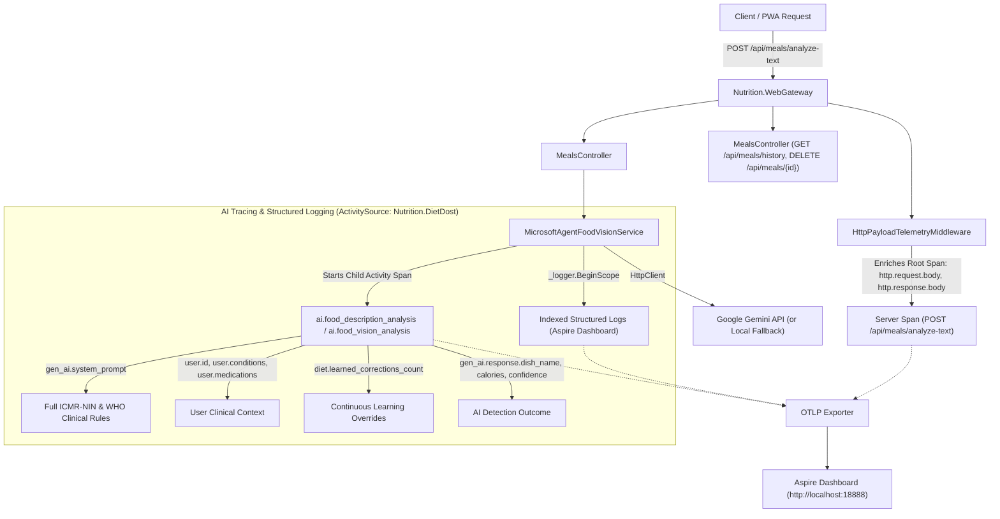
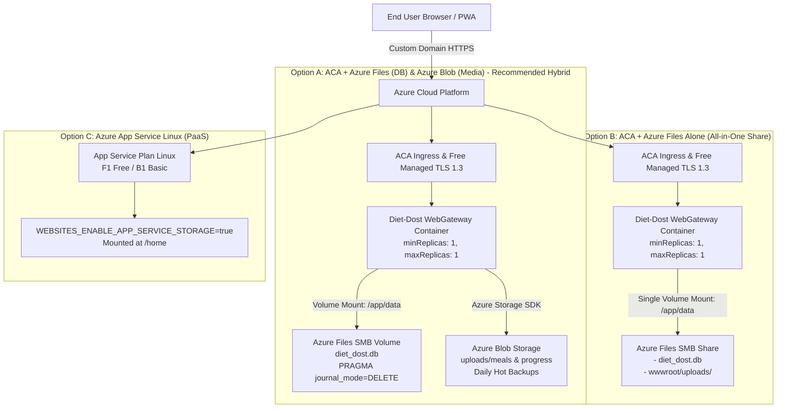
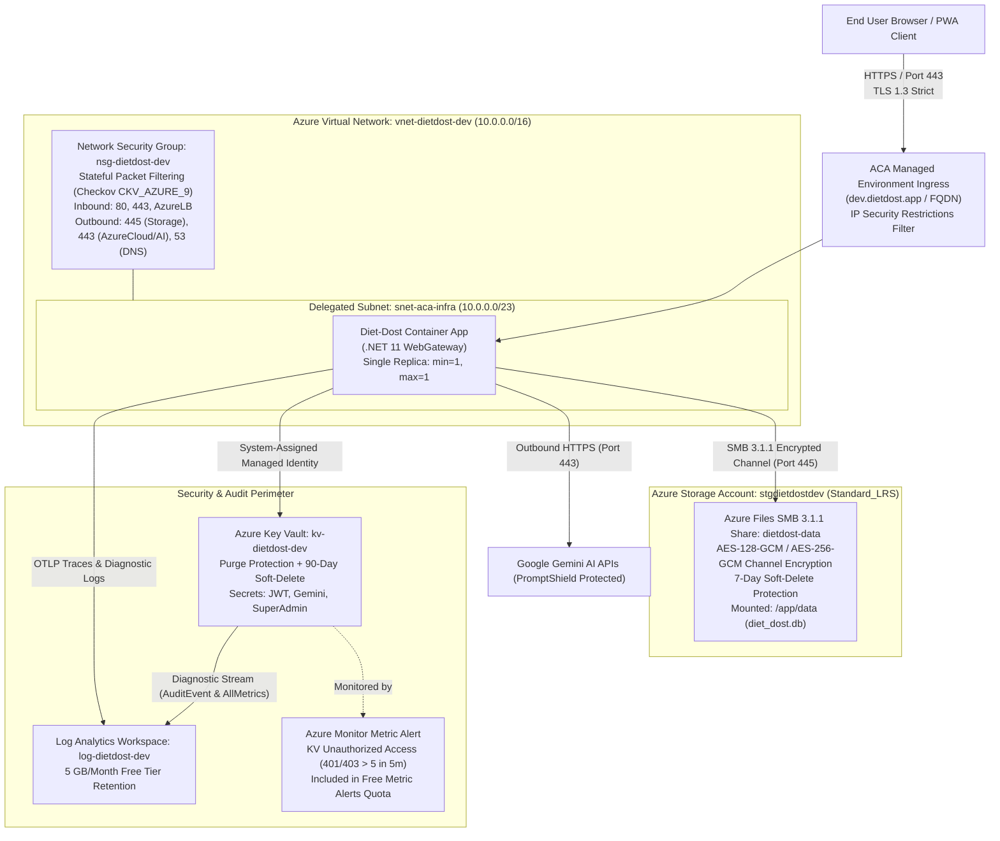

<!--
  Copyright (c) 2026 diet-dost and/or its contributors.
  Licensed under the "GNU Affero General Public License v3.0 only" and
  the "Server Side Public License, v 1"; you may not use this file except
  in compliance with, at your election, the "GNU Affero General Public
  License v3.0 only" or the "Server Side Public License, v 1".
-->

# DevOps, Infrastructure & Aspire Orchestration
> **Specification Version**: `v1.4.0 (Production & Living SDD)`  
> **Host Framework**: .NET Aspire 13.5.4 (`Aspire.Hosting.AppHost`) & Azure Container Apps  
> **Runtime**: .NET 11 (`net11.0`)  

---

## 1. Aspire AppHost Topology

```csharp
var builder = DistributedApplication.CreateBuilder(args);

// Web Gateway hosting the Linear.app PWA and microservice endpoints
builder.AddProject<Projects.Nutrition_WebGateway>("web-gateway")
       .WithHttpEndpoint(port: 5240, isProxied: false)
       .WithExternalHttpEndpoints()
       .WithEnvironment("Database__Provider", "Sqlite")
       .WithEnvironment("ConnectionStrings__DefaultConnection", "Data Source=diettracker.db");

builder.Build().Run();
```

### 1.1 Local Launch Configuration (`launchSettings.json`)
The AppHost uses deterministic HTTP bindings for local development and observability:
- **Aspire Dashboard**: `http://localhost:18888`
- **OTLP Ingestion Endpoint**: `http://localhost:18889` (HTTP) / `http://localhost:18890` (gRPC)
- **WebGateway Application**: `http://localhost:5240`
- **Unsecured Dev Transport**: Configured with `ASPIRE_ALLOW_UNSECURED_TRANSPORT=true` and `DOTNET_DASHBOARD_UNSECURED_ALLOW_ANONYMOUS=true` to eliminate browser cookie drops over HTTP during local development.

---

## 2. OpenTelemetry (OTel) Pipeline & Distributed Tracing

Diet Dost implements an end-to-end observability pipeline conforming to modern OpenTelemetry semantic conventions and .NET Aspire Dashboard tooling:


```mermaid
flowchart TD
    Client["Client / PWA Request"] -->|"POST /api/meals/analyze-text"| Gateway["Nutrition.WebGateway"]
    Gateway --> Middleware["HttpPayloadTelemetryMiddleware"]
    Middleware -->|"Enriches Root Span: http.request.body, http.response.body"| RootSpan["Server Span (POST /api/meals/analyze-text)"]
    Gateway --> Controller["MealsController"]
    Gateway --> DiaryController["MealsController (GET /api/meals/history, DELETE /api/meals/{id})"]
    Controller --> Agent["MicrosoftAgentFoodVisionService"]
    
    subgraph AI_Observability["AI Tracing & Structured Logging (ActivitySource: Nutrition.DietDost)"]
        Agent -->|"Starts Child Activity Span"| AISpan["ai.food_description_analysis / ai.food_vision_analysis"]
        AISpan -->|"gen_ai.system_prompt"| PromptTag["Full ICMR-NIN & WHO Clinical Rules"]
        AISpan -->|"user.id, user.conditions, user.medications"| ContextTags["User Clinical Context"]
        AISpan -->|"diet.learned_corrections_count"| MemoryTags["Continuous Learning Overrides"]
        AISpan -->|"gen_ai.response.dish_name, calories, confidence"| OutputTags["AI Detection Outcome"]
        Agent -->|"_logger.BeginScope"| StructuredLogs["Indexed Structured Logs (Aspire Dashboard)"]
    end
    
    Agent -->|"HttpClient"| Gemini["Google Gemini API (or Local Fallback)"]
    RootSpan -.-> OTLP["OTLP Exporter"]
    AISpan -.-> OTLP
    StructuredLogs -.-> OTLP
    OTLP --> AspireDash["Aspire Dashboard (http://localhost:18888)"]
```

### 2.1 HTTP Request & Response Payload Telemetry
Implemented in `Nutrition.WebGateway.Middleware.HttpPayloadTelemetryMiddleware`:
- Inspects `/api/*` endpoints and calls `context.Request.EnableBuffering()` so request bodies can be read without consuming the stream for controllers.
- Captures JSON and URL-encoded request payloads (up to 64KB) as `http.request.body` on `Activity.Current`.
- Captures multipart image uploads as structured metadata (`[Multipart Form Upload: ... bytes, ContentType=...]`), avoiding multi-megabyte binary allocations.
- Intercepts the response body via a temporary `MemoryStream`, reads the response payload, sets `http.response.body` and `http.response.status_code` on the span, and copies the stream back to the client.

### 2.2 Dedicated AI ActivitySource (`Nutrition.DietDost`)
Implemented in `Nutrition.Application.Common.NutritionTelemetry`:
- Emits dedicated child activity spans for meal parsing:
  - `ai.food_description_analysis` (text description analysis)
  - `ai.food_vision_analysis` (photo analysis)
- Semantic attributes recorded on AI spans:
  - `gen_ai.system`: `"google_gemini"`
  - `gen_ai.system_prompt`: Full ICMR-NIN 2024 & WHO prompt + subzi recognition rules
  - `gen_ai.user_prompt`: Meal description or image metadata
  - `gen_ai.request.model` & `gen_ai.response.model`: Model attribution (e.g. `gemini-3-flash-preview` or `Local Clinical Engine (Offline)`)
  - `user.id`, `user.name`, `user.diagnosed_conditions`, `user.medications`, `user.dietary_preference`
  - `diet.learned_corrections_count` & `diet.learned_corrections_summary`
  - `gen_ai.response.dish_name`, `total_calories`, `total_protein_g`, `total_carbs_g`, `total_fat_g`, `confidence_score`, `items_summary`

### 2.3 Non-PII Diagnostic Logging
Implemented in `Nutrition.Infrastructure.Persistence.EfRepository<T>` and `EfUnitOfWork`:
- All CRUD and `SaveChangesAsync` calls catch exceptions and log operational diagnostics:
  - `Operation`: e.g. `AddAsync`, `GetByIdAsync`, `SaveChangesAsync`, `DeleteAsync`
  - `EntityType`: e.g. `UserProfile`, `MealLog`, `DailyCalorieLedger`
  - `RecordId` and `EntityState`: e.g. `user-default`, `Modified`, `Deleted`
  - `DbUpdateException`: Entries summary and SQLite error code
- **Strict PII Protection**: User personal names, phone numbers, medications, and clinical notes are NEVER logged.

---

## 3. Frontend Architecture & Modular Partial Pipeline

The frontend is served as a Single Page Application from `Nutrition.WebGateway/wwwroot` using modular HTML partials dynamically mounted into `#app`:

```
wwwroot/
├── assets/
│   ├── placeholder-meal.svg        # Obsidian Dark fallback for meals (48x48 fork & knife)
│   └── placeholder-progress.svg    # Obsidian Dark fallback for selfies (48x48 camera & silhouette)
├── css/
│   └── index.css                   # Obsidian Dark theme tokens, layout, and component styles
├── js/
│   ├── app.js                      # Root orchestrator & global error fallback interceptor
│   ├── state.js                    # Reactive application state
│   ├── api.js                      # REST client with UTC normalization & period filtering
│   └── ui/
│       ├── clinical-modal.js       # Clinical dietary setup & guidance
│       ├── dashboard.js            # Daily calorie & 6-macro gauges + period trends
│       ├── delete-meal-modal.js    # Custom modal for meal deletion with deficit recalculation
│       ├── face-progress-card.js   # Face progress comparison & baseline visualizer
│       ├── food-diary.js           # Card/Grid food diary with Excel export & period switcher
│       ├── header.js               # Header navigation & user status
│       ├── profile-modal.js        # User profile, body metrics & IANA timezone selector
│       ├── progress-gallery-modal.js # Full progress photo timeline
│       ├── progress-modal.js       # Progress photo capture & metadata entry
│       ├── quick-log.js            # Multimodal photo/text meal analyzer
│       └── review-modal.js         # Interactive meal verification & portion editor
└── partials/
    ├── clinical-modal.html
    ├── dashboard.html
    ├── delete-meal-modal.html      # Obsidian danger modal with 6-macro mini-pills
    ├── face-progress-card.html
    ├── food-diary.html             # Period filter, Card/Grid toggle, Export, and meal list
    ├── header.html
    ├── profile-modal.html          # Includes Timezone selector with auto-detect button
    ├── progress-gallery-modal.html
    ├── progress-modal.html
    ├── quick-log.html
    └── review-modal.html           # Includes quantity input, portion dropdown, 6-macro pills
```

### 3.1 Global SVG Fallback Pipeline
In `app.js`, a capturing-phase `error` event listener intercepts all `HTMLImageElement` load failures:
```javascript
window.addEventListener('error', (e) => {
    if (e.target && e.target.tagName === 'IMG') {
        const isProgress = e.target.classList.contains('progress-thumb') || 
                           e.target.closest('.progress-card');
        const fallback = isProgress ? '/assets/placeholder-progress.svg' : '/assets/placeholder-meal.svg';
        if (e.target.src !== window.location.origin + fallback) {
            e.target.src = fallback;
            e.target.classList.add('img-fallback-applied');
        }
    }
}, true);
```

---

## 4. Local Execution & Troubleshooting Runbook

```bash
# 1. Restore & Build Solution (0 Warnings, 0 Errors)
dotnet build src/Nutrition.WebGateway/Nutrition.WebGateway.csproj

# 2. Run Test Harness (100% Pass)
dotnet test

# 3. Launch App via Aspire AppHost (includes Dashboard + WebGateway)
dotnet run --project src/Nutrition.AppHost/Nutrition.AppHost.csproj --launch-profile http
```

### 4.1 Multi-Process / Orphan DCP Resolution
If `dotnet run` fails with port conflicts (`EADDRINUSE 18888`, `5240`) or temp kubeconfig lock errors:
```powershell
# Terminate lingering background orchestrators
Stop-Process -Name dcp, Nutrition.AppHost, Nutrition.WebGateway -Force -ErrorAction SilentlyContinue
```

### 4.2 Service Access URLs
- **Web Application**: `http://localhost:5240/?v=1.3.1`
- **Aspire Dashboard (Traces, Logs, Metrics)**: `http://localhost:18888/`

---

## 5. Git Branching & Pull Request Governance

To maintain production stability and adherence to the Zero Documentation Drift Mandate, the following source control policy is enforced:

### 5.1 Branching Strategy
- **Protected Trunk (`main`)**: Direct commits and direct pushes to `main` are strictly prohibited.
- **Dedicated Branching**: Every feature, bug fix, refactor, or documentation update must originate on an isolated branch:
  - Features: `feature/<feature-name>`
  - Bug fixes: `fix/<defect-name>`
  - Documentation: `docs/<topic-name>`

### 5.2 Pull Request (PR) Merge Mandate
- **PR-Only Integration**: All code and documentation changes must be integrated into `main` exclusively through Pull Requests.
- **Verification Gates Before PR Merge**:
  1. Build compiles with **0 warnings and 0 errors** on `.NET 11`.
  2. All automated tests in `tests/` pass with 100% success rate.
  3. Living documentation in `docs/sdd/*.md` is updated, including an entry in `docs/sdd/07_living_documentation_log.md`.

---

## 6. Azure Production Cloud Deployment Architectures (SQLite & Custom Domain)

### 6.1 Deployment Options Evaluation (No-VM Architecture Focus)


```mermaid
graph TD
    Client[End User Browser / PWA] -->|Custom Domain HTTPS| Cloud[Azure Cloud Platform]
    
    subgraph OptionA ["Option A: ACA + Azure Files (DB) & Azure Blob (Media) - Recommended Hybrid"]
        Cloud --> ACA_IngressA[ACA Ingress & Free Managed TLS 1.3]
        ACA_IngressA --> ACA_PodA[Diet-Dost WebGateway Container<br/>minReplicas: 1, maxReplicas: 1]
        ACA_PodA -->|Volume Mount: /app/data| AzureFilesA[Azure Files SMB Volume<br/>diet_dost.db<br/>PRAGMA journal_mode=DELETE]
        ACA_PodA -->|Azure Storage SDK| AzureBlobA[Azure Blob Storage<br/>uploads/meals & progress<br/>Daily Hot Backups]
    end
    
    subgraph OptionB ["Option B: ACA + Azure Files Alone (All-in-One Share)"]
        Cloud --> ACA_IngressB[ACA Ingress & Free Managed TLS 1.3]
        ACA_IngressB --> ACA_PodB[Diet-Dost WebGateway Container<br/>minReplicas: 1, maxReplicas: 1]
        ACA_PodB -->|Single Volume Mount: /app/data| AzureFilesB[Azure Files SMB Share<br/>- diet_dost.db<br/>- wwwroot/uploads/]
    end
    
    subgraph OptionC ["Option C: Azure App Service Linux (PaaS)"]
        Cloud --> AppService[App Service Plan Linux<br/>F1 Free / B1 Basic]
        AppService --> AppServiceStorage[WEBSITES_ENABLE_APP_SERVICE_STORAGE=true<br/>Mounted at /home]
    end
```

| Dimension | Option A: ACA + Azure Files (DB) & Blob (Media) (Recommended) | Option B: ACA + Azure Files Alone (All-in-One) | Option C: Azure App Service Linux (B1 Basic / F1 Free) |
| :--- | :--- | :--- | :--- |
| **Compute Model** | Serverless MicroVM (Azure Container Apps) | Serverless MicroVM (Azure Container Apps) | Managed Web App PaaS (App Service Plan) |
| **Database Storage** | Azure Files SMB Share mounted to `/app/data` | Azure Files SMB Share mounted to `/app/data` | Persistent `/home` (Azure Files backed) |
| **Media / Photo Storage** | Azure Blob Storage (`dietdost-media`) | Azure Files SMB Share (`/app/data/uploads`) | Persistent `/home/data/uploads` |
| **Cost Profile** | **Monthly Free Grant**: 180k vCPU-s + 360k GiB-s + 2M requests/mo free.<br/>Files + Blob: **<$0.50/mo**. | **Monthly Free Grant**: 180k vCPU-s + 360k GiB-s + 2M requests/mo free.<br/>Files: **<$0.30/mo**. | **F1 Tier**: 100% Free (60 CPU-min/day, sleeps, no custom SSL).<br/>**B1 Tier**: ~$13/mo (AlwaysOn, dedicated core). |
| **Zero Data Loss Guarantee** | **100% Guaranteed**: SQLite transactions commit synchronously to Azure Files. | **100% Guaranteed**: SQLite transactions commit synchronously to Azure Files. | **100% Guaranteed**: Data lives in persistent `/home` volume. |
| **SQLite Concurrency & Locking** | **Single Replica Mandate (`maxReplicas: 1`)**.<br/>`PRAGMA journal_mode = DELETE`. | **Single Replica Mandate (`maxReplicas: 1`)**.<br/>`PRAGMA journal_mode = DELETE`. | **Single Instance Mandate (`AlwaysOn = true`)**.<br/>`PRAGMA journal_mode = DELETE`. |
| **Custom Domain & SSL** | **100% Free Azure Managed Certificates** (`Microsoft.App/managedEnvironments/managedCertificates`) with auto-renewal. | **100% Free Azure Managed Certificates** with auto-renewal. | **Free Managed Cert on B1+**.<br/>F1 requires Cloudflare Free Proxy workaround. |
| **Security Posture** | Managed Identity, Azure Key Vault references, internal/external ingress, DDoS basic. | Managed Identity, Azure Key Vault references, internal/external ingress, DDoS basic. | Managed Identity, Key Vault references, HTTPS only, IP access restrictions. |
| **CI/CD Integration** | GitHub Actions / Azure DevOps (`azure/container-apps-deploy-action`). | GitHub Actions / Azure DevOps (`azure/container-apps-deploy-action`). | GitHub Actions / Azure DevOps (`azure/webapps-deploy`). |

### 6.2 SQLite Zero-Data-Loss Invariants on Azure
1. **The Single-Replica Invariant (`maxReplicas: 1`)**: Auto-scaling across multiple container instances accessing the same SQLite database file will corrupt the database. All container deployments must constrain scaling to exactly 1 replica.
2. **Rollback Journal Mode for Network SMB Mounts**: Because SMB/CIFS network storage does not support POSIX shared memory (`.shm` mapping) reliably, `PRAGMA journal_mode = DELETE;` (or `TRUNCATE`) must be used when deploying against Azure Files.
3. **Write-Ahead Logging (WAL) for Local SSD Mounts**: When deploying to a Linux VM (Option 3), native block storage allows `PRAGMA journal_mode = WAL;`, enabling concurrent reads without blocking writes.
4. **Volume Mount Separation**: Container images must mount external persistent storage to `/app/data`, with the connection string pointing to `/app/data/diet_dost.db` and static uploads directed to `/app/data/wwwroot/uploads`.

---

## 7. Production Cloud Infrastructure Deployment Specification (Phase 1 Layer 9)

### 7.1 Two-Stage Automated CI/CD Workflows
Production deployment executes via two decoupled GitHub Actions workflows conditioned on a green pass of the 8-job security gate:
1. **Stage 1: Infrastructure Deployment (`azure-infra-deploy.yml`)**:
   - Provisions Azure Resource Group (`rg-dietdost-dev`), Storage Account, Azure Files Share (`dietdost-share`), Managed Environment (`diet-dost-env`), Key Vault (`diet-dost-kv`), and ACR (`dietdostacr`).
   - Executes `az deployment group create --template-file infra/infra.bicep`.
2. **Stage 2: Application Deployment (`azure-app-deploy.yml`)**:
   - Compiles container image targeting Linux x64 and pushes to Azure Container Registry.
   - Deploys container to Azure Container Apps via `infra/app.bicep`.
   - Binds custom domain `dev.dietdost.app` with free Azure managed TLS certificate.

### 7.2 Declarative Bicep Infrastructure as Code (IaC)
- [`infra/infra.bicep`](file:///c:/Users/nikunj.banker/source/repos/diet-dost/infra/infra.bicep): Base infrastructure definition with Key Vault purge protection enabled (`enablePurgeProtection: true`), 90-day retention, Azure Files SMB share, and storage mount definitions on the ACA Managed Environment.
- [`infra/app.bicep`](file:///c:/Users/nikunj.banker/source/repos/diet-dost/infra/app.bicep): Application definition configuring container volume mounts (`/app/data`), CPU (0.5 vCPU) and memory (1.0 Gi) limits, environment variables, managed identity role assignments (`acrPullRole`, `keyVaultSecretsUserRole`), and custom domain hostname bindings.

### 7.3 Azure Files SMB Volume Mount & Zero-Data-Loss Configuration
The Container App mounts the Azure Files SMB share as a persistent volume:
- **Mount Path**: `/app/data`
- **Database File**: `/app/data/diet_dost.db`
- **Photos Directory**: `/app/data/photos`
- **SQLite Journal Pragma**: `PRAGMA journal_mode = DELETE;` configured at startup.
- **Replica Guarantee**: `minReplicas: 1, maxReplicas: 1` guarantees that only a single process holds file locks on the SMB network share, eliminating SQLite multi-instance file lock corruption.

### 7.4 Custom Domain & Managed TLS Certificate
- **Host**: `dev.dietdost.app`
- **Certificate Type**: Managed Certificate (`Microsoft.App/managedEnvironments/managedCertificates`)
- **Validation**: Domain validation via CNAME (`dev.dietdost.app` $\to$ `<app-fqdn>`) and TXT record (`asuid.dev.dietdost.app` $\to$ domain verification ID).
### 7.5 Pre-Deployment PowerShell Configuration Runbook
For full step-by-step pre-deployment configuration, Azure Entra ID federated credentials creation, RBAC delegation, 256-bit cryptographic JWT key generation, and post-deployment smoke tests in native PowerShell (zero bash dependencies), refer to:
- **Authoritative Guide**: [`docs/AZURE_PRE_DEPLOYMENT_POWERSHELL_GUIDE.md`](file:///c:/Users/nikunj.banker/source/repos/diet-dost/docs/AZURE_PRE_DEPLOYMENT_POWERSHELL_GUIDE.md)
- **Pre-Flight Automation Script**: [`scripts/setup-azure-pre-deployment.ps1`](file:///c:/Users/nikunj.banker/source/repos/diet-dost/scripts/setup-azure-pre-deployment.ps1)

---

## 8. Zero-Trust Cloud Network & Security Infrastructure Architecture

Diet-Dost implements a defense-in-depth, Zero-Trust network and cloud security topology designed specifically for the dev-test free-tier environment ($0 incremental cost) while adhering to enterprise CIS Microsoft Azure Foundations Benchmark and Checkov IaC security standards:


```mermaid
graph TD
    Client["End User Browser / PWA Client"] -->|"HTTPS / Port 443<br/>TLS 1.3 Strict"| ACA_Ingress["ACA Managed Environment Ingress<br/>(dev.dietdost.app / FQDN)<br/>IP Security Restrictions Filter"]

    subgraph Azure_VNet ["Azure Virtual Network: vnet-dietdost-dev (10.0.0.0/16)"]
        subgraph Subnet_Infra ["Delegated Subnet: snet-aca-infra (10.0.0.0/23)"]
            ACA_App["Diet-Dost Container App<br/>(.NET 11 WebGateway)<br/>Single Replica: min=1, max=1"]
        end
        NSG["Network Security Group: nsg-dietdost-dev<br/>Stateful Packet Filtering (Checkov CKV_AZURE_9)<br/>Inbound: 80, 443, AzureLB<br/>Outbound: 445 (Storage), 443 (AzureCloud/AI), 53 (DNS)"]
        NSG --- Subnet_Infra
    end

    ACA_Ingress --> ACA_App

    subgraph Storage_Boundary ["Azure Storage Account: stgdietdostdev (Standard_LRS)"]
        SMB_Share["Azure Files SMB 3.1.1 Share: dietdost-data<br/>AES-128-GCM / AES-256-GCM Channel Encryption<br/>7-Day Soft-Delete Protection<br/>Mounted: /app/data (diet_dost.db)"]
    end

    subgraph Security_Perimeter ["Security & Audit Perimeter"]
        KV["Azure Key Vault: kv-dietdost-dev<br/>Purge Protection + 90-Day Soft-Delete<br/>Secrets: JWT, Gemini, SuperAdmin"]
        LAW["Log Analytics Workspace: log-dietdost-dev<br/>5 GB/Month Free Tier Retention"]
        Alert["Azure Monitor Metric Alert<br/>KV Unauthorized Access (401/403 > 5 in 5m)<br/>Included in Free Metric Alerts Quota"]
    end

    ACA_App -->|"SMB 3.1.1 Encrypted Channel (Port 445)"| SMB_Share
    ACA_App -->|"System-Assigned Managed Identity"| KV
    KV -->|"Diagnostic Stream (AuditEvent & AllMetrics)"| LAW
    KV -.->|"Monitored by"| Alert
    ACA_App -->|"OTLP Traces & Diagnostic Logs"| LAW
    ACA_App -->|"Outbound HTTPS (Port 443)"| GeminiAPI["Google Gemini AI APIs (PromptShield Protected)"]
```

### 8.1 Network Security Group (NSG) with Zero-Trust Subnet Isolation
- **Resource**: `Microsoft.Network/networkSecurityGroups` (`nsg-dietdost-dev`) attached directly to subnet `snet-aca-infra`.
- **Compliance**: Natively satisfies Checkov benchmark rule `CKV_AZURE_9` (*Ensure that Virtual Network subnets are associated with a Network Security Group*).
- **Rule Set**:
  - **Inbound**:
    - `Allow-HTTP` (Port 80) & `Allow-HTTPS` (Port 443) from `Internet` to `VirtualNetwork`.
    - `Allow-Azure-Load-Balancer` from `AzureLoadBalancer` to `VirtualNetwork`.
    - `Deny-All-Inbound` (implicit default).
  - **Outbound**:
    - `Allow-Storage-SMB` (Port 445) restricted strictly to `Storage` service tag.
    - `Allow-AzureCloud-HTTPS` (Port 443) restricted to `AzureCloud` service tag (Key Vault, ACR, OTLP).
    - `Allow-AI-APIs-HTTPS` (Port 443) outbound to `Internet` for Gemini 2.5 Flash / Flash Lite REST calls.
    - `Allow-DNS` (Port 53) outbound for core name resolution.
    - `Allow-NTP` (Port 123) outbound for clock synchronization.
    - `Deny-All-Outbound` (implicit default).

### 8.2 Azure Files SMB 3.1.1 Cryptographic Channel Hardening
- **Protocol Encryption**: Enforces SMB 3.1.1 wire encryption with negotiated ciphers `AES-128-GCM` and `AES-256-GCM` across `fileServices` in `infra/infra.bicep`.
- **Kerberos & NTLM Policy**: Enforces Kerberos ticket authentication and disables legacy NTLMv1 fallbacks.
- **Accidental Deletion Defense**: Configured 7-day share soft-delete retention policy, protecting the live SQLite database (`diet_dost.db`) and user meal photos against catastrophic accidental share deletion.

### 8.3 Azure Key Vault Audit Diagnostics & Metric Alerts
- **Audit Logging**: Configured `Microsoft.Insights/diagnosticSettings` (`diag-kv-dev`) streaming `AuditEvent` categories and all metrics directly into the existing Log Analytics Workspace (`log-dietdost-dev`) within the free 5 GB/month ingestion tier.
- **Automated Intrusion Alerting**: Deployed `Microsoft.Insights/metricAlerts` (`alert-kv-unauthorized-dev`) monitoring the Key Vault Service Api Hit metric with dimensions `StatusCode = 401, 403`. Fires automatically if unauthorized attempts exceed 5 in a 5-minute window, consuming 0 additional cost (within Azure's first 10 free platform metric alerts).

### 8.4 Container App Ingress Perimeter Hardening
- **IP Security Restrictions**: Added configurable `ipSecurityRestrictions` array to `infra/app.bicep`. Allows operators to enforce IP allowlisting/denylisting on the external ingress controller at 0 cost.

### 8.5 Architectural Visual Artifacts
The full architectural blueprint is codified in the following repository visual artifacts:
- **Mermaid Source Diagram**: [`docs/architecture/diagrams/azure_zero_trust_infra_architecture.mermaid`](file:///c:/Users/nikunj.banker/source/repos/diet-dost/docs/architecture/diagrams/azure_zero_trust_infra_architecture.mermaid)
- **High-Resolution Architecture Diagram**: [`docs/architecture/diagrams/azure_zero_trust_infra_architecture.jpg`](file:///c:/Users/nikunj.banker/source/repos/diet-dost/docs/architecture/diagrams/azure_zero_trust_infra_architecture.jpg)
- **Architectural Decision Record**: [`docs/adr/security/ADR-20261010-088-azure-zero-trust-network-security-group-smb311-and-diagnostic-hardening.md`](file:///c:/Users/nikunj.banker/source/repos/diet-dost/docs/adr/security/ADR-20261010-088-azure-zero-trust-network-security-group-smb311-and-diagnostic-hardening.md)


