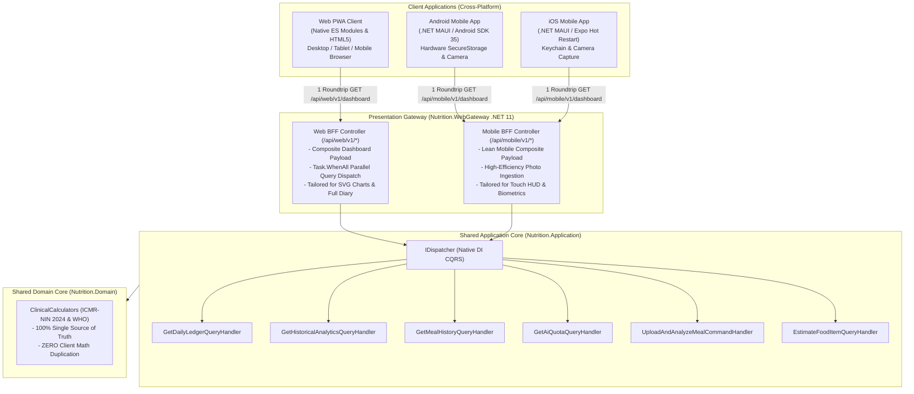
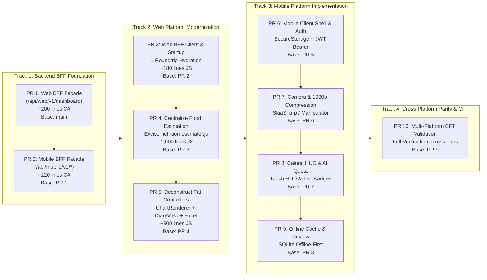

# SDD 08: Unified Cross-Platform (Web & Mobile) Clean Architecture, Dual BFF & Phased Migration Plan
> **Specification Version**: `v2.0.0 (Unified Living SDD & Multi-Platform Playbook)`  
> **Classification**: Cross-Platform Architecture Review, Dual BFF Design, SOLID Governance & Phased Execution Plan  
> **Target Subsystems**: Web PWA (`src/Nutrition.WebGateway/wwwroot/`), Cross-Platform Mobile (.NET MAUI / Expo), and Backend Presentation (`Nutrition.WebGateway`)  
> **Core Tenets**: Zero Duplicate Domain Code &bull; SOLID & Clean Architecture &bull; Dual BFFs (Web & Mobile) &bull; Phased Platform-by-Platform Migration (Zero Big Bang) &bull; Mandatory CFT Verification (`docs/cft/`)  

---

## 1. Executive Summary & Cross-Platform Vision

**Diet-Dost** provides an enterprise-grade nutrition companion across both **Web (PWA)** and **Mobile (Android & iOS)** platforms, powered by a single shared .NET 11 backend.

To achieve superior performance, rapid iteration, and maintainability across platforms without introducing regressions, this specification establishes:
1. **A Strict Cross-Platform Architectural Review**: Identifying code duplication, clinical drift risks, and chatty network boundaries.
2. **Dual BFF (Backend for Frontend) Pattern**: Symmetrical presentation-layer aggregation facades:
   - **Web BFF** (`/api/web/v1/*`): Tailored for desktop/tablet/mobile browser PWA layouts, large SVG analytics, and complex meal diary tables.
   - **Mobile BFF** (`/api/mobile/v1/*`): Tailored for native mobile constraints, low-bandwidth cellular networks, compressed payloads, and biometric authentication.
3. **Zero-Duplicate Domain Code Guarantee**: 100% of clinical calculations, ICMR-NIN 2024 algorithms, TDEE, and food estimation logic reside exclusively in `Nutrition.Domain` and `Nutrition.Application`. Zero domain math in client JavaScript or mobile code.
4. **Phased Platform-by-Platform Migration (Zero Big Bang)**: Step-by-step GitHub Stacked PR roadmap separating backend foundations, web modernization, and mobile implementation into small, independently reviewable PRs.
5. **Mandatory CFT (Customer & Functional Acceptance Test) Verification**: Formal platform test documents in `docs/cft/` ensuring 100% functional parity and zero regressions before any branch merge.

---

## 2. Multi-Platform Architectural Review & Current Deficiencies

### 2.1 Web Platform Deficiencies (`src/Nutrition.WebGateway/wwwroot/`)
1. **Domain Logic Duplication (`nutrition-estimator.js`)**:
   - Contains a hardcoded 1,001-line static JavaScript dictionary (`INDIAN_FOOD_DICTIONARY`) with calories, protein, carbs, fat, fiber, and sodium for 150+ dishes.
   - Duplicates portion multipliers (`scaleNutritionByPortion`) and dietitian advice (`generateDietitianAdvice`).
   - Risk: Any update to ICMR-NIN guidelines in `Nutrition.Domain` causes immediate clinical drift on the web app.
2. **Chatty Client-Server Boundary**:
   - Web startup (`main.js` `initApp`) fires 5 to 6 discrete HTTP roundtrips (`/api/auth/me`, `/api/analytics/daily`, `/api/analytics/projections`, `/api/meals/history`, `/api/progressphotos/comparison`, `/api/meals/quota`).
   - Causes high mobile browser latency and visible layout shifts.
3. **Fat UI Controllers (SRP Violations)**:
   - `analytics-chart.js` (792 lines) mixes SVG coordinate rendering, timeline tab state, click filter handlers, meal diary card/grid generation, and Excel/CSV serialization.
4. **Leaky DIP Coupling**:
   - UI controllers directly depend on 5 distinct backend micro-controllers rather than an aggregated presentation facade.

### 2.2 Mobile Platform Inception Challenges
1. **Risk of Domain Math Re-Implementation in Mobile Code**:
   - Without strict governance, mobile developers might re-implement BMI formulas, calorie deficit calculations, or local food dictionaries in C# / TypeScript.
   - **Strict Rule**: Mobile clients must NEVER implement clinical calculation algorithms. All calculations must be performed by the backend core.
2. **Bandwidth & Latency Constraints**:
   - Mobile devices operate on erratic 4G/5G mobile data. Firing 5 discrete startup calls drains battery and introduces lag.
   - Mobile photo uploads must be compressed on-device before transmission (1080p SkiaSharp compression down to <400 KB).
3. **Platform-Specific Security & Authentication**:
   - Web uses HttpOnly cookies; native mobile requires JWT bearer tokens stored in hardware security enclaves (`AndroidKeyStore` / iOS Keychain).

---

## 3. Dual BFF Architecture Specification

### 3.1 Web BFF Contract (`/api/web/v1/*`)
- **Endpoint**: `GET /api/web/v1/dashboard?period=7D`
- **Payload Shape**: `WebDashboardCompositeDto` containing:
  - `User`: Identity, Email, Display Name, Tier, Role.
  - `TodayLedger`: Daily caloric budget, consumed calories, remaining allowance, macro distribution.
  - `Projections`: 7D/30D/90D historical points for SVG chart rendering.
  - `RecentMeals`: Full meal diary items with macro breakdown for card/grid views.
  - `Quota`: Daily scans remaining, quota limit, localized reset time.
  - `FeatureFlags`: `CanComparePhotos`, `CanExportData`, `HistoryDayLimit`, `IsAdmin`.
- **Backend Orchestration**: `WebBffController` uses `IDispatcher` and `Task.WhenAll` to execute 4 CQRS read queries concurrently in <50ms.

### 3.2 Mobile BFF Contract (`/api/mobile/v1/*`)
- **Endpoint**: `GET /api/mobile/v1/dashboard`
- **Payload Shape**: `MobileDashboardCompositeDto` containing:
  - `User`: Id, Name, Tier, Role, AvatarUrl.
  - `CaloricBudget`: Target, Consumed, Remaining, Burned.
  - `MacroGauges`: Protein, Carbs, Fats, Fiber (current vs target).
  - `TodayMealsSummary`: Compact meal list optimized for touch cards.
  - `AiQuota`: Scans remaining, tier quota limit.
  - `TierEntitlements`: Paywall flags for mobile gating.
- **Endpoint**: `POST /api/mobile/v1/meals/capture`
  - Accepts compressed multipart image stream (<500 KB) and meal type (`Breakfast`, `Lunch`, `Dinner`, `Snack`).
  - Orchestrates AI vision analysis and quota validation, returning detected items for 1-tap review.

---

## 4. Phased Platform-by-Platform Phased Migration Roadmap (No Big Bang)

To guarantee zero regressions, eliminate risk, and enable small, atomic code reviews, the implementation proceeds through **four distinct tracks using GitHub Stacked PRs**:

---

### Track 1: Backend BFF Foundation (Stacked PRs 1 & 2)

#### Phase 1A (PR 1): Backend Web BFF Facade Endpoint (`/api/web/v1/dashboard`)
- **Base Branch**: `origin/main`
- **Scope**: ~200 lines C#. 100% additive, 0 frontend changes, zero breaking changes.
- **Tasks**:
  1. Add `WebDashboardCompositeDto.cs` in `Nutrition.Application/Features/WebBff/DTOs/`.
  2. Implement `WebBffController.cs` in `Nutrition.WebGateway/Controllers/Web/` using `IDispatcher` and `Task.WhenAll`.
  3. Add unit & integration tests in `Nutrition.EvalHarness.Tests`.
  4. Validate `dotnet test` (0 errors, 0 warnings).

#### Phase 1B (PR 2): Backend Mobile BFF Facade Endpoints (`/api/mobile/v1/*`)
- **Base Branch**: `feature/web-bff-facade` (PR 1)
- **Scope**: ~220 lines C#. 100% additive, zero breaking changes.
- **Tasks**:
  1. Add `MobileDashboardCompositeDto.cs` and `MobileCaptureResultDto.cs` in `Nutrition.Application/Features/MobileBff/DTOs/`.
  2. Implement `MobileBffController.cs` in `Nutrition.WebGateway/Controllers/Mobile/`.
  3. Wire parallel query execution via `IDispatcher` for mobile dashboard and meal capture.
  4. Add automated integration tests in `Nutrition.EvalHarness.Tests`.

---

### Track 2: Web Platform Modernization (Stacked PRs 3, 4, 5)

#### Phase 2A (PR 3): Web BFF Client Service & Single-Roundtrip Startup Consolidation
- **Base Branch**: `feature/mobile-bff-facade` (PR 2)
- **Scope**: ~180 lines JS.
- **Tasks**:
  1. Add `web-bff-service.js` in `src/Nutrition.WebGateway/wwwroot/js/services/`.
  2. Register `webBffService` in `di-container.js`.
  3. Refactor `initApp` in `main.js` to call `webBffService.getDashboard('7D')` and hydrate `DailyHud` and `AnalyticsChart` directly from memory.
  4. Verify via Network tab: 1 single request replaces 5 discrete calls.

#### Phase 2B (PR 4): Centralize Food Estimation & Safely Delete `nutrition-estimator.js`
- **Base Branch**: `feature/web-bff-client-service` (PR 3)
- **Scope**: +80 lines modified, -1,001 lines deleted.
- **Tasks**:
  1. Wire `review-modal.js` to `POST /api/meals/estimate` (`EstimateFoodItemQueryHandler`) with 300ms debounce.
  2. Safely delete `src/Nutrition.WebGateway/wwwroot/js/services/nutrition-estimator.js`.
  3. Execute Web CFT: [`docs/cft/cft_web_bff_and_clean_architecture.md`](file:///c:/Users/nikunj.banker/source/repos/diet-dost/docs/cft/cft_web_bff_and_clean_architecture.md).

#### Phase 2C (PR 5): Deconstruct Fat UI Controllers into Focused SRP Modules
- **Base Branch**: `feature/web-centralize-food-estimation` (PR 4)
- **Scope**: ~300 lines refactored into 3 small modules.
- **Tasks**:
  1. Extract `ChartRenderer.js` (<150 lines) for pure SVG coordinate math and rendering.
  2. Extract `MealDiaryView.js` (<150 lines) for card and grid table rendering.
  3. Extract `ExcelExportService.js` (<80 lines) for CSV/XLSX generation and file download.
  4. Reduce `AnalyticsChartController.js` to a thin coordinator (<120 lines).

---

### Track 3: Mobile Platform Phased Implementation (Stacked PRs 6, 7, 8, 9)

#### Phase 3A (PR 6): Cross-Platform Mobile Client Shell & Secure Hardware Auth
- **Base Branch**: `feature/web-modularize-ui-controllers` (PR 5)
- **Scope**: Mobile app foundation (Android & iOS).
- **Tasks**:
  1. Create mobile client project (`.NET MAUI` or `Expo`).
  2. Implement `AuthService` with secure hardware storage (`SecureStorage` via `AndroidKeyStore` / iOS Keychain).
  3. Implement Login Screen and session state hydration.
  4. Execute Mobile CFT Section 2: [`docs/cft/cft_mobile_mvp_cross_platform.md`](file:///c:/Users/nikunj.banker/source/repos/diet-dost/docs/cft/cft_mobile_mvp_cross_platform.md).

#### Phase 3B (PR 7): Native Camera Capture & Client-Side 1080p Image Compression
- **Base Branch**: `feature/mobile-client-shell-and-auth` (PR 6)
- **Scope**: Native camera integration and photo upload pipeline.
- **Tasks**:
  1. Configure camera permissions (`AndroidManifest.xml` & `Info.plist`) and `FileProvider`.
  2. Implement client-side 1080p SkiaSharp compression (<400 KB).
  3. Wire meal photo upload to `POST /api/mobile/v1/meals/capture`.
  4. Execute Mobile CFT Section 3: [`docs/cft/cft_mobile_mvp_cross_platform.md`](file:///c:/Users/nikunj.banker/source/repos/diet-dost/docs/cft/cft_mobile_mvp_cross_platform.md).

#### Phase 3C (PR 8): Daily Caloric HUD, Macro Rings & AI Quota Enforcement
- **Base Branch**: `feature/mobile-camera-and-compression` (PR 7)
- **Scope**: Dashboard visualization and tier quota meter on mobile.
- **Tasks**:
  1. Consume `GET /api/mobile/v1/dashboard`.
  2. Render touch-optimized Caloric HUD, progress rings (Protein, Carbs, Fat), and Quota badge.
  3. Enforce tier paywalls (Free/Basic upgrade modals, Premium/SuperAdmin unlocked).
  4. Execute Mobile CFT Section 4: [`docs/cft/cft_mobile_mvp_cross_platform.md`](file:///c:/Users/nikunj.banker/source/repos/diet-dost/docs/cft/cft_mobile_mvp_cross_platform.md).

#### Phase 3D (PR 9): Offline SQLite Ledger Cache & 1-Tap Review Screen
- **Base Branch**: `feature/mobile-hud-and-quota` (PR 8)
- **Scope**: Offline-first resilience and meal confirmation screen.
- **Tasks**:
  1. Implement local SQLite cache for today's caloric ledger.
  2. Implement 1-tap review screen for adjusting portions and meal names.
  3. Wire confirm meal command to backend CQRS core.
  4. Execute Mobile CFT Section 5: [`docs/cft/cft_mobile_mvp_cross_platform.md`](file:///c:/Users/nikunj.banker/source/repos/diet-dost/docs/cft/cft_mobile_mvp_cross_platform.md).

---

### Track 4: Cross-Platform Parity & Multi-Platform CFT Validation (Stacked PR 10)

#### Phase 4A (PR 10): Multi-Platform CFT Validation & Living Documentation Synchronization
- **Base Branch**: `feature/mobile-offline-cache-and-review` (PR 9)
- **Scope**: Full verification across all 5 demo user tiers on both Web and Mobile.
- **Tasks**:
  1. Execute [`docs/cft/cft_cross_platform_functional_parity_matrix.md`](file:///c:/Users/nikunj.banker/source/repos/diet-dost/docs/cft/cft_cross_platform_functional_parity_matrix.md).
  2. Verify 100% parity across Web, Android, and iOS for:
     - Calorie & macro budget calculations.
     - Daily AI detection quota tracking and midnight reset.
     - Feature gating (Photo comparison, Data export, History duration).
     - Role authorization (User, Admin, SuperAdmin).
  3. Confirm 0 console errors, 0 runtime exceptions, and 129/129 passing automated tests.
  4. Synchronize all SDDs, diagrams, and living documentation log entries.

---

## 5. Customer & Functional Acceptance Test (CFT) Governance in `docs/cft/`

Every feature implemented under this plan must be verified using the authoritative CFT documents in `docs/cft/`:

| CFT Document Reference | Target Platform | Scope & Verification Gates |
| :--- | :--- | :--- |
| [`cft_web_bff_and_clean_architecture.md`](file:///c:/Users/nikunj.banker/source/repos/diet-dost/docs/cft/cft_web_bff_and_clean_architecture.md) | Web PWA Client | Single-roundtrip dashboard hydration, zero client-side calculation, debounced backend food estimation, modularized UI controls, 5 demo user tiers, and paywall verification. |
| [`cft_mobile_mvp_cross_platform.md`](file:///c:/Users/nikunj.banker/source/repos/diet-dost/docs/cft/cft_mobile_mvp_cross_platform.md) | Mobile (Android & iOS) | Native camera capture, 1080p SkiaSharp compression (<400 KB), mobile BFF dashboard hydration, secure hardware token storage, touch HUD, and offline cache. |
| [`cft_cross_platform_functional_parity_matrix.md`](file:///c:/Users/nikunj.banker/source/repos/diet-dost/docs/cft/cft_cross_platform_functional_parity_matrix.md) | Web & Mobile (Cross-Platform) | Feature-by-feature parity matrix guaranteeing 100% mathematical and behavioral consistency between Web and Mobile across all 5 demo user tiers. |
| [`scratchpad_e2e_user_tier_verification_checklist.md`](file:///c:/Users/nikunj.banker/source/repos/diet-dost/docs/cft/scratchpad_e2e_user_tier_verification_checklist.md) | Web & Mobile Tiers | Baseline 5-tier credential verification matrix (`free`, `basic`, `premium`, `admin.demo`, `superadmin`). |
| [`scratchpad_superadmin_user_management_verification.md`](file:///c:/Users/nikunj.banker/source/repos/diet-dost/docs/cft/scratchpad_superadmin_user_management_verification.md) | Admin / Governance Console | Deep-dive verification for SuperAdmin actions (Create, Update, Lock/Unlock). |

---

## 6. Summary: Before vs After Cross-Platform Migration

| Architectural Attribute | Current Architecture (Before) | Unified Target Architecture (After Phased PRs) |
| :--- | :--- | :--- |
| **Presentation Gateway** | Fragmented direct micro-endpoints | **Dual BFF Architecture** (`WebBffController` & `MobileBffController`) |
| **Initial Network Roundtrips** | **5 – 6 HTTP calls** in parallel/sequence | **1 Single HTTP call** (`GET /api/web/v1/dashboard` or `/api/mobile/v1/dashboard`) |
| **Clinical Nutrition Calculation** | **Duplicated** in `nutrition-estimator.js` (1,000 lines) | **Centralized 100%** in `Nutrition.Domain.Clinical` (Zero Client Math) |
| **Web UI Controllers** | Monolithic `analytics-chart.js` (792 lines) | Focused SRP components each **< 150 lines** |
| **Mobile Integration** | Undefined / High risk of duplicated domain code | Symmetrical Mobile BFF with shared CQRS core & hardware token security |
| **Quality & Parity Assurance** | Ad-hoc web checks | **Mandatory CFT Documents per platform** in `docs/cft/` + Parity Matrix |
| **Release Strategy** | High-risk big-bang release | **10 Small, Non-Big-Bang Stacked PRs** across 4 distinct tracks |
