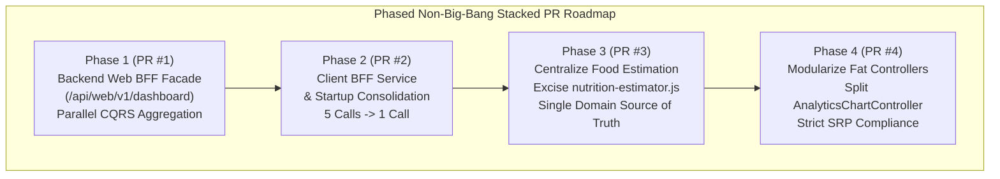
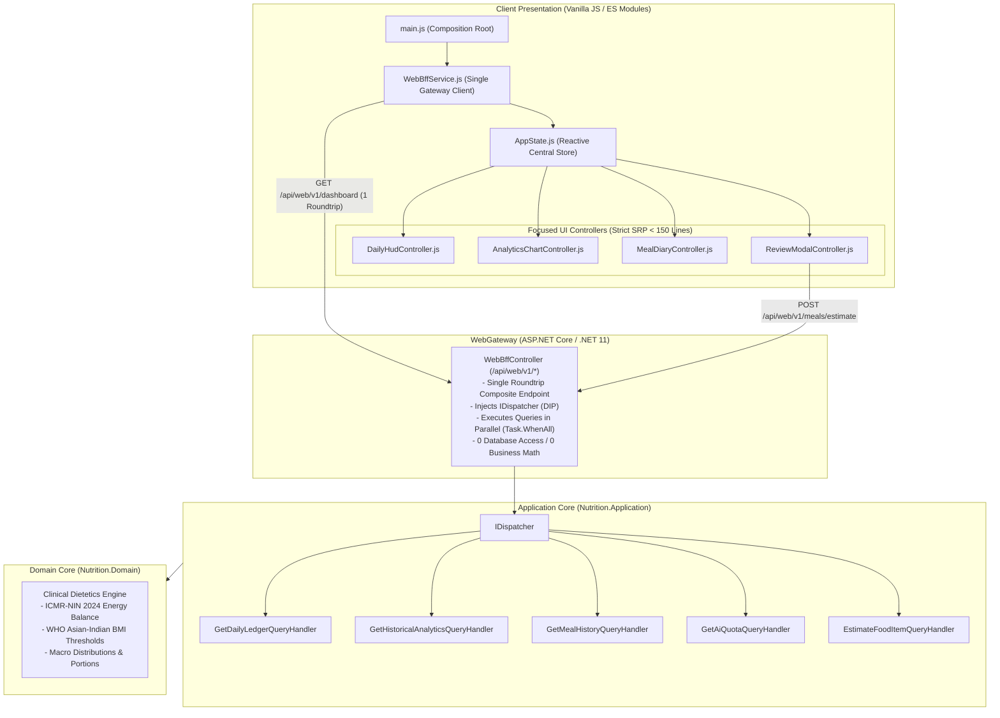

# SDD 08: Web App Architecture Review & Web BFF Phased Migration Plan
> **Specification Version**: `v1.0.0 (Living SDD & Migration Blueprint)`  
> **Classification**: Architectural Review, SOLID/Clean Governance & Phased Execution Plan  
> **Target Subsystem**: `Nutrition.WebGateway` (Presentation Layer & Native Vanilla JS/HTML5 PWA)  
> **Core Tenets**: Zero Duplicate Code &bull; SOLID Principles &bull; Clean Architecture &bull; Backend for Frontend (Web BFF) &bull; Phased Non-Big-Bang Releases  

---

## 1. Executive Summary & Review Objectives

This document provides a rigorous architectural review of the existing **Diet-Dost Web Application** (`src/Nutrition.WebGateway/wwwroot/`) and establishes a **step-by-step, non-big-bang migration roadmap**. 

While the web frontend has a strong foundation utilizing native ES Modules, dependency injection (`di-container.js`), and modular HTML partials (`[data-include]`), evolutionary additions have introduced **domain logic leakage**, **code duplication**, and **chatty client-server network boundaries**. 

To resolve these without introducing high-risk "big-bang" releases, this document details a **4-Phase GitHub Stacked PR Migration Strategy**:



---

## 2. Strict Architectural Review: Current State & Findings

### 2.1 Finding 1: Domain Logic Leakage & Duplication (`nutrition-estimator.js`)
- **Location**: `src/Nutrition.WebGateway/wwwroot/js/services/nutrition-estimator.js` (1,001 lines).
- **The Violation**:
  - Contains a hardcoded 1,000-line client-side JavaScript dictionary (`INDIAN_FOOD_DICTIONARY`) with calories, proteins, carbs, fats, fiber, and sodium for over 150 dishes.
  - Implements client-side portion scaling (`scaleNutritionByPortion`) and dietitian advice generation (`generateDietitianAdvice`).
  - Meanwhile, the backend already contains authoritative clinical calculators in `Nutrition.Domain` and an AI-augmented knowledge query in `Nutrition.Application` (`EstimateFoodItemQueryHandler.cs`).
- **Architectural Risk**:
  - **Clinical Drift**: If ICMR-NIN guidelines or macro ratios update in the domain core, the client JavaScript does not automatically update, causing inconsistent nutritional values between web, mobile, and backend reports.
  - **Bundle Bloat**: Every user downloads 31 KB of uncompressed static dictionary on initial page load.

### 2.2 Finding 2: Chatty Client-Server Boundary (Lack of Web BFF)
- **Location**: `src/Nutrition.WebGateway/wwwroot/js/main.js` (`initApp` and `auth:success`).
- **The Violation**:
  On initial authenticated page load, the web application executes **5 to 6 sequential and parallel HTTP roundtrips**:
  1. `GET /api/auth/me` (Identity & Tier)
  2. `GET /api/analytics/daily?userId={id}` (Today's ledger)
  3. `GET /api/analytics/projections?userId={id}&period=7D` (Trend charts)
  4. `GET /api/meals/history?userId={id}&days=7` (Logged meal diary)
  5. `GET /api/progressphotos/comparison` (Transformation photos)
  6. `GET /api/meals/quota` (AI detection meter)
- **Architectural Risk**:
  - High Time-to-Interactive (TTI) on mobile cellular connections and high network latency.
  - Multiple parallel HTTP connections saturate browser connection limits (HTTP/1.1 6-connection limit per domain).
  - Component race conditions: `DailyHud` and `AnalyticsChart` load at slightly different times, causing visible UI layout shifts.

### 2.3 Finding 3: Violations of Single Responsibility Principle (Fat UI Controllers)
- **Location**: `src/Nutrition.WebGateway/wwwroot/js/ui/analytics-chart.js` (792 lines).
- **The Violation**:
  The `AnalyticsChartController` currently juggles **6 disparate responsibilities**:
  1. Timeline period state management (1D, 7D, 30D, 90D, 365D).
  2. Pure SVG bar chart rendering and coordinate math (`renderBarChart`).
  3. Click event handling for chart bars and date/segment filtering (`handleBarClick`).
  4. Meal diary table rendering for Cards and Grid layouts (`renderMealData`).
  5. Excel / CSV data serialization and Blob download triggering (`exportToExcel`).
  6. Empty state and badge management.
- **Architectural Risk**:
  - High cognitive load and defect density: fixing a chart tooltip bug risks breaking Excel export or card rendering.
  - Low testability: cannot test SVG rendering logic independently from table DOM updates.

### 2.4 Finding 4: Leaky Endpoint Coupling (Violations of DIP)
- **The Violation**:
  Client-side controllers (`DailyHudController`, `AnalyticsChartController`, `MealLoggerController`) directly depend on individual REST endpoint structures across 5 separate backend controllers (`MealsController`, `AnalyticsController`, `ProfileController`, `ProgressPhotosController`, `AuthController`).
- **Architectural Risk**:
  - Refactoring a backend micro-endpoint breaks multiple client UI controllers.
  - Inability to optimize or cache composite dashboard data on the server without touching dozens of JavaScript files.

---

## 3. Target Web BFF Architecture & Clean Principles



### Key Architectural Tenets
1. **The Web BFF Contract (`/api/web/v1/dashboard`)**:
   - Single HTTP GET request returning a composite payload containing:
     - `User`: ID, Name, Tier, Role, Avatar.
     - `TodayLedger`: Target calories, consumed calories, pending calories, 6-macro breakdown.
     - `Projections`: Active period (default 7D), trend points, deficit total, projected weight loss.
     - `RecentMeals`: Today's logged meals for immediate diary rendering.
     - `Quota`: Scans remaining, daily limit, tier upgrade recommendations.
     - `FeatureFlags`: Photo comparison allowed, data export allowed, history unlocked.
2. **Strict Invariant: Zero Domain Calculations in Client JavaScript**:
   - Portion multipliers, caloric math, and dietitian tips are computed **only** by `Nutrition.Domain` and `Nutrition.Application`.
   - The client merely binds and displays values.
3. **Single Responsibility UI Components**:
   - Controllers coordinate events and bind data to the DOM.
   - Dedicated helpers handle SVG rendering, table formatting, and file export independently.

---

## 4. Phased Step-by-Step Implementation Roadmap (No Big-Bang Releases)

To eliminate release risk and facilitate rapid, isolated code reviews, the migration is structured into **4 sequential, independently deployable PRs** following the **GitHub Stacked PR Protocol**:

---

### Phase 1 (PR 1): Backend Web BFF Facade (`/api/web/v1/dashboard`)
> **Goal**: Introduce the composite Web BFF controller on the backend without modifying existing frontend code.  
> **PR Type**: Additive, 100% backward compatible, zero risk to running web client.  
> **Review Scope**: ~200 lines C#.

#### Step-by-Step Tasks:
1. Create composite DTO in `Nutrition.Application/Features/WebBff/DTOs/WebDashboardCompositeDto.cs`:
   ```csharp
   public record WebDashboardCompositeDto(
       UserProfileDto User,
       DailyLedgerDto TodayLedger,
       AnalyticsProjectionDto Projections,
       List<MealHistoryItemDto> RecentMeals,
       AiQuotaStatusDto Quota,
       TierFeatureFlagsDto FeatureFlags
   );
   ```
2. Create `WebBffController.cs` in `src/Nutrition.WebGateway/Controllers/Web/`:
   ```csharp
   [Authorize]
   [ApiController]
   [Route("api/web/v1")]
   public class WebBffController : ControllerBase
   {
       private readonly IDispatcher _dispatcher;

       public WebBffController(IDispatcher dispatcher) => _dispatcher = dispatcher;

       [HttpGet("dashboard")]
       public async Task<IActionResult> GetDashboardComposite(
           [FromQuery] string period = "7D",
           CancellationToken ct = default)
       {
           var userId = User.GetUserId();
           if (string.IsNullOrWhiteSpace(userId)) return Unauthorized();

           // Execute independent queries in parallel via Task.WhenAll
           var ledgerTask = _dispatcher.QueryAsync(new GetDailyLedgerQuery(userId, null, User.IsAdminOrSuper()), ct);
           var projectionsTask = _dispatcher.QueryAsync(new GetHistoricalAnalyticsQuery(userId, period), ct);
           var mealsTask = _dispatcher.QueryAsync(new GetMealHistoryQuery(userId, 7), ct);
           var quotaTask = _dispatcher.QueryAsync(new GetAiQuotaQuery(userId), ct);

           await Task.WhenAll(ledgerTask, projectionsTask, mealsTask, quotaTask);

           var composite = new WebDashboardCompositeDto(
               User: BuildUserDto(User),
               TodayLedger: ledgerTask.Result.Data,
               Projections: projectionsTask.Result.Data,
               RecentMeals: mealsTask.Result.Data?.Items ?? [],
               Quota: quotaTask.Result.Data,
               FeatureFlags: BuildTierFlags(User.GetTier())
           );

           return Ok(composite);
       }
   }
   ```
3. Add unit and integration tests in `tests/Nutrition.EvalHarness.Tests/WebBffTests.cs`.
4. Validate build: `dotnet test` (0 errors, 0 warnings).

---

### Phase 2 (PR 2): Client Web BFF Service & Startup Consolidation
> **Goal**: Update client startup (`main.js`) to consume `/api/web/v1/dashboard`, cutting 5 network roundtrips down to 1.  
> **PR Type**: Client-side network optimization, backward compatible.  
> **Review Scope**: ~180 lines JS.

#### Step-by-Step Tasks:
1. Create `src/Nutrition.WebGateway/wwwroot/js/services/web-bff-service.js`:
   ```javascript
   export class WebBffService {
     constructor(apiClient) {
       this._api = apiClient;
     }

     async getDashboard(period = '7D') {
       return this._api.get('/api/web/v1/dashboard', { period });
     }
   }
   ```
2. Register `webBffService` in `di-container.js` and `main.js`.
3. Refactor `initApp` in `main.js`:
   - Replace sequential calls with a single `webBffService.getDashboard('7D')`.
   - Seed `appState` with composite data:
     ```javascript
     const dashboard = await webBffService.getDashboard('7D');
     updateUserUI(dashboard.user);
     appState.setInitialDashboard(dashboard);
     
     // Hydrate UI components instantly from memory (0 new HTTP calls!)
     dailyHud.hydrate(dashboard.todayLedger);
     analyticsChart.hydrate(dashboard.projections, dashboard.recentMeals);
     ```
4. Verify in browser: Network tab confirms page load makes **1 single data call** instead of 5.

---

### Phase 3 (PR 3): Centralize Food Estimation & Excise `nutrition-estimator.js`
> **Goal**: Eliminate 1,000-line client food dictionary and client-side advice generation; route all estimation to backend CQRS.  
> **PR Type**: Code deletion & architectural cleanup (Single Source of Truth).  
> **Review Scope**: ~150 lines modified, ~1,000 lines deleted.

#### Step-by-Step Tasks:
1. Verify backend `POST /api/meals/estimate` endpoint handles:
   - Food name search (e.g. "paneer bhurji", "2 roti").
   - Portion scaling (grams, katoris, cups, spoons).
   - Dietitian clinical advice based on ICMR-NIN 2024 macros.
2. In `src/Nutrition.WebGateway/wwwroot/js/ui/review-modal.js`:
   - Replace local `scaleNutritionByPortion()` and `estimateIndianFoodNutrition()` imports with `mealsService.estimateFoodItem(...)`.
   - Debounce item name / portion inputs (300ms) to provide smooth typing experience.
3. Safely delete `src/Nutrition.WebGateway/wwwroot/js/services/nutrition-estimator.js`.
4. Validate that manual meal entry, portion editing, and AI review modal continue to calculate accurately with 0 console errors.

---

### Phase 4 (PR 4): Modularize Monolithic UI Controllers (Strict SRP)
> **Goal**: Split `AnalyticsChartController.js` (792 lines) into focused, single-responsibility modules.  
> **PR Type**: Frontend Clean Architecture refactoring.  
> **Review Scope**: ~300 lines refactored into 3 small modules.

#### Step-by-Step Tasks:
1. Extract SVG Bar Chart drawing into `src/Nutrition.WebGateway/wwwroot/js/ui/components/chart-renderer.js` (<150 lines):
   - Responsible strictly for SVG coordinate calculations, bar heights, tooltips, and SVG DOM insertion.
2. Extract Meal Diary cards/grid into `src/Nutrition.WebGateway/wwwroot/js/ui/components/meal-diary-view.js` (<150 lines):
   - Responsible strictly for rendering meal item cards, grid rows, and card selection states.
3. Extract Excel export into `src/Nutrition.WebGateway/wwwroot/js/services/excel-export-service.js` (<80 lines):
   - Responsible strictly for shaping meal records into CSV/XLSX and triggering the browser file save.
4. Slim down `AnalyticsChartController.js` to a thin coordinator (<120 lines) that delegates to these three focused components.

---

## 5. Verification & Rollback Strategy

| Phase | Automated Gate | Manual / CFT Verification | Rollback Procedure |
| :--- | :--- | :--- | :--- |
| **Phase 1** | `dotnet test` passing (100% CQRS unit & eval tests) | Swagger UI tests on `/api/web/v1/dashboard` | Revert PR 1 on GitHub (zero impact to running web app) |
| **Phase 2** | Browser subagent validation across all 5 user tiers | Inspect Network tab: verify 1 call replaces 5 calls | Toggle `appState.useLegacyLoading = true` or revert PR 2 |
| **Phase 3** | Automated estimation tests in `Nutrition.EvalHarness.Tests` | Verify portion changes in Review Modal update calories accurately | Revert PR 3 to restore client estimator fallback |
| **Phase 4** | Browser subagent verification of 1D/7D/30D/90D tabs & Excel export | Verify cards/grid toggles and bar click filtering | Revert PR 4 |

---

## 6. Summary Matrix: Before vs After Migration

| Quality Attribute | Current Web App (Before) | Target Architecture (After Phased PRs) |
| :--- | :--- | :--- |
| **Initial Dashboard Network Calls** | **5 – 6 HTTP roundtrips** in parallel/sequence | **1 HTTP roundtrip** (`GET /api/web/v1/dashboard`) |
| **Clinical Nutrition Logic** | **Duplicated** in `nutrition-estimator.js` (1,000 lines) | **Centralized 100%** in `Nutrition.Domain` & CQRS |
| **Controller Complexity** | Monolithic `analytics-chart.js` (792 lines) | Focused components each **< 150 lines** (Strict SRP) |
| **Dependency Decoupling** | Leaky: UI knows 5 distinct micro-controllers | Clean: UI depends solely on `WebBffService` |
| **Delivery Strategy** | High-risk big-bang rewrite | **4 Small, Non-Big-Bang Stacked PRs** |
