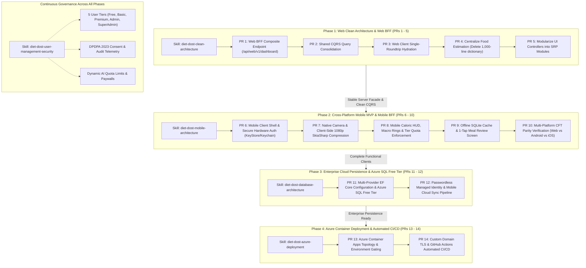

# SDD 09: Master Implementation Roadmap & Skill-by-Skill Execution Sequence
> **Specification Version**: `v1.0.0 (Authoritative Implementation Roadmap)`  
> **Classification**: Solution Execution Sequence, Skill Dependency Graph, and Phased Delivery Plan  
> **Target Subsystems**: Web PWA, Mobile (Android/iOS), Presentation Gateway, Core Persistence, and Azure Infrastructure  
> **Governing Skills**: `diet-dost-clean-architecture`, `diet-dost-mobile-architecture`, `diet-dost-database-architecture`, `diet-dost-azure-deployment`, `diet-dost-user-management-security`  
> **Acceptance Suites**: `docs/cft/` (Web BFF, Mobile MVP, Cross-Platform Parity Matrix)  

---

## 1. Executive Summary & Strategy Overview

This specification defines the **authoritative, sequential implementation roadmap** for the **Diet-Dost** ecosystem.

Over the initial architectural and design phases, comprehensive skills and system design documents (SDDs) were codified for every subsystem. To prevent chaotic or conflicting simultaneous changes, eliminate code duplication, and ensure zero regressions across both Web and Mobile platforms, this document establishes:
1. **The Exact Skill-by-Skill Implementation Order**: Grounded in technical prerequisites and risk mitigation.
2. **Why This Order Is Mandatory**: Architectural justification for why each subsystem must precede or follow the others.
3. **Phased Deliverable Breakdown**: Small, reviewable GitHub Stacked PRs adhering to `AGENTS.md`.
4. **Validation & Verification Gates**: Executable Customer & Functional Acceptance Tests (CFTs) in `docs/cft/` for every milestone.



---

## 2. Master Skill Implementation Sequence & Rationale

| Order | Target Subsystem / Phase | Governing Skill | Primary Objective | Architectural Justification ("Why This Order?") |
| :---: | :--- | :--- | :--- | :--- |
| **1st** | **Web Clean Architecture & Web BFF Facade** | [`diet-dost-clean-architecture`](file:///c:/Users/nikunj.banker/source/repos/diet-dost/.agents/skills/diet-dost-clean-architecture/SKILL.md) | Eliminate chatty startup HTTP calls, centralize all clinical/estimation math on server, deconstruct fat JS controllers. | **Prerequisite Foundation**: The web client currently makes 5-6 discrete calls and contains a 1,001-line static food dictionary (`nutrition-estimator.js`). Fixing the server-side aggregation facade (`/api/web/v1/dashboard`) and removing client-side math establishes a single source of truth for both Web and the upcoming Mobile clients. |
| **2nd** | **Cross-Platform Mobile MVP & Mobile BFF** | [`diet-dost-mobile-architecture`](file:///c:/Users/nikunj.banker/source/repos/diet-dost/.agents/skills/diet-dost-mobile-architecture/SKILL.md) | Native camera meal capture, 1080p SkiaSharp compression, hardware token security, and touch HUD. | **Zero Duplicate Math**: Because Phase 1 already centralized all clinical calculation and estimation on the backend, the mobile app consumes the lean `MobileBffController` (`/api/mobile/v1/*`) directly without writing a single line of duplicated clinical math. |
| **3rd** | **Enterprise Database & Azure Cloud Migration** | [`diet-dost-database-architecture`](file:///c:/Users/nikunj.banker/source/repos/diet-dost/.agents/skills/diet-dost-database-architecture/SKILL.md) | Transition persistence from local SQLite to Azure SQL Serverless Free Tier ($0/mo) + Azure Cosmos DB Free Tier. | **Zero Client Breaking Changes**: Both Web and Mobile clients are already functional and thoroughly tested against SQLite. Swapping EF Core providers to Azure SQL Serverless with Managed Identity is purely an infrastructural layer change in `Nutrition.Infrastructure` with zero impact on UI clients. |
| **4th** | **Azure Cloud Containerization & Automated CI/CD** | [`diet-dost-azure-deployment`](file:///c:/Users/nikunj.banker/source/repos/diet-dost/.agents/skills/diet-dost-azure-deployment/SKILL.md) | Provision Azure Container Apps (Consumption Free Tier), Custom Domain with managed SSL, and GitHub Actions CI/CD. | **Production Deployment**: Once the application code, mobile BFF endpoints, and cloud database persistence are operational and tested, deploying the containerized WebGateway to Azure production completes the release pipeline. |
| **Cross-Cutting** | **User Management, Security Governance & Quotas** | [`diet-dost-user-management-security`](file:///c:/Users/nikunj.banker/source/repos/diet-dost/.agents/skills/diet-dost-user-management-security/SKILL.md) | Dual-scheme authentication (Cookies + JWT Bearer), 5 user tiers, dynamic AI quotas, SuperAdmin console. | **Active Guardrails**: Governs all four phases by providing tier quotas, role-based paywalls, and DPDPA compliance checks across both Web and Mobile. |

---

## 3. Detailed Phase-by-Phase Execution Plan

### Phase 1: Web Clean Architecture & Web BFF Facade (Track 1 & Track 2)
- **Governing Skill**: [`diet-dost-clean-architecture`](file:///c:/Users/nikunj.banker/source/repos/diet-dost/.agents/skills/diet-dost-clean-architecture/SKILL.md)
- **Playbook**: [`references/web_bff_clean_architecture_playbook.md`](file:///c:/Users/nikunj.banker/source/repos/diet-dost/.agents/skills/diet-dost-clean-architecture/references/web_bff_clean_architecture_playbook.md)
- **CFT Suite**: [`docs/cft/cft_web_bff_and_clean_architecture.md`](file:///c:/Users/nikunj.banker/source/repos/diet-dost/docs/cft/cft_web_bff_and_clean_architecture.md)
- **Deliverables**:
  1. **PR 1**: `WebDashboardCompositeDto` and `WebBffController.cs` (`GET /api/web/v1/dashboard?period=7D`) using parallel `Task.WhenAll`.
  2. **PR 2**: Extract shared query handlers in `Nutrition.Application` for daily ledger, analytics, meal history, photo comparison, and quota.
  3. **PR 3**: Refactor `src/Nutrition.WebGateway/wwwroot/js/services/api.js` and `main.js` to hydrate dashboard in 1 single HTTP roundtrip.
  4. **PR 4**: Wire meal review modal to `POST /api/meals/estimate` and safely delete `nutrition-estimator.js` (-1,001 lines).
  5. **PR 5**: Deconstruct `analytics-chart.js` into SRP modules: `ChartRenderer.js`, `MealDiaryView.js`, `ExcelExportService.js`.

---

### Phase 2: Cross-Platform Mobile MVP & Mobile BFF (Track 3 & Track 4)
- **Governing Skill**: [`diet-dost-mobile-architecture`](file:///c:/Users/nikunj.banker/source/repos/diet-dost/.agents/skills/diet-dost-mobile-architecture/SKILL.md)
- **CFT Suites**: [`docs/cft/cft_mobile_mvp_cross_platform.md`](file:///c:/Users/nikunj.banker/source/repos/diet-dost/docs/cft/cft_mobile_mvp_cross_platform.md) and [`docs/cft/cft_cross_platform_functional_parity_matrix.md`](file:///c:/Users/nikunj.banker/source/repos/diet-dost/docs/cft/cft_cross_platform_functional_parity_matrix.md)
- **Deliverables**:
  1. **PR 6**: Cross-platform mobile project foundation (.NET MAUI / Expo) with `AuthService` using hardware security (`AndroidKeyStore` / iOS Keychain).
  2. **PR 7**: Native camera integration with SkiaSharp 1080p client-side compression (<400 KB) and `POST /api/mobile/v1/meals/capture`.
  3. **PR 8**: Touch Caloric HUD, macro progress rings (Protein, Carbs, Fat), tier quota badge, and upgrade paywalls.
  4. **PR 9**: Offline-first SQLite local ledger cache and 1-tap meal review screen.
  5. **PR 10**: Cross-platform functional parity verification across all 5 user tiers on Web, Android, and iOS.

---

### Phase 3: Enterprise Cloud Persistence & Azure SQL Free Tier
- **Governing Skill**: [`diet-dost-database-architecture`](file:///c:/Users/nikunj.banker/source/repos/diet-dost/.agents/skills/diet-dost-database-architecture/SKILL.md)
- **Reference**: `references/azure_database_architecture_playbook.md`
- **Deliverables**:
  1. **PR 11**: Multi-provider EF Core configuration in `StorageInfrastructureExtensions.cs` supporting both SQLite (`Database:Provider=Sqlite`) and Azure SQL Serverless (`Database:Provider=AzureSql`).
  2. **PR 12**: Azure SQL Serverless Free Tier provisioning (32,000 vCore-seconds + 32 GB storage free/month), Passwordless Azure Managed Identity (`DefaultAzureCredential`), and mobile offline sync protocol.

---

### Phase 4: Azure Cloud Containerization & Automated CI/CD
- **Governing Skill**: [`diet-dost-azure-deployment`](file:///c:/Users/nikunj.banker/source/repos/diet-dost/.agents/skills/diet-dost-azure-deployment/SKILL.md)
- **Reference**: `references/azure_deployment_playbook.md`
- **Deliverables**:
  1. **PR 13**: Azure Container Apps deployment template (Consumption Free Tier: 180,000 vCPU-seconds free/month), multi-stage Docker build, and environment secret injection.
  2. **PR 14**: Custom domain binding (`app.dietdost.com`), free Azure-managed TLS certificate auto-renewal, and GitHub Actions CD automation.

---

## 4. Git Branching & Stacked PR Execution Protocol

Contributors and AI agents must strictly follow the **Pre-Flight Remote Fetch & Dedicated Branch Creation** workflow defined in `AGENTS.md`:

```bash
# 1. Fetch remote tracking branches
git fetch origin

# 2. Branch explicitly from remote origin tracking branch
git checkout -b feature/<descriptive-name> origin/<parent-feature-or-main>

# 3. Assert commit match lineage guard
git rev-parse HEAD
git rev-parse origin/<parent-feature-or-main>
# BOTH hashes must match identically.

# 4. Implement changes, run tests (dotnet test targeting .NET 11, 0 warnings)
# 5. Push branch and open Stacked PR on GitHub targeting the parent branch as base
git push -u origin feature/<descriptive-name>
```

---

## 5. Living Documentation & Traceability

Whenever any phase of this roadmap is executed:
1. Create a dedicated atomic log fragment: `docs/sdd/logs/LOG-<YYYYMMDD>-<NNN>-<slug>.md` using `write_to_file`.
2. Register the fragment in [`docs/sdd/07_living_documentation_log.md`](file:///c:/Users/nikunj.banker/source/repos/diet-dost/docs/sdd/07_living_documentation_log.md).
3. Execute the corresponding platform CFT checklist in [`docs/cft/`](file:///c:/Users/nikunj.banker/source/repos/diet-dost/docs/cft/).
