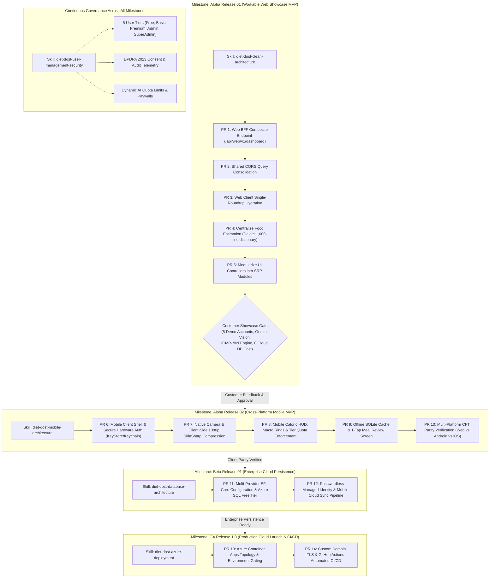

<!--
  Copyright (c) 2026 diet-dost and/or its contributors.
  Licensed under the "GNU Affero General Public License v3.0 only" and
  the "Server Side Public License, v 1"; you may not use this file except
  in compliance with, at your election, the "GNU Affero General Public
  License v3.0 only" or the "Server Side Public License, v 1".
-->

# SDD 09: Master Implementation Roadmap & Skill-by-Skill Execution Sequence
> **Specification Version**: `v2.0.0 (MVP Market Roadmap & Phased Execution Sequence)`  
> **Classification**: PO Master Market Roadmap, Phased Release Milestones, Skill Dependency Graph, and Delivery Plan  
> **Target Subsystems**: Web PWA, Mobile (Android/iOS), Presentation Gateway, Core Persistence, and Azure Infrastructure  
> **Governing Skills**: `diet-dost-clean-architecture`, `diet-dost-mobile-architecture`, `diet-dost-database-architecture`, `diet-dost-azure-deployment`, `diet-dost-user-management-security`  
> **Acceptance Suites**: `docs/cft/` (Web BFF, Mobile MVP, Cross-Platform Parity Matrix)  

---

## 1. Executive Summary & PO Strategy: "Showcase First, Scale Second"

This specification defines the **authoritative, sequential implementation roadmap** for the **Diet-Dost** ecosystem, re-prioritized from the Product Owner (PO) perspective to balance **immediate customer demonstration (Alpha Release 01 Workable MVP)** with the **long-term enterprise cloud architecture (Beta & GA Releases)**.

### Product Owner Strategic Assessment
1. **The Market Imperative (Fast Customer Validation)**:
   Diet-Dost solves complex, clinically grounded Indian nutrition challenges (ICMR-NIN 2024 guidelines, South Asian metabolic phenotypes, and multimodal AI meal vision). Before spending time and operational budget on enterprise cloud provisioning (Azure SQL Serverless, Azure Cosmos DB, managed identity infrastructure, and production container networking), the product must be placed into the hands of real users, dietitians, and stakeholders as a **fully functional, interactive, workable showcase MVP**.
2. **Zero-Cloud-Friction Persistence for Alpha 01**:
   For **Alpha Release 01**, persistence is intentionally grounded in the lightweight, embedded local SQLite engine (`diettracker.db`) via Entity Framework Core. This delivers:
   - **Zero Cloud Prerequisites**: Runs immediately on local/demo workstations or standalone instances without Azure account logins, cloud database firewall provisioning, or connection strings.
   - **Zero Cloud Infrastructure Cost ($0/mo)**: Eliminates cloud hosting expenditure during initial market discovery.
   - **Predictable Demo State**: Pre-seeded with 5 user tier accounts (`free@dietdost.app`, `basic@dietdost.app`, `premium@dietdost.app`, `admin.demo@dietdost.app`, `superadmin@dietdost.app` with `DietDost@Demo2026!`) showcasing instant AI food vision, caloric budget calculations, macro progress rings, meal diary, and tier quotas.
3. **The End Goal Is Fully Preserved**:
   By implementing Clean Architecture and Native CQRS in Phase 1, domain entities and application handlers remain completely decoupled from the persistence provider. When the product advances from customer validation to cloud beta (Phase 3), swapping EF Core providers from local SQLite to Azure SQL Serverless and Azure Cosmos DB is an isolated infrastructure change with **zero client breaking changes**.


```mermaid
graph TD
    subgraph MILESTONE_ALPHA1 ["Milestone: Alpha Release 01 (Workable Web Showcase MVP)"]
        SKILL_CLEAN["Skill: diet-dost-clean-architecture"]
        PR1["PR 1: Web BFF Composite Endpoint (/api/web/v1/dashboard)"]
        PR2["PR 2: Shared CQRS Query Consolidation"]
        PR3["PR 3: Web Client Single-Roundtrip Hydration"]
        PR4["PR 4: Centralize Food Estimation (Delete 1,000-line dictionary)"]
        PR5["PR 5: Modularize UI Controllers into SRP Modules"]
        
        SKILL_CLEAN --> PR1 --> PR2 --> PR3 --> PR4 --> PR5
        DEMO_GATE{"Customer Showcase Gate\n(5 Demo Accounts, Gemini Vision,\nICMR-NIN Engine, 0 Cloud DB Cost)"}
        PR5 --> DEMO_GATE
    end

    subgraph MILESTONE_ALPHA2 ["Milestone: Alpha Release 02 (Cross-Platform Mobile MVP)"]
        SKILL_MOBILE["Skill: diet-dost-mobile-architecture"]
        PR6["PR 6: Mobile Client Shell & Secure Hardware Auth (KeyStore/Keychain)"]
        PR7["PR 7: Native Camera & Client-Side 1080p SkiaSharp Compression"]
        PR8["PR 8: Mobile Caloric HUD, Macro Rings & Tier Quota Enforcement"]
        PR9["PR 9: Offline SQLite Cache & 1-Tap Meal Review Screen"]
        PR10["PR 10: Multi-Platform CFT Parity Verification (Web vs Android vs iOS)"]

        SKILL_MOBILE --> PR6 --> PR7 --> PR8 --> PR9 --> PR10
    end

    subgraph MILESTONE_BETA1 ["Milestone: Beta Release 01 (Enterprise Cloud Persistence)"]
        SKILL_DB["Skill: diet-dost-database-architecture"]
        PR11["PR 11: Multi-Provider EF Core Configuration & Azure SQL Free Tier"]
        PR12["PR 12: Passwordless Managed Identity & Mobile Cloud Sync Pipeline"]

        SKILL_DB --> PR11 --> PR12
    end

    subgraph MILESTONE_GA1 ["Milestone: GA Release 1.0 (Production Cloud Launch & CI/CD)"]
        SKILL_DEPLOY["Skill: diet-dost-azure-deployment"]
        PR13["PR 13: Azure Container Apps Topology & Environment Gating"]
        PR14["PR 14: Custom Domain TLS & GitHub Actions Automated CI/CD"]

        SKILL_DEPLOY --> PR13 --> PR14
    end

    subgraph GOVERNANCE ["Continuous Governance Across All Milestones"]
        SKILL_SEC["Skill: diet-dost-user-management-security"]
        GOV1["5 User Tiers (Free, Basic, Premium, Admin, SuperAdmin)"]
        GOV2["DPDPA 2023 Consent & Audit Telemetry"]
        GOV3["Dynamic AI Quota Limits & Paywalls"]
        
        SKILL_SEC -.-> GOV1
        SKILL_SEC -.-> GOV2
        SKILL_SEC -.-> GOV3
    end

    DEMO_GATE -->|"Customer Feedback & Approval"| MILESTONE_ALPHA2
    MILESTONE_ALPHA2 -->|"Client Parity Verified"| MILESTONE_BETA1
    MILESTONE_BETA1 -->|"Enterprise Persistence Ready"| MILESTONE_GA1
```

---

## 2. Master Skill Implementation Sequence & PO Market Rationale

| Release Milestone | Phase / Target Subsystem | Governing Skill | Primary Objective | PO Market & Architectural Justification ("Why This Order?") |
| :---: | :--- | :--- | :--- | :--- |
| **Alpha Release 01** | **Phase 1: Web Clean Architecture & Web BFF Facade** | [`diet-dost-clean-architecture`](file:///c:/Users/nikunj.banker/source/repos/diet-dost/.agents/skills/diet-dost-clean-architecture/SKILL.md) | Eliminate chatty startup HTTP calls, centralize all clinical/estimation math on server, deconstruct fat JS controllers, and deliver a polished workable Web Showcase MVP. | **Immediate Customer Demo Value**: The Web PWA is already functional and visually stunning in Obsidian Dark. Finalizing the Web BFF (`/api/web/v1/dashboard`) delivers single-roundtrip hydration, removes duplicated JS math, and enables smooth, flawless live customer and investor demos with zero cloud DB latency or configuration friction. |
| **Alpha Release 02** | **Phase 2: Cross-Platform Mobile MVP & Mobile BFF** | [`diet-dost-mobile-architecture`](file:///c:/Users/nikunj.banker/source/repos/diet-dost/.agents/skills/diet-dost-mobile-architecture/SKILL.md) | Native camera meal capture, 1080p SkiaSharp compression (<400 KB), hardware token security, touch HUD, and offline local cache. | **Zero Duplicate Domain Math**: Because Alpha 01 already centralized all clinical calculation and estimation on the backend CQRS handlers, the mobile app consumes the lean `MobileBffController` (`/api/mobile/v1/*`) directly without writing a single line of duplicated clinical code. |
| **Beta Release 01** | **Phase 3: Enterprise Cloud Persistence & Azure SQL Free Tier** | [`diet-dost-database-architecture`](file:///c:/Users/nikunj.banker/source/repos/diet-dost/.agents/skills/diet-dost-database-architecture/SKILL.md) | Transition persistence from local SQLite to Azure SQL Serverless Free Tier ($0/mo) + Azure Cosmos DB Free Tier with passwordless Managed Identity. | **Zero Client Breaking Changes**: Web and Mobile clients are already functional and validated against local persistence. Swapping EF Core providers to Azure SQL Serverless with Managed Identity is purely an infrastructural layer change in `Nutrition.Infrastructure` with zero impact on UI clients. |
| **GA Release 1.0** | **Phase 4: Azure Cloud Containerization & Automated CI/CD** | [`diet-dost-azure-deployment`](file:///c:/Users/nikunj.banker/source/repos/diet-dost/.agents/skills/diet-dost-azure-deployment/SKILL.md) | Provision Azure Container Apps (Consumption Free Tier), Custom Domain with managed SSL, and GitHub Actions CI/CD. | **Commercial Launch**: Once the application code, mobile BFF endpoints, and cloud database persistence are operational and tested, deploying the containerized WebGateway to Azure production completes the commercial release pipeline. |
| **Cross-Cutting** | **User Management, Security Governance & Quotas** | [`diet-dost-user-management-security`](file:///c:/Users/nikunj.banker/source/repos/diet-dost/.agents/skills/diet-dost-user-management-security/SKILL.md) | Dual-scheme authentication (Cookies + JWT Bearer), 5 user tiers, dynamic AI quotas, SuperAdmin console. | **Active Guardrails**: Governs all four phases by providing tier quotas, role-based paywalls, and DPDPA compliance checks across both Web and Mobile. |

---

## 3. Detailed Phase-by-Phase Execution Plan

### Phase 1: Milestone Alpha Release 01 — Web Clean Architecture, Web BFF & Local Showcase MVP (Track 1 & Track 2)
- **Release Milestone**: `Alpha Release 01 (Workable Web Showcase MVP)`
- **Governing Skill**: [`diet-dost-clean-architecture`](file:///c:/Users/nikunj.banker/source/repos/diet-dost/.agents/skills/diet-dost-clean-architecture/SKILL.md)
- **Playbook**: [`references/web_bff_clean_architecture_playbook.md`](file:///c:/Users/nikunj.banker/source/repos/diet-dost/.agents/skills/diet-dost-clean-architecture/references/web_bff_clean_architecture_playbook.md)
- **CFT Suite**: [`docs/cft/cft_web_bff_and_clean_architecture.md`](file:///c:/Users/nikunj.banker/source/repos/diet-dost/docs/cft/cft_web_bff_and_clean_architecture.md)
- **Local Persistence Strategy**: Embedded SQLite (`diettracker.db`) via EF Core with seeded demo datasets. Zero external cloud SQL or NoSQL required.
- **Deliverables**:
  1. **PR 1**: `WebDashboardCompositeDto` and `WebBffController.cs` (`GET /api/web/v1/dashboard?period=7D`) using parallel `Task.WhenAll`.
  2. **PR 2**: Extract shared query handlers in `Nutrition.Application` for daily ledger, analytics, meal history, photo comparison, and quota.
  3. **PR 3**: Refactor `src/Nutrition.WebGateway/wwwroot/js/services/api.js` and `main.js` to hydrate dashboard in 1 single HTTP roundtrip.
  4. **PR 4**: Wire meal review modal to `POST /api/meals/estimate` and safely delete `nutrition-estimator.js` (-1,001 lines).
  5. **PR 5**: Deconstruct `analytics-chart.js` into SRP modules: `ChartRenderer.js`, `MealDiaryView.js`, `ExcelExportService.js`.
- **Customer Showcase Demo Acceptance Checklist**:
  - [x] **5 Demo Accounts Active**: Instant login with `free@dietdost.app`, `basic@dietdost.app`, `premium@dietdost.app`, `admin.demo@dietdost.app`, `superadmin@dietdost.app` (Password: `DietDost@Demo2026!`).
  - [x] **Instant Multimodal AI Food Vision**: Upload Indian meal photo (Thali, Dosa, Dal Tadka), AI analyzes items with Gemini 3 Flash Thinking and displays detection transparency badge.
  - [x] **Zero-Assumption Clinical Nutrition**: Real-time TDEE, Asian-Indian BMI cutoffs, and medical adjustments (Diabetes, Hypothyroidism, HTN) calculated strictly per ICMR-NIN 2024.
  - [x] **Single-Roundtrip Hydration**: Dashboard loads with all charts, ledger, and macro rings in a single composite call (`<150ms` locally).
  - [x] **Food Diary & Excel Export**: 1D/7D/30D meal history filters with 1-click XLSX export.

---

### Phase 2: Milestone Alpha Release 02 — Cross-Platform Mobile MVP & Mobile BFF (Track 3 & Track 4)
- **Release Milestone**: `Alpha Release 02 (Cross-Platform Mobile MVP)`
- **Governing Skill**: [`diet-dost-mobile-architecture`](file:///c:/Users/nikunj.banker/source/repos/diet-dost/.agents/skills/diet-dost-mobile-architecture/SKILL.md)
- **CFT Suites**: [`docs/cft/cft_mobile_mvp_cross_platform.md`](file:///c:/Users/nikunj.banker/source/repos/diet-dost/docs/cft/cft_mobile_mvp_cross_platform.md) and [`docs/cft/cft_cross_platform_functional_parity_matrix.md`](file:///c:/Users/nikunj.banker/source/repos/diet-dost/docs/cft/cft_cross_platform_functional_parity_matrix.md)
- **Deliverables**:
  1. **PR 6**: Cross-platform mobile project foundation (.NET MAUI / Expo) with `AuthService` using hardware security (`AndroidKeyStore` / iOS Keychain).
  2. **PR 7**: Native camera integration with SkiaSharp 1080p client-side compression (<400 KB) and `POST /api/mobile/v1/meals/capture`.
  3. **PR 8**: Touch Caloric HUD, macro progress rings (Protein, Carbs, Fat), tier quota badge, and upgrade paywalls.
  4. **PR 9**: Offline-first SQLite local ledger cache and 1-tap meal review screen.
  5. **PR 10**: Cross-platform functional parity verification across all 5 user tiers on Web, Android, and iOS.

---

### Phase 3: Milestone Beta Release 01 — Enterprise Cloud Persistence & Azure SQL Free Tier
- **Release Milestone**: `Beta Release 01 (Enterprise Cloud Persistence)`
- **Governing Skill**: [`diet-dost-database-architecture`](file:///c:/Users/nikunj.banker/source/repos/diet-dost/.agents/skills/diet-dost-database-architecture/SKILL.md)
- **Reference**: `references/azure_database_architecture_playbook.md`
- **Deliverables**:
  1. **PR 11**: Multi-provider EF Core configuration in `StorageInfrastructureExtensions.cs` supporting both SQLite (`Database:Provider=Sqlite`) and Azure SQL Serverless (`Database:Provider=AzureSql`).
  2. **PR 12**: Azure SQL Serverless Free Tier provisioning (32,000 vCore-seconds + 32 GB storage free/month), Passwordless Azure Managed Identity (`DefaultAzureCredential`), and mobile offline sync protocol.

---

### Phase 4: Milestone GA Release 1.0 — Azure Cloud Containerization & Automated CI/CD
- **Release Milestone**: `GA Release 1.0 (Commercial Production Cloud Launch)`
- **Governing Skill**: [`diet-dost-azure-deployment`](file:///c:/Users/nikunj.banker/source/repos/diet-dost/.agents/skills/diet-dost-azure-deployment/SKILL.md)
- **Reference**: `references/azure_deployment_playbook.md`
- **Deliverables**:
  1. **PR 13**: Azure Container Apps deployment template (Consumption Free Tier: 180,000 vCPU-seconds free/month), multi-stage Docker build, and environment secret injection.
  2. **PR 14**: Custom domain binding (`app.dietdost.com`), free Azure-managed TLS certificate auto-renewal, and GitHub Actions CD automation.

---

## 4. Git Branching & Stacked PR Execution Protocol

Contributors and AI agents must strictly follow the **Pre-Flight Remote Fetch & Dedicated Branch Creation** and **Native GitHub Stacked PR Protocol** defined in `AGENTS.md` and [`ADR-20260928-049`](file:///c:/Users/nikunj.banker/source/repos/diet-dost/docs/adr/ADR-20260928-049-native-github-stacked-pr-protocol.md):

```bash
# 1. Fetch remote tracking branches
git fetch origin

# 2. Branch explicitly from remote origin tracking branch
git checkout -b feature/<descriptive-name> origin/<parent-feature-or-main>

# 3. Assert commit match lineage guard
git rev-parse HEAD
git rev-parse origin/<parent-feature-or-main>
# BOTH hashes must match identically.

# 4. Implement changes, run tests (dotnet test targeting .NET 11, 0 warnings)
# 5. Push branch to remote
git push -u origin feature/<descriptive-name>

# 6. Open PR targeting parent feature branch as base (with Stack Navigation Callout at top of body)
gh pr create --base <parent-branch> --head feature/<descriptive-name> ...

# 7. Formally link into GitHub Stack engine and sync
gh stack link <parent-pr-number> <child-pr-number>
gh stack sync
```

---

## 5. Living Documentation & Traceability

Whenever any milestone or phase of this roadmap is executed:
1. Create a dedicated atomic ADR fragment: `docs/adr/ADR-<YYYYMMDD>-<NNN>-<slug>.md` using `write_to_file`.
2. Register the ADR in [`docs/adr/README.md`](file:///c:/Users/nikunj.banker/source/repos/diet-dost/docs/adr/README.md) and [`docs/sdd/07_living_documentation_log.md`](file:///c:/Users/nikunj.banker/source/repos/diet-dost/docs/sdd/07_living_documentation_log.md).
3. Execute the corresponding platform CFT checklist in [`docs/cft/`](file:///c:/Users/nikunj.banker/source/repos/diet-dost/docs/cft/).
