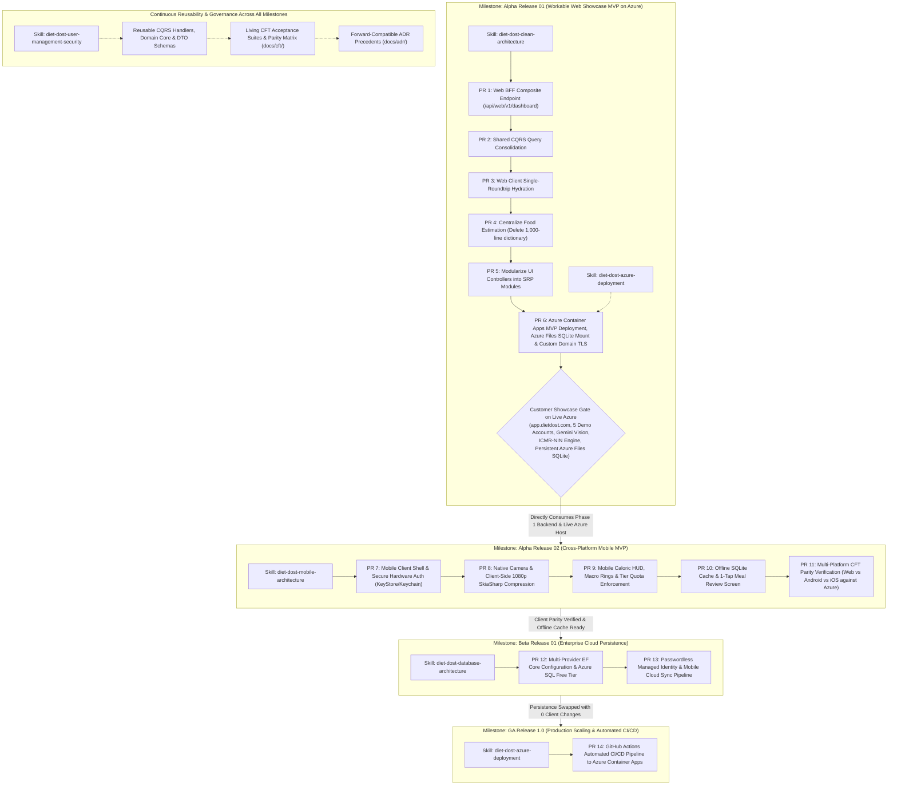

<!--
  Copyright (c) 2026 diet-dost and/or its contributors.
  Licensed under the "GNU Affero General Public License v3.0 only" and
  the "Server Side Public License, v 1"; you may not use this file except
  in compliance with, at your election, the "GNU Affero General Public
  License v3.0 only" or the "Server Side Public License, v 1".
-->

# SDD 09: Master Implementation Roadmap & Skill-by-Skill Execution Sequence
> **Specification Version**: `v2.2.0 (Zero-Throwaway Engineering & Forward-Roadmap Reusability Mandate)`  
> **Classification**: PO Master Market Roadmap, Phased Release Milestones, Reusability Governance, Skill Dependency Graph, and Delivery Plan  
> **Target Subsystems**: Web PWA, Mobile (Android/iOS), Presentation Gateway, Core Persistence, and Azure Infrastructure  
> **Governing Skills**: `diet-dost-clean-architecture`, `diet-dost-mobile-architecture`, `diet-dost-database-architecture`, `diet-dost-azure-deployment`, `diet-dost-user-management-security`  
> **Acceptance Suites**: `docs/cft/` (Web BFF, Mobile MVP, Cross-Platform Parity Matrix)  
> **Architectural Decisions**: [`docs/adr/ADR-20260929-051-mvp-market-roadmap-reprioritization.md`](file:///c:/Users/nikunj.banker/source/repos/diet-dost/docs/adr/ADR-20260929-051-mvp-market-roadmap-reprioritization.md), [`docs/adr/ADR-20260930-052-reusability-and-forward-roadmap-compatibility-mandate.md`](file:///c:/Users/nikunj.banker/source/repos/diet-dost/docs/adr/ADR-20260930-052-reusability-and-forward-roadmap-compatibility-mandate.md)  

---

## 1. Executive Summary & PO Strategy: "Showcase First, Scale Second"

This specification defines the **authoritative, sequential implementation roadmap** for the **Diet-Dost** ecosystem, re-prioritized from the Product Owner (PO) perspective to balance **immediate live customer demonstration on Azure (Alpha Release 01 Workable MVP)** with the **long-term enterprise cloud architecture (Beta & GA Releases)**.

### Product Owner Strategic Assessment
1. **The Market Imperative (Live Azure Customer Validation)**:
   Diet-Dost solves complex, clinically grounded Indian nutrition challenges (ICMR-NIN 2024 guidelines, South Asian metabolic phenotypes, and multimodal AI meal vision). Before spending time and operational budget on enterprise cloud database provisioning (Azure SQL Serverless, Azure Cosmos DB, managed identity infrastructure, and multi-region replication), the product must be deployed live on Azure so customers, dietitians, and angel investors can test it worldwide via a **secure, live, workable showcase MVP**.
2. **Zero-Cloud-DB Persistence for Alpha 01 (<$0.30/Month Total Footprint)**:
   For **Alpha Release 01**, persistence is grounded in the lightweight, embedded local SQLite engine (`diettracker.db`) hosted in **Azure Container Apps with a persistent Azure Files SMB volume mount (`/app/data`)**. This delivers:
   - **Zero Cloud DB Prerequisites**: No Azure SQL Serverless or Cosmos DB accounts, firewall configurations, or heavy cloud licenses required.
   - **Virtually Free Cloud Hosting (<$0.30/mo)**: Fits within the Azure Container Apps Free Grant (180,000 vCPU-seconds + 360,000 GiB-seconds free/month) and a single Azure Files SMB share.
   - **Live Custom Domain & Free TLS**: Accessible at a branded custom domain (e.g. `https://app.dietdost.com`) backed by free Azure-managed TLS certificates with automatic renewal.
   - **Predictable Demo State**: Pre-seeded with 5 user tier accounts (`free@dietdost.app`, `basic@dietdost.app`, `premium@dietdost.app`, `admin.demo@dietdost.app`, `superadmin@dietdost.app` with `DietDost@Demo2026!`) showcasing instant AI food vision, caloric budget calculations, macro progress rings, meal diary, and tier quotas.
3. **The End Goal Is Fully Preserved**:
   By implementing Clean Architecture and Native CQRS in Phase 1, domain entities and application handlers remain completely decoupled from the persistence provider. When the product advances from customer validation to cloud beta (Phase 3), swapping EF Core providers from Azure Files SQLite to Azure SQL Serverless and Azure Cosmos DB is an isolated infrastructure change with **zero client breaking changes**.
4. **The Reusability & Forward-Roadmap Compatibility Mandate (Zero-Throwaway Engineering)**:
   > [!IMPORTANT]
   > **Zero Disposable Code Policy**: MVP work must NEVER be treated as throwaway prototype code or isolated demo hacks. Every line of backend code, domain model, CQRS handler, DTO schema, frontend module, Customer & Functional Acceptance Test (CFT), and Architectural Decision Record (ADR) created in Phase 1 (or any subsequent phase) MUST be engineered **in concert with future roadmap milestones in consideration**.
   >
   > The four non-negotiable reusability pillars are:
   > - **A. Code & Functionality Reusability**:
   >   - *Shared Application CQRS Core*: The query and command handlers extracted in Phase 1 (`GetDailyLedgerQueryHandler`, `GetHistoricalAnalyticsQueryHandler`, `GetMealHistoryQueryHandler`, `GetAiQuotaQueryHandler`, `EstimateFoodItemQueryHandler`, `UploadAndAnalyzeMealCommandHandler`) are built to be directly consumed by Mobile BFF in Phase 2 with 0 lines of duplicated code.
   >   - *Clinical Dietetics Invariants*: 100% of ICMR-NIN 2024 and WHO calculations reside exclusively in `Nutrition.Domain`. Clients never perform local clinical math.
   >   - *Decoupled Persistence*: EF Core entity configurations in Phase 1 SQLite must be strictly agnostic to SQLite dialect specifics so Phase 3 multi-provider injection (`Database:Provider=AzureSql`) requires 0 changes in Domain, Application, or Presentation layers.
   >   - *Modular Client Architecture*: Web presentation scripts follow Single Responsibility Principle (SRP) with isolated API client facades, charting renderers, and view components, enabling easy wrapping or reuse in PWA or hybrid mobile shells.
   >   - *Container & Infra Parameterization*: Azure Container Apps manifests in PR 6 parameterize database providers and secrets via environment variables (`DATABASE_PROVIDER=Sqlite`), so switching to Azure SQL in Phase 3 is a declarative configuration update rather than an infrastructure rewrite.
   > - **B. CFT Reusability & Living Acceptance Test Inheritance**:
   >   - Acceptance test suites in `docs/cft/` are durable, reusable regression harnesses.
   >   - Phase 1 Web CFT (`cft_web_bff_and_clean_architecture.md`) sets the functional baseline for 5 user tiers, ICMR-NIN clinical metrics, and quota enforcement. Phase 2 Mobile CFT (`cft_mobile_mvp_cross_platform.md`) and Master Parity Matrix (`cft_cross_platform_functional_parity_matrix.md`) directly inherit and cross-validate against these same invariant criteria.
   >   - All CFT test cases must remain runnable and valid across SQLite, Azure Files SQLite SMB, Azure SQL Serverless, Web PWA, Android, and iOS.
   > - **C. ADR Reusability & Forward Architectural Precedent**:
   >   - Every atomic ADR fragment (`docs/adr/ADR-<YYYYMMDD>-<NNN>-<slug>.md`) MUST include a dedicated section titled `Forward Roadmap Impact & Future Phase Compatibility`, certifying that the decision supports upcoming phases and creates zero technical debt.
   > - **D. Cross-Phase Synchronization Verification**:
   >   - No PR is approved unless it verifies compatibility with both preceding milestones and future milestones on the roadmap.


```mermaid
graph TD
    subgraph MILESTONE_ALPHA1 ["Milestone: Alpha Release 01 (Workable Web Showcase MVP on Azure)"]
        SKILL_CLEAN["Skill: diet-dost-clean-architecture"]
        SKILL_DEPLOY_ALPHA["Skill: diet-dost-azure-deployment"]
        PR1["PR 1: Web BFF Composite Endpoint (/api/web/v1/dashboard)"]
        PR2["PR 2: Shared CQRS Query Consolidation"]
        PR3["PR 3: Web Client Single-Roundtrip Hydration"]
        PR4["PR 4: Centralize Food Estimation (Delete 1,000-line dictionary)"]
        PR5["PR 5: Modularize UI Controllers into SRP Modules"]
        PR6["PR 6: Azure Container Apps MVP Deployment, Azure Files SQLite Mount & Custom Domain TLS"]
        
        SKILL_CLEAN --> PR1 --> PR2 --> PR3 --> PR4 --> PR5
        PR5 --> PR6
        SKILL_DEPLOY_ALPHA -.-> PR6
        DEMO_GATE{"Customer Showcase Gate on Live Azure\n(app.dietdost.com, 5 Demo Accounts, Gemini Vision,\nICMR-NIN Engine, Persistent Azure Files SQLite)"}
        PR6 --> DEMO_GATE
    end

    subgraph MILESTONE_ALPHA2 ["Milestone: Alpha Release 02 (Cross-Platform Mobile MVP)"]
        SKILL_MOBILE["Skill: diet-dost-mobile-architecture"]
        PR7["PR 7: Mobile Client Shell & Secure Hardware Auth (KeyStore/Keychain)"]
        PR8["PR 8: Native Camera & Client-Side 1080p SkiaSharp Compression"]
        PR9["PR 9: Mobile Caloric HUD, Macro Rings & Tier Quota Enforcement"]
        PR10["PR 10: Offline SQLite Cache & 1-Tap Meal Review Screen"]
        PR11["PR 11: Multi-Platform CFT Parity Verification (Web vs Android vs iOS against Azure)"]

        SKILL_MOBILE --> PR7 --> PR8 --> PR9 --> PR10 --> PR11
    end

    subgraph MILESTONE_BETA1 ["Milestone: Beta Release 01 (Enterprise Cloud Persistence)"]
        SKILL_DB["Skill: diet-dost-database-architecture"]
        PR12["PR 12: Multi-Provider EF Core Configuration & Azure SQL Free Tier"]
        PR13["PR 13: Passwordless Managed Identity & Mobile Cloud Sync Pipeline"]

        SKILL_DB --> PR12 --> PR13
    end

    subgraph MILESTONE_GA1 ["Milestone: GA Release 1.0 (Production Scaling & Automated CI/CD)"]
        SKILL_DEPLOY["Skill: diet-dost-azure-deployment"]
        PR14["PR 14: GitHub Actions Automated CI/CD Pipeline to Azure Container Apps"]

        SKILL_DEPLOY --> PR14
    end

    subgraph REUSABILITY_PILLARS ["Continuous Reusability & Governance Across All Milestones"]
        SKILL_SEC["Skill: diet-dost-user-management-security"]
        REUSE_CODE["Reusable CQRS Handlers, Domain Core & DTO Schemas"]
        REUSE_CFT["Living CFT Acceptance Suites & Parity Matrix (docs/cft/)"]
        REUSE_ADR["Forward-Compatible ADR Precedents (docs/adr/)"]
        
        SKILL_SEC -.-> REUSE_CODE
        REUSE_CODE -.-> REUSE_CFT
        REUSE_CFT -.-> REUSE_ADR
    end

    DEMO_GATE -->|"Directly Consumes Phase 1 Backend & Live Azure Host"| MILESTONE_ALPHA2
    MILESTONE_ALPHA2 -->|"Client Parity Verified & Offline Cache Ready"| MILESTONE_BETA1
    MILESTONE_BETA1 -->|"Persistence Swapped with 0 Client Changes"| MILESTONE_GA1
```

---

## 2. Master Skill Implementation Sequence & PO Market Rationale

| Release Milestone | Phase / Target Subsystem | Governing Skills | Primary Objective | PO Market & Architectural Justification ("Why This Order?") | Reusable Assets & Forward-Roadmap Linkages |
| :---: | :--- | :--- | :--- | :--- | :--- |
| **Alpha Release 01** | **Phase 1: Web Clean Architecture, Web BFF & Azure MVP Deployment** | [`diet-dost-clean-architecture`](file:///c:/Users/nikunj.banker/source/repos/diet-dost/.agents/skills/diet-dost-clean-architecture/SKILL.md)<br/>[`diet-dost-azure-deployment`](file:///c:/Users/nikunj.banker/source/repos/diet-dost/.agents/skills/diet-dost-azure-deployment/SKILL.md) | Deliver a polished, single-roundtrip Web BFF and deploy the live workable MVP to Azure Container Apps with custom domain TLS and Azure Files SQLite persistence. | **Immediate Live Demo Value**: Demonstrating locally on `localhost` cannot validate customer interest remotely. Deploying the Web MVP to Azure Container Apps (`https://app.dietdost.com`) backed by persistent Azure Files SQLite delivers a worldwide, live customer showcase with zero cloud SQL/NoSQL costs (<$0.30/mo) and zero breaking changes for future phases. | **Durable Core Foundations**: Produces the shared CQRS query handlers, centralized food estimation API, and parameterized Docker deployment directly reused by Mobile in Phase 2 and Azure SQL in Phase 3. |
| **Alpha Release 02** | **Phase 2: Cross-Platform Mobile MVP & Mobile BFF** | [`diet-dost-mobile-architecture`](file:///c:/Users/nikunj.banker/source/repos/diet-dost/.agents/skills/diet-dost-mobile-architecture/SKILL.md) | Native camera meal capture, 1080p SkiaSharp compression (<400 KB), hardware token security, touch HUD, and offline local cache connecting to live Azure backend. | **Zero Duplicate Domain Math**: Because Alpha 01 already deployed the backend CQRS handlers and Web BFF to Azure, the mobile app consumes the live `MobileBffController` (`https://app.dietdost.com/api/mobile/v1/*`) directly without writing a single line of duplicated clinical code. | **Shared Mobile Core**: Hardware vault security, client-side compression pipeline, and local SQLite cache schema engineered to plug into Phase 3's cloud sync engine. |
| **Beta Release 01** | **Phase 3: Enterprise Cloud Persistence & Azure SQL Free Tier** | [`diet-dost-database-architecture`](file:///c:/Users/nikunj.banker/source/repos/diet-dost/.agents/skills/diet-dost-database-architecture/SKILL.md) | Transition persistence from Azure Files SQLite to Azure SQL Serverless Free Tier ($0/mo) + Azure Cosmos DB Free Tier with passwordless Managed Identity. | **Zero Client Breaking Changes**: Web and Mobile clients are already functional and validated against the live Azure MVP. Swapping EF Core providers to Azure SQL Serverless with Managed Identity is purely an infrastructural layer change in `Nutrition.Infrastructure` with zero impact on UI clients. | **Multi-Provider Persistence Engine**: Multi-provider EF Core configuration enabling zero-downtime provider swaps and hydrating Phase 2 Mobile SQLite offline caches via Azure Managed Identity. |
| **GA Release 1.0** | **Phase 4: Production Scaling & Automated CI/CD** | [`diet-dost-azure-deployment`](file:///c:/Users/nikunj.banker/source/repos/diet-dost/.agents/skills/diet-dost-azure-deployment/SKILL.md) | Multi-environment staging/production gating, automated GitHub Actions CI/CD pipeline, and horizontal scaling governance. | **Commercial Launch**: Once cloud database persistence and mobile clients are thoroughly validated, automated CI/CD provides continuous zero-downtime releases from Git commits directly to Azure Container Apps. | **End-to-End Release Automation**: Automated CI/CD running full CFT regression matrix across Web and Mobile, executing zero-downtime canary rollouts. |
| **Cross-Cutting** | **User Management, Security Governance & Quotas** | [`diet-dost-user-management-security`](file:///c:/Users/nikunj.banker/source/repos/diet-dost/.agents/skills/diet-dost-user-management-security/SKILL.md) | Dual-scheme authentication (Cookies + JWT Bearer), 5 user tiers, dynamic AI quotas, SuperAdmin console. | **Active Guardrails**: Governs all four phases by providing tier quotas, role-based paywalls, and DPDPA compliance checks across both Web and Mobile. | **Universal Entitlement Engine**: Reusable across all endpoints, client platforms, and persistence providers without tier re-implementation. |

---

## 3. Detailed Phase-by-Phase Execution Plan

### Phase 1: Milestone Alpha Release 01 — Web Clean Architecture, Web BFF & Azure MVP Deployment (Track 1 & Track 2)
- **Release Milestone**: `Alpha Release 01 (Workable Web Showcase MVP on Azure)`
- **Governing Skills**:
  - [`diet-dost-clean-architecture`](file:///c:/Users/nikunj.banker/source/repos/diet-dost/.agents/skills/diet-dost-clean-architecture/SKILL.md) (Web BFF, CQRS handlers, single-roundtrip hydration, modular UI)
  - [`diet-dost-azure-deployment`](file:///c:/Users/nikunj.banker/source/repos/diet-dost/.agents/skills/diet-dost-azure-deployment/SKILL.md) (Azure Container Apps, Azure Files SQLite persistence, custom domain TLS)
- **Playbooks**:
  - [`references/web_bff_clean_architecture_playbook.md`](file:///c:/Users/nikunj.banker/source/repos/diet-dost/.agents/skills/diet-dost-clean-architecture/references/web_bff_clean_architecture_playbook.md)
  - [`references/azure_deployment_playbook.md`](file:///c:/Users/nikunj.banker/source/repos/diet-dost/.agents/skills/diet-dost-azure-deployment/references/azure_deployment_playbook.md)
- **CFT Suite**: [`docs/cft/cft_web_bff_and_clean_architecture.md`](file:///c:/Users/nikunj.banker/source/repos/diet-dost/docs/cft/cft_web_bff_and_clean_architecture.md)
- **Local & Cloud Persistence Strategy**: Embedded SQLite (`diettracker.db`) via EF Core mounted on persistent Azure Files SMB share (`/app/data/diettracker.db`). Zero external cloud SQL or NoSQL required.
- **Deliverables**:
  1. **PR 1**: `WebDashboardCompositeDto` and `WebBffController.cs` (`GET /api/web/v1/dashboard?period=7D`) using parallel `Task.WhenAll`.
  2. **PR 2**: Extract shared query handlers in `Nutrition.Application` for daily ledger, analytics, meal history, photo comparison, and quota.
  3. **PR 3**: Refactor `src/Nutrition.WebGateway/wwwroot/js/services/api.js` and `main.js` to hydrate dashboard in 1 single HTTP roundtrip.
  4. **PR 4**: Wire meal review modal to `POST /api/meals/estimate` and safely delete `nutrition-estimator.js` (-1,001 lines).
  5. **PR 5**: Deconstruct `analytics-chart.js` into SRP modules: `ChartRenderer.js`, `MealDiaryView.js`, `ExcelExportService.js`.
  6. **PR 6**: Multi-stage Linux Docker build for `Nutrition.WebGateway`, Azure Container Apps deployment template with Azure Files SMB volume mount (`/app/data`), custom domain binding (`app.dietdost.com`) with free Azure-managed TLS certificate, and environment secret injection.

#### Reusable Assets & Forward-Roadmap Linkages (In Concert with Future Phases)
* **PR 1 & PR 2 Reusability -> Reused in Phase 2 Mobile BFF (PR 7, PR 9)**:
  The shared query handlers (`GetDailyLedgerQueryHandler`, `GetHistoricalAnalyticsQueryHandler`, `GetMealHistoryQueryHandler`, `GetAiQuotaQueryHandler`) are designed as generic CQRS queries in `Nutrition.Application`. They are directly dispatched by `MobileBffController` in Phase 2, eliminating any duplicate query or aggregation logic between Web and Mobile.
* **PR 3 Reusability -> Establishes Client Contract for Mobile (PR 7)**:
  The single-roundtrip composite payload pattern defined in `WebDashboardCompositeDto` serves as the structural architectural precedent for `MobileDashboardCompositeDto`, ensuring symmetrical data models across platforms.
* **PR 4 Reusability -> Consumed by Mobile Camera Review Modal (PR 8, PR 10)**:
  `POST /api/meals/estimate` is a centralized, domain-grounded API. When native mobile captures food images or allows portion adjustments, it consumes this exact same endpoint, ensuring 100% mathematical and clinical consistency.
* **PR 5 Reusability -> Modular UI for PWA & Hybrid Shells**:
  Deconstructing the UI into decoupled ES modules (`ChartRenderer.js`, `MealDiaryView.js`, `ExcelExportService.js`) enables modular reuse in responsive mobile web views, progressive web app offline sync, or hybrid app shells.
* **PR 6 Reusability -> Parameterized Container for Phase 3 Azure SQL (PR 12)**:
  The Dockerfile, Azure Container App environment, and mount templates are created with parameterization (`DATABASE_PROVIDER=Sqlite`, `CONNECTION_STRING=/app/data/diettracker.db`). In Phase 3 (PR 12), switching to `DATABASE_PROVIDER=AzureSql` requires zero container reconstruction or infrastructure rewrites.

- **Customer Showcase Demo Acceptance Checklist (Live on Azure)**:
  - [x] **Live Public HTTPS URL**: Accessible worldwide at `https://app.dietdost.com` with valid TLS certificate and sub-200ms TTFB.
  - [x] **5 Demo Accounts Active**: Instant login with `free@dietdost.app`, `basic@dietdost.app`, `premium@dietdost.app`, `admin.demo@dietdost.app`, `superadmin@dietdost.app` (Password: `DietDost@Demo2026!`).
  - [x] **Zero Cloud SQL/NoSQL Overhead**: Operates entirely on Azure Files SMB-backed SQLite (`/app/data/diettracker.db`) with zero Azure SQL or Cosmos DB fees (<$0.30/mo total cloud footprint).
  - [x] **Instant Multimodal AI Food Vision**: Upload Indian meal photo (Thali, Dosa, Dal Tadka), AI analyzes items with Gemini 3 Flash Thinking and displays detection transparency badge.
  - [x] **Zero-Assumption Clinical Nutrition**: Real-time TDEE, Asian-Indian BMI cutoffs, and medical adjustments (Diabetes, Hypothyroidism, HTN) calculated strictly per ICMR-NIN 2024.
  - [x] **Single-Roundtrip Hydration**: Dashboard loads with all charts, ledger, and macro rings in a single composite call over the live internet.
  - [x] **Food Diary & Excel Export**: 1D/7D/30D meal history filters with 1-click XLSX export.

---

### Phase 2: Milestone Alpha Release 02 — Cross-Platform Mobile MVP & Mobile BFF (Track 3 & Track 4)
- **Release Milestone**: `Alpha Release 02 (Cross-Platform Mobile MVP)`
- **Governing Skill**: [`diet-dost-mobile-architecture`](file:///c:/Users/nikunj.banker/source/repos/diet-dost/.agents/skills/diet-dost-mobile-architecture/SKILL.md)
- **CFT Suites**: [`docs/cft/cft_mobile_mvp_cross_platform.md`](file:///c:/Users/nikunj.banker/source/repos/diet-dost/docs/cft/cft_mobile_mvp_cross_platform.md) and [`docs/cft/cft_cross_platform_functional_parity_matrix.md`](file:///c:/Users/nikunj.banker/source/repos/diet-dost/docs/cft/cft_cross_platform_functional_parity_matrix.md)
- **Target Backend**: Connects directly to the live Azure backend (`https://app.dietdost.com/api/mobile/v1/*`).
- **Deliverables**:
  1. **PR 7**: Cross-platform mobile project foundation (.NET MAUI / Expo) with `AuthService` using hardware security (`AndroidKeyStore` / iOS Keychain).
  2. **PR 8**: Native camera integration with SkiaSharp 1080p client-side compression (<400 KB) and `POST /api/mobile/v1/meals/capture`.
  3. **PR 9**: Touch Caloric HUD, macro progress rings (Protein, Carbs, Fat), tier quota badge, and upgrade paywalls.
  4. **PR 10**: Offline-first SQLite local ledger cache and 1-tap meal review screen.
  5. **PR 11**: Multi-Platform CFT Parity Verification across all 5 user tiers on Web, Android, and iOS against the live Azure backend.

#### Reusable Assets & Forward-Roadmap Linkages (In Concert with Future Phases)
* **PR 7 Reusability -> Hardware Security Foundation for Enterprise Cloud Sync (PR 13)**:
  The secure hardware token storage (`AndroidKeyStore` / iOS Keychain) created in PR 7 provides the durable credential management layer required for long-lived offline refresh tokens and Phase 3 Managed Identity sync.
* **PR 8 Reusability -> Permanent Media Ingestion Pipeline**:
  The SkiaSharp 1080p client-side compression (<400 KB) algorithm is built as an independent, platform-agnostic service, reusable across camera capture, photo library selection, and future multi-photo comparison workflows.
* **PR 9 Reusability -> Guaranteed Cross-Platform Visual Parity**:
  The mobile Touch HUD and macro progress rings consume the exact DTO contracts produced by Phase 1's CQRS handlers, ensuring identical calculations and visual parity with the Web PWA.
* **PR 10 Reusability -> Offline Cache Ready for Phase 3 Cloud Sync Protocol (PR 13)**:
  The local SQLite database schema implemented in PR 10 is designed with sync metadata (`SyncStatus`, `LastModifiedUtc`, `ClientMutationId`), making it 100% ready to serve as the offline-first edge database for Phase 3's bidirectional cloud sync pipeline.
* **PR 11 Reusability -> Durable Multi-Platform Regression Suite**:
  The functional parity matrix (`cft_cross_platform_functional_parity_matrix.md`) verified in PR 11 is preserved as the regression testing gate for Phase 3 and Phase 4.

---

### Phase 3: Milestone Beta Release 01 — Enterprise Cloud Persistence & Azure SQL Free Tier
- **Release Milestone**: `Beta Release 01 (Enterprise Cloud Persistence)`
- **Governing Skill**: [`diet-dost-database-architecture`](file:///c:/Users/nikunj.banker/source/repos/diet-dost/.agents/skills/diet-dost-database-architecture/SKILL.md)
- **Reference**: `references/azure_database_architecture_playbook.md`
- **Deliverables**:
  1. **PR 12**: Multi-provider EF Core configuration in `StorageInfrastructureExtensions.cs` supporting both SQLite (`Database:Provider=Sqlite`) and Azure SQL Serverless (`Database:Provider=AzureSql`).
  2. **PR 13**: Azure SQL Serverless Free Tier provisioning (32,000 vCore-seconds + 32 GB storage free/month), Passwordless Azure Managed Identity (`DefaultAzureCredential`), and mobile offline sync protocol.

#### Reusable Assets & Forward-Roadmap Linkages (In Concert with Future Phases)
* **PR 12 Reusability -> Non-Breaking Persistence Swap**:
  Because Phase 1 adhered strictly to Clean Architecture, swapping to Azure SQL Serverless in `Nutrition.Infrastructure` requires zero modifications in `Nutrition.Domain`, `Nutrition.Application`, `Nutrition.WebGateway`, or the Mobile client.
* **PR 13 Reusability -> Enterprise Sync Backbone for Commercial Scale (Phase 4)**:
  The bidirectional sync pipeline hydrates the Phase 2 mobile SQLite caches with Azure SQL Serverless, establishing the enterprise-scale data infrastructure required for commercial multi-region rollout in Phase 4.

---

### Phase 4: Milestone GA Release 1.0 — Production Scaling & Automated CI/CD
- **Release Milestone**: `GA Release 1.0 (Commercial Production Cloud Launch)`
- **Governing Skill**: [`diet-dost-azure-deployment`](file:///c:/Users/nikunj.banker/source/repos/diet-dost/.agents/skills/diet-dost-azure-deployment/SKILL.md)
- **Deliverables**:
  1. **PR 14**: GitHub Actions Automated CI/CD Pipeline (multi-environment deployment, container image push to ACR, zero-downtime revision rollout on Azure Container Apps).

#### Reusable Assets & Forward-Roadmap Linkages (In Concert with Future Phases)
* **PR 14 Reusability -> Continuous Delivery Harness**:
  Automates the execution of all reusable CFT acceptance suites (`docs/cft/`), runs .NET 11 zero-warning verification, builds multi-stage production container images, and executes zero-downtime canary deployments to Azure Container Apps.

---

## 4. Git Branching & Stacked PR Execution Protocol

Contributors and AI agents must strictly follow the **Pre-Flight Remote Fetch & Dedicated Branch Creation** and **Native GitHub Stacked PR Protocol** defined in `AGENTS.md` and [`ADR-20260928-049`](file:///c:/Users/nikunj.banker/source/repos/diet-dost/docs/adr/ADR-20260928-049-native-github-stacked-pr-protocol.md):

```bash
# 1. Fetch remote tracking branches
git fetch origin

# 2. Branch explicitly from remote origin tracking branch
git checkout -b feature/<descriptive-name> origin/<parent-feature-or-main>

# 3. Assert commit match lineage guard
git rev-parse HEAD
git rev-parse origin/<parent-feature-or-main>
# BOTH hashes must match identically.

# 4. Implement changes, run tests (dotnet test targeting .NET 11, 0 warnings)
# 5. Push branch to remote
git push -u origin feature/<descriptive-name>

# 6. Open PR targeting parent feature branch as base (with Stack Navigation Callout at top of body)
gh pr create --base <parent-branch> --head feature/<descriptive-name> ...

# 7. Formally link into GitHub Stack engine and sync
gh stack link <parent-pr-number> <child-pr-number>
gh stack sync
```

---

## 5. Living Documentation, ADR Precedents & Traceability

Whenever any milestone or phase of this roadmap is executed, the following governance rules are mandatory:

1. **Atomic ADR Fragment Creation with Forward-Roadmap Section**:
   - Create a dedicated atomic ADR fragment: `docs/adr/ADR-<YYYYMMDD>-<NNN>-<slug>.md` using `write_to_file`.
   - **Mandatory Section**: Every ADR MUST include Section 5/6: `Forward Roadmap Impact & Future Phase Compatibility`, documenting how the decision supports upcoming roadmap milestones and guarantees zero throwaway engineering.
2. **Registry Synchronization**:
   - Register the ADR in [`docs/adr/README.md`](file:///c:/Users/nikunj.banker/source/repos/diet-dost/docs/adr/README.md) and [`docs/sdd/07_living_documentation_log.md`](file:///c:/Users/nikunj.banker/source/repos/diet-dost/docs/sdd/07_living_documentation_log.md).
3. **Living CFT Test Harness Execution & Parity Verification**:
   - Execute the corresponding platform CFT checklist in [`docs/cft/`](file:///c:/Users/nikunj.banker/source/repos/diet-dost/docs/cft/).
   - Ensure all acceptance criteria are maintained as reusable regression tests across all client platforms and persistence providers.
4. **Zero-Throwaway Code Signoff**:
   - Confirm that all code and functionality introduced in the PR directly serves future phases in concert with this master roadmap.
