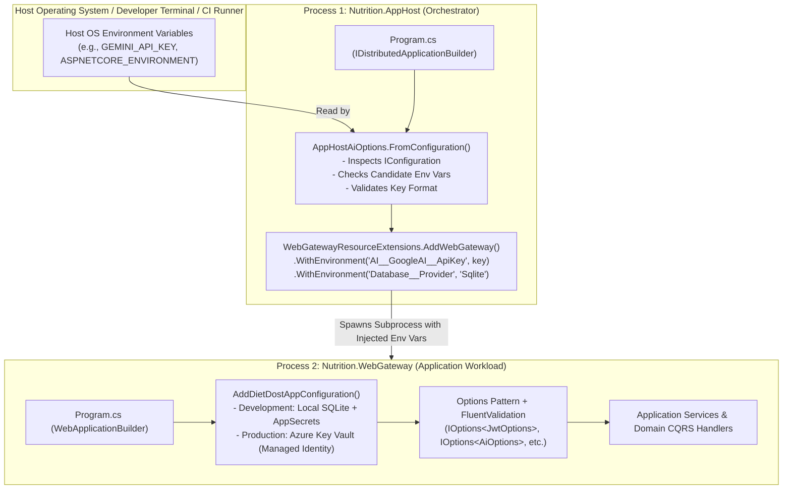
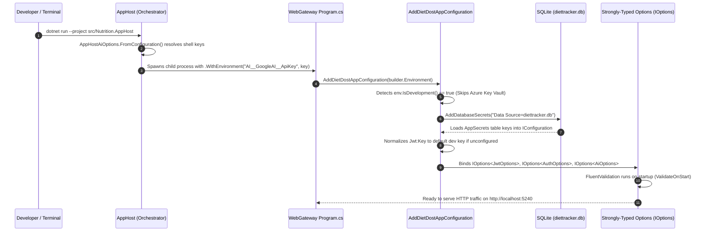
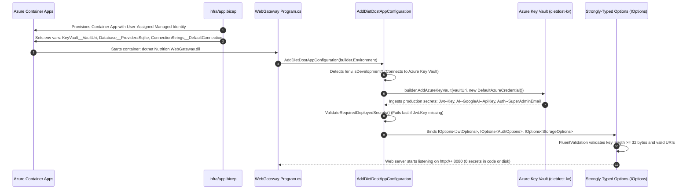

<!--
  Copyright (c) 2026 diet-dost and/or its contributors.
  Licensed under the "GNU Affero General Public License v3.0 only" and
  the "Server Side Public License, v 1"; you may not use this file except
  in compliance with, at your election, the "GNU Affero General Public
  License v3.0 only" or the "Server Side Public License, v 1".
-->

# Software Design Document (SDD): Configuration, Options Pattern & Secret Management Architecture

> **Document Reference**: `docs/sdd/10_configuration_and_secret_management_architecture.md`  
> **Classification**: Authoritative System Design Document & Living Architecture Proof  
> **Status**: `APPROVED & LIVING`  
> **Last Synchronized**: 2026-10-09  
> **Target Framework**: `.NET 11 RC`, `.NET Aspire 13.5.4`, `Azure Container Apps`, `Azure Key Vault`  

---

## 1. Executive Summary & Purpose

This document serves as the permanent, authoritative architectural reference and live proof for how **Configuration, Secrets, Environment Variables, and Strongly-Typed Options** are governed across the **Diet-Dost** solution.

It defines:
1. The **2-Tier Process Boundary** between the .NET Aspire Orchestrator (`Nutrition.AppHost`) and the Application Workload (`Nutrition.WebGateway`).
2. Why process-level environment variable bridging (`Environment.GetEnvironmentVariable` and `.WithEnvironment(...)`) is technically necessary in Aspire AppHost.
3. The exact role, hierarchy, and isolation of the **4 configuration mechanisms**:
   - `DatabaseSecretStore` (Local SQLite `AppSecrets` fallback)
   - `Azure Key Vault` (Production authoritative secret repository)
   - `IConfiguration` (`appsettings.json`, `appsettings.Development.json`)
   - `Environment Variables` (Container & infrastructure runtime bindings)
4. The behavior and priority differences across **Debug / Local Development** versus **Release / Production Deployment**.
5. The architectural distinction between `AppHost/Program.cs` and `WebGateway/Program.cs`.
6. The governance protocol for keeping this document continuously synchronized across future development phases.

---

## 2. The 2-Tier Process Architecture (.NET Aspire Orchestrator vs Application Workload)

.NET Aspire introduces a clean separation between **infrastructure orchestration** and **application execution**. In local development and manifest publication, two distinct processes exist:



---

## 3. Why Process-Level Environment Bridging Exists in AppHost

### 3.1 The Process Boundary Problem
- **Process Memory Isolation**: An operating system does not automatically propagate arbitrary terminal or shell environment variables to child processes unless explicitly instructed.
- When `dotnet run --project src/Nutrition.AppHost` is executed, shell variables (such as `GEMINI_API_KEY` or `GOOGLE_AI_KEY`) reside exclusively within `AppHost`'s process memory.
- When Aspire launches `Nutrition.WebGateway` as a subprocess via `.AddProject<Projects.Nutrition_WebGateway>("web-gateway")`, it creates an isolated process table. Without explicit forwarding, the child process starts without knowledge of keys set in the parent shell.

### 3.2 Candidate Key Normalization
In real-world environments, developers and cloud tools set API keys under various naming conventions:
- Google GenAI SDK default: `GEMINI_API_KEY` or `GOOGLE_API_KEY`
- .NET hierarchical notation: `AI__GoogleAI__ApiKey` or `AI__ApiKey`
- Legacy / flat conventions: `GOOGLE_AI_KEY`

In [`src/Nutrition.AppHost/Configuration/AppHostAiOptions.cs`](file:///c:/Users/nikunj.banker/source/repos/diet-dost/src/Nutrition.AppHost/Configuration/AppHostAiOptions.cs), `ResolveUsableKey` validates candidates:
```csharp
var geminiKey = ResolveUsableKey(
    aiOptions.GoogleAI?.ApiKey,
    Environment.GetEnvironmentVariable("AI__GoogleAI__ApiKey"),
    Environment.GetEnvironmentVariable("AI__ApiKey"),
    Environment.GetEnvironmentVariable("GEMINI_API_KEY"),
    Environment.GetEnvironmentVariable("GOOGLE_AI_KEY"),
    Environment.GetEnvironmentVariable("GOOGLE_API_KEY"));
```
It discards dummy values (`*******`), unconfigured templates (`YOUR_API_KEY`), and truncated strings ($< 20$ chars).

### 3.3 Child Environment Injection
In [`src/Nutrition.AppHost/Extensions/WebGatewayResourceExtensions.cs`](file:///c:/Users/nikunj.banker/source/repos/diet-dost/src/Nutrition.AppHost/Extensions/WebGatewayResourceExtensions.cs), the orchestrator injects normalized configuration into the child process:
```csharp
var webGateway = builder.AddProject<Projects.Nutrition_WebGateway>(ResourceName)
    .WithHttpEndpoint(port: GatewayPort, isProxied: false)
    .WithExternalHttpEndpoints()
    .WithEnvironment("Database__Provider", "Sqlite")
    .WithEnvironment("ConnectionStrings__DefaultConnection", "Data Source=diettracker.db")
    .WithEnvironment("AI__Provider", aiOptions.Provider)
    .WithEnvironment("AI__GoogleAI__ApiKey", aiOptions.GeminiApiKey ?? string.Empty)
    .WithEnvironment("AI__ApiKey", aiOptions.GeminiApiKey ?? string.Empty)
    .WithEnvironment("AI__GoogleAI__ModelId", aiOptions.GeminiModelId)
    .WithEnvironment("AI__GoogleAI__FallbackModelId", aiOptions.GeminiFallbackModelId);
```
**Conclusion**: `.WithEnvironment(...)` instructs the Aspire process launcher to inject these normalized keys into the child `WebGateway` process's environment table upon startup.

---

## 4. The 4 Configuration Mechanisms: Roles & Environment Matrix

Diet-Dost implements a defense-in-depth configuration strategy combining 4 mechanisms:

| # | Configuration Mechanism | Local Development / Debug (`ASPNETCORE_ENVIRONMENT=Development`) | Release / Production (`ASPNETCORE_ENVIRONMENT=Production`) | Primary Responsibility |
| :-: | :--- | :--- | :--- | :--- |
| **1** | **`DatabaseSecretStore`** | **Active (Local DB Fallback)**<br>Reads from the local SQLite `AppSecrets` table via `AddDatabaseSecrets`. Allows local development with 0 cloud dependencies. | **Active as Fallback Adapter**<br>First checks strongly-typed `IOptions<T>` and Azure Key Vault (`IConfiguration`); falls back to database if dynamic keys are requested. | Dynamic runtime secret resolution and cache management without requiring service restarts. |
| **2** | **Azure Key Vault** | **Bypassed (0 Cost / Offline)**<br>`env.IsDevelopment()` bypasses Azure Key Vault to allow developers to build, test, and run 100% offline without Azure login. | **Authoritative Secret Repository**<br>Connected via `DefaultAzureCredential` (User-Assigned Managed Identity). Authoritative source for `Jwt:Key`, `AI:GoogleAI:ApiKey`, `Auth:SuperAdminEmail`, and `Auth:RequireMobileVerification`. | Zero-secrets-in-git compliance, automated rotation, and audit-logged cloud secret governance. |
| **3** | **`appsettings.json` & `appsettings.<Env>.json`** | **Active**<br>`appsettings.json` provides structural schemas and non-sensitive defaults.<br>`appsettings.Development.json` provides safe local developer keys. | **Active for Non-Secrets Only**<br>Provides static templates (model IDs, endpoints, token ceilings). All secret values (`Jwt:Key`, `Auth:SuperAdminEmail`) remain empty (`""`) or omitted. | Base configuration schema, model names, timeouts, and logging levels. |
| **4** | **Environment Variables** | **Active (Developer Shell)**<br>Set via terminal (`export GEMINI_API_KEY=...`) or `launchSettings.json`. | **Active (Infrastructure Wiring)**<br>Injected by Bicep into the Azure Container App (`ASPNETCORE_URLS`, `KeyVault__VaultUri`, `Database__Provider`). | Infrastructure-to-container boundary parameterization. |

---

## 5. End-to-End Configuration Resolution Flows

### 5.1 Local Development Resolution Flow (`ASPNETCORE_ENVIRONMENT=Development`)



### 5.2 Production Deployment Resolution Flow (`ASPNETCORE_ENVIRONMENT=Production` on Azure Container Apps)



---

## 6. Architectural Distinction: `AppHost/Program.cs` vs `WebGateway/Program.cs`

| Architectural Dimension | `Nutrition.AppHost/Program.cs` | `Nutrition.WebGateway/Program.cs` |
| :--- | :--- | :--- |
| **System Role** | **Distributed Application Orchestrator & Deployment Modeler** | **Application Workload (Kestrel Web Server)** |
| **Lifecycle** | Runs during development to launch dependencies; runs during `aspire publish` to generate deployment manifests (Bicep/ARM). | Long-running production process handling HTTP requests, auth, and business logic. |
| **Builder Type** | `IDistributedApplicationBuilder` (`DistributedApplication.CreateBuilder(args)`) | `WebApplicationBuilder` (`WebApplication.CreateBuilder(args)`) |
| **Configuration Scope** | Needs **only orchestration metadata** (ports, resource names, volume mounts, external keys to forward). | Needs **full domain configuration** (JWT issuer, password policies, clinical math constants, EF Core connection strings). |
| **Persistence Access** | **Zero persistence access**. Does not reference EF Core, migrations, or database tables. | Owns `DietTrackerDbContext`, database migrations, PRAGMA setup, and seed data. |
| **Security Perimeter** | Declares cloud resource definitions (`AddAzureKeyVault`, `AddAzureStorage`). | Authenticates users, validates JWTs, signs cookies, enforces rate limits, and checks DPDPA consent. |

---

## 7. Strongly-Typed Options Pattern & FluentValidation Standard

Following ADR-20261008-073 and ADR-20261008-075, **all direct string indexer reads (`configuration["<key>"]`) are strictly prohibited in application services**.

### 7.1 Options Inventory & Validators
1. **`JwtOptions`** (`Nutrition.Application.Common.Options.JwtOptions`):
   - Validated via `JwtOptionsValidator`: Ensures `Issuer`, `Audience`, and minimum 32-byte cryptographic signing key length.
2. **`AuthOptions`** (`Nutrition.Application.Common.Options.AuthOptions`):
   - Validated via `AuthOptionsValidator`: Enforces valid `SuperAdminEmail`, `TermsVersion`, and `HealthConsentVersion`.
3. **`AiOptions`** (`Nutrition.Application.Common.Options.AiOptions`):
   - Validated via `AiOptionsValidator`: Validates provider (`GoogleAI` vs `AzureOpenAI`), model identifiers, and non-empty API keys.
4. **`DatabaseOptions`** (`Nutrition.Application.Common.Options.DatabaseOptions`):
   - Validated via `DatabaseOptionsValidator`: Enforces provider selection (`Sqlite`, `SqlServer`, `PostgreSql`) and non-empty connection string.
5. **`StorageOptions`** (`Nutrition.Application.Common.Options.StorageOptions`):
   - Validated via `StorageOptionsValidator`: Enforces valid `WebRootPath` path format and presence.

### 7.2 Service Consumption Standard
All infrastructure and application handlers consume options strictly via `IOptions<T>`:
```csharp
public class JwtTokenService : IJwtTokenService
{
    public JwtTokenService(IOptions<JwtOptions> jwtOptions, IAppEnvironment? appEnv = null)
    {
        var options = jwtOptions.Value ?? throw new ArgumentNullException(nameof(jwtOptions));
        _issuer = options.Issuer;
        _audience = options.Audience;
        _key = options.Key;
        ...
    }
}
```

---

## 8. High-Concurrency SQLite Concurrency: `SqlitePragmaInterceptor`

To support concurrent composite queries in Web BFF and Mobile BFF (`Task.WhenAll`), every SQLite connection opened by EF Core in `StorageInfrastructureExtensions` registers [`SqlitePragmaInterceptor`](file:///c:/Users/nikunj.banker/source/repos/diet-dost/src/Nutrition.Infrastructure/Persistence/SqlitePragmaInterceptor.cs):
```csharp
public class SqlitePragmaInterceptor : DbConnectionInterceptor
{
    public override void ConnectionOpened(DbConnection connection, ConnectionEndEventData eventData)
    {
        using var cmd = connection.CreateCommand();
        cmd.CommandText = "PRAGMA journal_mode=WAL; PRAGMA busy_timeout=5000;";
        cmd.ExecuteNonQuery();
        base.ConnectionOpened(connection, eventData);
    }
}
```
This guarantees:
1. Write-Ahead Logging (WAL) is enabled on all connections.
2. Busy timeout is configured to 5,000ms, completely eliminating `SQLITE_BUSY` (SQLite Error 5) lock collisions.

---

## 9. Living Update Protocol & Maintenance Guidelines

This document is a **living specification**. Whenever architectural changes touch configuration, secrets, or deployment pipelines, contributors and AI agents **MUST** follow this update protocol:

1. **When Introducing New Configuration Sections**:
   - Create a strongly-typed class in `src/Nutrition.Application/Common/Options/<Name>Options.cs`.
   - Create a corresponding FluentValidation validator in `Validators/<Name>OptionsValidator.cs`.
   - Register the options in `OptionsValidationExtensions.AddDietDostOptions`.
   - Update Section 7 of this document (`10_configuration_and_secret_management_architecture.md`).
2. **When Altering Cloud Secret Sources or Key Vault Mappings**:
   - Update `src/Nutrition.WebGateway/Extensions/ConfigurationExtensions.cs`.
   - Update `infra/app.bicep` and `.github/workflows/azure-app-deploy.yml`.
   - Update Section 4 and Section 5 of this document.
3. **When Altering Aspire Orchestration or Resource Bindings**:
   - Update `src/Nutrition.AppHost/Configuration/AppHostAiOptions.cs` and `Extensions/WebGatewayResourceExtensions.cs`.
   - Update Section 3 and Section 6 of this document.
4. **Living Log Synchronization**:
   - Record an atomic ADR fragment in `docs/adr/ADR-<YYYYMMDD>-<NNN>-<slug>.md`.
   - Update `docs/sdd/07_living_documentation_log.md` and `docs/sdd/00_sdd_index.md`.
